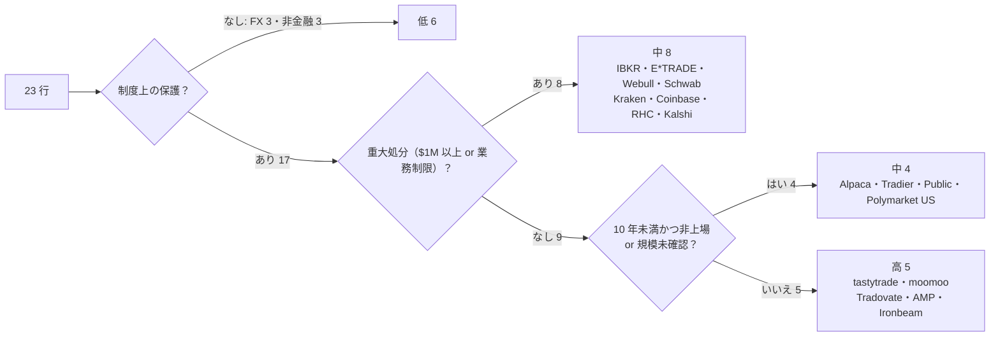
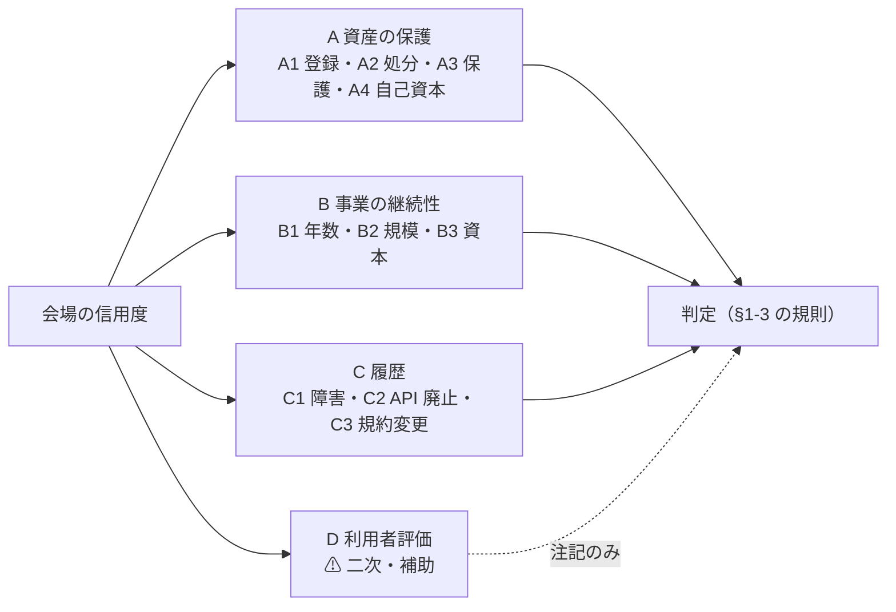
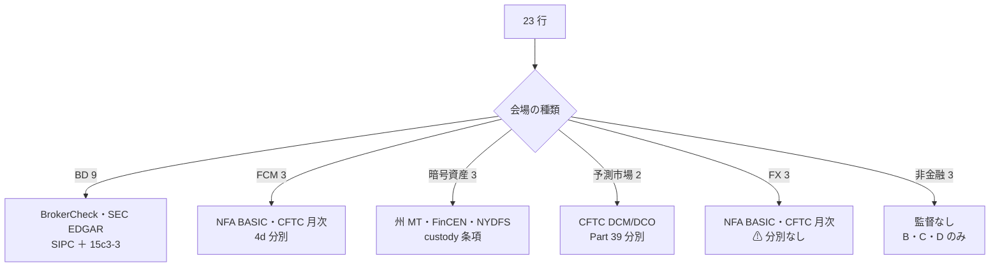
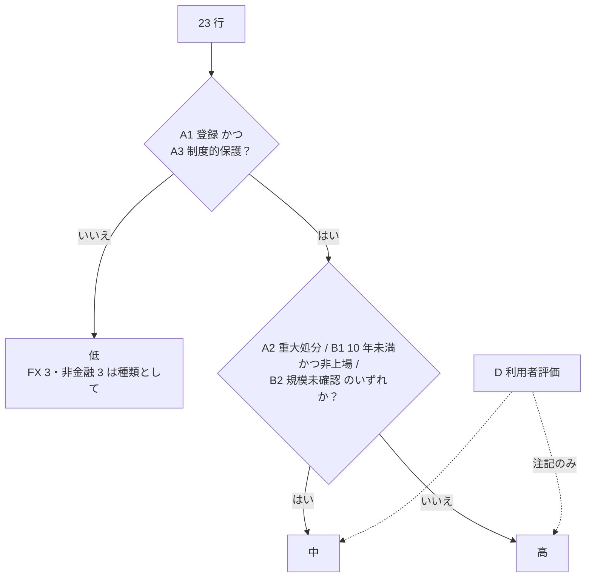
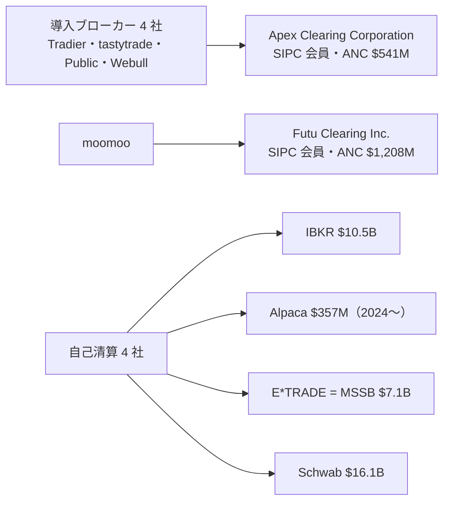
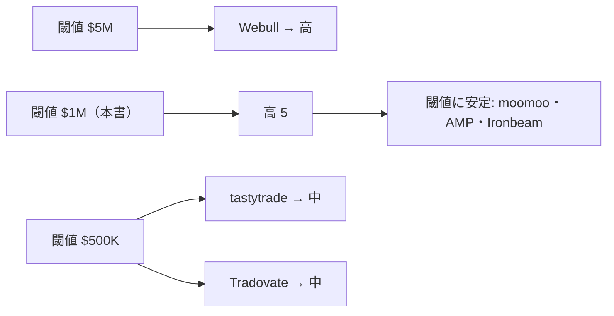
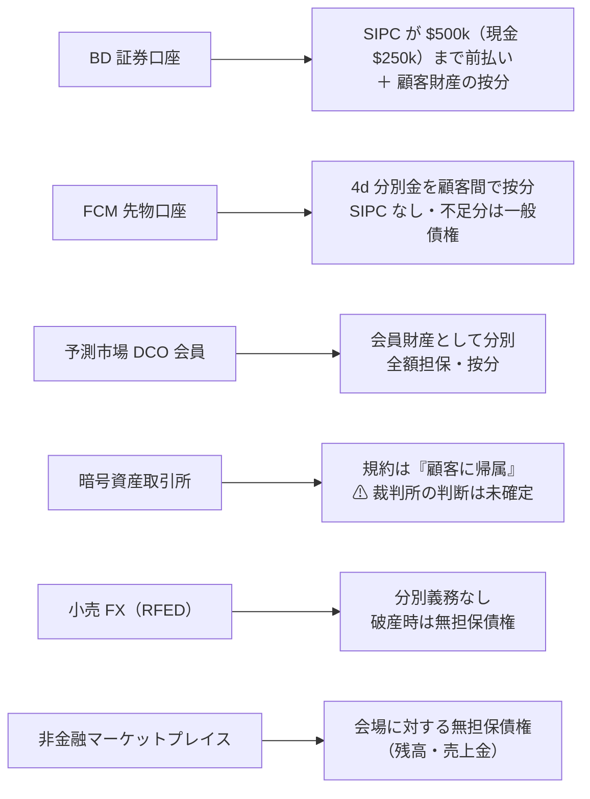

# API が使用できるサービスの信用度 — 23 提供元を監督当局の一次情報で判定する

調査日: 2026-09-03〜04。対象: [trading-api-availability.md](trading-api-availability.md) 付録 A で発注 API が **A0〜A1** になった提供元（[trading-fee-comparison.md](trading-fee-comparison.md) §2-1 と同じ母集団を **23 行**に立て直した。§2）。
プラン: [docs/plans/archive/service-trust-assessment.md](../plans/archive/service-trust-assessment.md)

> 前々タスクは「経路があるか」、前タスクは「いくらかかるか」を確定させた。**この文書は「その会場に資金と発注を預けて大丈夫か」を、監督当局の一次情報（FINRA BrokerCheck・NFA BASIC・CFTC 月次 FCM データ・SEC EDGAR・州の送金業ライセンス）で埋め、あらかじめ固定した規則で 高 / 中 / 低 に判定する。**点数の足し算はしない。判定とは別に、会場が止まった・破綻したときに資金と発注がどうなる「壊れる形」を制度から書いた。数値はすべて出典 URL と取得日つきの【公表値】、利用者評価は【二次】として隔離し判定に使っていない。前 2 タスクの文書は書き換えていない。

## 0. 結論

**23 行の判定は 高 5 / 中 12 / 低 6。**「高」は tastytrade・moomoo（BD）と Tradovate・AMP・Ironbeam（FCM）の 5 行、「低」は種類として制度上の保護が無い小売 FX 3 行と非金融 3 行。IBKR・Schwab・E*TRADE（Morgan Stanley）・Webull・Coinbase・Robinhood Crypto・Kraken は、登録も保護も規模もあるが**直近 5 年に $1M 以上の処分がある**ので規則 2 で「中」に落ちる。⚠ この結果は「規則を機械的に当てた帰結」であって、大手ほど処分の母数が多いという性質を含む（§5-2 の感度分析で閾値を動かすと入れ替わる行を示した）。判定は付録 B の「壊れる形」と A4 の自己資本の絶対額と併せて読むこと。

| 種類 | 高 | 中 | 低 | 「中」の理由の内訳 |
| --- | ---: | ---: | ---: | --- |
| BD 9 | 2（tastytrade・moomoo） | 7 | 0 | 重大処分 4（IBKR・E*TRADE・Webull・Schwab）／年数・規模 3（Alpaca・Tradier・Public） |
| FCM 3 | 3（Tradovate・AMP・Ironbeam） | 0 | 0 | — |
| 暗号資産 3 | 0 | 3 | 0 | 重大処分 3（Kraken・Coinbase・Robinhood Crypto） |
| 予測市場 2 | 0 | 2 | 0 | 年数・規模 2（Kalshi は加えて WA の業務制限） |
| 小売 FX 3 | 0 | 0 | 3 | 種類として分別義務なし（破産時は無担保債権） |
| 非金融 3 | 0 | 0 | 3 | 種類として保護なし（残高は会場への債権） |
| **計 23** | **5** | **12** | **6** | |

**前々タスクの「成立 51 件」との対応**: 判定「高」の会場 1 社で ③ ④ とも通るのは **45 件**（tastytrade で P1 42・P2 1、Tradovate / AMP / Ironbeam で V2 の ES・ZR）。「中」の会場でしか通らないのが 4 件（P4 米国債・地方債は IBKR / Public、P5 外国上場は IBKR、V3 暗号資産は 3 社とも中）、「低」の会場でしか通らないのが 2 件（V5 AWS RI、V6 小売 FX。⚠ FX は IBKR なら「中」）。

> この図の主張: 判定を分けたのは「保護の制度があるか」（低の 6 行）と「重大処分があるか」（中の 8 行）の 2 本で、年数・規模で落ちたのは 4 行だけ。

判断に効く発見が 7 つあった。

| # | 発見 | 効くところ |
| --- | --- | --- |
| 1 | ⚠ **E*TRADE Securities LLC（CRD 29106）は 2024-06-03 に登録終了**（営業終了 2023-12-14）。「E*TRADE from Morgan Stanley」の証券口座は **Morgan Stanley Smith Barney LLC（CRD 149777）** が提供し、先物は E*TRADE Futures LLC（FCM）。前々タスクの「E*TRADE」行は法人としては MSSB を見ることになる | A1〜A4 の出典が MSSB に変わる。MSSB には SEC $15M（2024-12、顧客口座からの資金流用を防ぐ体制の不備）がある |
| 2 | ⚠ **Tradovate は独立法人ではなく NinjaTrader Clearing, LLC の商号**（旧 Tradovate, LLC の IB 登録は 2025-03-31 取下げ）。NinjaTrader Clearing は **Payward, Inc.（Kraken）の 100% 子会社**（2025-03-20 発表、$1.5B）で、分別資金の預託先とレバレッジ暗号資産の担保先に Kraken 系列を含む | FCM の「高」は Kraken グループへの依存を伴う。⚠ NinjaTrader の Tradovate 買収は 2022-01（$115M）で、プランの「2019/2020」は誤り |
| 3 | ⚠ **OANDA の自己資本の余裕は要件の 24%**（超過 $6.4M、2026-06-30）。自社開示では 2023-01〜07 の 7 か月間 超過が**マイナス**、2025-04〜05 に調整純資本が約 $25M 減。処分 3 件のうち 2 件が純資本計算の不備。親会社は 2025-12-01 に CVC から prop-firm 事業者 FTMO へ | 小売 FX は種類として「低」だが、種類内でも OANDA は tastyfx（202%）・FOREX.com（204%）と差がある |
| 4 | ⚠ **暗号資産 3 社とも、破産時に顧客資産が自社財団から外れるかは「裁判所が判断していない」と自ら書く**（Kraken "a court may disagree"、Coinbase 10-K "courts have not yet considered"）。SEC の 2023 年訴訟は Kraken・Coinbase とも 2025 年に却下（処分の認定なし） | 暗号資産の「中」は SIPC の「中」と同じ段ではない（付録 B-4） |
| 5 | ⚠ **予測市場は「会場が壊れる」より「州単位で止まる」**。WA は 2026-08-12 命令で Kalshi のスポーツ・政治等を停止、CFTC は 2026-08-11 に緊急権限で営業継続を命じ 9 州を提訴。Polymarket US は直近 90 日で critical 9 件（マッチングエンジン停止）、約定履歴を保守ごとにリセット | 居住地の壁（前々タスク）に加え、C1 の運用品質が 5 種類中で最も弱い |
| 6 | ⚠ **線の近くに処分がある行が 2 つ**: tastytrade FINRA $850K（2026-07-21、最良執行）と Tradovate CFTC $750K ＋ 返還 $233K（2024-09-23）。閾値を $500K に下げると両行は「中」になる（§5-2） | 「高」を読むときはこの 2 行に注記を付ける |
| 7 | **利用者評価（D）は A〜C の判定と相関しない。**Kalshi は App Store 4.82（49 万件）に対し BBB F・Trustpilot 2.1、Schwab は App 4.78 に対し Play 3.15・Trustpilot 1.6、eBay は App 4.82 に対し Trustpilot 1.2 | D を判定に使わない設計が裏付けられた（付録 C-2） |

## 1. 定義

### 1-1. 4 群 11 尺度と採否

「信用度」を 1 つの数字にせず、**4 つの問い**に分けた。根拠の強さは A → B → C → D の順に弱くなり、判定は A〜C で行い D は併記にとどめる。

| 群 | 問い | 尺度 | 一次情報 | 種類をまたいで比較 | 操作されにくい | 採否 |
| --- | --- | --- | --- | --- | --- | --- |
| **A** | 資産は守られるか | A1 登録の有無と番号（CRD・NFA ID・州 MT ライセンス・DCM/DCO 指定） | ✅ | ✅ | ✅ | **採る** |
| A | | A2 監督当局の処分歴（直近 5 年の件数・年・金額・内容） | ✅ | ⚠ 種類で母数が違う | ✅ | **採る**（種類内で比べる） |
| A | | A3 顧客資産の保護（SIPC / 4d 分別 / DCO 分別 / custody 条項） | ✅ | ⚠ 仕組みが違う | ✅ | **採る**（何が守られ何が守られないかを書く） |
| A | | A4 自己資本（CFTC 月次の調整純資本・10-K / 20-F・X-17A-5 の net capital） | ✅（FCM・RFED は毎月） | ⚠ BD は年 1 回 | ✅ | **採る**（取れる範囲） |
| **B** | 事業は続くか | B1 継続年数（個人向けサービス開始年から） | ✅ | ✅ | ✅ | **採る** |
| B | | B2 規模（口座数・顧客資産・出来高・分別金） | ⚠ 上場企業と FCM のみ確実 | ⚠ | ✅ | **採る**（無ければ「未確認」） |
| B | | B3 資本の裏付け（上場・親会社・買収履歴） | ✅ | ✅ | ✅ | **採る** |
| **C** | 約束を守ってきたか | C1 障害・事故（当局事案を主、status page を従） | ⚠ status page は自己申告 | ⚠ | ⚠ | **採る**（当局事案のみ判定に使う） |
| C | | C2 API の廃止・破壊的変更の履歴 | ✅（changelog・deprecation 告知） | ✅ | ✅ | **採る** |
| C | | C3 規約・料金の変更頻度（前 2 タスクの記録） | ✅ | ✅ | ✅ | **採る** |
| **D** | 利用者はどう評価しているか | App Store・Google Play・BBB・Trustpilot | 二次 | ⚠ | ❌ | **補助**（併記のみ。付録 C） |
| D | | Reddit・SNS の評判 | 二次 | ❌ | ❌ | **採らない** |

> この図の主張: 判定に効くのは A〜C の 10 尺度で、D は判定を動かさず注記にだけ現れる。

### 1-2. 会場の種類で監督者と保護の仕組みが違う

23 行は **6 種類**に分かれ、同じ尺度でも出典と意味が違う。判定は種類の中で読む（暗号資産の「高」は SIPC の「高」ではない。付録 B）。

| 種類 | 行 | 監督者と登録の確認先 | 顧客資産の保護の仕組み | 自己資本の出典 |
| --- | --- | --- | --- | --- |
| **BD** 証券ブローカー | 9 | FINRA BrokerCheck（CRD）・SEC | SIPC（証券 $500,000、うち現金 $250,000）＋ SEC Rule 15c3-3 の顧客資産分離。清算会社（自社 / Apex 等）が実際の保管者 | 10-K・20-F・X-17A-5（監査済み財務諸表の公開部分）・CFTC 月次（FCM 兼業なら） |
| **FCM** 先物 | 3 | NFA BASIC・CFTC 月次「Selected FCM Financial Data」 | CEA §4d(a)(2) の顧客分別（⚠ SIPC 対象外） | CFTC 月次（毎月） |
| **暗号資産** | 3 | 州の Money Transmitter（WA DFI）・FinCEN MSB・NY BitLicense | ⚠ SIPC・FDIC 対象外。custody は各社の規約と州法の保全義務 | 10-K（上場親会社）／非上場は「未確認」 |
| **予測市場** DCM / DCO | 2 | CFTC の DCM 指定・DCO 登録 | DCO の会員財産分別（17 CFR Part 39）・全額担保 | DCO の財務資源開示（⚠ 2 社とも未取得） |
| **小売 FX** RFED / FCM | 3 | NFA BASIC・CFTC 月次（Retail Forex Obligation） | ⚠ **分別義務なし**。NFA 資本要件（$20M ＋ 5%）と「同額以上の資産保有」（17 CFR 5.8）のみ | CFTC 月次（毎月） |
| **非金融** マーケットプレイス | 3 | 金融監督なし（eBay の決済子会社は州送金業ライセンス） | なし。残高は会場に対する債権 | 10-K（上場親会社）／非上場は「未確認」 |

> この図の主張: 母集団は 6 種類に割れ、A の 4 尺度は種類ごとに出典が決まる。横断で比べられるのは B・C・D だけ。

### 1-3. 判定の規則（固定。§4 で機械的に適用）

⚠ **点数を足し合わせない。**次の順に条件を見て、最初に当たったものが判定になる。理由は尺度の値で書く。

| 順 | 条件 | 判定 |
| --- | --- | --- |
| 1 | A1 監督当局への登録が**無い**、または A3 顧客資産の保護が**制度で担保されていない**（種類の定義は下表） | **低** |
| 2 | 登録・保護はあるが、次のいずれか 1 つ以上: A2 直近 5 年に**重大な処分**あり／B1 継続 **10 年未満かつ非上場**／B2 規模が公表値で**確認できない** | **中** |
| 3 | 登録あり ＋ 保護あり ＋ 重大な処分なし ＋（継続 10 年以上 **or** 上場）＋ 規模が確認できる | **高** |

「制度で担保された保護」の定義（種類別）:

| 種類 | 保護ありとみなす条件 |
| --- | --- |
| BD | SIPC 会員（sipc.org の会員一覧で確認）かつ SEC 登録 BD。清算会社が別会社なら**その清算会社**が SIPC 会員であること |
| FCM | CFTC 登録 FCM で、CFTC 月次データに顧客分別金（4d）が載る |
| 暗号資産 | 州 MT ライセンス（WA を含む）または NY BitLicense **かつ** 規約に顧客資産を自社資産と分離して保管する条項がある |
| 予測市場 | CFTC の DCM 指定 **かつ** 顧客資金を保管する DCO が CFTC 登録（Part 39 分別） |
| 小売 FX | **該当なし**。RFED に分別義務が無いため、この種類は規則 1 で **低** になる（種類内の相対は注記で書く） |
| 非金融 | **該当なし**。規則 1 で **低** になり、B・C から「継続性」を別枠で書く |

**「重大な処分」の線引き**（A2）: 効力発生日または Date Initiated が **2021-09-01〜2026-09-03** の、監督当局（SEC・FINRA・取引所 SRO・CFTC・NFA・州証券局・NYDFS・州 AG）による処分で、次の **両方**を満たすもの。

1. 対象が (i) 顧客資産の保護・分別・自己資本、(ii) 最良執行・注文処理・顧客への虚偽表示・不適切な勧誘や口座承認、(iii) 取引システムの障害・準備不足・監視システムの不備（顧客の取引や口座に影響したもの）、(iv) 登録なしでの金融サービス提供、のいずれかに関わる
2. 金銭制裁（罰金・返還の合計）**$1,000,000 以上**、または営業停止・登録取消・業務制限を伴う

満たさない処分（$1M 未満、広告・インフルエンサー表示、Form CRS、取引報告・帳簿の書式や遅延）は付録 A に引用で残すが「重大」に数えない。⚠ **帳簿・記録保存（off-channel 通信の保存を含む）と規制報告の不備は (i)〜(iv) に含めない**（顧客の取引・資産に直接影響しないため。2023 年に業界横断で科された記録保存の罰金はここに落ちる）。**却下・取り下げで終わった訴訟（処分の認定なし）は「事案」として付録 A に置くが処分に数えない。**処分の対象は**本書の行と同じ事業を営む法人**（前身・改称を含む）に限り、親会社や別事業の関連会社への処分は注記にとどめる。仲裁（Arbitration）件数は顧客紛争の量で処分ではないので使わない。

**「継続年数」の起点**（B1）: **その会場で個人が対象商品を売買できるサービスの開始年**。親会社や前身の設立年ではなく、API の提供開始年でもない（API 開始年は C2 の文脈として別に記録する）。10 年以上 = 2016 年以前に開始。

**「規模が確認できる」**（B2）: 口座数・顧客資産・出来高・分別金のいずれか 1 つ以上に、年月つきの【公表値】がある（CFTC 月次の分別金・Retail Forex Obligation、監査済み財務諸表の顧客債務を含む）。

> この図の主張: 判定は 3 条件の順次判定で、D は入らない。FX と非金融は種類として規則 1 に当たる。

## 2. 母集団 — 23 行と前タスク「21」の対応

前タスク §2-1 の表に登場する固有名は **23** で、見出しの「21」は Ironbeam（AMP と同じ A1 の行に並記）と Robinhood Crypto（P1〜P2 は Web 側に置いた注記付き）を数から落としたもの【推測】。本書は 23 行を独立に立てる。⚠ Rithmic・CQG（AMP の API 経路）は取引所会員でも受託者でもないので行にしない。⚠ 調査の結果、**2 行は規制上の法人がプランの想定と違った**（E*TRADE → Morgan Stanley Smith Barney LLC、Tradovate → NinjaTrader Clearing, LLC）。

| # | 種類 | 行 | 規制上の法人（本書で調べた主体） | 前タスク §2-1 の位置 |
| ---: | --- | --- | --- | --- |
| 1 | BD | IBKR | Interactive Brokers LLC（CRD 36418・NFA 0258600） | P1〜P6 A0 |
| 2 | BD | Alpaca | Alpaca Securities LLC（CRD 288202）。暗号資産は Alpaca Crypto LLC（MSB） | P1〜P2 A0 |
| 3 | BD | Tradier | Tradier Brokerage, Inc.（CRD 104982）。清算 Apex Clearing Corporation | P1〜P2 A0 |
| 4 | BD | tastytrade | tastytrade, Inc.（CRD 277027、旧 tastyworks）。清算 Apex | P1〜P3 A0 |
| 5 | BD | E*TRADE | ⚠ **Morgan Stanley Smith Barney LLC**（CRD 149777）＋ E*TRADE Futures LLC（FCM）。E*TRADE Securities LLC（CRD 29106）は 2024-06-03 登録終了 | P1〜P2・P5 A0 |
| 6 | BD | Public | Open to the Public Investing, Inc.（CRD 127818）。清算 Apex | P1〜P2・P4〜P5 A0 |
| 7 | BD | Webull | Webull Financial LLC（CRD 289063・NFA 0528018）。清算 Apex（omnibus） | P1〜P3 A1 |
| 8 | BD | moomoo | Moomoo Financial Inc.（CRD 283078）。清算 Futu Clearing Inc.（CRD 298769） | P1〜P2 A0 |
| 9 | BD | Schwab | Charles Schwab & Co., Inc.（CRD 5393）＋ Charles Schwab Futures and Forex LLC（NFA 0477394） | P1〜P2 A1 |
| 10 | FCM | Tradovate | ⚠ **NinjaTrader Clearing, LLC**（NFA 0309379）の商号。旧 Tradovate, LLC（NFA 0484683）は IB 登録を 2025-03-31 取下げ | P3 A0 |
| 11 | FCM | AMP | AMP Global Clearing LLC（NFA 0412490） | P3 A1（「AMP / Rithmic」） |
| 12 | FCM | Ironbeam | Ironbeam, Inc.（NFA 0415708） | P3 A1（AMP と同行） |
| 13 | 暗号資産 | Kraken | Payward Interactive, Inc.（NMLS 1843762）。親 Payward, Inc. | V3 A0 |
| 14 | 暗号資産 | Coinbase | Coinbase, Inc.（NMLS 1163082）。親 Coinbase Global, Inc. | V3 A0 |
| 15 | 暗号資産 | Robinhood Crypto | Robinhood Crypto, LLC（NMLS 1702840）。親 Robinhood Markets, Inc. | V3 A0（「Robinhood Crypto API」） |
| 16 | 予測市場 | Kalshi | KalshiEX LLC（DCM）・Kalshi Klear LLC（DCO） | V4 A0 |
| 17 | 予測市場 | Polymarket US | QCX LLC（DCM）・QC Clearing LLC（DCO）。親 Blockratize, Inc. | V4 A0 |
| 18 | 小売 FX | OANDA | OANDA Corporation（NFA 0325821） | V6 A0 |
| 19 | 小売 FX | tastyfx | tastyfx LLC（NFA 0509630、旧 IG US LLC） | V6 A0 |
| 20 | 小売 FX | FOREX.com | GAIN Capital Group LLC（NFA 0339826） | V6 A1 |
| 21 | 非金融 | AWS RI | Amazon Web Services, Inc. | V5 A0 / A1 |
| 22 | 非金融 | eBay | eBay Inc.（決済 eBay Commerce Inc.、NMLS 1774459） | V5 A0（出品） |
| 23 | 非金融 | DMarket | DMarket Inc.・Mythical, Inc.・Mythical Games, Unipessoal, Lda の 3 社連名（規約 §1.1） | V5 A0 |

## 3. 方針との関係 — 何を読み、何を読まなかったか

CLAUDE.md の 2026-08-27 方針により、登録・契約・課金・実行は行わない。監督当局のデータベースは**「1 社につき、人がその社のページを開くのと同等の回数」**だけ取得し、一括取得スクリプトは書いていない。

| 行為 | 可否 | 結果 |
| --- | --- | --- |
| FINRA BrokerCheck を 1 社ずつ引く | ✅ 行った | `brokercheck.finra.org/robots.txt` は `Disallow:`（空＝全許可、2026-09-03）。画面が使う概要 JSON と「Detailed Report」PDF を 1 社 1 回ずつ取得し、`pdftotext` で処分歴を読んだ（10 法人） |
| NFA BASIC を 1 社ずつ引く | ✅ 行った | 利用条件（basic-terms.aspx）は範囲と正確性の免責のみで自動取得の禁止条項なし。⚠ 「BASIC does not include … actions taken by other federal and state regulatory agencies and self-regulatory organizations」— SEC・州の処分は別に引く必要がある。画面が使う JSON-RPC（登録区分・会員状態・履歴・処分一覧）を 1 社 1 回ずつ呼んだ（11 法人）。⚠ `getNetCapitalReport` 等は 500、tastytrade・E*TRADE Futures は暗号化 ID のみで未取得 |
| CFTC 月次「Selected FCM Financial Data」を読む | ✅ 行った | 2026-06-30 時点の xlsx を 1 回取得（`cftc.gov/robots.txt` は `Allow: /`、Content-Signal `ai-train=no`）。調整純資本・要件・超過・分別金・Retail Forex Obligation を 16 法人分転記 |
| SEC EDGAR（companyfacts・submissions・10-K・10-Q・20-F・X-17A-5）を読む | ✅ 行った | SEC の指示どおり UA に連絡先を入れ、10 req/s 未満で取得。X-17A-5 は Tradier・tastytrade・Public・Webull・MSSB の FY2025 分（⚠ Tradier・Public の PDF は Type 3 フォントで画像化して目視） |
| WA DFI・FinCEN・NYDFS の登録を確認する | ⚠ 行った | WA DFI の仮想通貨ライセンシー一覧 PDF（2025-09 版）で Coinbase・Payward Interactive・Robinhood Crypto を確認。NMLS Consumer Access は JS 描画で未取得 → 各社の州ライセンス一覧ページを一次情報にした |
| 上場企業の 10-K / 20-F / 年次報告を読む | ✅ 行った | IBKR・MS・SCHW・BULL・FUTU・COIN・HOOD・SNEX・AMZN・EBAY・IG Group（LSE） |
| status page（Statuspage.io の incidents API）・changelog・deprecation 告知を読む | ✅ 行った | C1・C2。⚠ 公開 status page が無い会場が多い（§4 の C1 列） |
| アプリストア・BBB・Trustpilot を読む | ⚠ 行った | 【二次】として付録 C-2 に隔離。判定に使っていない。Trustpilot・BBB は WAF / Cloudflare で直接は 403（r.jina.ai・Wayback で一部） |
| 口座開設・API 登録・問い合わせ・FOIA 請求 | ❌ 行わない | 開示請求でしか出ない値（BD の FOCUS 非公開部分、非上場社の口座数、custody の保険額、Kalshi Klear・QC Clearing の財務資源）は「未確認」 |

⚠ **読めなかったサイト**（前 2 タスクと同じ）: `coinbase.com`（403、User Agreement は Wayback 2026-08-01）、`kalshi.com`（403 / Vercel checkpoint。Rulebook 現行版・料金表・財務資源開示が未取得）、`forex.com`（Cloudflare 403。顧客契約 PDF は Wayback 経由で外部ホストから）、`schwab.com`・`developer.schwab.com`（bot 遮断・JS。Account Protection のみ r.jina.ai）、`polymarket.us`（JS チャレンジ。Rulebook・契約は polymarketexchange.com から）、`justice.gov`（Akamai）、Business Wire（403）。Wayback Machine は一時 503。

## 4. 判定表 — 23 行 × 尺度（種類別）

列の読み方: 表 A が **A 群（登録・処分・保護・自己資本）と判定**、表 B が **B・C 群と D の注記**。数値はすべて【公表値】で、取得日は 2026-09-03（EDGAR・etrade.com は 09-04）。金額の「重大 ✅」は §1-3 の線引きに当たる処分。出典 URL は付録 A（処分）と各社の開示ページ（本文中の名前で検索できる文書名を記す）。

### 4-1. BD 証券ブローカー（9 行）— 高 2 / 中 7

> この図の主張: BD 9 行のうち、顧客資産を実際に保管するのは 5 法人（IBKR・Alpaca・MSSB・Schwab の自己清算と Apex・Futu Clearing）。導入ブローカー 4 社の「壊れる形」は Apex の壊れ方に依存する。

**表 4-1A: A 群と判定**

| 行 | A1 登録（法人・CRD・SEC 承認） | A2 処分 直近 5 年（件数・重大の有無・主なもの） | A3 保護（SIPC・清算・excess SIPC・FDIC sweep） | A4 自己資本（Net capital / 超過、時点） | 判定 | 理由（規則の当たり方） |
| --- | --- | --- | --- | --- | --- | --- |
| **IBKR** | Interactive Brokers LLC、CRD 36418・SEC 8-47257（1994）、NFA 0258600 FCM。Active | **35 件**（NFA 別 9 件）。**重大 ✅**: CFTC 21-19 $1.75M ＋ 返還 $82.57M（2021-09-28、2020-04-20 の WTI マイナス価格に取引システムが未対応）／ FINRA $3.5M（2023-12-22、最良執行の定期審査不備）／ FINRA $2.25M（2024-12-30、現金口座の free-riding 検知漏れ）／ 12 取引所 計 $7.75M（2025-09-30、professional customer 誤コード 240 万件）。⚠ SEC $35M ＋ CFTC $20M（2023-09-29）は off-channel 記録保存で対象外 | SIPC ✅ 自己清算（顧客資産は JPMorgan・Citi に保管）。excess SIPC $30M/口座（現金 $900K、総枠 $150M）。FDIC sweep 個人 $5M。⚠ 先物口座は SIPC 外 | $10,533M / 超過 $8,425M（2026-06-30 10-Q）。CFTC ANC $10.53B・分別金 $10.59B | **中** | 重大処分あり（規則 2）。登録・保護・年数・上場・規模はすべて満たす |
| **Alpaca** | Alpaca Securities LLC、CRD 288202・SEC 8-69928（2018-03-26）。Active。Alpaca Derivatives LLC は FCM 登録済みだが未稼働 | 2 件、重大なし: FINRA $300K（2026-03-17、取引報告システムの容量不足で 187 万件遅延）／ SEC $400K（2024-09-24、off-channel） | SIPC ✅ 自己清算（2024 年に完全移行、DTC・NSCC・OCC 会員）。excess SIPC 証券 $75M ・現金 $75M（総枠 $250M）⚠ About ページの「$30M / $1M」と不一致。FDIC sweep あり。⚠ Alpaca Crypto は SIPC 外・pass-through FDIC 非対応 | $357.4M / 超過 $355.4M（2026-06-30 未監査。うち親からの劣後ローン $140M）。監査済み 2025-12-31: $107.0M | **中** | 2018 年開始（10 年未満）かつ非上場（規則 2）。規模は分別現金 $742.5M・顧客債務 $736.6M で確認 |
| **Tradier** | Tradier Brokerage, Inc.、CRD 104982・SEC 8-52972（2001）。Active。先物は Tradier Futures（Lazzara Consulting、NFA ID 未取得） | 1 件、重大なし: FINRA $75K（2026-03-02、顧客苦情の統計報告漏れ）。参考: SEC $50K（2021-07-26、Form CRS） | SIPC ✅ 清算は Apex Clearing（fully disclosed）。excess SIPC は Apex（額の記載なし）。FDIC sweep は Apex のプログラム | $6.69M / 超過 $6.59M（2025-12-31 X-17A-5）。⚠ 顧客資産は Apex 保管で BS に載らない | **中** | 規模の公表値なし（規則 2）。年数（2013）・登録・保護は満たす |
| **tastytrade** | tastytrade, Inc.（旧 tastyworks）、CRD 277027・SEC 8-69649（2016-03-10）、NFA IB。Active | 3 件、重大なし: FINRA **$850K**（2026-07-21、最良執行の定期審査不備。PFOF を払う 5 社にのみ回送）⚠ 線の近く／ FINRA $200K（2026-05-29、苦情報告漏れ）／ FINRA $30K（2024-11-06） | SIPC ✅ 清算は Apex（fully disclosed、15c3-3(k)(2)(ii)）。excess SIPC は Apex（額非開示）。⚠ 先物口座は SIPC 外（Apex が分別）。暗号資産は Zero Hash | $25.7M / 超過 $25.5M（2025-12-31 X-17A-5） | **高** | 全条件を満たす。年数は 2017（9.7 年）だが親 IG Group が上場（LSE: IGG）。⚠ $850K の最良執行処分が閾値の近く |
| **E*TRADE** | ⚠ E*TRADE Securities LLC（CRD 29106）は **2024-06-03 登録終了**。現在は Morgan Stanley Smith Barney LLC、CRD 149777・SEC 8-68191（2009）。Active。先物は E*TRADE Futures LLC（FCM） | MSSB **10 件**。**重大 ✅**: SEC 3-22339 **$15M**（2024-12-09、従業員による顧客口座からの資金流用を防ぐ体制の不備）／ SEC 3-21112 $35M（2022-09-20、顧客 PII の保護・廃棄の不備）／ FINRA $1.6M（2024-02-15、地方債 fail の未解消）。⚠ SEC $125M（2022-09-27）は off-channel で対象外。旧 E*TRADE Securities は 5 件（計 $887.5K、相場操縦監視） | SIPC ✅ MSSB 自己清算。excess SIPC 総枠 $1B（現金 $1.9M/顧客）。FDIC sweep 個人 $500K（⚠ sweep 金利で集団訴訟中） | MSSB $7,069M / 超過 $6,302M（2025-12-31 X-17A-5）。E*TRADE Futures ANC $79.4M | **中** | 重大処分あり（規則 2） |
| **Public** | Open to the Public Investing, Inc.、CRD 127818・SEC 8-66049（2004、Public ブランドは 2019）。Active | 3 件、重大なし: FINRA $500K（2023-06-27、最良執行審査不備・PFOF 未開示）／ FINRA $500K（2023-12-05、貸株 FPLP に 150 万顧客を自動加入、開示に虚偽）／ FINRA $350K（2025-05-27、インフルエンサー） | SIPC ✅ 清算は Apex（fully disclosed）。excess SIPC 総枠 $150M（$37.5M / 現金 $900K）。FDIC は HYCA（提携銀行）。⚠ FPLP 中の株は SIPC 外（FINRA 指摘） | $8.49M / 超過 $8.24M（2025-12-31 X-17A-5）。累積赤字 $(42.9)M | **中** | 2019 年開始かつ非上場、規模の公表値なし（規則 2） |
| **Webull** | Webull Financial LLC、CRD 289063・SEC 8-69978（2018-01-04）、NFA 0528018 FCM。Active | **6 件**。**重大 ✅**: FINRA **$3.0M**（2023-03-09、オプション承認のデューデリ不備・自動承認の誤設定で 9,000 口座超）／ FINRA **$1.6M**（2025-05-08、誤発注防止コントロールの不備・インフルエンサー・Form CRS）／ MA $500K（2023-11-09）／ SEC $125K（2024-11-22、SAR）／ FINRA $115K（2026-08-17） | SIPC ✅ 清算は Apex（omnibus。顧客資金は自社で carry: 分別 $1,141M）。excess SIPC 総枠 $100M（現金 $1.9M）。FDIC sweep $5M | $200.1M / 超過 $180.4M（2025-12-31 X-17A-5）。CFTC ANC $216.8M | **中** | 重大処分あり（規則 2） |
| **moomoo** | Moomoo Financial Inc.、CRD 283078・SEC 8-69739（2018-01-19）、NFA 0568516 FCM（2026-05-01）。清算 Futu Clearing Inc.、CRD 298769。Active | 2 件、重大なし: FINRA $750K（2024-11-26、インフルエンサー・Reg S-P 通知）／ FINRA $125K（2025-12-10、LOPR 未報告）。⚠ 関連会社: **CSRC が Futu Securities (HK) に RMB 約 13.3 億の罰金を提案（Pending 2026-05-22）**、日本法人に新規口座停止命令（2026-06-19〜09-18）— 別法人のため注記 | SIPC ✅（両社）。グループ内清算（Futu Clearing、omnibus）。excess SIPC は米国向け開示なし。FDIC sweep $2M | Futu Clearing ANC $1,208M / MFI $65.5M（CFTC 2026-06-30）。20-F: Futu Clearing net capital HK$8.8B | **高** | 全条件を満たす。親 Futu Holdings 上場（Nasdaq: FUTU）。⚠ 関連会社の事案が大きい |
| **Schwab** | Charles Schwab & Co., Inc.、CRD 5393・SEC 8-16514（1970）。CSFF NFA 0477394 FCM/FDM。Active | 3 件（Pending 1）。**重大 ✅**: SEC 3-20897 **$135M ＋ 返還 $51.5M**（2022-06-13、ロボアド SIP の現金比率を Form ADV で虚偽表示。fraud/deceptive「Yes」）／ FINRA $350K（2023-06-08）。⚠ SEC $10M（2025-01-13）は off-channel で対象外。MA E-2021-0036 は係属 | SIPC ✅ 自己清算。excess SIPC 総枠 $600M。FDIC sweep 複数行 | $16,124M / 超過 $12,578M（2026-06-30 10-Q）。CSFF ANC $292.8M・分別金 $917.0M | **中** | 重大処分あり（規則 2） |

**表 4-1B: B・C 群と D 注記**

| 行 | B1 個人向け開始年（API 開始） | B2 規模（時点） | B3 上場・親・買収 | C1 障害・事故（当局事案／公開 status 直近 90 日） | C2 API の廃止・破壊的変更 | C3 規約の版 | D【二次】App / Play / BBB / Trustpilot |
| --- | --- | --- | --- | --- | --- | --- | --- |
| IBKR | 1993 ブローカレッジ開始（TWS API の開始年は一次情報なし） | 口座 5.185M・顧客資産 $930.3B・DARTs 4.82M/日（2026-06-30） | Nasdaq: IBKR。自力成長、買収なし | CFTC 21-19（2020-04 の WTI マイナス価格）。status は現在状態のみで履歴なし | Web API: `/hmds/history` 廃止（2025-11）、Fundamental tags 廃止（2026-01）、`/md/regsnapshot` 廃止（2026-02）。TWS 最低版 10.30 を 2025-03 に強制 | Client Agreement 2025-01-10、Market Data API Supplement 2026-04-20 | 4.50 / 4.55 / A / 3.1 |
| Alpaca | 2018-10-23（API と同時） | 口座数非公表。分別現金 $742.5M・顧客債務 $736.6M（2026-06-30） | 非上場（AlpacaDB, Inc.） | FINRA 2026-03（取引報告容量）。status 30 件（minor 14・none 16） | Market Data v1 → v2（2021-09 deprecated、2022-03 sunset）。legacy events・`/v2beta1` 廃止 | Customer Agreement V26.2026.07、T&C 2021-08 | — / — / A- / 2.6（2025-06） |
| Tradier | 2013-10-15（API と同時）。先物 2024-03 | 未確認 | 非上場（Tradier, Inc.） | status 14 件（本番 5・paper 9、critical 1 は paper） | changelog なし。`/v1` のみ継続 | Apex 顧客契約 2019-12-17、API Agreement 2019-10-07 | 4.54 / 4.05 / — / 2.3（2025-11） |
| tastytrade | 2017-01-03（API 2023-05） | IG US セグメント CY2025 £186.7M、active 96.8K（年次報告） | IG Group Holdings plc（LSE: IGG、2021-06 買収）⚠ IG は 2026-03-19 に strategic review 開始 | status 2 件（critical: 2026-07-14 暗号資産停止、06-05 気配遅延）。2026-06-29 に API 経由の暗号資産取引を停止 | `/sessions` 認証を 2026-02-11 に廃止（OAuth2 へ）。版廃止は 6 か月猶予 | Customer Agreement 2025-08-11、API Terms 2023-05-17 | 4.76 / 4.06 / D- / 4.1（2025-12） |
| E*TRADE | 1992（SEC 登録）。API V1 2018-09-14 | MS Self-Directed: 顧客資産 $1,811B・8.7M 世帯・DARTs 1.28M（2026-06-30） | NYSE: MS（2020-10 買収）。E*TRADE Securities は 2023-12-14 営業終了 → MSSB | SEC $35M PII（2022-09）。公開 status なし | Release Notes は 2018-09-14 の V1 のみ。API Agreement §9.1「with or without notice … discontinue」 | Client Agreement 2026-05-20、Futures Agreement 2026-06-10 | 4.72 / 4.59 / D- / 1.1 |
| Public | 2019-09（API 2025-06-17） | 未確認（FINRA AWC: 2020-05〜2022-09 に 150 万顧客が FPLP に自動加入） | 非上場（Public Holdings, Inc.） | 公開 status なし（status.public.com 不通） | changelog 2025-06〜: 破壊的変更 1（2026-02-16 シンボル形式） | ToS 2020-03-01、API Program Terms 2026-06、Fee Schedule 2026-08-14 | 4.68 / 4.33 / A 認定 / — |
| Webull | 2018-05（OpenAPI docs 初出 2025-11-20） | funded 5.13M・顧客資産 $28.5B・DARTs 1.6M（2026-06-30、グローバル） | Nasdaq: BULL（2025-04-10 SPAC）。PEAK6（Apex の親）が少数株主 | 2021-01-28 GME 等の買付停止（Apex 起因、20-F）。公開 status なし | OpenAPI: パス変更 2026-08-08 / 08-14、フィールド deprecated 2026-08-20 | Customer Agreement v2.5（2026-02）、Tech ToS 2024-10-21 | 4.70 / 4.57 / B / 1.2 |
| moomoo | 2018（OpenAPI 開始年は未確認） | funded 3.84M・顧客資産 HK$1.40T（2026-06-30、グローバル） | Nasdaq: FUTU（2019-03 上場） | 米国 BD は当局事案なし。公開 status なし | OpenD 更新 13 回（2025-08〜2026-08）、フィールド廃止 1、設定ファイル互換性変更 | Customer Agreement 2026-06-22 | 4.70 / 4.41 / F / 3.4 |
| Schwab | 1971（Trader API の開始日はログイン壁） | 口座 39.8M・顧客資産 $13.08T・DATs 11.9M（2026-06-30） | NYSE: SCHW。TD Ameritrade 2020-10 買収（口座移行完了 2024-05）、Forge Global 2026-03-02 | 公開 status なし | ⚠ **TD Ameritrade API 廃止（2024-05-13）**→ Trader API（トークン 7 日・手動承認）【二次: schwab-py docs。一次は取得不能】 | ログイン壁で未取得 | 4.78 / 3.15 / A+ / 1.6 |

### 4-2. FCM 先物（3 行）— 高 3

**表 4-2A: A 群と判定**

| 行 | A1 登録 | A2 処分 直近 5 年 | A3 保護（4d 分別・清算構造） | A4 自己資本（CFTC 2026-06-30） | 判定 | 理由 |
| --- | --- | --- | --- | --- | --- | --- |
| **Tradovate** | NinjaTrader Clearing, LLC、NFA 0309379、FCM（2002-05-29）・Notice BD（2026-06-17）。DSRO NFA。⚠ 旧 Tradovate, LLC（NFA 0484683）は IB 登録を 2025-03-31 取下げ | 2 件、重大なし: CFTC 24-27 **$750K ＋ 返還 $233,425**（2024-09-23、裁判所の凍結命令の対象口座を凍結できず顧客に損失）⚠ 合計 $983K で線の近く／ NFA $250K（2025-06-13、AML） | 4d 分別 ✅ Seg $505.7M / 要 $399.3M（超過 $106.4M）。⚠ 自己清算ではなく Dorman Trading・Advantage Futures への omnibus。Bitnomial・Kalshi Klear の直接清算会員。⚠ 分別資金の預託先に Kraken 系 SPDI（Payward Financial）、レバレッジ暗号資産の担保は Payward Interactive（CFTC 分別外） | ANC $113.7M / 要 $1.0M / 超過 $112.7M | **高** | 全条件を満たす（2016 開始、分別金で規模確認、重大処分なし）。⚠ 注記: 親 Kraken への依存、CFTC 24-27 が閾値の近く |
| **AMP** | AMP Global Clearing LLC、NFA 0412490、FCM（2010-06-04）。DSRO CME。CME・CBOT・COMEX・NYMEX 清算会員 | 1 件、重大なし: CME $2,000（2024-01-24、Globex 端末オペレータ ID の記録） | 4d 分別 ✅ Seg $115.7M / 要 $93.8M（超過 $21.9M）。CME 直接清算。非 CME は GH Financials・Advantage・Dorman | ANC $20.3M / 要 $5.0M / 超過 $15.3M | **高** | 全条件を満たす。⚠ 注記: 個人 1 名（Daniel Culp）が唯一の持分保有者、ANC は 6 社中 2 番目に小さい。自社 API なし（Rithmic・CQG 経由） |
| **Ironbeam** | Ironbeam, Inc.、NFA 0415708、FCM（2010-09-08）・Notice BD（2026-08-03）。DSRO CME。CME 清算会員 | 2 件、重大なし: CME $50,000（2026-05-21、2025-10-30 に分別資金の MMMF 投資が 17 CFR 1.25 の集中限度を超過。⚠ 1.55 開示は「material な処分なし」と記載）／ CBOT $1,500（2024-01-02、報告不備） | 4d 分別 ✅ Seg $111.1M / 要 $94.3M（超過 $16.8M）。CME 直接清算、非 CME は Phillip Capital | ANC $19.5M / 要 $1.5M / 超過 $17.9M（6 社中最小の ANC） | **高** | 全条件を満たす（2009 開始）。⚠ 注記: 創業者単独所有（Tavage, Inc.）、分別資金の運用で処分、API は 2024 年頃から |

**表 4-2B: B・C 群と D 注記**

| 行 | B1 開始年（API） | B2 規模 | B3 上場・親・買収 | C1 障害／status | C2 API 廃止 | C3 規約の版 | D【二次】 |
| --- | --- | --- | --- | --- | --- | --- | --- |
| Tradovate | Tradovate 2016（NinjaTrader ブローカー 2014、API フォーラム 2021-03） | Seg $505.7M。「2 million users」（口座数ではない） | 非上場。Payward (Kraken) 100%（発表 2025-03-20、$1.5B）。NinjaTrader が Tradovate を 2022-01 に $115M で買収 | CFTC 24-27。status.tradovate.com は 24 時間分のみ | changelog なし（フォーラム告知は 2022-07 で停止）。API Access は有料アドオン【二次 $25/月】 | 1.55 開示 2026-05-06。顧客契約日付は未取得 | 4.37 / 3.38 / — / 1.6 |
| AMP | 2010 | Seg $115.7M | 非上場、個人所有 | 当局事案なし。status なし | 自社 API なし | 1.55 開示 2026-02-26 | — / — / F / 4.3 |
| Ironbeam | 2009（API 2024 頃） | Seg $111.1M | 非上場（Tavage, Inc.） | CME 2026-05。status なし | `/v1` のみ、changelog「1.0 Initial」 | 1.55 開示 2026-06 | 2.90 / 2.85 / C+ / 4.2 |

### 4-3. 暗号資産取引所（3 行）— 中 3

**表 4-3A: A 群と判定**

| 行 | A1 登録 | A2 処分 直近 5 年 | A3 保護（custody 条項・保険） | A4 自己資本 | 判定 | 理由 |
| --- | --- | --- | --- | --- | --- | --- |
| **Kraken** | Payward Interactive, Inc.: 47 法域の MT ライセンス、**WA 550-MT-118785**、FinCEN MSB 31000270997766。Payward Financial: Wyoming SPDI（2020-09-16）。⚠ NY BitLicense なし（NY 州民向け提供なし） | 5 件。**重大 ✅**: SEC **$30M**（2023-02-09、ステーキングの未登録販売 (iv)）／ CFTC **$1.25M**（2021-09-28、無登録 FCM としてマージン取引 (iv)）／ OFAC $362K（2022-11-28）／ CT $13K（2022-08）。SEC 2023-11 訴訟（無登録取引所・commingling 主張）は **2025-03-27 却下** | 規約 "Title to Digital Assets … remains with you … not subject to the claims of our creditors. **However, a court may disagree**"。omnibus アドレス・分離帳簿。Proof of Reserves 2026-06-30 ≥100%。SIPC・FDIC なし | **未確認**（非上場。S-1 は秘密提出【二次】） | **中** | 重大処分あり（規則 2） |
| **Coinbase** | Coinbase, Inc.: 全州 MT・NY BitLicense（2017〜）・LA VCBL、**WA 550-MT-90174**（NMLS 1163082）。CCTC（NY 信託）、Coinbase Financial Markets（FCM、ANC $302.5M） | 5 件。**重大 ✅**: NYDFS **$100M**（2023-01-04、AML 監視の 10 万件超の未処理アラート・サイバー体制 (iii)）。SEC 2023-06 訴訟は **2025-02-27 却下**。州ステーキング C&D は CA・NJ・WI・MD・WA が係属。NY AG 2026-04-21 提訴（CFM の予測市場、係属）。2025-05 データ窃取で $311.2M 支出（事故） | 規約 2.7 UCC 第 8 編「financial asset」構成、omnibus。10-K「**courts have not yet considered** this type of treatment」。USD は pass-through FDIC $250K。ホットウォレット 2% 以下、コールドは自己資本頼み | CB Inc.・CCTC の資本は非開示。連結 FY2025 純利益 $1.26B、Q2 2026 純損失 $359.5M | **中** | 重大処分あり（規則 2） |
| **Robinhood Crypto** | Robinhood Crypto, LLC: 30 法域以上の MT、**WA 550-MT-115315**、NY BitLicense 0000012（2019-05） | 3 件。**重大 ✅**: NYDFS **$30M**（2022-08-02、AML 体制・サイバー (iii)）／ CA AG $3.9M（2024-08、開示・delivery）。SEC Wells（2024-05）は 2025-02-21 不起訴。⚠ グループ BD: SEC $45M（2025-01）・FINRA $26M（2025-03）— 別法人 | 規約 §10 UCC 第 8 編、omnibus、「will not loan, hypothecate, pledge」。10-K「do not commingle … do not engage in lending」。SIPC・FDIC なし。保険額 非開示 | RHC の資本は非開示。連結 FY2025 純利益 $1.88B | **中** | 重大処分あり（規則 2） |

**表 4-3B: B・C 群と D 注記**

| 行 | B1 開始年（API） | B2 規模 | B3 上場・親・買収 | C1 障害／status 90 日 | C2 API 廃止 | C3 規約・料金 | D【二次】 |
| --- | --- | --- | --- | --- | --- | --- | --- |
| Kraken | 2011 設立・2013 開始【二次】（WS v1 2018-11） | funded 5.7M・AOP $48.2B・出来高 $2.0T（FY2025、自社開示） | 非上場（Payward, Inc.）。NinjaTrader 2025-05、Breakout・Small Exchange 2025、Backed 2026-01 | ≥50 件 / 59 日（minor 45・major 0）。SEC 訴訟の commingling 主張は却下 | WS v2 2023-12（v1 併存、廃止日なし）。Derivatives 認証の破壊的変更 2025-10-01。フィールド deprecated 多数 | Terms 2026-08-04。手数料 2026-07-09 cross-platform tiers | 4.74 / 4.29 / — / 3.2 |
| Coinbase | 2012（Advanced Trade API は Pro 廃止 2023-12） | MTU 9.2M・AOP $376B・出来高 $1,221B（FY2025）→ AOP $245.9B（2026-06-30） | Nasdaq: COIN。Deribit 2025-08、FairX（DCM）2022 | ≥50 件 / 48 日（major 1）。2025-05 データ窃取 | **Coinbase Pro API 廃止 2023-12-01**（旧キー使用不可、CDP キーへ） | User Agreement 2026-07-22（料金ページは 403） | 4.68 / 4.34 / A+ 認定 / 4.0 |
| Robinhood Crypto | 2018-01（API 2024-05-30） | funded 27.0M（グループ）・暗号資産収益 $901M（FY2025）→ $100M（Q2 2026、−38%） | Nasdaq: HOOD。Bitstamp 2025 | status.robinhood.com は **2022-04 で更新停止**（0 件は無効） | v1 / v2 併存、廃止告知なし | Customer Agreement 2026-08-17 | 4.29 / 4.35 / — / — |

### 4-4. 予測市場 DCM / DCO（2 行）— 中 2

**表 4-4A: A 群と判定**

| 行 | A1 登録 | A2 処分 直近 5 年 | A3 保護（DCO 分別） | A4 自己資本 | 判定 | 理由 |
| --- | --- | --- | --- | --- | --- | --- |
| **Kalshi** | KalshiEX LLC: CFTC **DCM 2020-11-03**（2025-01-17 に仲介取引を許可）。Kalshi Klear LLC: **DCO 2024-08-28**（2026-04-15 改訂） | 金銭処分なし。**重大 ✅（業務制限）**: WA King County 上位裁判所 **最終命令 2026-08-12**（州 AG 提訴。スポーツ・選挙・政治・娯楽等を WA で停止、ジオフェンス 09-02 まで）／ NV C&D 2025-03-04／ NJ C&D 2025-03／ NY AG 提訴 2026-07-31（$36B 請求）。⚠ **CFTC は 2026-08-11 に緊急権限で営業継続を命じ、9 州を提訴**（連邦と州の管轄争いは未決）。CFTC 2023-09 の契約不承認は Kalshi 勝訴・CFTC 控訴取下げ 2025-05 | DCO 登録命令 "all funds held in any clearing member account will be considered **member property** … separate and distinct from its own funds"。全額担保。清算基金の開示なし。SIPC・FDIC なし | **未確認**（Kalshi Klear の 39.11(f) 財務資源開示は kalshi.com が 403） | **中** | 業務制限（規則 2）に加え、2021 年開始かつ非上場、規模の公表値なし |
| **Polymarket US** | QCX LLC: CFTC **DCM 2025-07-09**。QC Clearing LLC: **DCO 2024-12-16**。Polymarket（Blockratize, Inc.）が 2025-07-21 に $112M で買収 | QCX・QC Clearing 自身なし。⚠ 親 Blockratize は CFTC $1.4M（2022-01-03、無登録の event contract 提供 = polymarket.com の別会場）— 注記。州の C&D（TN・AZ・CT）・MN の刑事罰法（2026-06）は係属 | Clearing Rulebook "funds from Direct Clearing Members shall be **segregated** … treated as belonging to Direct Clearing Members"。全額担保。Participant Agreement で資金に第一順位の担保権。清算基金の開示なし | **未確認** | **中** | 2026 年開始（Retail API 2026-04）かつ非上場、規模未確認（規則 2） |

**表 4-4B: B・C 群と D 注記**

| 行 | B1 開始年（API） | B2 規模 | B3 上場・親 | C1 障害／status 90 日 | C2 API 廃止 | C3 規約・料金 | D【二次】 |
| --- | --- | --- | --- | --- | --- | --- | --- |
| Kalshi | 2021-07【二次】 | 未確認（kalshi.com 403。NY AG は $36B の損害賠償を請求） | 非上場（Kalshi Inc.） | CFTC 緊急命令 2026-08-11。status 未確認 | **高頻度**: 旧 `/portfolio/orders` 廃止 2026-06、`tick_size` 削除 2026-05-07、announcements EP 削除 2026-07、multivariate lookup 削除 2026-08、rate limit 方式変更 2026-04-23 | 契約・料金は 403 で未取得 | 4.82（49 万件） / 4.66 / **F**（苦情 238） / 2.1 |
| Polymarket US | Retail API changelog 初出 2026-04-10 | 未確認 | 非上場（Blockratize。ICE 出資【二次】） | **19 件 / 90 日、critical 9**（マッチングエンジン停止 06-11・06-13・06-15・06-24・06-25・07-18・07-20・08-27） | Breaking Change 11 件。**約定履歴を保守ごとにリセット**（"queries for pre-maintenance executions return empty results"） | Participant Agreement 2026-08-06 v1.4、Rulebook 2026-08-14、手数料 2026-07-01 | 4.60 / 3.98 / F / — |

### 4-5. 小売 FX RFED（3 行）— 低 3（種類として）

種類として規則 1 で「低」。**種類内の相対**を注記に書く。

**表 4-5A: A 群と判定**

| 行 | A1 登録 | A2 処分 直近 5 年 | A3 保護 | A4 自己資本（CFTC 2026-06-30） | 判定 | 種類内の注記 |
| --- | --- | --- | --- | --- | --- | --- |
| **OANDA** | OANDA Corporation、NFA 0325821、FCM（2003-03-14）・RFED（2010-10-05）。DSRO NFA | 1 件（累計 3）: NFA **$600K ＋ 返還 ≤$428,592**（2025-06-13、関連会社取引の純資本計算不備・第三者プラットフォームの価格表示不具合で顧客損失・広告・監督）。参考: NFA $200K（2021-04）、CFTC $500K（2020-08、純資本不足・配当制限違反） | ❌ 分別義務なし。契約 "the assets in your Account shall be **commingled** with the assets of other customers"。SIPC なし | ANC $32.8M / 要 $26.4M / **超過 $6.4M（24%）**。⚠ 2023-01〜07 は超過がマイナス、2025-04〜05 に ANC 約 $25M 減（自社月次開示） | **低** | 3 社中で資本余裕が最も薄く、処分 3 件中 2 件が純資本計算。親会社は 2025-12-01 に CVC → FTMO |
| **tastyfx** | tastyfx LLC（旧 IG US LLC）、NFA 0509630、RFED・IB（2018-10-15）。FCM 申請中（2025-12-16〜） | **0 件** | ❌ 分別義務なし。契約は master netting agreement（11 U.S.C. §101(38A)）。取引の相手方は tastyfx、IG Markets Ltd にヘッジ | ANC $66.2M / 要 $21.9M / 超過 $44.3M（202%） | **低** | 処分歴なし・上場親会社（IG Group）。⚠ 自社 API なし（MT4 / MT5 経由） |
| **FOREX.com** | GAIN Capital Group LLC、NFA 0339826、FCM（2004-07-29）・RFED（2010-10-07） | 1 件（累計 4）: NFA **$700K**（2022-12-22、**system malfunction 後の顧客口座の不当調整**・NFA への不正確な情報・監督） | ❌ 分別義務なし。契約 6 条 "FOREX.com shall have the right to sell, pledge, **rehypothecate**, assign, invest, commingle" | ANC $89.3M / 要 $29.4M / 超過 $59.9M（204%） | **低** | 顧客債務は 3 社中最大（$197.1M）。上場親会社（StoneX） |

**表 4-5B: B・C 群と D 注記**

| 行 | B1 開始年（API） | B2 規模 | B3 上場・親・買収 | C1 障害／status | C2 API 廃止 | C3 規約の版 | D【二次】 |
| --- | --- | --- | --- | --- | --- | --- | --- |
| OANDA | 1996 設立・FCM 2003（v20 API 2016） | Retail Forex Obligation $132.9M（1 年で約 10% 減） | 非上場。CVC（2018〜）→ **FTMO（2025-12-01 完了）** | NFA 2025 Count III（価格表示不具合）。status なし | legacy REST v1 は廃止（2020-10 以降 404）。v20 release notes は 2018-09 で停止 | Customer Agreement 2026-03-27、API License 2026-08 | 4.73 / 4.67 / F / — |
| tastyfx | 2018-10（改称 2024-06） | RFO $48.0M。OTC active 5.5K（CY2025） | IG Group Holdings plc（LSE: IGG） | なし。status なし | 自社 API なし | Customer Agreement 2026-08 | 4.73 / 4.37 / A- / 2.7 |
| FOREX.com | FCM 2004（ブランド 2001【二次】、API 2016 以前） | RFO $197.1M。active 44,399 口座（2025-Q1、5.5(e) 開示） | StoneX Group（Nasdaq: SNEX、2020-07-31 買収） | NFA 2022（障害後の口座調整）。status なし | `/market/sentiments` 削除 2026-04-21、v1 LogOn obsolete → v2（2023） | Customer Agreement 2025-04-25 | 4.64 / 4.75 / F / 4.6 |

### 4-6. 非金融マーケットプレイス（3 行）— 低 3（種類として）

種類として規則 1 で「低」。B・C から**継続性**を別枠で書く。

**表 4-6A: A 群と判定**

| 行 | A1 登録 | A2 処分 | A3 残高の法的形態 | A4 自己資本 | 判定 | 継続性（B・C から） |
| --- | --- | --- | --- | --- | --- | --- |
| **AWS RI** | 金融監督なし。契約相手は Amazon Web Services, Inc.（WA 州法） | 該当なし | ❌ 「残高」が存在しない。売却代金は 2 営業日後に日次で**米国 ACH 口座**へ払い出し（"Payments will be made only to an ACH-enabled bank account located in the United States"）。AWS は疑いで保留・他債務と相殺可。RI 自体は AWS への予約権で、AWS がプログラムを打ち切れる | 該当なし（AMZN 連結） | **低** | **高**: 2012-09-12 開始、Nasdaq: AMZN、AWS 売上 $128,725M（FY2025） |
| **eBay** | eBay Commerce Inc. が州送金業ライセンス **52 法域**（NMLS 1774459、**WA 550-MT-117399**） | 顧客資金に関わる処分なし。企業行動: DOJ DPA $3M（2024-01）、DEA $59M（2024-01-31）— 10-K | ❌ 売上金は eCI への **無担保債権**（"do not constitute deposits … represent an unsecured claim for payment against us"）。プール運用・利息は eBay 帰属。閉鎖後最長 190 日保留、rolling reserve 可 | 州 MT 法上の純資産・保証金は非公開 | **低** | **高**: 1995 創業、Nasdaq: EBAY、GMV $79.6B・active buyers 135M（2025） |
| **DMarket** | 登録なし（送金業・MSB の記載なし）。契約相手は 3 法人連名 | 該当なし | ❌ **入金した USD は出金不可**（売却益のみ）、停止時は残高**没収**条項、Steam Trade Protection で売却代金ロック。3 法人連名で責任主体が単一でない | 非公開 | **低** | **低**: 非上場（Mythical Games、2023-01-25 買収）、規模・財務非公開、status page なし |

**表 4-6B: B・C 群と D 注記**

| 行 | B1 開始年（API） | B2 規模 | B3 上場・親 | C1 障害／status 90 日 | C2 API 廃止 | C3 規約・料金の変更 | D【二次】 |
| --- | --- | --- | --- | --- | --- | --- | --- |
| AWS RI | 2012-09-12（EC2 API に同時） | AWS 売上 $128,725M・営業利益 $45,606M（FY2025）。RI Marketplace 単独は非公開 | Nasdaq: AMZN | us-east-1 の大規模障害 2021-12-07・2023-06-13・2025-10-20（post-event summary）。Health Dashboard は JS で件数未取得 | RI 系 API に deprecation なし（EC2 API version 2016-11-15 据え置き） | Service Terms 2026-09-01（年 4〜6 回以上改定、直近 12 日間隔）、Customer Agreement 2026-08-14。売主手数料 12% は 2012 から不変 | 4.73 / 4.69（AWS Console。比較不可） / — / 1.3 |
| eBay | 1995（Managed Payments 2018〜） | GMV $79,609M・active buyers 135M・売上 $11,100M（FY2025） | Nasdaq: EBAY。Caramel 2025 買収 | API 障害 **14 件 / 90 日**（GetPayouts の払出データ欠落 2026-06-30 を含む） | 公式 deprecation 表: Finding / Shopping API 廃止 2025-02-04、Trading API 多数・Post-Order API を 2026 に廃止。猶予 2 週間〜7 か月 | UA 2026-06-28（前版 2026-02-20、buy-for-me agents 名指し）、Payments ToU 2026-07-30。FVF 改定 2025-02-14・2026-07-01 | 4.82 / 4.54 / A+ 認定（苦情 17,172） / 1.2 |
| DMarket | 2017【二次】（Trading API 2020-12-08） | 未確認 | 非上場（Mythical Games） | status なし | v1 出品系 3 エンドポイント廃止 2026-03-31、aggregated-prices 廃止 2025-11。猶予 2 週間〜数か月、ブログ告知のみ | ToU 2023-12-18（以降更新なし、ただし通知なしで変更可）。手数料上限 10%（CS2 2%） | 4.30 / 4.17 / F / 4.0 |

## 5. 集計 — 判定の件数・感度・前々タスクとの対応

### 5-1. 判定の件数と、規則のどこで落ちたか

| 判定 | 行 | 落ちた規則 |
| --- | --- | --- |
| **高 5** | tastytrade・moomoo・Tradovate・AMP・Ironbeam | — |
| **中 12** | IBKR・E*TRADE・Webull・Schwab・Kraken・Coinbase・Robinhood Crypto・Kalshi | 規則 2: 重大処分（Kalshi は業務制限） |
| | Alpaca・Public・Polymarket US | 規則 2: 10 年未満かつ非上場（Public・Polymarket US は規模未確認も） |
| | Tradier | 規則 2: 規模未確認 |
| **低 6** | OANDA・tastyfx・FOREX.com | 規則 1: 種類として分別義務なし |
| | AWS RI・eBay・DMarket | 規則 1: 種類として保護なし |

⚠ **規則の性質**: 処分の件数と金額は事業規模にほぼ比例する（IBKR 35 件・Schwab 58 件累計 vs Tradier 2 件）。$1M の閾値は「大手ほど落ちやすい」方向に働くので、「高」の 5 行を「IBKR や Schwab より安全」と読んではいけない。**A4 の絶対額（IBKR 超過純資本 $8.4B vs Ironbeam $17.9M）と付録 B の制度の差を必ず併読する。**規則がそう設計されているのは、「処分が無いこと」を事業規模で割り引かずに読むためであり、読み手が別の重み付けをしたい場合のために §5-2 に感度を置いた。

### 5-2. 感度 — 線を動かすと入れ替わる行

| 変える条件 | 入れ替わる行 | 結果 |
| --- | --- | --- |
| 重大処分の閾値 $1M → **$5M** | Webull（$3.0M・$1.6M）が「中」→「高」 | 高 6 / 中 11 / 低 6。IBKR（返還 $82.57M）・Kraken（$30M）・Coinbase（$100M）・RHC（$30M）・Schwab（$186.5M）・E*TRADE（$15M・$35M）は動かない |
| 閾値 $1M → **$500K** | tastytrade（$850K）・Tradovate（$750K ＋ $233K）が「高」→「中」 | 高 3（moomoo・AMP・Ironbeam）/ 中 14 / 低 6 |
| 「10 年未満かつ非上場」を外す | Alpaca が「中」→「高」（規模は分別現金で確認済み）。Public・Polymarket US は規模未確認で「中」のまま | 高 6 |
| 「規模未確認」を外す | Tradier が「中」→「高」。Public は年数で、Polymarket US は年数で「中」のまま | 高 6 |
| off-channel 記録保存を (i)〜(iv) に含める | Alpaca（SEC $400K）は閾値未満で不変。IBKR・Schwab・E*TRADE は既に「中」 | 変わらず |
| 関連会社の処分を本体に数える | moomoo（CSRC 提案 RMB 13.3 億 Pending・日本法人 業務停止）が「高」→「中」候補 | 高 4 |

> この図の主張: 「高」の 5 行のうち 2 行（tastytrade・Tradovate）は閾値 $500K で「中」に落ち、Webull は $5M で「高」に上がる。閾値に対して安定なのは moomoo・AMP・Ironbeam の 3 行。

### 5-3. 前々タスクの「成立 51 件」との対応

[trading-api-availability.md](trading-api-availability.md) §6-2 の「1 社で ③ ④ とも通る件数」に判定を重ねた。

| 会場 | ③ ④ とも通る件数（前々タスク） | 本書の判定 | 51 件への効き方 |
| --- | ---: | --- | --- |
| IBKR | 48 | 中 | 最広の経路は「中」。P4 地方債・P5 外国上場・V6 FX は IBKR でしか通らない |
| tastytrade | 44 | **高** | P1 42・P2 1・V2 ES の **43 件＋ES** が「高」で通る |
| Public | 44 | 中 | P4 米国債は IBKR / Public のみ（両方「中」） |
| Alpaca | 43 | 中 | — |
| Tradier | 43 | 中 | — |
| E*TRADE（MSSB） | 43 | 中 | — |
| moomoo | P1・P2 | **高** | P1 42・P2 1 の代替経路（前々タスク A0） |
| Tradovate / AMP / Ironbeam | V2 2 | **高** | ES・ZR |

| 51 件の内訳 | 件数 | 「高」の会場で通る | 「中」でしか通らない | 「低」でしか通らない |
| --- | ---: | ---: | ---: | ---: |
| V1 P1 上場株・ETF | 42 | 42（tastytrade・moomoo） | 0 | 0 |
| V1 P2 上場オプション | 1 | 1（tastytrade・moomoo） | 0 | 0 |
| V1 P4 債券個別 | 2 | 0 | 2（IBKR・Public） | 0 |
| V1 P5 外国上場 | 1 | 0 | 1（IBKR） | 0 |
| V2 先物（ES・ZR） | 2 | 2（Tradovate・AMP・Ironbeam。ES は tastytrade も） | 0 | 0 |
| V3 暗号資産 | 1 | 0 | 1（Kraken・Coinbase・RHC） | 0 |
| V5 AWS RI | 1 | 0 | 0 | 1 |
| V6 小売 FX | 1 | 0 | 0（IBKR なら「中」） | 1 |
| **計** | **51** | **45** | **4** | **2** |

⚠ 「高の会場で通る」は「無人で回る」を意味しない。tastytrade は OAuth（前々タスク §6-2）、Tradovate は API Access アドオン＋ CME サブベンダー登録、AMP は Rithmic 経由（月 $125）で、経路の条件は前 2 タスクのまま。

### 5-4. D（利用者評価）と A〜C の食い違い

D は判定に使っていない。A〜C と食い違う行を注記として拾う（値は付録 C-2、すべて【二次】）。

| 行 | App Store | Google Play | BBB | Trustpilot | 食い違い |
| --- | --- | --- | --- | --- | --- |
| Kalshi | 4.82（492,847 件） | 4.66 | **F**（3 年 238 件、直近 12 か月 217 件） | 2.1（2026-02） | アプリ評価は 23 行中最高だが、BBB 苦情の 9 割が直近 1 年。州との係争期と重なる |
| Schwab | 4.78（1.21M 件） | **3.15** | A+ | 1.6 | App と Play で 1.6 点差。判定「中」は処分由来で D とは無関係 |
| E*TRADE | 4.72 | 4.59 | D- | 1.1 | 判定「中」（MSSB の処分）と Trustpilot 最低は方向が同じだが理由は別 |
| eBay | 4.82（4.97M 件） | 4.54 | A+ 認定（苦情 17,172） | 1.2 | 判定「低」は制度由来。D は買い手評価が主 |
| tastytrade | 4.76 | 4.06 | **D-** | 4.1 | 判定「高」に対し BBB は低い（苦情 21 件） |
| moomoo | 4.70 | 4.41 | **F** | 3.4 | 判定「高」に対し BBB F（苦情 36 件、直近 12 か月 19 件） |
| AMP / Ironbeam | —／2.90 | —／2.85 | F／C+ | 4.3／4.2 | 判定「高」に対しアプリ評価は低い（Ironbeam は 40〜61 件と少数） |

**読み**: 高判定の 5 行のうち 3 行（tastytrade・moomoo・AMP）が BBB で D- / F、中判定の Kalshi・Schwab がアプリ評価で最高圏。**D は A〜C と相関せず、自己選択と会場の性格（買い手 vs 売り手、個人 vs プロ）を映す。**判定に使わない設計を維持する。

## 付録 A: 処分歴・事案の引用（判断せず引用。2021-09-01 以降を主に）

出典は BrokerCheck の Detailed Report PDF（`https://files.brokercheck.finra.org/firm/firm_<CRD>.pdf`）、NFA BASIC（`https://www.nfa.futures.org/BasicNet/basic-profile.aspx?nfaid=<ID>`）、当局のプレスリリース・命令書。取得日 2026-09-03。BrokerCheck の日付は規制者報告版の Date Initiated。引用は原文（大文字は BrokerCheck の表記のまま）で、[…] は省略。**太字は §1-3 の「重大」に当たるもの。**

### A-1. BD

**IBKR（Interactive Brokers LLC、CRD 36418）**: Regulatory Event 累計 92 件、うち 2021-09-01 以降 35 件（＋ NFA BASIC 9 件、Arbitration 28 件）。$1M 以上と CFTC 事案を列挙、他 27 件は $4.5K〜$900K（取引所の記録・監督・開示）。

| 日付 | 規制者・参照 | 金額 | 引用 |
| --- | --- | --- | --- |
| **2021-09-28** | **CFTC 21-19** | **$1,750,000 ＋ 返還 $82,570,000** | "INTERACTIVE BROKERS FAILED TO DILIGENTLY SUPERVISE ITS FCM ACTIVITIES WITH RESPECT TO ITS ELECTRONIC TRADING SYSTEM'S PREPAREDNESS FOR AND ABILITY TO HANDLE NEGATIVE CRUDE OIL FUTURES PRICES ON APRIL 20, 2020." |
| 2022-04-14 | NFA 22-BCC-004 | $250,000 | Count I 等: 監督（GENERAL CONDUCT） |
| 2022-06-30 | CFTC 22-18 | $300,000 ＋ 返還 $710,828 | "CEASE AND DESIST FROM VIOLATING REGULATION 166.3"（2015-01〜2021-12 の監督義務） |
| 2023-09-29 | SEC 3-21770 ／ CFTC 23-56 | $35,000,000 ／ $20,000,000 | off-channel 通信の記録保存（業界横断）。⚠ §1-3 により「重大」に数えない |
| **2023-12-22** | **FINRA 2014041809401** | **$3,500,000** | "IT'S REVIEWS OF CUSTOMER EXECUTION QUALITY FAILED TO MEET THE REASONABLE DILIGENCE STANDARD OF FINRA RULE 5310 AND THE REGULAR-AND RIGOROUS REVIEW REQUIREMENTS OF FINRA RULE 5310.09. […] THE FIRM'S REVIEWS OF CUSTOMER EXECUTION QUALITY WERE AD HOC, NOT ADEQUATELY DOCUMENTED […] FAILED TO CONDUCT REASONABLE REVIEWS FOR PRICE IMPROVEMENT OPPORTUNITIES." |
| **2024-12-30** | **FINRA 2022075315101** | **$2,250,000** | "IT FAILED TO DETECT CUSTOMERS WITH CASH ACCOUNTS WHO ENGAGED IN 'FREE-RIDING,' THE BUYING AND SELLING OF SECURITIES BEFORE PAYING FOR THEM, IN OPTIONS […]" |
| 2025-07-15（Date Initiated 2019-08-01） | OFAC ENF 1059258 | $11,832,136 | "IB HAS AGREED TO PAY […] $11,832,136 TO SETTLE ITS POTENTIAL CIVIL LIABILITY FOR APPARENT VIOLATIONS OF MULTIPLE OFAC SANCTIONS PROGRAMS."（制裁法。(i)〜(iv) 外） |
| 2025-08-21 | FINRA 2021071984801 | $650,000 | "IT FAILED TO EXERCISE REASONABLE DUE DILIGENCE WHEN APPROVING CERTAIN SELF-DIRECTED CUSTOMERS TO TRADE OPTIONS." |
| **2025-09-30** | **Nasdaq ISE・PHLX・NYSE Arca・MIAX 等 12 取引所** | **計 $7,750,000**（ISE $2,370,100、PHLX $1,628,204、Arca $1,510,421 ほか） | "IT MISMARKED APPROXIMATELY 2.4 MILLION TRANSACTIONS, TOTALING APPROXIMATELY 15.3 MILLION CONTRACTS, WHICH WERE ERRONEOUSLY EXECUTED AS CUSTOMER INSTEAD OF PROFESSIONAL CUSTOMER […] THE FIRM FAILED TO INCLUDE COMPLEX ORDERS AND CERTAIN CANCEL/REPLACE ORDERS IN THE AUTOMATIC ORDER COUNTING ALGORITHM LOGIC" |
| 2025-12-03 | Nasdaq 2022.11.0413 | $900,000 | "IBKR'S SUPERVISORY SYSTEM […] WAS NOT REASONABLY DESIGNED"（2021-04〜2023-08） |

**Alpaca（Alpaca Securities LLC、CRD 288202）**: 累計 2 件（Arbitration 0）。NFA（Alpaca Derivatives）0 件。

| 日付 | 規制者・参照 | 金額 | 引用 |
| --- | --- | --- | --- |
| 2024-09-24 | SEC 3-22159 | $400,000 | "FROM AT LEAST MAY 2022 […], ALPACA PERSONNEL SENT AND RECEIVED OFF-CHANNEL COMMUNICATIONS THAT RELATED TO ITS BROKER-DEALER BUSINESS. RESPONDENT DID NOT MAINTAIN OR PRESERVE THE SUBSTANTIAL MAJORITY OF THESE WRITTEN COMMUNICATIONS." |
| 2026-03-17 | FINRA 2021072094901 | $300,000 | "IT FAILED TO TIMELY REPORT TO THE FINRA/NASDAQ TRADE REPORTING FACILITY (FNTRF) APPROXIMATELY 1.87 MILLION TRANSACTIONS DUE TO PERFORMANCE ISSUES AND CAPACITY CONSTRAINTS IN ITS TRADE REPORTING SYSTEMS." |

**Tradier（Tradier Brokerage, Inc.、CRD 104982）**: 累計 2 件。

| 日付 | 規制者・参照 | 金額 | 引用 |
| --- | --- | --- | --- |
| 2021-07-26（期間外） | SEC 3-20433 | $50,000 | "TRADIER'S FAILURE TO FILE WITH THE COMMISSION AND TO DELIVER TO RETAIL INVESTORS ITS FORM CRS." |
| 2026-03-02 | FINRA 2024081243801 | $75,000 | "IT FAILED TO REPORT ACCURATE STATISTICAL AND SUMMARY INFORMATION REGARDING WRITTEN CUSTOMER COMPLAINTS TO FINRA. […] OMITTED HUNDREDS OF COMPLAINTS CONCERNING, AMONG OTHER THINGS, THE FUNCTIONALITY OF THE FIRM'S ONLINE SYSTEM AND WEBSITE, POOR CUSTOMER SERVICE, AND ISSUES WITH RESPECT TO MARGIN AND OPTIONS TRADING ON THE FIRM'S PLATFORM." |

**tastytrade（tastytrade, Inc.、CRD 277027）**: 累計 3 件（すべて期間内）。NFA は ID 未取得。

| 日付 | 規制者・参照 | 金額 | 引用 |
| --- | --- | --- | --- |
| 2024-11-06 | FINRA 2023077032101 | $30,000 | 従業員の外部口座の監督不備 |
| 2026-05-29 | FINRA 2020068991101 | $200,000 | "FAILED TO REPORT, AT LEAST 71 WRITTEN CUSTOMER COMPLAINTS" |
| 2026-07-21 | FINRA 2017056224801 | **$850,000**（⚠ 閾値未満） | "IT FAILED TO CONDUCT REASONABLE REGULAR AND RIGOROUS REVIEWS TO ENSURE ITS CUSTOMERS' EQUITIES ORDERS OBTAINED BEST EXECUTION. THE FINDINGS STATED THAT THE FIRM RELIED ON A SMART ORDER ROUTER TO DIRECT ALL CUSTOMER EQUITY ORDERS EXCLUSIVELY TO FIVE MARKET MAKERS, ALL OF WHICH PAID THE FIRM FOR THE ORDER FLOW. BETWEEN 2020 AND 2022, THE FIRM ROUTED OVER 8.8 MILLION EQUITY ORDERS TOTALING OVER 1.7 BILLION EXECUTED SHARES." |

**E*TRADE（Morgan Stanley Smith Barney LLC、CRD 149777）**: 累計 66 件、うち期間内 10 件。旧 E*TRADE Securities LLC（CRD 29106、Terminated）は累計 93 件、期間内 5 件（2021-12〜2022-01、NYSE Arca・Cboe EDGX・Nasdaq・IEX・FINRA、計 $887,500、相場操縦の監視不備）。

| 日付 | 規制者・参照 | 金額 | 引用 |
| --- | --- | --- | --- |
| **2022-09-20** | **SEC 3-21112** | **$35,000,000** | "RESPONDENT'S FAILURE TO PROTECT ITS CUSTOMER RECORDS AND INFORMATION, INCLUDING PERSONAL IDENTIFYING INFORMATION ('PII'), AND PROPERLY DISPOSE OF CONSUMER REPORT INFORMATION, IN CONNECTION WITH THE DECOMMISSIONING OF TWO DATA CENTERS IN 2016." |
| 2022-09-27 | SEC 3-21169 | $125,000,000 | off-channel 通信の記録保存。⚠ 「重大」に数えない |
| **2024-02-15** | **FINRA 2020065102001** | **$1,600,000** | "FAILING TO CANCEL OR CLOSE OUT 239 FAILED INTER-DEALER MUNICIPAL SECURITIES TRANSACTIONS WITH A TOTAL VALUE OF $9,007,188 WITHIN 20 CALENDAR DAYS AFTER SETTLEMENT DATE."（⚠ 顧客口座への影響は限定的。(ii) の注文処理として数える） |
| 2024-09-05 | Massachusetts E-2023-0034 | $2,000,000 | "FAILED TO REASONABLY SUPERVISE ITS AGENTS IN THE EXECUTION AND REVIEW OF TRADING ACTIVITY BY AN INSIDER AT A PUBLICLY-TRADED COMPANY, AND FAILED TO REASONABLY SUPERVISE RECORD KEEPING OBLIGATIONS INVOLVING OFF-CHANNEL COMMUNICATIONS" |
| **2024-12-09** | **SEC 3-22339** | **$15,000,000** | "THE FIRM'S FAILURE TO ADOPT AND IMPLEMENT POLICIES AND PROCEDURES REASONABLY DESIGNED TO PREVENT ITS PERSONNEL FROM MISUSING AND MISAPPROPRIATING FUNDS FROM ADVISORY CLIENT AND BROKERAGE CUSTOMER ACCOUNTS." |

**Public（Open to the Public Investing, Inc.、CRD 127818）**: 累計 4 件、期間内 3 件。

| 日付 | 規制者・参照 | 金額 | 引用 |
| --- | --- | --- | --- |
| 2023-06-27 | FINRA 2020065340901 | $500,000 | "IT FAILED TO MEET ITS BEST EXECUTION OBLIGATIONS. […] THE FIRM'S REVIEWS OF ITS CUSTOMERS' EXECUTION QUALITY WERE LIMITED TO REVIEWING ITS CLEARING FIRM'S QUARTERLY REPORTS […] THE FIRM FAILED TO DISCLOSE IN WRITING […] THAT IT RECEIVED PAYMENT FOR ORDER FLOW" |
| 2023-12-05 | FINRA 2021072127701 | $500,000 ＋ 返還 $28,123.75 | "FROM MAY 2020 THROUGH SEPTEMBER 2022, MORE THAN 1.5 MILLION CUSTOMERS WERE AUTOMATICALLY ENROLLED IN THE FPLP AS PART OF THE ACCOUNT OPENING PROCESS. THE FIRM RECEIVED OVER $2.5 MILLION IN REVENUE […] NONE OF THAT REVENUE WAS PAID TO CUSTOMERS. CUSTOMERS LOST, FOR THE DURATION OF THE SECURITIES LOAN, BOTH SIPC PROTECTION AND VOTING RIGHTS." |
| 2025-05-27 | FINRA 2021072581501 | $350,000 | "IT PAID INDIVIDUALS WITH FOLLOWINGS ON SOCIAL MEDIA SITES TO PROMOTE THE FIRM […] SOME OF WHICH INCLUDED STATEMENTS THAT WERE NOT FAIR AND BALANCED" |

**Webull（Webull Financial LLC、CRD 289063）**: 累計 6 件（すべて期間内）、Arbitration 1 件（$550,000.01、2025-07-18）。NFA 0 件。

| 日付 | 規制者・参照 | 金額 | 引用 |
| --- | --- | --- | --- |
| 2021-11-16 | California DFPI | $4,000 | 帳簿検査の拒否（2022-02 に是正） |
| **2023-03-09** | **FINRA 2021070581401** | **$3,000,000** | "IT DID NOT EXERCISE REASONABLE DUE DILIGENCE BEFORE APPROVING CUSTOMERS TO TRADE OPTIONS. […] REGISTERED OPTIONS PRINCIPALS AT THE FIRM REVIEWED FEWER THAN 100 ACCOUNTS EACH MONTH, EVEN IN MONTHS WHERE THE FIRM APPROVED TENS OR HUNDREDS OF THOUSANDS OF ACCOUNTS TO TRADE OPTIONS. […] ERRORS IN THE PROGRAMMING OF THE FIRM'S AUTOMATED SYSTEM RESULTED IN APPROVALS FOR MORE THAN 9,000 ACCOUNTS FOR LEVEL 1 OPTIONS TRADING AUTHORITY WHO DID NOT SATISFY THE FIRM'S ELIGIBILITY CRITERIA" |
| 2023-11-09 | Massachusetts E-2022-0058 | $500,000 | "FAILURE TO MAINTAIN REASONABLE COMPLIANCE STAFF AND HAVE IN PLACE A REASONABLE SUPERVISORY STRUCTURE" |
| 2024-11-22 | SEC 3-22330 | $125,000 | "FILED DEFICIENT SUSPICIOUS ACTIVITY REPORTS ('SARS')" |
| **2025-05-08** | **FINRA 2021072231801** | **$1,600,000** | "IT FAILED TO REASONABLY SUPERVISE OR RETAIN SOCIAL MEDIA COMMUNICATIONS PROMOTING THE FIRM. […] THE FIRM FAILED TO DELIVER ITS FORM CRS […] FINRA FOUND THAT THE FIRM FAILED TO ESTABLISH, DOCUMENT, AND MAINTAIN FINANCIAL RISK MANAGEMENT CONTROLS AND SUPERVISORY PROCEDURES REASONABLY DESIGNED TO PREVENT THE ENTRY OF ERRONEOUS ORDERS." |
| 2026-08-17 | FINRA 2021073151001 | $115,000 | "IT MAINTAINED INACCURATE BOOKS AND RECORDS OF OPTIONS ORDER ORIGIN CODES […] APPROXIMATELY 33,000 MISMARKED TRADES TOTALING ALMOST 180,000 CONTRACTS." |

**moomoo（Moomoo Financial Inc.、CRD 283078）**: 累計 2 件（期間内）、Arbitration 3 件（少額）。Futu Clearing Inc. 0 件。NFA 0 件。

| 日付 | 規制者・参照 | 金額 | 引用 |
| --- | --- | --- | --- |
| 2024-11-26 | FINRA 2021072581701 | $750,000 | "ITS INFLUENCER COMMUNICATIONS WERE NOT FAIR AND BALANCED AND INCLUDED MISLEADING AND PROMISSORY STATEMENTS. […] THE INFLUENCERS ALSO POSTED COMMUNICATIONS THAT CONTAINED FALSE AND MISLEADING CLAIMS SUGGESTING THAT BECAUSE THE FIRM WAS A FINRA MEMBER, CUSTOMERS' INVESTMENTS WERE SAFE […] THE FIRM FAILED TO PROVIDE INITIAL AND ANNUAL PRIVACY NOTICES TO FIRM CUSTOMERS, AS REQUIRED BY REG S-P."（⚠ 広告表示として「重大」に数えない） |
| 2025-12-10 | FINRA 2023078120201 | $125,000 | "FAILED TO REPORT THOUSANDS OF POSITIONS TO THE LOPR […] 4,192 POSITIONS TO THE LOPR IN 20,067 INSTANCES" |
| ⚠ 関連会社（注記） | CSRC 深圳局 [2026] No. 10（Pending 2026-05-22）／ 関東財務局 1 No. 188（2026-06-19）／ NFA 24-BCC-013（Futu Futures、$100,000） | 提案: 没収 RMB 335,940,407.30 ＋ 罰金 RMB 993,352,212.43 | "THE COMPANY PROVIDED SECURITIES, FUND AND FUTURES-RELATED SERVICES TO MAINLAND CHINESE INVESTORS IN MAINLAND CHINA IN BREACH OF ITS SECURITIES LAW" ／ "BUSINESS SUSPENSION ORDER SUSPENDING SOLICITATION AND ACCEPTANCE OF APPLICATIONS RELATED TO NEW ACCOUNT OPENINGS FROM JUNE 19, 2026 THROUGH SEPTEMBER 18, 2026" |

**Schwab（Charles Schwab & Co., Inc.、CRD 5393）**: 累計 58 件（Pending 1）、期間内 3 件、Arbitration 257 件（期間内 23 件、裁定計 $5.56M）。CSFF（NFA 0477394）は ICE $2,500（2019、期間外）のみ。

| 日付 | 規制者・参照 | 金額 | 引用 |
| --- | --- | --- | --- |
| 2021-07-21（Pending） | Massachusetts E-2021-0036 | 未決 | "SCHWAB FAILED TO HAVE IN PLACE ANY POLICIES AND PROCEDURES TO MONITOR ADEQUATELY ACCOUNTS ON ITS PLATFORM FOR PAYMENTS KNOWN TO UNREGISTERED INVESTMENT ADVISERS" |
| **2022-06-13** | **SEC 3-20897** | **$135,000,000 ＋ 返還・利息 $51,536,861** | "FROM MARCH 2015 THROUGH NOVEMBER 2018, CERTAIN INVESTMENT ADVISER SUBSIDIARIES OF THE CHARLES SCHWAB CORPORATION MADE FALSE AND MISLEADING STATEMENTS IN THEIR FORM ADV FILINGS ABOUT THE CASH COMPONENT OF THEIR ROBO-ADVISER SERVICE, SCHWAB INTELLIGENT PORTFOLIOS ('SIP'). […] THE AMOUNT OF CASH THAT EACH SIP MODEL PORTFOLIO CONTAINED WAS PRE-SET SO THAT RESPONDENTS' AFFILIATE BANK WOULD EARN AT LEAST A MINIMUM AMOUNT OF REVENUE FROM THE SPREAD ON THE CASH"（fraud/deceptive「Yes」） |
| 2023-06-08 | FINRA 2020068047101 | $350,000 | ETN の取引確認書に callable の開示漏れ（自己申告） |
| 2025-01-13 | SEC 3-22407 | $10,000,000 | off-channel 通信・約 330,000 件のテキスト未保存（電話事業者の設定エラー）。⚠ 「重大」に数えない |

### A-2. FCM

| 行 | 日付 | 規制者・参照 | 金額 | 引用 |
| --- | --- | --- | --- | --- |
| Tradovate（NinjaTrader Clearing） | 2024-09-23 | CFTC 24-27（Release 8973-24） | $750,000 ＋ 返還 $233,425（⚠ 合計 $983K、閾値未満） | "NTC failed to have adequate policies and procedures governing the emergency handling of accounts and did not exercise sufficient oversight over its employees' handling of accounts in response to a statutory restraining order issued in CFTC v. Patel […] from at least Dec. 31, 2020, to the present, NTC failed to diligently supervise its employees' handling of accounts that needed to be frozen, disabled, or otherwise restricted on an emergency basis." |
| Tradovate | 2025-06-13 | NFA 24BCC00012 | $250,000 | "The Complaint alleged that NinjaTrader failed to implement an adequate anti-money laundering program, in violation of NFA Compliance Rule 2-9(c), and that NinjaTrader and Cavanaugh failed to supervise" |
| AMP | 2024-01-24 | CME DQA-23-1259 | $2,000 | CME Rule 576（Globex 端末オペレータの識別）。1.55 開示: "There were no material legal or regulatory actions against AMP in the years, 2022-2023, 2023-2024 and 2024-2025." |
| Ironbeam | 2024-01-02 | CBOT RSRH-23-7104 | $1,500 | "inaccurately reported long positions eligible for delivery in the December 2023 CBT Wheat, KC Wheat, and 10-Yr Treasury Note futures contract." |
| Ironbeam | 2026-05-21 | CME 25-5414-BC | $50,000 | "on October 30, 2025, Ironbeam failed to maintain adequate procedures and controls to ensure compliance with CFTC Regulation 1.25 concentration limits following a reduction in segregated assets."（⚠ 1.55 開示 2026-06 版は "no material administrative, civil, enforcement, or criminal complaints or actions […] during the last three years" と記載） |

### A-3. 暗号資産

| 行 | 日付 | 規制者・参照 | 金額 | 引用 |
| --- | --- | --- | --- | --- |
| **Kraken** | **2021-09-28** | **CFTC Release 8433-21** | **$1,250,000** | "from approximately June 2020 to July 2021, Kraken offered margined retail commodity transactions in digital assets to U.S. customers who were not eligible contract participants. […] Kraken illegally operated as an unregistered FCM." |
| Kraken | 2022-08-31 | Connecticut Dept. of Banking | $13,375 | "engaged in the business of money transmission in this state without the required license since at least 2019" |
| Kraken | 2022-11-28 | OFAC | $362,158.70 | "Due to Kraken's failure to timely implement appropriate geolocation tools, […] Kraken exported services to users who appeared to be in Iran" |
| **Kraken** | **2023-02-09** | **SEC 2023-25** | **$30,000,000** | "failing to register the offer and sale of their crypto asset staking-as-a-service program, whereby investors transfer crypto assets to Kraken for staking in exchange for advertised annual investment returns of as much as 21 percent." |
| Kraken（事案） | 2023-11-20 → 2025-03-27 却下 | SEC 2023-237 ／ LR-26278 | なし | 訴状: "Kraken commingles its customers' money with its own […] creating what its own auditor had identified as 'a significant risk of loss' to its customers." 却下: "The Commission's decision […] rests on its judgment that the dismissal will facilitate the Commission's ongoing efforts to reform and renew its regulatory approach to the crypto industry, not on any assessment of the merits" |
| **Coinbase** | **2023-01-04** | **NYDFS Consent Order** | **$50,000,000 ＋ コンプライアンス投資 $50,000,000** | "significant failures in its compliance program that violated the New York Banking Law and the […] virtual currency, money transmitter, transaction monitoring, and cybersecurity regulations. […] By late 2021, Coinbase's failure to keep pace with its alerts resulted in a significant and growing backlog of over 100,000 unreviewed transaction monitoring alerts." |
| Coinbase（事案） | 2023-06-06 → 2025-02-27 却下 | SEC 2023-102 ／ 2025-47 | なし | "operating its crypto asset trading platform as an unregistered national securities exchange, broker, and clearing agency" → joint stipulation で却下 |
| Coinbase（係属） | 2023-06 | 州証券当局 10 州（ステーキング） | なし | 10-K: "In March and April 2025, the Alabama, Kentucky, Illinois, South Carolina, and Vermont state securities regulators dismissed […] their legal actions."（CA・NJ・WI・MD・WA は係属） |
| Coinbase（事故） | 2025-05-15 | 8-K Item 1.05 | 支出 $311.2M（FY2025） | "The threat actor appears to have obtained this information by paying multiple contractors or employees working in support roles outside the United States" |
| Coinbase（係属） | 2026-04-21 | NY AG v. Coinbase Financial Markets | 未定 | "illegally running gambling operations in New York through their so-called 'prediction market' platforms" |
| **Robinhood Crypto** | **2022-08-02** | **NYDFS Consent Order** | **$30,000,000** | "significant failures in the areas of bank secrecy act/anti-money laundering obligations and cybersecurity […] RHC's BSA/AML program was inadequately staffed; failed to timely transition from a manual transaction monitoring system" |
| Robinhood Crypto | 2024-08 | California AG | $3,900,000 | 10-K: "related to, among other things, certain disclosures by RHC and delivery of customers' cryptocurrency assets under California Corporations Code Sections 29520 and 29505 during the period January 2018 through April 2022" |
| Robinhood Crypto（事案） | 2024-05-04 → 2025-02-21 終了 | SEC Wells Notice | なし | 10-K: "the SEC Division of Enforcement closed the investigation, advising RHC in writing that it had concluded its investigation and did not intend to move forward" |

### A-4. 予測市場

| 行 | 日付 | 主体・参照 | 内容 | 引用 |
| --- | --- | --- | --- | --- |
| Kalshi | 2023-09-22 → 2025-05-07 | CFTC 8780-23 → D.C. Cir. 24-5205 | 契約不承認 → Kalshi 勝訴、CFTC 控訴取下げ | "the CFTC determined the contracts involve gaming and activity that is unlawful under state law" → "PER CURIAM ORDER […] granting motion for voluntarily dismissal" |
| Kalshi | 2025-03-04 | Nevada Gaming Control Board C&D | 業務制限（NV） | "offering 'event-based contracts' on sporting events and election outcomes 'is unlawful in Nevada, unless and until approved as licensed gaming by the Nevada Gaming Commission.'" |
| **Kalshi** | **2026-08-12 / 13** | **WA AG（King County Superior Court 最終命令）** | **業務制限（WA）** | "The order requires Kalshi to stop offering, accepting, or facilitating wagers on sports, elections, politics, entertainment, culture, tech and science, or mentions in Washington. Kalshi must implement an IP address and residency based geofence by August 19 and a multi-source geofencing solution by September 2." |
| Kalshi | 2026-07-31 | NY AG 提訴 | $36B 請求（係属） | CFTC 9281-26: "New York seeks a temporary restraining order prohibiting KalshiEX, LLC from offering all event contracts nationwide and more than $36 billion in damages." |
| Kalshi | 2026-08-11 | CFTC 9281-26（緊急権限） | 営業継続命令 | "ordered the exchange to continue to operate in accordance with the Commodity Exchange Act's Core Principles. […] the CFTC has filed lawsuits against Arizona, Connecticut, Illinois, Kentucky, Minnesota, New Mexico, New York, Rhode Island, and Wisconsin." |
| Polymarket US（親、注記） | 2022-01-03 | CFTC 8478-22（Blockratize, Inc.） | $1,400,000 | "beginning in approximately June 2020, Polymarket had been operating an illegal unregistered or non-designated facility for event-based binary options online trading contracts"（polymarket.com。QCX 買収前） |
| Polymarket US | 2026-06-18 | Minnesota AG 声明 | 州法（刑事罰）係属 | "Minnesota passed a law making it a felony to offer or facilitate certain forms of event contracts – those involving sports, political, cultural, entertainment, legal, and catastrophic events" |

### A-5. 小売 FX

| 行 | 日付 | 規制者・参照 | 金額 | 引用 |
| --- | --- | --- | --- | --- |
| OANDA | 2020-08-21（期間外） | CFTC 20-29（8224-20） | $500,000 | "OANDA failed to meet minimum net capital requirements, violated the equity withdrawal restriction in making dividend payments on three occasions […] the Division of Enforcement found no indication that customers suffered losses" |
| OANDA | 2021-04-16（期間外） | NFA 21BCC00002 | $200,000 | "failed to submit accurate daily forex reports to NFA […] failed to adopt and implement an adequate information systems security program" |
| OANDA | 2025-06-13 | NFA 25BCC00004 | $600,000 ＋ 返還 ≤$428,592.26 | "OANDA failed to maintain adequate net capital by failing to collect required security deposits on forex transactions with an affiliate counterparty […] a pricing display issue that affected customers utilizing a third-party platform the firm permitted them to use, which issue resulted in monetary harm to certain customers" |
| OANDA（自社開示） | 2023-01〜07 | 規制開示ページ | 超過純資本 −$6.28M〜−$9.13M | "The excess net capital deficiency of OANDA Corporation in respect of January through July 2023 resulted from the application of capital requirements related to offsetting trades between OANDA Corporation and its parent entity […] Neither client assets nor OANDA Corporation's ability to continue operations was at risk." |
| tastyfx | — | NFA BASIC | 0 件 | — |
| FOREX.com | 2022-12-22 | NFA 22BCC00012 | $700,000 | "Gain violated NFA Compliance Rule 2-43(a)(1) by improperly adjusting customer accounts following a system malfunction […] by its treatment of customers affected by the system malfunction and Gain's account adjustments; violated NFA Compliance Rules 2-5 and 2-36(c) by submitting inaccurate and incomplete information to NFA" |

### A-6. 非金融（顧客資金に関わる処分はなし）

| 行 | 日付 | 主体 | 金額 | 引用（10-K） |
| --- | --- | --- | --- | --- |
| eBay | 2024-01-31 | DEA / DOJ 和解 | $59,000,000 | "fully resolved DOJ's allegations of noncompliance arising under the Controlled Substances Act" |
| eBay | 2024-01 | DPA（D. Mass.） | $3,000,000 ＋ 3 年の独立モニター | "regarding potential criminal liability of the Company arising from the stalking and harassment in 2019 of the editor and publisher of Ecommercebytes" |
| eBay | 2023-09-27 → 2024-09-30 棄却 | DOJ / EPA 民事訴訟 | なし | 第三者出品の規制製品。2025-04-25 に政府が控訴取下げ |
| AWS・DMarket | — | — | — | 該当なし |

## 付録 B: 「壊れる形」— 会場が止まった・破綻したとき、資金と発注はどうなるか

判定（§4）とは別に、**制度がどこまで守り、どこから守らないか**を種類ごとに一次情報（法令・当局・規約の逐語）で書く。自動売買の設計では「止まる」（API・会場の停止）と「壊れる」（破綻）を分けて考える。取得日はすべて 2026-09-03。

> この図の主張: 破綻時に顧客が受け取るものは、種類で「制度が返す」「按分で返る」「契約次第」「一般債権」の 4 段に分かれる。判定の「高」は同じ段の中での高さであって、段をまたいで比べられない。

### B-1. BD 証券口座（IBKR・Alpaca・Tradier・tastytrade・E*TRADE・Public・Webull・moomoo・Schwab）

| 局面 | 制度上の扱い | 一次情報（逐語） |
| --- | --- | --- |
| 平時 | 顧客の証券は BD の自己資産と分離し（Rule 15c3-3）、現金は顧客専用の準備銀行口座に置く | 17 CFR 240.15c3-3(e)(1): "Every broker or dealer must maintain with a bank or banks at all times … a 'Special Reserve Bank Account for the Exclusive Benefit of Customers' … separate from … any other bank account of the broker or dealer." |
| 破綻 | SIPA の清算手続で「顧客財産」を按分し、不足分を SIPC が **顧客あたり $500,000（現金は $250,000）まで**前払い。価格下落・futures・FX は対象外 | 15 U.S.C. §78fff-3(a): "SIPC shall advance to the trustee such moneys, not to exceed $500,000 for each customer" ／ sipc.org: "The limit of SIPC protection is $500,000, which includes a $250,000 limit for cash." "SIPC does not protect commodity futures contracts … or foreign exchange trades" "Cash held in connection with a commodities trade is not protected by SIPC." |
| 上限を超える分 | 清算会社が任意で買う excess SIPC 保険（額は会場ごと。§4-1 の A3 列） | IBKR: "$30 million (with a cash sublimit of $900,000), subject to an aggregate limit of $150 million" ／ Apex（Public の開示）: "aggregate limit of $150 million … $37.5 million for securities and $900,000 for cash" ／ Alpaca: "$75 million in securities and $75 million in cash … aggregate limit of $250 million" |
| ⚠ 誰が保管しているか | **導入ブローカー（Tradier・tastytrade・Public・Webull）の顧客資産は Apex Clearing Corporation が保管**する。壊れるのが導入ブローカーなら口座は Apex に残り、壊れるのが Apex なら Apex の SIPA 手続になる | BrokerCheck（Tradier）: "THE FIRM CLEARS ITS TRANSACTIONS ON A FULLY DISCLOSED BASIS WITH … APEX CLEARING CORPORATION" ／ Public X-17A-5: "The Company does not maintain possession or control of any user funds or securities" |
| ⚠ SIPC の外に出る資産 | 貸株プログラム（FPLP）に入った株式、futures 口座、暗号資産（Zero Hash 等の別会社）、FDIC sweep に出た現金（こちらは銀行の FDIC $250,000） | FINRA AWC（Public、2023-12-05）: "CUSTOMERS LOST, FOR THE DURATION OF THE SECURITIES LOAN, BOTH SIPC PROTECTION AND VOTING RIGHTS." ／ tastytrade: "Futures and event contract accounts are not protected by the Securities Investor Protection Corporation (SIPC)." |
| 止まるとき | 会場の API が止まっても建玉は清算会社の帳簿に残る。発注だけが止まる | — |

### B-2. FCM 先物口座（Tradovate / NinjaTrader Clearing・AMP・Ironbeam。IBKR・tastytrade・Webull・Schwab・E*TRADE の先物口座も同じ）

| 局面 | 制度上の扱い | 一次情報（逐語） |
| --- | --- | --- |
| 平時 | 顧客資金を FCM の自己資産から**分別**し、CFTC が毎月「分別金と必要額」を公表する | 17 CFR 1.20(a): "A futures commission merchant must separately account for all futures customer funds and segregate such funds as belonging to its futures customers." ／ CFTC 月次表 2026-06-30（§4-2） |
| 破綻 | 分別金を**顧客間で按分**（他の債権に優先）。分別金が足りなければ不足分は一般債権。**SIPC・保険はない** | 11 U.S.C. §766(h): "the trustee shall distribute customer property ratably to customers on the basis and to the extent of such customers' allowed net equity claims, and in priority to all other claims" ／ IBKR 1.55(k): "funds deposited to trade futures with IB (or any other futures commission merchant) are not protected by the Securities Industry Protection Corporation ('SIPC')." |
| 目安 | 「超過分別金」（Seg − Required）と「超過純資本」が緩衝。§4-2 で AMP $21.9M / Ironbeam $16.8M / NinjaTrader $106.4M | CFTC 月次表 |
| 止まるとき | 建玉は取引所の清算機関（CME Clearing）に残る。FCM の API・フロントが止まると決済・反対売買ができない | — |

### B-3. 予測市場（Kalshi・Polymarket US。個人が DCO の直接清算会員になる）

| 局面 | 制度上の扱い | 一次情報（逐語） |
| --- | --- | --- |
| 平時 | 個人は DCM の参加者であると同時に **DCO の直接清算会員**。会員財産は DCO 自身の資金と分離。建玉は**全額担保**（レバレッジなし） | 17 CFR 39.15(b)(1): "A derivatives clearing organization shall comply with the applicable segregation requirements of section 4d of the Act … requiring that customer funds and assets … be segregated, set aside, or held in a separate account." ／ Kalshi Klear 登録命令（2026-04-15 改訂）: "all funds held in any clearing member account will be considered member property, as that term is defined in the U.S. Bankruptcy Code, and Kalshi will at all times maintain funds of its clearing members separate and distinct from its own funds" ／ Polymarket Clearing Rulebook: "Such funds from Direct Clearing Members shall be segregated by the Clearinghouse and treated as belonging to Direct Clearing Members." |
| 破綻 | 会員財産として按分。相互保証の清算基金は fully collateralized モデルのため開示が見つからず（未確認）。**SIPC なし** | Polymarket Participant Agreement: "You pledge to Polymarket Clearing a first-priority security interest in all collateral transferred to or deposited with Polymarket Clearing" |
| ⚠ 制度の外の壊れ方 | **州法との管轄争い**で州単位に提供が止まる（WA は 2026-08-12 命令でスポーツ・政治等を停止）。CFTC は 2026-08-11 に緊急権限で営業継続を命じ、9 州を提訴 | WA AG 2026-08-13: "The order requires Kalshi to stop offering, accepting, or facilitating wagers on sports, elections, politics, entertainment, culture, tech and science, or mentions in Washington." ／ CFTC 9281-26: "ordered the exchange to continue to operate in accordance with the Commodity Exchange Act's Core Principles" |
| 止まるとき | Polymarket US は直近 90 日で critical 9 件（マッチングエンジン停止）、約定履歴を保守ごとにリセット | status.polymarketexchange.com ／ changelog: "After maintenance, queries for pre-maintenance executions return empty results." |

### B-4. 暗号資産取引所（Kraken・Coinbase・Robinhood Crypto）

| 局面 | 制度上の扱い | 一次情報（逐語） |
| --- | --- | --- |
| 平時 | 州の送金業ライセンス（WA DFI 等）と NY BitLicense（Coinbase・RHC）。**SIPC・FDIC の対象外**。規約は「所有権は顧客に残る」「omnibus ウォレットで保管」 | Kraken 開示: "They are not subject to Federal Deposit Insurance Corporation or Securities Investor Protection Corporation protections" ／ Coinbase UA 2.7.1: "Title to Supported Digital Assets shall at all times remain with you and shall not transfer to Coinbase." ／ RHC 契約 §10 b): "stored and held by RHC in one or more omnibus cryptocurrency wallets for the benefit of RHC customers" |
| 破綻 | **裁判所の扱いは未確定**。3 社とも UCC 第 8 編の「金融資産」構成で破産財団から外す意図を書くが、Kraken は "a court may disagree"、Coinbase 10-K は "courts have not yet considered" と自ら書く | Kraken Terms: "However, a court may disagree with our treatment of your Digital Assets and subject them to claims of our creditors." ／ Coinbase 10-K FY2025: "we believe that a court would not treat custodied crypto assets as part of our general estate; however, due to the novelty of crypto assets, courts have not yet considered this type of treatment for custodied crypto assets." |
| 米ドル残高 | Coinbase は pass-through FDIC（$250,000）を狙う pooled custodial account。Kraken は "Designated Financial Institution" に預ける（信託の明文なし）。Alpaca Crypto は "not established in a manner to make pass-through FDIC insurance available" | Coinbase UA 2.8 ／ Kraken Terms ／ Alpaca Crypto Customer Agreement |
| 保険 | ホットウォレットのみ自社保険、コールドは自己資本頼み | Coinbase 10-K: "in the event of a loss from our cold wallets, our assets may be insufficient to cover amounts that exceed our insurance coverage." |
| 止まるとき | Kraken・Coinbase は status page に 59〜48 日で 50 件（ほぼ minor）。RHC の status page は 2022-04 で更新停止 | 各 status API |

### B-5. 小売 FX（OANDA・tastyfx・FOREX.com）

| 局面 | 制度上の扱い | 一次情報（逐語） |
| --- | --- | --- |
| 平時 | **顧客資金の分別義務がない**。業者は「顧客債務と同額以上の資産」を適格機関に置き（17 CFR 5.8）、純資本 $20M ＋ 顧客債務の 5% を保つ（NFA §11）。取引の相手方は業者自身 | 17 CFR 5.5(b) Risk Disclosure: "Your dealer may commingle your funds with its own operating funds or use them for other purposes." ／ OANDA 契約: "the assets in your Account shall be commingled with the assets of other customers of OANDA" ／ FOREX.com 契約 6 条: "FOREX.com shall have the right to sell, pledge, rehypothecate, assign, invest, commingle and otherwise use any Collateral it holds" |
| 破綻 | **無担保債権**。SIPC なし。CFTC の必須開示文が明記 | 17 CFR 5.5(b): "In the event your dealer becomes bankrupt, any funds the dealer is holding for you … whether or not any assets are maintained in separate deposit accounts by the dealer, may be treated as an unsecured creditor's claim." ／ sipc.org: "SIPC does not protect … foreign exchange trades" |
| 目安 | 緩衝は超過純資本だけ。OANDA $6.4M（要件の 24%）／ tastyfx $44.3M（202%）／ GAIN $59.9M（204%） | CFTC 月次表 2026-06-30 |
| 止まるとき | 建玉は業者との相対契約なので、業者が止まれば決済も止まる。3 社とも公開 status page なし | — |

### B-6. 非金融マーケットプレイス（AWS RI・eBay・DMarket）

| 局面 | 制度上の扱い | 一次情報（逐語） |
| --- | --- | --- |
| AWS RI | 「残高」が存在しない。売却代金は 2 営業日後に日次で**米国 ACH 口座**へ払い出す。AWS は疑いだけで保留・相殺できる。RI 自体は AWS への予約権で、AWS がプログラムを打ち切れる | Service Terms 5.6.4: "At the end of each business day, we will pay to you all due and payable Transaction Proceeds … We may withhold, deduct, or setoff any amounts payable by you to us … Payments will be made only to an ACH-enabled bank account located in the United States" ／ 5.4.2: "We may terminate the Savings Plans, EC2 Reserved Instance or EC2 Dedicated Host Reservation pricing programs at any time." |
| eBay | 売上金は eBay Commerce Inc.（州送金業 52 法域）が代理受領し、**eBay に対する無担保債権**。プール運用・利息は eBay 帰属。閉鎖後最長 190 日保留。カナダだけ信託 | Payments ToU §5: "Funds we receive on your behalf do not constitute deposits. If received by eCI, eCA, or eCCA, they represent an unsecured claim for payment against us. We may combine your funds with those of other customers and invest them according to applicable laws." |
| DMarket | 登録なし。**入金した USD は出金不可**（売却益のみ）。停止時は残高没収条項。3 法人連名で責任主体が単一でない | ToU 6.1: "If you deposit USD to Your Account You won't be able to withdraw them. You can withdraw only those USD funds that were gained during sale of In-game items." ／ 5.5: "If a User's Account is terminated or suspended by DMarket, any balance on said Account may be forfeited." ／ 3.7: "freeze any transactions on the Website at any time … without any refunds" |
| 破綻 | 3 社とも一般債権。監督当局・保険・分別のいずれもない（eBay の州送金業法上の許可投資・保証金は州法レベルで存在するが額は未確認） | — |

## 付録 C: 取れなかった尺度と、二次情報の隔離

### C-1. 取れなかった尺度（「未確認」の理由）

| 尺度 | 行 | 理由 |
| --- | --- | --- |
| A2 NFA 処分歴 | tastytrade・E*TRADE Futures・Tradier Futures（Lazzara） | NFA BASIC が暗号化 ID を返し JSON-RPC が拒否。検索 API も "execution failed" |
| A2 州送金業当局の処分 | eBay Commerce・Alpaca Crypto | NMLS Consumer Access は JS 描画。各州サイトは未照会 |
| A3 excess SIPC の額 | Tradier・tastytrade（Apex）・moomoo | 「contact your broker-dealer」で非公開／米国向け開示なし |
| A3 custody の保険額 | Kraken・Coinbase・Robinhood Crypto | 10-K・規約に金額なし |
| A3 清算基金・財務資源 | Kalshi Klear・QC Clearing | 39.11(f) の開示が kalshi.com 403／polymarketexchange.com に掲載なし |
| A4 規制資本 | Kraken・Coinbase, Inc.・RHC・Kalshi・Polymarket US・DMarket | 非上場または 10-K に金額なし |
| B1 個人向け開始年の一次情報 | Kraken（2013）・FOREX.com（2001）・tastyfx（2019）・DMarket（2017）・Kalshi（2021-07） | 二次のみ。表では【二次】と明記 |
| B1 API 開始年 | IBKR・Webull・moomoo・Schwab | 旧 release notes が 410／changelog が 2025 年以降のみ／ログイン壁 |
| B2 口座数・顧客資産 | Alpaca・Tradier・Public・AMP・Ironbeam・Kalshi・Polymarket US・DMarket・OANDA | 非上場で非公表（FCM・RFED は分別金・RFO で代替、Alpaca は財務諸表で代替） |
| C1 status page の履歴 | IBKR（現在状態のみ）・E*TRADE・Public・Webull・moomoo・Schwab・AMP・Ironbeam・OANDA・tastyfx・FOREX.com・Kalshi・DMarket（なし）・Tradovate（24h のみ）・Robinhood（2022-04 で停止）・AWS（JS） | 公開 status page が無い、または履歴を出さない |
| C2 TD Ameritrade API 廃止の一次情報 | Schwab | developer.schwab.com は JS・403、Wayback 503。【二次】schwab-py docs |
| C3 顧客契約の日付 | Schwab・Tradovate・AMP・Ironbeam・moomoo API 規約 | ログイン壁・口座開設フロー内 |
| B3 買収完了日 | Kraken → NinjaTrader（2025-05-01） | Kraken 側の完了プレスが 404。所有関係自体は 1.55 開示で【公表値】 |

### C-2. 利用者評価（D）— すべて【二次】、判定には使っていない

取得日 2026-09-03。App Store は iTunes Search API（米国ストア）、Google Play は詳細ページの JSON-LD、BBB は検索 JSON（格付・認定）と `/complaints`（直近 3 年の件数）、Trustpilot は直接 403 のため r.jina.ai（現在値、件数なし）または Wayback（日付つき）。「—」は取れなかった・該当なし。

| 行 | App Store 点数 / 件数 | Google Play 点数 / 件数 | BBB 格付 / 認定 / 苦情 3 年 | Trustpilot 点数（件数・時点） |
| --- | --- | --- | --- | --- |
| IBKR | 4.50 / 11,426 | 4.55 / 74,904 | A / 非認定 / 101 | 3.1（Wayback 2026-02: 3.6 / 5,101） |
| Alpaca | —（消費者アプリなし） | — | A- / 非認定 / 2 | —（Wayback 2025-06: 2.6 / 18） |
| Tradier | 4.54 / 580 | 4.05 / 284 | —（ヒットなし） | —（Wayback 2025-11: 2.3 / 18） |
| tastytrade | 4.76 / 13,283 | 4.06 / 3,698 | D- / 非認定 / 21 | —（Wayback 2025-12: 4.1 / 571） |
| E*TRADE | 4.72 / 380,790 | 4.59 / 86,265 | D- / 非認定 / 428 | 1.1 |
| Public | 4.68 / 84,858 | 4.33 / 52,188 | A / 認定 / 112 | — |
| Webull | 4.70 / 340,437 | 4.57 / 214,485 | B / 非認定 / 116 | 1.2（Wayback 2025-12: 1.4 / 329） |
| moomoo | 4.70 / 37,089 | 4.41 / 50,713 | F / 非認定 / 36 | 3.4 |
| Schwab | 4.78 / 1,210,404 | 3.15 / 29,480 | A+ / 非認定 / 475 | 1.6（Wayback 2025-11: 1.6 / 633） |
| Tradovate | 4.37 / 3,349 | 3.38 / 1,554 | —（ヒットなし） | 1.6（Wayback 2025-06: 2.2 / 1,840） |
| AMP | —（自社アプリなし） | — | F / 非認定 / 5 | 4.3（Wayback 2025-11: 4.3 / 850） |
| Ironbeam | 2.90 / 40 | 2.85 / 61 | C+ / 非認定 / 1 | 4.2（Wayback 2025-08: 3.9 / 207） |
| Kraken | 4.74 / 34,520 | 4.29 / 54,341 | —（ヒットなし） | 3.2 |
| Coinbase | 4.68 / 1,797,047 | 4.34 / 928,681 | A+ / 認定 / 3,025 | 4.0 |
| Robinhood（株・暗号資産一体） | 4.29 / 4,820,223 | 4.35 / 548,005 | —（ヒットなし） | — |
| Kalshi | 4.82 / 492,847 | 4.66 / 105,671 | F / 非認定 / 238（直近 12 か月 217） | —（Wayback 2026-02: 2.1 / 140） |
| Polymarket US | 4.60 / 53,363 | 3.98 / 9,809 | F / 非認定 / 53 | —（プロフィールなし） |
| OANDA | 4.73 / 23,789 | 4.67 / 8,660 | F / 非認定 / 10 | — |
| tastyfx | 4.73 / 7,458 | 4.37 / 1,069 | A- / 非認定 / 1 | 2.7 |
| FOREX.com | 4.64 / 6,222 | 4.75 / 4,251 | F / 非認定 / 17 | 4.6（Wayback 2025-06: 4.7 / 2,063） |
| AWS（Console アプリ、比較不可） | 4.73 / 6,064 | 4.69 / 28,714 | —（Amazon.com 小売のプロフィールのみ） | 1.3（Wayback 2026-01: 1.3 / 361） |
| eBay | 4.82 / 4,968,996 | 4.54 / 5,017,849 | A+ / 認定 / 17,172 | 1.2 |
| DMarket | 4.30 / 610 | 4.17 / 10,127 | F / 非認定 / 6 | 4.0 |

### C-3. 本文に入れなかった二次情報

| 内容 | 出典の性質 | 扱い |
| --- | --- | --- |
| Kraken の S-1 秘密提出（2025-11）・IPO 保留（2026-03）・$20B 評価 | 報道 | A4「未確認」のまま。上場したら EDGAR で置き換える |
| Kraken → NinjaTrader 買収完了 2025-05-01 | 報道（Kraken の完了プレスは 404） | B3 に【二次】。所有関係は 1.55 開示で確定 |
| TD Ameritrade API の停止日 2024-05-13・トークン 7 日・手動承認 | schwab-py / tda-api ドキュメント | C2 に【二次】。10-K の口座移行完了（2024-05）で年月は裏付く |
| Kalshi の出来高（$50B 年率、2025-10）・評価額 | TechCrunch ほか | B2 は「未確認」のまま |
| Polymarket の DOJ / CFTC 調査終了（2025-07） | 報道 | 公式リリースなし。A2 に含めない |
| Tradovate API Access $25/月・CME 別契約 | フォーラム投稿 | C2 に【二次】 |
| OANDA の CVC → FTMO 契約日 2025-02-03 | MarketScreener | 完了日 2025-12-01 は OANDA プレスで【公表値】 |
| eBay 2026-02-12 の FVF 改定 | ChannelX | 2025-02-14・2026-07-01 の改定は eBay 一次ページで【公表値】 |
| moomoo の excess SIPC「Lloyd's $25M」 | 比較サイト | 一次情報なしのため「開示なし」 |

## 6. 検証

| # | 検証 | 結果 |
| --- | --- | --- |
| 1 | **母集団のずれが無い** | ✅ 23 行が前タスク §2-1 の固有名 23 と 1:1（§2 の対応表）。Ironbeam・Robinhood Crypto の分離を明記。⚠ 規制上の法人が 2 行で変わった（E*TRADE → MSSB、Tradovate → NinjaTrader Clearing）ことを §2 と §0 に書いた |
| 2 | **尺度に根拠がある** | ✅ A1〜A4 は BrokerCheck（10 法人）・NFA BASIC（11 法人）・CFTC 月次（16 法人）・SEC EDGAR（X-17A-5 5 法人、10-K/10-Q/20-F 11 社）・WA DFI PDF・各社の州ライセンス開示。B・C は 10-K/20-F・公式 changelog・status API・契約書の版。D は【二次】と明記し付録 C-2 に隔離 |
| 3 | **判定が規則から再現できる** | ✅ §4 の各行に「理由（規則の当たり方）」を書き、§5-1 で 23 行を規則 1 / 2 / 3 に振り分けて 5 / 12 / 6 を再集計。点数の足し算はない。⚠ 規則の性質（大手ほど処分が多い）と閾値の感度を §5-1・5-2 に明示 |
| 4 | **処分歴は引用で残す** | ✅ 付録 A に日付・規制者・参照番号・金額・原文（大文字は BrokerCheck のまま）。「重大」に数えたものは太字、数えなかった記録保存・広告・却下訴訟はその旨を付記 |
| 5 | **断定と推測を分ける** | ✅ 取れなかった尺度は「未確認」で付録 C-1 に理由。二次情報は【二次】を付けて付録 C-3 に隔離。開始年の【二次】（Kraken・FOREX.com・tastyfx・DMarket・Kalshi）は表にも明記 |
| 6 | 図・表の形式 | ✅ Mermaid 7 枚とも 12 ノード以内。表のセル数不整合 0（機械検査） |

⚠ **この文書のスコープは「信用度の判定と壊れる形」まで。**約定品質・API の安定性の実測・税務は扱っていない。監督当局のデータは日々更新され（Webull 2026-08-17・IBKR 2026-07-21・moomoo 2026-05-22 の事案は調査の 1〜3 か月前）、参照時は取得日を見ること。前々タスクの「成立 51 件」の件数と経路は書き換えていない。
