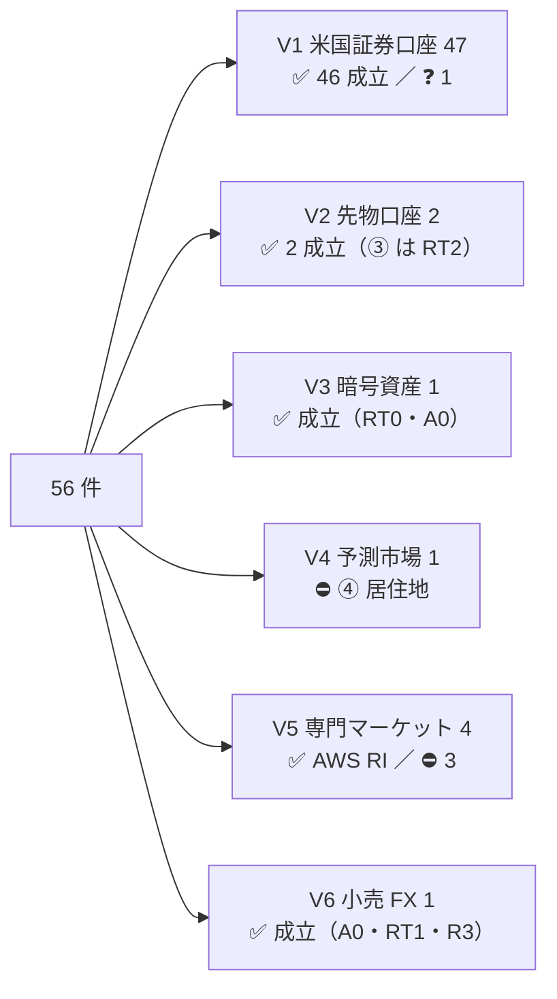
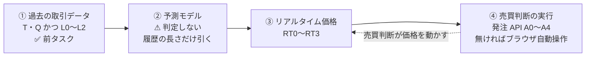
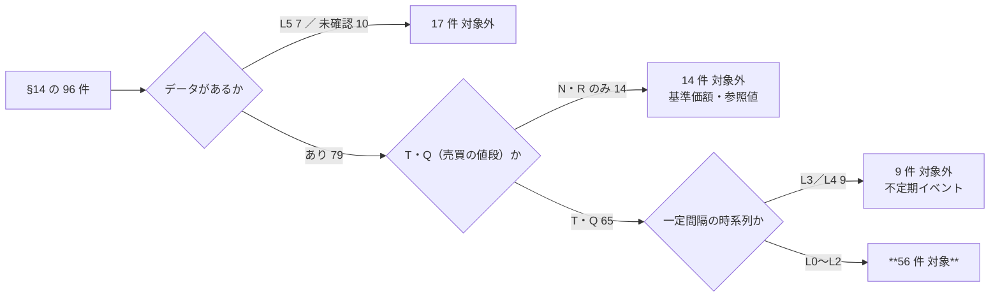
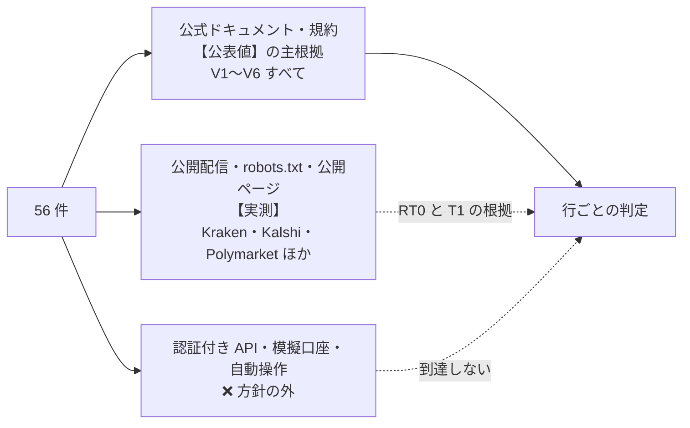
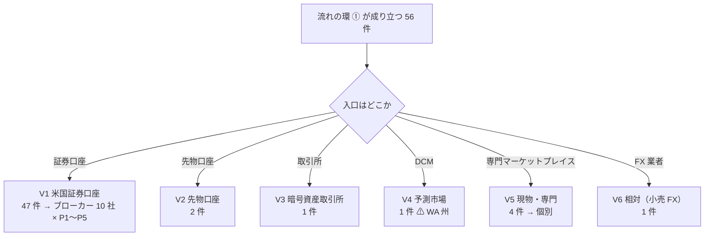
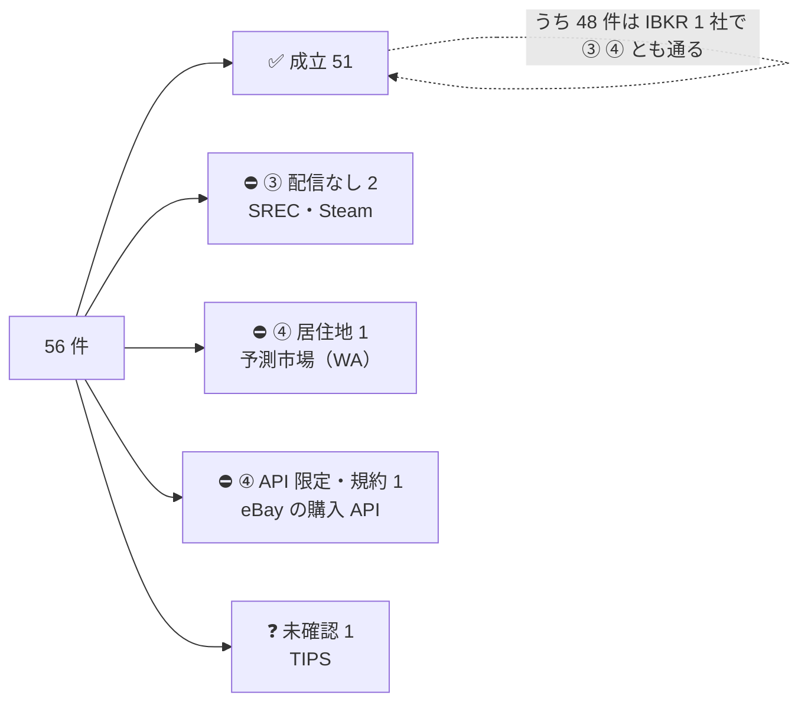
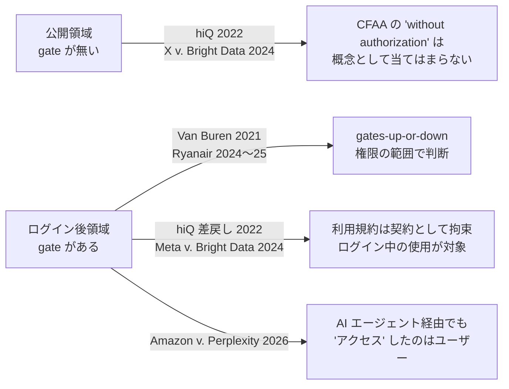

# 流れの環 ③ ④ — 56 件について、リアルタイム価格の配信と発注 API（無ければブラウザ自動操作）の可否

調査日: 2026-09-01〜02。対象: [market-data-availability.md](market-data-availability.md) の 96 行のうち、**過去の取引データ（T・Q）が一定間隔（L0〜L2）で取れると確定した 56 件**。元の一覧は [online-tradable-assets.md](online-tradable-assets.md) §14。
プラン: [docs/plans/archive/trading-api-availability.md](../plans/archive/trading-api-availability.md)

> 前タスクは「過去データが取れるか」（環 ①）までを確定させた。**この文書はその横に「現在値がプログラムに届くか」（環 ③）と「プログラムから発注できるか」（環 ④）を並べる。**元文書・スライド・前タスクの台帳は書き換えていない。

## 0. 結論

**56 件のうち 51 件は、環 ③ ④ とも公式の経路が一次情報で確認できた（`成立`）。**流れが切れるのは 4 件、未確認は 1 件。

| 流れの判定 | 件数 | 中身 |
| --- | ---: | --- |
| ✅ **成立** | **51** | 米国証券口座の 46 件（P1 42・P2 1・P4 2・P5 1）＋ 先物 2（ES・ZR）・暗号資産 1・AWS RI 1・小売 FX 1 |
| ⛔ ③ で切れる（現在値の配信が無い） | 2 | REC / SREC（Flett Exchange は画面と日次 settlement のみ）・ゲーム内アイテム（Steam に公式 API が無い） |
| ⛔ ④ で切れる（発注 API が無い・限定・規約） | 2 | 予測市場（⚠ **居住地**。Kalshi の API はあるが WA 州は裁判所命令でジオフェンス）・トレーディングカード（eBay の購入 API は Limited Release、規約が buy-for-me agent を名指しで禁止） |
| ❓ 未確認 | 1 | TIPS（IBKR・Public とも TIPS を名指しした API 記述が取れず） |
| | **56** | |

⚠ **「成立」は「③ と ④ の経路が公式に存在し、個人が利用条件を満たせば使える」という意味であって、モデルが作れる・儲かるとは言っていない**（環 ② は判定していない。§1）。

そして、後続の判断を左右する発見が 6 つあった。

| # | 発見 | 効くところ |
| --- | --- | --- |
| 1 | ⚠ **PDT（パターンデイトレーダー）規制は 2026-06-04 に FINRA 規則から廃止された**（SR-FINRA-2025-017、$25,000 要件と回数要件を intraday margin 基準へ置換。段階導入は 2027-10-20 まで）。Schwab は 6/8、E*TRADE は 6/9 に実装済み、Alpaca は docs で廃止を明記（顧客契約は経過期間中の旧要件適用を留保）【公表値】 | 米国証券口座 46 件の利用条件。プランが前提にしていた $25,000 の壁は消えた（ブローカーによっては経過期間中に旧要件を残しうる） |
| 2 | ⚠ **「現在値が無償で取れる」と「学習データと同じ板」はずれる。**Alpaca の無償フィードは IEX 単独で、IEX の市場シェアは **約 4%**（2026-08 の日次 3.75〜4.52%、IEX 自身の SEC 提出書類で「約 3.78%」）。IEX のリアルタイム TOPS は 2022 年から有償（$500 → 2026-10 に $1,000/月）で、無償なのは 15 分遅延のみ | 前タスク D5 の「約 2.5%」は更新が要る（§6-3）。全市場（SIP）の現在値を無償で受けるなら Tradier・E*TRADE・tastytrade の経路になる |
| 3 | ⚠ **10 社中 8 社が個人向けに発注 API を自己発行（A0）で開いており、7 社は AI エージェント接続（MCP）を公式に用意している**（IBKR・Alpaca・Tradier・Public・Robinhood・Webull・tastytrade）。「AI エージェントを名指しで禁じる」ブローカーは無く、逆に Robinhood は顧客契約 §29.8 で AI エージェント経由の注文を「受領時点で最終・拘束的」と規定した | 環 ④ は「API があるか」ではなく「**どの商品クラスまで**か」「**無人運転できるか**」で差がつく。IBKR（TWS / Client Portal Gateway）と E*TRADE（OAuth が ET 深夜に失効）は**毎日人がブラウザでログインする工程**が残る |
| 4 | ⚠ **API を出しているブローカーでも、API 以外の自動化を顧客契約で禁じている**（Schwab「ブラウザと書面承認アプリ以外の一切のソフトウェア」、Webull §5(e) 同旨、Public API 契約 §4(a)(xix)(xx)）。専門マーケットプレイスは robot / scraper の禁止が標準で、eBay は 2026-06 改定で **buy-for-me agents・LLM-driven bots** を名指しした | Phase 3 の判定。ブラウザ自動操作が「規約上 可」と書ける行は **1 行も無かった** |
| 5 | ⚠ **予測市場は WA 州で「切れ方」が細かくなった。**King County 上位裁判所の 2026-08-12 命令で、Kalshi は sports・elections・politics・entertainment・culture・tech & science・mentions を 2026-09-02 までにジオフェンスする。⚠ Commodities・Climate・Economics・Finance は命令の対象外だが、州賭博委員会は予測市場全般を「not authorized」としている | §14 の属性「WA 州で取引できない」を引き継ぎつつ、カテゴリで割れることを注記した（§5 の 14-11-5） |
| 6 | ⚠ **§14 の前提が 1 つ食い違った。**「2024-01-15 以降、AWS RI Marketplace で買った RI の再販は禁止」は現行 AWS Service Terms 5.6.1 と逆で、**Marketplace 購入分は再販可**、禁止されているのはディスカウントプログラム購入分。2024-01-15 の日付は第三者ブログにしか無い | §14-11 の属性の訂正候補（本書では書き換えず §6-3 に置く） |

> この図の主張: 56 件の大半は「米国証券口座」の 1 束に落ち、そこは ③ ④ とも複数社で通る。個別に効いたのは残り 9 件で、切れたのは専門マーケットプレイスと予測市場だけ。

## 1. 定義

⚠ 「API で売買できる」「リアルタイム」は人によって指すものがぶれる。プランで先に固定した定義をそのまま使う。

### 1-1. 流れの 4 環と、本書が判定する範囲

> この図の主張: 流れは 4 環。① は前タスクで確定、② は商品固有の問題ではないので判定しない、**③ と ④ を本書で埋めた**。

| 環 | 本書での扱い |
| --- | --- |
| ① 過去の取引データ | 前タスクの結果をそのまま使い、**対象の絞り込み条件**にした（§2） |
| ② 予測モデル | ⚠ **判定しない。**モデルが作れるかは商品ではなくデータ長・粒度・手法で決まる。前タスクの「履歴」列を属性として引くだけ |
| ③ リアルタイム価格 | **本書で調べた。**現在値（quote / trade / 板）がプログラムに届くか、配信方式・遅延・板の範囲・費用 |
| ④ 売買判断の実行 | **本書の主題。**発注 API の有無と段階、無ければブラウザ自動操作の規約上の可否 |

### 1-2. 発注 API の段階 A0〜A4（環 ④）

| 段階 | 内容 | 本書での例 |
| --- | --- | --- |
| **A0** 公開 | 公式・公開ドキュメント・**口座があればキーを自分で発行できる** | Alpaca・Tradier・Public・Kraken・Kalshi |
| **A1** 申請制 | 公式だが**アプリ登録・審査**を経る（個人可） | Webull（1〜2 営業日）・Schwab【推測】・AWS RI の出品・eBay の Buy API |
| **A2** 限定 | 公式だが**パートナー・法人・機関限定** | IBKR の OAuth・FIX、eBay の Order API（Limited Release） |
| **A3** 非公式のみ | サードパーティの非公認ライブラリ、Web セッションの流用 | ⚠ **「無し」と数える。**Robinhood 株式向けの robin_stocks 等 |
| **A4** 無し | 公式 API が存在しない、または「探した範囲で見つからず」 | Flett Exchange・Steam・TCGplayer（購入） |

⚠ **上場商品の発注 API は取引所ではなくブローカーのものである。**個人は NYSE や CME に直接発注できない。したがって V1・V2 は「その商品クラスを扱うブローカーの API が、そのクラスの発注に対応しているか」を問う。

### 1-3. 商品クラス P1〜P5 — 「API がある」と「その商品が API で買える」はずれる

| クラス | 56 件での該当 | 行数 |
| --- | --- | ---: |
| **P1** 上場株・ETF・CEF・優先株・SPAC | 14-1・14-2 の全部、債券 ETF、商品 ETF、バッファー ETF、SPAC、通貨 ETF ほか | 42 |
| **P2** 上場オプション | オプション売り（14-6-2） | 1 |
| **P3** 先物 | 米 ZR（14-5-5）・§1256（14-6-1） | 2 |
| **P4** 債券の個別銘柄 | 米国債・TIPS・地方債 AAA（14-3-1・2・5） | 3 |
| **P5** OTC・外国上場 | 物理ウラン SRUUF（OTC）・U.UN（TSX）（14-5-6） | 1 |
| — | V3〜V6（証券口座以外） | 7 |

### 1-4. リアルタイム価格の段階 RT0〜RT3（環 ③）

| 段階 | 内容 | 本書での例 |
| --- | --- | --- |
| **RT0** 無登録・無償 | 公開の WebSocket / REST で、アカウント無しに現在値が取れる | Kraken・Coinbase・Kalshi REST・Polymarket【実測】 |
| **RT1** 口座があれば無償 | ブローカー・運営の口座を持てば追加費用なしで配信される | Tradier・tastytrade・E*TRADE・Public、⚠ Alpaca（IEX のみ）、AWS RI |
| **RT2** 有償購読 | 取引所の配信料・ベンダの月額が要る | IBKR（取引所ごと USD 1.50〜）、Alpaca SIP（$99/月）、CME |
| **RT3** 無し | 現在値がプログラムから取れない。画面表示のみ・日次更新のみ | Flett Exchange・Steam・TCGplayer（新規） |

記録した属性: 配信方式（ストリーミング / ポーリング）・遅延・板の範囲（全市場 SIP / 単一取引所）・登録要否・費用。

### 1-5. ブラウザ自動操作の判定軸（Phase 3）

⚠ **本プロジェクトは自動操作を実行しない（§3）。**判定は**規約**を主軸に、技術的関門は公表情報と公開ページの 1 回取得で補助した。

| 軸 | 段階 | 内容 |
| --- | --- | --- |
| **R** 規約 | R1 明示禁止 | 利用規約・顧客契約に「自動化された手段（robot / script / scraper / automated means）」の禁止条項がある |
| | R2 沈黙 | 該当する条項が見つからない（⚠ 「可」と断定しない） |
| | R3 許容 | 条件付きで認めている（実質 API 提供と同じ） |
| **T** 技術 | T1 強い関門 | MFA 必須・CAPTCHA・bot 検出の導入が公表情報または公開ページで確認できる |
| | T2 ログインのみ | 通常のログインだけ |
| | T3 ログイン不要 | 発注にアカウントが要らない |

行ごとの判定は「規約上 可 / 不可 / 未確認」の 3 値。**A0・A1 の行は「不要」。**⚠ AI エージェント（computer use 型）によるブラウザ操作も「自動化された手段」に含めて読み、名指し条項の有無を確認項目に入れた。

### 1-6. 流れの判定

③ と ④ の両方が通って初めて `成立`。それ以外は `③ で切れる` / `④ で切れる` / `未確認`。⚠ ブラウザ自動操作は環 ④ だけの代替であり、③ が RT3 の行は ④ がどうであれ切れる。

## 2. 母集団 — 流れの環 ① が成り立つ 56 件

**基準: 前タスクの台帳（§4）の「種類」列が T か Q を含み、かつ「最小粒度」列が L0〜L2 に確定している行。**96 行から機械的に抜いた。

| 落とす理由 | 内容 | 件数 | 該当 |
| --- | --- | ---: | --- |
| **A** L5 | データが無い | 7 | BDC「平均 12.6%」（14-1-7）・CEF（14-1-10）・地方債 CEF（14-3-6）・特許（14-8-6）・時計（14-9-3）・官公庁の払い下げ（14-11-2）・協同組合の持分（14-11-10） |
| **B** 未確認 | 前タスクで保留 3・打ち切り 7 | 10 | ブローカード CD（14-3-15）・MYGA（14-4-1）・変額年金（14-4-2）・トークン化国債（14-4-4）・スニーカー（14-9-1）・住宅ローン債権（14-10-3）・YieldStreet（14-10-6）・返品在庫（14-11-3）・貸株（14-11-8）・貸付（14-11-9） |
| **C** T・Q だが L3／L4 | 落札・成約の**不定期イベント**で、一定間隔の時系列にならない。⚠ リアルタイムの価格も存在しない | 9 | NFT（14-7-3）・トークン化不動産（14-7-4）・音楽印税（14-8-1）・ドメイン（14-8-3）・周波数（14-8-4）・美術品の分割所有（14-9-4）・ワイン等（14-9-5）・タックスリーエン（14-10-1）・不動産現物（14-10-7） |
| **D** L0〜L2 だが N・R のみ | 基準価額・参照値は売買の値段ではない | 4 | 現物金・銀（14-5-2）・ステーキング（14-7-2）・未公開株の二次市場（14-10-2）・CCLFX（14-10-5） |
| **E** L3／L4 かつ N・R のみ | 値段が動かない・買取式で決まる | 10 | I Bonds（14-3-3）・EE Bonds（14-3-4）・MMF（14-3-14）・仕組債（14-3-17）・生命保険買取（14-4-3）・水（14-5-8）・IPv4（14-8-2）・Fundrise（14-10-4）・サイト売買（14-11-1）・航空マイル（14-11-7） |
| | **除外** | **40** | |
| ✅ **対象** | T・Q かつ L0〜L2 | **56** | 分類別 **16 / 10 / 11 / 0 / 6 / 7 / 1 / 1 / 1 / 0 / 3** |

> この図の主張: 96 件は 5 つの理由で 40 件落ち、56 件が残る。**落ちるのはすべて環 ① の欠落**で、儲かるかどうかで落としたものは無い。

⚠ **14-4 保険・年金と 14-10 債権・不動産・未公開は 0 件。**この 2 分類は「値段が売買で決まらない」か「不定期」のどちらかで、流れの環 ① が成り立たない。
⚠ **再開条件**: 前タスクの保留 3 件（MYGA・トークン化国債・スニーカー）が T・Q かつ L0〜L2 で確定したら追加する。StockX は本物の bid/ask を持つので、確定すれば入りうる唯一の候補。

## 3. 方針との関係 — 何を実測し、何を実測しなかったか

CLAUDE.md の 2026-08-27 方針変更により、**登録・契約・課金・実行は行わない**。この調査では次の線を引いた。

| 行為 | 可否 | 結果 |
| --- | --- | --- |
| 公式の API ドキュメント・料金表・利用規約・顧客契約を読む | ✅ 行った | **判定の主根拠**。ログイン壁の向こうは「未確認」（Schwab の開発者ポータル、tastytrade の OAuth 登録手順、eBay の Marketplace Insights） |
| `robots.txt`・利用規約ページを 1 回取得する | ✅ 行った | 40 ドメイン。⚠ `cmegroup.com` は IP 単位で遮断し「scripts, robots, agents … strictly prohibited」と返す。`ebay.com` は ClaudeBot・GPTBot 等の AI クローラを `Disallow: /`。`kalshi.com` は Vercel のチャレンジで robots.txt すら返さない |
| **無登録・無認証**の公開配信から現在値を 1 回取る | ⚠ 前タスクで実測済みの 3 経路に限って実施 | **Kraken WS v2・Kalshi REST・Polymarket CLOB WS** で RT0 を【実測】（§3-1） |
| 公開のログインページを手動相当で 1 回開き、bot 検出の痕跡を目視 | ⚠ `robots.txt` が許す範囲・フォーム送信なし | IBKR・E*TRADE に Akamai、Polymarket に Cloudflare チャレンジ、eBay の signin は curl を 403 で遮断（§3-2） |
| アカウント登録・API キー取得・**模擬口座の開設** | ❌ 行わなかった | ⚠ 模擬口座も「登録」にあたる。Alpaca paper・IBKR demo・Webull sandbox 等は使っていない |
| 認証付き API を叩く | ❌ 行わなかった | 発注 API とブローカーの相場配信は全て認証付きなので、**V1・V2・V6 に【実測】は存在しない** |
| ブラウザ自動操作を動かす | ❌ 行わなかった | 自分の口座が無いうえ、規約確認前の実行は方針に反する |

> この図の主張: 環 ③ ④ とも、米国株は認証の壁の向こうにあり【公表値】でしか書けない。【実測】が届くのは暗号資産・予測市場の公開配信と robots.txt・公開ページだけ。

### 3-1. 実測した公開配信（3 経路・2026-09-01 PDT）

| # | 経路 | 確認できたこと |
| --- | --- | --- |
| 1 | **Kraken WebSocket v2** `wss://ws.kraken.com/v2` | 無認証で接続 → `status`（v2.0.10）→ `ticker`・`trade`（BTC/USD）の subscribe が `success:true`。25.9 秒で ticker 6 本・trade 7 本。ticker snapshot は bid 77381.7 / ask 77381.8 / last 77381.8、タイムスタンプとローカル受信の差はサブ秒（−0.03〜−0.28 秒。ローカル時計の遅れ） | 
| 2 | **Kalshi REST** `GET /trade-api/v2/markets?series_ticker=KXHIGHNY&status=open` → `GET /markets/{ticker}/orderbook?depth=3` | 無認証で 200。`KXHIGHNY-26SEP01-T83` yes_bid 0.9900 / yes_ask 1.0000 / 出来高 56,142。板 `yes_dollars: [[0.97, 15.00], [0.98, 252.00], [0.99, 4491.57]]`。⚠ OpenAPI は orderbook に `security` を付けているが、無認証で返った。⚠ `/markets?limit=200` の先頭ページは板の無い `KXMVECROSSCATEGORY-SHARD…` 200 件で埋まり、`series_ticker` 指定が要る |
| 3 | **Polymarket CLOB WebSocket** `wss://ws-subscriptions-clob.polymarket.com/ws/market` | 無認証で接続 → `{"assets_ids":[…],"type":"market"}` → `event_type: book` 1 件（Fed 9 月会合 no-change 市場、bid 0.39/0.40、gamma API の bestBid 0.4 / bestAsk 0.41 と整合）。25 秒間に差分イベントは無し（21:24 PDT）。`PING`/`PONG` 10 秒 |

⚠ **Kalshi の WebSocket は叩いていない。**docs が「Authentication is required to establish the connection … Some channels carry only public market data, but the connection itself still requires authentication」と明記しているため。よって Kalshi は REST が RT0、WS が RT1。

### 3-2. 公開ログインページと robots.txt で見えた技術的関門（T1 の補助）

| サイト | 観察（1 回取得・フォーム送信なし） | 読み |
| --- | --- | --- |
| `cmegroup.com` | **403** JSON「This IP address is blocked due to suspected web scraping activity … Use of scripts, software, spiders, robots, avatars, agents, tools or other scraping mechanisms is strictly prohibited by CME Group's website Data Terms of Use」 | T1 ＋ R1（Web サイト）。CME の一次資料はこの調査環境から読めず、CME データ料は二次情報 |
| `kalshi.com` | **429** Vercel Security Checkpoint（robots.txt・sign-in・規約 PDF とも） | T1。docs.kalshi.com と API ホストは通る |
| `signin.ebay.com`・`developer.ebay.com` | **403**「Error Page \| eBay」 | T1。開発者ドキュメントはミラー `edp.ebay.com` で読めた |
| `forex.com` | **403** Cloudflare「Just a moment…」 | T1 |
| `polymarket.com` | 200。`/cdn-cgi/challenge-platform/scripts/…` が挿入 | Cloudflare の bot 管理 |
| `interactivebrokers.com/sso/Login`・`us.etrade.com/…/login` | 200。Akamai の配信・計測スクリプト（`akamaihd.net`・`AKAMAIURL`）。`developer.etrade.com` は Akamai の Access Denied | Akamai 配下（Bot Manager の有無までは読めない） |
| `robinhood.com/login`・`app.alpaca.markets/login`・`kraken.com/sign-in` | 200。SPA バンドルのみで、静的 HTML からベンダ名は読めず | 未確認 |

## 4. 束 — 56 件を「入口の場所」で 6 つに割った

**環 ③ ④ の経路は商品ではなく「どこで買うか」で決まる。**前タスクの束（S1〜S7）は識別子で切ったが、本書は入口で切り直した。

> この図の主張: 56 件は入口で 6 束に落ちる。**V1 の 47 件は「ブローカー API × 商品クラス」の 1 つの行列**で片付き、個別調査が要ったのは V3〜V6 の 9 件。

| 束 | 件数 | 該当（§14 の分類） | 当たった先 | 着地 |
| --- | ---: | --- | --- | --- |
| **V1** 米国証券口座 | **47** | 14-1（16）・14-2（10）・14-3 の 11・14-5 の 5・14-6 の 5 | ブローカー 10 社（IBKR・Alpaca・Tradier・tastytrade・Schwab・E*TRADE・Webull・Public・Robinhood・moomoo）を横断で 1 回 | P1・P2 は **8 社で A0**、現在値は **4 社で RT1**。P4・P5 は対応社が 1〜2 社（付録 A-1） |
| **V2** 先物口座 | **2** | 14-5-5（米 ZR）・14-6-1（§1256） | 先物ブローカーの API と ZR の取扱 | **A0・RT2**。ES は IBKR・tastytrade・Tradovate、ZR は Tradovate・NinjaTrader・AMP・Ironbeam が扱う（tastytrade は非対応、IBKR は未確認）。⚠ 相場は CME の配信料で、Tradovate の API 経由はサブベンダー登録が要る |
| **V3** 暗号資産取引所 | **1** | 14-7-1 | Kraken・Coinbase の公開仕様 | **A0・RT0【実測】**。WA 州で提供あり |
| **V4** 予測市場 | **1** | 14-11-5 | Kalshi・Polymarket の公開仕様 | **A0・RT0【実測】**だが ⚠ **WA 州は裁判所命令でジオフェンス**（カテゴリで割れる） |
| **V5** 現物・専門マーケットプレイス | **4** | 14-8-5・14-9-2・14-11-4・14-11-6 | サイトごとに個別 | AWS RI だけが ✅（購入 A0・出品 A1・RT1）。SREC・カード・ゲーム内は切れる |
| **V6** 相対（小売 FX） | **1** | 14-6-7 | FX 業者の API 仕様 | **A0・RT1・R3**（OANDA v20 が自動売買を明示的に許容）。⚠ 建値は業者固有、ストリームは 4 本/秒に間引き |
| | **56** | | | |

束の割り当ては初期案（47/2/1/1/4/1）どおりに確定した。前タスクの束との対応は §7 の検証表に置いた。

## 5. 56 行の表

⚠ **費用・認証・規約・出典は行ごとに書かず、付録 A のカタログ（B1〜B10・F・X・K・M・FX・T）に集約した。**同じブローカー行列が 47 行に出るため、行に書くと同じ内容を 47 回繰り返すことになる。行の「出典」列の記号を付録 A で引く。「入口」は §14 の「買う場所」列、「履歴」は前タスクの「履歴」列をそのまま写した。

### §14-1 株式・株式ファンド（16 件）

| # | 商品 | 入口 | 束 | P | 履歴 | ③ リアルタイム価格 | ④ 発注 API の提供元 | ④ 段階 | ⚠ 利用条件 | 規約 | ブラウザ自動操作 | 流れの判定 | 出典 |
| --- | --- | --- | --- | --- | --- | --- | --- | --- | --- | --- | --- | --- | --- |
| 1 | 上場株・高配当 ETF（SCHD・VYM） | 証券口座 | V1 | P1 | tick 2004〜 | **RT1**（Tradier・tastytrade・E*TRADE・Public: 口座で無償）／Alpaca 無償は **IEX のみ**（約 4%）／IBKR は **RT2**（Network A・B・C 各 USD 1.50） | Alpaca・Tradier・tastytrade・IBKR・E*TRADE・Public・moomoo（A0）／Webull・Schwab（A1） | **A0** | 入金済み口座（IBKR は IBKR Pro）。レート制限は社ごと（Tradier 発注 60/分〜IBKR 50/秒）。⚠ PDT（$25,000）は 2026-06-04 に廃止（付録 A-7 T6）。⚠ 非表示利用の申告（付録 A-7 T1） | R2（Alpaca・Tradier・tastytrade・IBKR・E*TRADE）／⚠ **R1**（Schwab・Webull・Public は API 以外の自動化を禁止） | 不要 | ✅ **成立** ⚠ 学習 SIP tick と現在値の板が違う（§6-3） | B1〜B10 |
| 2 | REIT ETF（VNQ） | 証券口座 | V1 | P1 | tick 2004〜 | **RT1**（Tradier・tastytrade・E*TRADE・Public: 口座で無償）／Alpaca 無償は **IEX のみ**（約 4%）／IBKR は **RT2**（Network A・B・C 各 USD 1.50） | Alpaca・Tradier・tastytrade・IBKR・E*TRADE・Public・moomoo（A0）／Webull・Schwab（A1） | **A0** | 入金済み口座（IBKR は IBKR Pro）。レート制限は社ごと（Tradier 発注 60/分〜IBKR 50/秒）。⚠ PDT（$25,000）は 2026-06-04 に廃止（付録 A-7 T6）。⚠ 非表示利用の申告（付録 A-7 T1） | R2（Alpaca・Tradier・tastytrade・IBKR・E*TRADE）／⚠ **R1**（Schwab・Webull・Public は API 以外の自動化を禁止） | 不要 | ✅ **成立** ⚠ 学習 SIP tick と現在値の板が違う（§6-3） | B1〜B10 |
| 3 | mREIT（AGNC・NLY） | 証券口座 | V1 | P1 | tick 2004〜 | **RT1**（Tradier・tastytrade・E*TRADE・Public: 口座で無償）／Alpaca 無償は **IEX のみ**（約 4%）／IBKR は **RT2**（Network A・B・C 各 USD 1.50） | Alpaca・Tradier・tastytrade・IBKR・E*TRADE・Public・moomoo（A0）／Webull・Schwab（A1） | **A0** | 入金済み口座（IBKR は IBKR Pro）。レート制限は社ごと（Tradier 発注 60/分〜IBKR 50/秒）。⚠ PDT（$25,000）は 2026-06-04 に廃止（付録 A-7 T6）。⚠ 非表示利用の申告（付録 A-7 T1） | R2（Alpaca・Tradier・tastytrade・IBKR・E*TRADE）／⚠ **R1**（Schwab・Webull・Public は API 以外の自動化を禁止） | 不要 | ✅ **成立** ⚠ 学習 SIP tick と現在値の板が違う（§6-3） | B1〜B10 |
| 4 | mREIT ETF（MORT） | 証券口座 | V1 | P1 | tick 2004〜 | **RT1**（Tradier・tastytrade・E*TRADE・Public: 口座で無償）／Alpaca 無償は **IEX のみ**（約 4%）／IBKR は **RT2**（Network A・B・C 各 USD 1.50） | Alpaca・Tradier・tastytrade・IBKR・E*TRADE・Public・moomoo（A0）／Webull・Schwab（A1） | **A0** | 入金済み口座（IBKR は IBKR Pro）。レート制限は社ごと（Tradier 発注 60/分〜IBKR 50/秒）。⚠ PDT（$25,000）は 2026-06-04 に廃止（付録 A-7 T6）。⚠ 非表示利用の申告（付録 A-7 T1） | R2（Alpaca・Tradier・tastytrade・IBKR・E*TRADE）／⚠ **R1**（Schwab・Webull・Public は API 以外の自動化を禁止） | 不要 | ✅ **成立** ⚠ 学習 SIP tick と現在値の板が違う（§6-3） | B1〜B10 |
| 5 | BDC（ARCC） | 証券口座 | V1 | P1 | tick 2004〜 | **RT1**（Tradier・tastytrade・E*TRADE・Public: 口座で無償）／Alpaca 無償は **IEX のみ**（約 4%）／IBKR は **RT2**（Network A・B・C 各 USD 1.50） | Alpaca・Tradier・tastytrade・IBKR・E*TRADE・Public・moomoo（A0）／Webull・Schwab（A1） | **A0** | 入金済み口座（IBKR は IBKR Pro）。レート制限は社ごと（Tradier 発注 60/分〜IBKR 50/秒）。⚠ PDT（$25,000）は 2026-06-04 に廃止（付録 A-7 T6）。⚠ 非表示利用の申告（付録 A-7 T1） | R2（Alpaca・Tradier・tastytrade・IBKR・E*TRADE）／⚠ **R1**（Schwab・Webull・Public は API 以外の自動化を禁止） | 不要 | ✅ **成立** ⚠ 学習 SIP tick と現在値の板が違う（§6-3） | B1〜B10 |
| 6 | BDC（MAIN） | 証券口座 | V1 | P1 | tick 2004〜 | **RT1**（Tradier・tastytrade・E*TRADE・Public: 口座で無償）／Alpaca 無償は **IEX のみ**（約 4%）／IBKR は **RT2**（Network A・B・C 各 USD 1.50） | Alpaca・Tradier・tastytrade・IBKR・E*TRADE・Public・moomoo（A0）／Webull・Schwab（A1） | **A0** | 入金済み口座（IBKR は IBKR Pro）。レート制限は社ごと（Tradier 発注 60/分〜IBKR 50/秒）。⚠ PDT（$25,000）は 2026-06-04 に廃止（付録 A-7 T6）。⚠ 非表示利用の申告（付録 A-7 T1） | R2（Alpaca・Tradier・tastytrade・IBKR・E*TRADE）／⚠ **R1**（Schwab・Webull・Public は API 以外の自動化を禁止） | 不要 | ✅ **成立** ⚠ 学習 SIP tick と現在値の板が違う（§6-3） | B1〜B10 |
| 8 | カバードコール ETF（QYLD） | 証券口座 | V1 | P1 | tick 2004〜 | **RT1**（Tradier・tastytrade・E*TRADE・Public: 口座で無償）／Alpaca 無償は **IEX のみ**（約 4%）／IBKR は **RT2**（Network A・B・C 各 USD 1.50） | Alpaca・Tradier・tastytrade・IBKR・E*TRADE・Public・moomoo（A0）／Webull・Schwab（A1） | **A0** | 入金済み口座（IBKR は IBKR Pro）。レート制限は社ごと（Tradier 発注 60/分〜IBKR 50/秒）。⚠ PDT（$25,000）は 2026-06-04 に廃止（付録 A-7 T6）。⚠ 非表示利用の申告（付録 A-7 T1） | R2（Alpaca・Tradier・tastytrade・IBKR・E*TRADE）／⚠ **R1**（Schwab・Webull・Public は API 以外の自動化を禁止） | 不要 | ✅ **成立** ⚠ 学習 SIP tick と現在値の板が違う（§6-3） | B1〜B10 |
| 9 | カバードコール ETF（JEPI） | 証券口座 | V1 | P1 | tick 2004〜 | **RT1**（Tradier・tastytrade・E*TRADE・Public: 口座で無償）／Alpaca 無償は **IEX のみ**（約 4%）／IBKR は **RT2**（Network A・B・C 各 USD 1.50） | Alpaca・Tradier・tastytrade・IBKR・E*TRADE・Public・moomoo（A0）／Webull・Schwab（A1） | **A0** | 入金済み口座（IBKR は IBKR Pro）。レート制限は社ごと（Tradier 発注 60/分〜IBKR 50/秒）。⚠ PDT（$25,000）は 2026-06-04 に廃止（付録 A-7 T6）。⚠ 非表示利用の申告（付録 A-7 T1） | R2（Alpaca・Tradier・tastytrade・IBKR・E*TRADE）／⚠ **R1**（Schwab・Webull・Public は API 以外の自動化を禁止） | 不要 | ✅ **成立** ⚠ 学習 SIP tick と現在値の板が違う（§6-3） | B1〜B10 |
| 11 | 優先株 ETF（PFF） | 証券口座 | V1 | P1 | tick 2004〜 | **RT1**（Tradier・tastytrade・E*TRADE・Public: 口座で無償）／Alpaca 無償は **IEX のみ**（約 4%）／IBKR は **RT2**（Network A・B・C 各 USD 1.50） | Alpaca・Tradier・tastytrade・IBKR・E*TRADE・Public・moomoo（A0）／Webull・Schwab（A1） | **A0** | 入金済み口座（IBKR は IBKR Pro）。レート制限は社ごと（Tradier 発注 60/分〜IBKR 50/秒）。⚠ PDT（$25,000）は 2026-06-04 に廃止（付録 A-7 T6）。⚠ 非表示利用の申告（付録 A-7 T1） | R2（Alpaca・Tradier・tastytrade・IBKR・E*TRADE）／⚠ **R1**（Schwab・Webull・Public は API 以外の自動化を禁止） | 不要 | ✅ **成立** ⚠ 学習 SIP tick と現在値の板が違う（§6-3） | B1〜B10 |
| 12 | 鉱区ロイヤリティ LP（DMLP） | 証券口座 | V1 | P1 | tick 2004〜 | **RT1**（Tradier・tastytrade・E*TRADE・Public: 口座で無償）／Alpaca 無償は **IEX のみ**（約 4%）／IBKR は **RT2**（Network A・B・C 各 USD 1.50） | Alpaca・Tradier・tastytrade・IBKR・E*TRADE・Public・moomoo（A0）／Webull・Schwab（A1） | **A0** | 入金済み口座（IBKR は IBKR Pro）。レート制限は社ごと（Tradier 発注 60/分〜IBKR 50/秒）。⚠ PDT（$25,000）は 2026-06-04 に廃止（付録 A-7 T6）。⚠ 非表示利用の申告（付録 A-7 T1） | R2（Alpaca・Tradier・tastytrade・IBKR・E*TRADE）／⚠ **R1**（Schwab・Webull・Public は API 以外の自動化を禁止） | 不要 | ✅ **成立** ⚠ 学習 SIP tick と現在値の板が違う（§6-3） | B1〜B10 |
| 13 | 鉱区ロイヤリティ LP（BSM） | 証券口座 | V1 | P1 | tick 2004〜 | **RT1**（Tradier・tastytrade・E*TRADE・Public: 口座で無償）／Alpaca 無償は **IEX のみ**（約 4%）／IBKR は **RT2**（Network A・B・C 各 USD 1.50） | Alpaca・Tradier・tastytrade・IBKR・E*TRADE・Public・moomoo（A0）／Webull・Schwab（A1） | **A0** | 入金済み口座（IBKR は IBKR Pro）。レート制限は社ごと（Tradier 発注 60/分〜IBKR 50/秒）。⚠ PDT（$25,000）は 2026-06-04 に廃止（付録 A-7 T6）。⚠ 非表示利用の申告（付録 A-7 T1） | R2（Alpaca・Tradier・tastytrade・IBKR・E*TRADE）／⚠ **R1**（Schwab・Webull・Public は API 以外の自動化を禁止） | 不要 | ✅ **成立** ⚠ 学習 SIP tick と現在値の板が違う（§6-3） | B1〜B10 |
| 14 | MLP ETF（AMLP） | 証券口座 | V1 | P1 | tick 2004〜 | **RT1**（Tradier・tastytrade・E*TRADE・Public: 口座で無償）／Alpaca 無償は **IEX のみ**（約 4%）／IBKR は **RT2**（Network A・B・C 各 USD 1.50） | Alpaca・Tradier・tastytrade・IBKR・E*TRADE・Public・moomoo（A0）／Webull・Schwab（A1） | **A0** | 入金済み口座（IBKR は IBKR Pro）。レート制限は社ごと（Tradier 発注 60/分〜IBKR 50/秒）。⚠ PDT（$25,000）は 2026-06-04 に廃止（付録 A-7 T6）。⚠ 非表示利用の申告（付録 A-7 T1） | R2（Alpaca・Tradier・tastytrade・IBKR・E*TRADE）／⚠ **R1**（Schwab・Webull・Public は API 以外の自動化を禁止） | 不要 | ✅ **成立** ⚠ 学習 SIP tick と現在値の板が違う（§6-3） | B1〜B10 |
| 15 | 石油ガスロイヤリティトラスト（PBT・SBR） | 証券口座 | V1 | P1 | tick 2004〜 | **RT1**（Tradier・tastytrade・E*TRADE・Public: 口座で無償）／Alpaca 無償は **IEX のみ**（約 4%）／IBKR は **RT2**（Network A・B・C 各 USD 1.50） | Alpaca・Tradier・tastytrade・IBKR・E*TRADE・Public・moomoo（A0）／Webull・Schwab（A1） | **A0** | 入金済み口座（IBKR は IBKR Pro）。レート制限は社ごと（Tradier 発注 60/分〜IBKR 50/秒）。⚠ PDT（$25,000）は 2026-06-04 に廃止（付録 A-7 T6）。⚠ 非表示利用の申告（付録 A-7 T1） | R2（Alpaca・Tradier・tastytrade・IBKR・E*TRADE）／⚠ **R1**（Schwab・Webull・Public は API 以外の自動化を禁止） | 不要 | ✅ **成立** ⚠ 学習 SIP tick と現在値の板が違う（§6-3） | B1〜B10 |
| 16 | 農地 REIT（FPI・LAND） | 証券口座 | V1 | P1 | tick 2004〜 | **RT1**（Tradier・tastytrade・E*TRADE・Public: 口座で無償）／Alpaca 無償は **IEX のみ**（約 4%）／IBKR は **RT2**（Network A・B・C 各 USD 1.50） | Alpaca・Tradier・tastytrade・IBKR・E*TRADE・Public・moomoo（A0）／Webull・Schwab（A1） | **A0** | 入金済み口座（IBKR は IBKR Pro）。レート制限は社ごと（Tradier 発注 60/分〜IBKR 50/秒）。⚠ PDT（$25,000）は 2026-06-04 に廃止（付録 A-7 T6）。⚠ 非表示利用の申告（付録 A-7 T1） | R2（Alpaca・Tradier・tastytrade・IBKR・E*TRADE）／⚠ **R1**（Schwab・Webull・Public は API 以外の自動化を禁止） | 不要 | ✅ **成立** ⚠ 学習 SIP tick と現在値の板が違う（§6-3） | B1〜B10 |
| 17 | 林地 REIT（WY） | 証券口座 | V1 | P1 | tick 2004〜 | **RT1**（Tradier・tastytrade・E*TRADE・Public: 口座で無償）／Alpaca 無償は **IEX のみ**（約 4%）／IBKR は **RT2**（Network A・B・C 各 USD 1.50） | Alpaca・Tradier・tastytrade・IBKR・E*TRADE・Public・moomoo（A0）／Webull・Schwab（A1） | **A0** | 入金済み口座（IBKR は IBKR Pro）。レート制限は社ごと（Tradier 発注 60/分〜IBKR 50/秒）。⚠ PDT（$25,000）は 2026-06-04 に廃止（付録 A-7 T6）。⚠ 非表示利用の申告（付録 A-7 T1） | R2（Alpaca・Tradier・tastytrade・IBKR・E*TRADE）／⚠ **R1**（Schwab・Webull・Public は API 以外の自動化を禁止） | 不要 | ✅ **成立** ⚠ 学習 SIP tick と現在値の板が違う（§6-3） | B1〜B10 |
| 18 | 転換社債 ETF（CWB・ICVT） | 証券口座 | V1 | P1 | tick 2004〜 | **RT1**（Tradier・tastytrade・E*TRADE・Public: 口座で無償）／Alpaca 無償は **IEX のみ**（約 4%）／IBKR は **RT2**（Network A・B・C 各 USD 1.50） | Alpaca・Tradier・tastytrade・IBKR・E*TRADE・Public・moomoo（A0）／Webull・Schwab（A1） | **A0** | 入金済み口座（IBKR は IBKR Pro）。レート制限は社ごと（Tradier 発注 60/分〜IBKR 50/秒）。⚠ PDT（$25,000）は 2026-06-04 に廃止（付録 A-7 T6）。⚠ 非表示利用の申告（付録 A-7 T1） | R2（Alpaca・Tradier・tastytrade・IBKR・E*TRADE）／⚠ **R1**（Schwab・Webull・Public は API 以外の自動化を禁止） | 不要 | ✅ **成立** ⚠ 学習 SIP tick と現在値の板が違う（§6-3） | B1〜B10 |

### §14-2 上場の代替アクセス（10 件）

| # | 商品 | 入口 | 束 | P | 履歴 | ③ リアルタイム価格 | ④ 発注 API の提供元 | ④ 段階 | ⚠ 利用条件 | 規約 | ブラウザ自動操作 | 流れの判定 | 出典 |
| --- | --- | --- | --- | --- | --- | --- | --- | --- | --- | --- | --- | --- | --- |
| 1 | 生命保険買取 → NYSE:ABX（Abacus。旧 ABL） | 証券口座（上場株） | V1 | P1 | 上場以降 | **RT1**（Tradier・tastytrade・E*TRADE・Public: 口座で無償）／Alpaca 無償は **IEX のみ**（約 4%）／IBKR は **RT2**（Network A・B・C 各 USD 1.50） | Alpaca・Tradier・tastytrade・IBKR・E*TRADE・Public・moomoo（A0）／Webull・Schwab（A1） | **A0** | 入金済み口座（IBKR は IBKR Pro）。レート制限は社ごと（Tradier 発注 60/分〜IBKR 50/秒）。⚠ PDT（$25,000）は 2026-06-04 に廃止（付録 A-7 T6）。⚠ 非表示利用の申告（付録 A-7 T1） | R2（Alpaca・Tradier・tastytrade・IBKR・E*TRADE）／⚠ **R1**（Schwab・Webull・Public は API 以外の自動化を禁止） | 不要 | ✅ **成立** ⚠ 学習 SIP tick と現在値の板が違う（§6-3） | B1〜B10 |
| 2 | 訴訟ファイナンス → NYSE:BUR（Burford） | 証券口座（上場株） | V1 | P1 | 上場以降 | **RT1**（Tradier・tastytrade・E*TRADE・Public: 口座で無償）／Alpaca 無償は **IEX のみ**（約 4%）／IBKR は **RT2**（Network A・B・C 各 USD 1.50） | Alpaca・Tradier・tastytrade・IBKR・E*TRADE・Public・moomoo（A0）／Webull・Schwab（A1） | **A0** | 入金済み口座（IBKR は IBKR Pro）。レート制限は社ごと（Tradier 発注 60/分〜IBKR 50/秒）。⚠ PDT（$25,000）は 2026-06-04 に廃止（付録 A-7 T6）。⚠ 非表示利用の申告（付録 A-7 T1） | R2（Alpaca・Tradier・tastytrade・IBKR・E*TRADE）／⚠ **R1**（Schwab・Webull・Public は API 以外の自動化を禁止） | 不要 | ✅ **成立** ⚠ 学習 SIP tick と現在値の板が違う（§6-3） | B1〜B10 |
| 3 | 未公開株 → NYSE:DXYZ（Destiny Tech100） | 証券口座（上場株） | V1 | P1 | 上場以降 | **RT1**（Tradier・tastytrade・E*TRADE・Public: 口座で無償）／Alpaca 無償は **IEX のみ**（約 4%）／IBKR は **RT2**（Network A・B・C 各 USD 1.50） | Alpaca・Tradier・tastytrade・IBKR・E*TRADE・Public・moomoo（A0）／Webull・Schwab（A1） | **A0** | 入金済み口座（IBKR は IBKR Pro）。レート制限は社ごと（Tradier 発注 60/分〜IBKR 50/秒）。⚠ PDT（$25,000）は 2026-06-04 に廃止（付録 A-7 T6）。⚠ 非表示利用の申告（付録 A-7 T1） | R2（Alpaca・Tradier・tastytrade・IBKR・E*TRADE）／⚠ **R1**（Schwab・Webull・Public は API 以外の自動化を禁止） | 不要 | ✅ **成立** ⚠ 学習 SIP tick と現在値の板が違う（§6-3） | B1〜B10 |
| 4 | 未公開株の板 → NYSE:FRGE（Forge Global） | 証券口座（上場株） | V1 | P1 | 上場以降 | **RT1**（Tradier・tastytrade・E*TRADE・Public: 口座で無償）／Alpaca 無償は **IEX のみ**（約 4%）／IBKR は **RT2**（Network A・B・C 各 USD 1.50） | Alpaca・Tradier・tastytrade・IBKR・E*TRADE・Public・moomoo（A0）／Webull・Schwab（A1） | **A0** | 入金済み口座（IBKR は IBKR Pro）。レート制限は社ごと（Tradier 発注 60/分〜IBKR 50/秒）。⚠ PDT（$25,000）は 2026-06-04 に廃止（付録 A-7 T6）。⚠ 非表示利用の申告（付録 A-7 T1） | R2（Alpaca・Tradier・tastytrade・IBKR・E*TRADE）／⚠ **R1**（Schwab・Webull・Public は API 以外の自動化を禁止） | 不要 | ✅ **成立** ⚠ 2025-10 の Schwab 買収合意で上場廃止見込み。系列が止まる | B1〜B10 |
| 5 | 周波数 → NASDAQ:ATEX（Anterix） | 証券口座（上場株） | V1 | P1 | 上場以降 | **RT1**（Tradier・tastytrade・E*TRADE・Public: 口座で無償）／Alpaca 無償は **IEX のみ**（約 4%）／IBKR は **RT2**（Network A・B・C 各 USD 1.50） | Alpaca・Tradier・tastytrade・IBKR・E*TRADE・Public・moomoo（A0）／Webull・Schwab（A1） | **A0** | 入金済み口座（IBKR は IBKR Pro）。レート制限は社ごと（Tradier 発注 60/分〜IBKR 50/秒）。⚠ PDT（$25,000）は 2026-06-04 に廃止（付録 A-7 T6）。⚠ 非表示利用の申告（付録 A-7 T1） | R2（Alpaca・Tradier・tastytrade・IBKR・E*TRADE）／⚠ **R1**（Schwab・Webull・Public は API 以外の自動化を禁止） | 不要 | ✅ **成立** ⚠ 学習 SIP tick と現在値の板が違う（§6-3） | B1〜B10 |
| 6 | 音楽印税 → NASDAQ:RSVR（Reservoir Media） | 証券口座（上場株） | V1 | P1 | 上場以降 | **RT1**（Tradier・tastytrade・E*TRADE・Public: 口座で無償）／Alpaca 無償は **IEX のみ**（約 4%）／IBKR は **RT2**（Network A・B・C 各 USD 1.50） | Alpaca・Tradier・tastytrade・IBKR・E*TRADE・Public・moomoo（A0）／Webull・Schwab（A1） | **A0** | 入金済み口座（IBKR は IBKR Pro）。レート制限は社ごと（Tradier 発注 60/分〜IBKR 50/秒）。⚠ PDT（$25,000）は 2026-06-04 に廃止（付録 A-7 T6）。⚠ 非表示利用の申告（付録 A-7 T1） | R2（Alpaca・Tradier・tastytrade・IBKR・E*TRADE）／⚠ **R1**（Schwab・Webull・Public は API 以外の自動化を禁止） | 不要 | ✅ **成立** ⚠ 学習 SIP tick と現在値の板が違う（§6-3） | B1〜B10 |
| 7 | 官公庁払い下げ・返品在庫 → NASDAQ:LQDT | 証券口座（上場株） | V1 | P1 | 上場以降 | **RT1**（Tradier・tastytrade・E*TRADE・Public: 口座で無償）／Alpaca 無償は **IEX のみ**（約 4%）／IBKR は **RT2**（Network A・B・C 各 USD 1.50） | Alpaca・Tradier・tastytrade・IBKR・E*TRADE・Public・moomoo（A0）／Webull・Schwab（A1） | **A0** | 入金済み口座（IBKR は IBKR Pro）。レート制限は社ごと（Tradier 発注 60/分〜IBKR 50/秒）。⚠ PDT（$25,000）は 2026-06-04 に廃止（付録 A-7 T6）。⚠ 非表示利用の申告（付録 A-7 T1） | R2（Alpaca・Tradier・tastytrade・IBKR・E*TRADE）／⚠ **R1**（Schwab・Webull・Public は API 以外の自動化を禁止） | 不要 | ✅ **成立** ⚠ 学習 SIP tick と現在値の板が違う（§6-3） | B1〜B10 |
| 8 | IPv4 アドレス → NASDAQ:CCOI（Cogent） | 証券口座（上場株） | V1 | P1 | 上場以降 | **RT1**（Tradier・tastytrade・E*TRADE・Public: 口座で無償）／Alpaca 無償は **IEX のみ**（約 4%）／IBKR は **RT2**（Network A・B・C 各 USD 1.50） | Alpaca・Tradier・tastytrade・IBKR・E*TRADE・Public・moomoo（A0）／Webull・Schwab（A1） | **A0** | 入金済み口座（IBKR は IBKR Pro）。レート制限は社ごと（Tradier 発注 60/分〜IBKR 50/秒）。⚠ PDT（$25,000）は 2026-06-04 に廃止（付録 A-7 T6）。⚠ 非表示利用の申告（付録 A-7 T1） | R2（Alpaca・Tradier・tastytrade・IBKR・E*TRADE）／⚠ **R1**（Schwab・Webull・Public は API 以外の自動化を禁止） | 不要 | ✅ **成立** ⚠ 学習 SIP tick と現在値の板が違う（§6-3） | B1〜B10 |
| 9 | ドメイン → NASDAQ:VRSN・GDDY・TCX | 証券口座（上場株） | V1 | P1 | 上場以降 | **RT1**（Tradier・tastytrade・E*TRADE・Public: 口座で無償）／Alpaca 無償は **IEX のみ**（約 4%）／IBKR は **RT2**（Network A・B・C 各 USD 1.50） | Alpaca・Tradier・tastytrade・IBKR・E*TRADE・Public・moomoo（A0）／Webull・Schwab（A1） | **A0** | 入金済み口座（IBKR は IBKR Pro）。レート制限は社ごと（Tradier 発注 60/分〜IBKR 50/秒）。⚠ PDT（$25,000）は 2026-06-04 に廃止（付録 A-7 T6）。⚠ 非表示利用の申告（付録 A-7 T1） | R2（Alpaca・Tradier・tastytrade・IBKR・E*TRADE）／⚠ **R1**（Schwab・Webull・Public は API 以外の自動化を禁止） | 不要 | ✅ **成立** ⚠ 学習 SIP tick と現在値の板が違う（§6-3） | B1〜B10 |
| 10 | 収集品の板 → NASDAQ:EBAY | 証券口座（上場株） | V1 | P1 | 上場以降 | **RT1**（Tradier・tastytrade・E*TRADE・Public: 口座で無償）／Alpaca 無償は **IEX のみ**（約 4%）／IBKR は **RT2**（Network A・B・C 各 USD 1.50） | Alpaca・Tradier・tastytrade・IBKR・E*TRADE・Public・moomoo（A0）／Webull・Schwab（A1） | **A0** | 入金済み口座（IBKR は IBKR Pro）。レート制限は社ごと（Tradier 発注 60/分〜IBKR 50/秒）。⚠ PDT（$25,000）は 2026-06-04 に廃止（付録 A-7 T6）。⚠ 非表示利用の申告（付録 A-7 T1） | R2（Alpaca・Tradier・tastytrade・IBKR・E*TRADE）／⚠ **R1**（Schwab・Webull・Public は API 以外の自動化を禁止） | 不要 | ✅ **成立** ⚠ 学習 SIP tick と現在値の板が違う（§6-3） | B1〜B10 |

### §14-3 債券・金利（11 件）

| # | 商品 | 入口 | 束 | P | 履歴 | ③ リアルタイム価格 | ④ 発注 API の提供元 | ④ 段階 | ⚠ 利用条件 | 規約 | ブラウザ自動操作 | 流れの判定 | 出典 |
| --- | --- | --- | --- | --- | --- | --- | --- | --- | --- | --- | --- | --- | --- |
| 1 | 米国債 2〜30 年 | TreasuryDirect・証券口座 | V1 | P4 | DGS30 は 1977-02-15〜【実測】 | **RT1〜RT2**（IBKR: US Bond Real-Time Data は Fee Waived、ただし API データは有償購読前提／Public: quotes に bond details）。⚠ **業者気配**であって利回り曲線ではない | IBKR（`secType=BOND`・CUSIP 指定、A0）／Public（`type=BOND`、国債・社債、2026-03-25〜、A0）。⚠ TreasuryDirect は API 無し（備考） | **A0** | IBKR: BOND は CUSIP 単位。Public: 個人口座。⚠ 板の値段は業者気配（Q）で、学習データ（D10/D11 利回り曲線 R ＋ D14 TRACE T）と**別系列** | R2（IBKR）／R1（Public は API 以外） | 不要 | ✅ **成立** ⚠ 学習と現在値の系列が違う（§6-3） | B1・B8 |
| 2 | TIPS | TreasuryDirect・証券口座 | V1 | P4 | 2003-01-02〜【実測】 | 未確認（IBKR の BOND 配信に TIPS が含まれるかを名指しした記述無し） | IBKR（BOND・CUSIP）で扱える可能性はあるが **TIPS を名指しした API 記述は取得できず**／Public は「国債・社債」で TIPS の明記無し | **未確認** | — | R2（IBKR）／⚠ R1（Schwab Web） | 規約上 未確認（IBKR は沈黙・Schwab は明示禁止）＋ **T1**（IBKR は全ユーザー 2FA 必須） | ❓ **未確認**（④） | B1・B5・B8 |
| 5 | 地方債 AAA 10 年 | 証券口座・VTEB・MUB | V1 | P4 | — | **RT1**（VTEB・MUB は P1 と同じ）／個別地方債の現在値は未確認 | **主: VTEB・MUB（P1 経路、A0）**／備考: 個別地方債 CUSIP は IBKR・Public とも API 名指し無し（Public は国債・社債のみ） | **A0**（ETF 経路） | ⚠ 個別 AAA 地方債（3.30%）を API で買う経路は未確認。ETF は P1 と同条件 | R2／R1（P1 と同じ） | 不要（ETF 経路） | ✅ **成立**（ETF 経路）⚠ 個別銘柄は ④ 未確認 | B1・B8 |
| 7 | 債券 ETF（BND・AGG・SGOV） | 証券口座 | V1 | P1 | tick 2004〜 | **RT1**（Tradier・tastytrade・E*TRADE・Public: 口座で無償）／Alpaca 無償は **IEX のみ**（約 4%）／IBKR は **RT2**（Network A・B・C 各 USD 1.50） | Alpaca・Tradier・tastytrade・IBKR・E*TRADE・Public・moomoo（A0）／Webull・Schwab（A1） | **A0** | 入金済み口座（IBKR は IBKR Pro）。レート制限は社ごと（Tradier 発注 60/分〜IBKR 50/秒）。⚠ PDT（$25,000）は 2026-06-04 に廃止（付録 A-7 T6）。⚠ 非表示利用の申告（付録 A-7 T1） | R2（Alpaca・Tradier・tastytrade・IBKR・E*TRADE）／⚠ **R1**（Schwab・Webull・Public は API 以外の自動化を禁止） | 不要 | ✅ **成立** ⚠ 学習 SIP tick と現在値の板が違う（§6-3） | B1〜B10 |
| 8 | ハイイールド債 ETF（HYG・JNK） | 証券口座 | V1 | P1 | tick 2004〜 | **RT1**（Tradier・tastytrade・E*TRADE・Public: 口座で無償）／Alpaca 無償は **IEX のみ**（約 4%）／IBKR は **RT2**（Network A・B・C 各 USD 1.50） | Alpaca・Tradier・tastytrade・IBKR・E*TRADE・Public・moomoo（A0）／Webull・Schwab（A1） | **A0** | 入金済み口座（IBKR は IBKR Pro）。レート制限は社ごと（Tradier 発注 60/分〜IBKR 50/秒）。⚠ PDT（$25,000）は 2026-06-04 に廃止（付録 A-7 T6）。⚠ 非表示利用の申告（付録 A-7 T1） | R2（Alpaca・Tradier・tastytrade・IBKR・E*TRADE）／⚠ **R1**（Schwab・Webull・Public は API 以外の自動化を禁止） | 不要 | ✅ **成立** ⚠ 学習 SIP tick と現在値の板が違う（§6-3） | B1〜B10 |
| 9 | 新興国現地通貨建て国債 ETF（EMLC・LEMB） | 証券口座 | V1 | P1 | tick 2004〜 | **RT1**（Tradier・tastytrade・E*TRADE・Public: 口座で無償）／Alpaca 無償は **IEX のみ**（約 4%）／IBKR は **RT2**（Network A・B・C 各 USD 1.50） | Alpaca・Tradier・tastytrade・IBKR・E*TRADE・Public・moomoo（A0）／Webull・Schwab（A1） | **A0** | 入金済み口座（IBKR は IBKR Pro）。レート制限は社ごと（Tradier 発注 60/分〜IBKR 50/秒）。⚠ PDT（$25,000）は 2026-06-04 に廃止（付録 A-7 T6）。⚠ 非表示利用の申告（付録 A-7 T1） | R2（Alpaca・Tradier・tastytrade・IBKR・E*TRADE）／⚠ **R1**（Schwab・Webull・Public は API 以外の自動化を禁止） | 不要 | ✅ **成立** ⚠ 学習 SIP tick と現在値の板が違う（§6-3） | B1〜B10 |
| 10 | CLO ETF（JAAA） | 証券口座 | V1 | P1 | 設定 2020-10 以降 | **RT1**（Tradier・tastytrade・E*TRADE・Public: 口座で無償）／Alpaca 無償は **IEX のみ**（約 4%）／IBKR は **RT2**（Network A・B・C 各 USD 1.50） | Alpaca・Tradier・tastytrade・IBKR・E*TRADE・Public・moomoo（A0）／Webull・Schwab（A1） | **A0** | 入金済み口座（IBKR は IBKR Pro）。レート制限は社ごと（Tradier 発注 60/分〜IBKR 50/秒）。⚠ PDT（$25,000）は 2026-06-04 に廃止（付録 A-7 T6）。⚠ 非表示利用の申告（付録 A-7 T1） | R2（Alpaca・Tradier・tastytrade・IBKR・E*TRADE）／⚠ **R1**（Schwab・Webull・Public は API 以外の自動化を禁止） | 不要 | ✅ **成立** ⚠ 学習 SIP tick と現在値の板が違う（§6-3） | B1〜B10 |
| 11 | CLO ETF（JBBB） | 証券口座 | V1 | P1 | 設定 2022-01 以降 | **RT1**（Tradier・tastytrade・E*TRADE・Public: 口座で無償）／Alpaca 無償は **IEX のみ**（約 4%）／IBKR は **RT2**（Network A・B・C 各 USD 1.50） | Alpaca・Tradier・tastytrade・IBKR・E*TRADE・Public・moomoo（A0）／Webull・Schwab（A1） | **A0** | 入金済み口座（IBKR は IBKR Pro）。レート制限は社ごと（Tradier 発注 60/分〜IBKR 50/秒）。⚠ PDT（$25,000）は 2026-06-04 に廃止（付録 A-7 T6）。⚠ 非表示利用の申告（付録 A-7 T1） | R2（Alpaca・Tradier・tastytrade・IBKR・E*TRADE）／⚠ **R1**（Schwab・Webull・Public は API 以外の自動化を禁止） | 不要 | ✅ **成立** ⚠ 学習 SIP tick と現在値の板が違う（§6-3） | B1〜B10 |
| 12 | CLO ETF（CLOZ） | 証券口座 | V1 | P1 | 設定 2023-01 以降 | **RT1**（Tradier・tastytrade・E*TRADE・Public: 口座で無償）／Alpaca 無償は **IEX のみ**（約 4%）／IBKR は **RT2**（Network A・B・C 各 USD 1.50） | Alpaca・Tradier・tastytrade・IBKR・E*TRADE・Public・moomoo（A0）／Webull・Schwab（A1） | **A0** | 入金済み口座（IBKR は IBKR Pro）。レート制限は社ごと（Tradier 発注 60/分〜IBKR 50/秒）。⚠ PDT（$25,000）は 2026-06-04 に廃止（付録 A-7 T6）。⚠ 非表示利用の申告（付録 A-7 T1） | R2（Alpaca・Tradier・tastytrade・IBKR・E*TRADE）／⚠ **R1**（Schwab・Webull・Public は API 以外の自動化を禁止） | 不要 | ✅ **成立** ⚠ 学習 SIP tick と現在値の板が違う（§6-3） | B1〜B10 |
| 13 | シニアローン ETF（BKLN・SRLN） | 証券口座 | V1 | P1 | tick 2004〜 | **RT1**（Tradier・tastytrade・E*TRADE・Public: 口座で無償）／Alpaca 無償は **IEX のみ**（約 4%）／IBKR は **RT2**（Network A・B・C 各 USD 1.50） | Alpaca・Tradier・tastytrade・IBKR・E*TRADE・Public・moomoo（A0）／Webull・Schwab（A1） | **A0** | 入金済み口座（IBKR は IBKR Pro）。レート制限は社ごと（Tradier 発注 60/分〜IBKR 50/秒）。⚠ PDT（$25,000）は 2026-06-04 に廃止（付録 A-7 T6）。⚠ 非表示利用の申告（付録 A-7 T1） | R2（Alpaca・Tradier・tastytrade・IBKR・E*TRADE）／⚠ **R1**（Schwab・Webull・Public は API 以外の自動化を禁止） | 不要 | ✅ **成立** ⚠ 学習 SIP tick と現在値の板が違う（§6-3） | B1〜B10 |
| 16 | カタストロフィボンド ETF（ILS） | 証券口座（NYSE Arca） | V1 | P1 | 設定 2025-04 以降 | **RT1**（Tradier・tastytrade・E*TRADE・Public: 口座で無償）／Alpaca 無償は **IEX のみ**（約 4%）／IBKR は **RT2**（Network A・B・C 各 USD 1.50） | Alpaca・Tradier・tastytrade・IBKR・E*TRADE・Public・moomoo（A0）／Webull・Schwab（A1） | **A0** | 入金済み口座（IBKR は IBKR Pro）。レート制限は社ごと（Tradier 発注 60/分〜IBKR 50/秒）。⚠ PDT（$25,000）は 2026-06-04 に廃止（付録 A-7 T6）。⚠ 非表示利用の申告（付録 A-7 T1） | R2（Alpaca・Tradier・tastytrade・IBKR・E*TRADE）／⚠ **R1**（Schwab・Webull・Public は API 以外の自動化を禁止） | 不要 | ✅ **成立** ⚠ 学習 SIP tick と現在値の板が違う（§6-3） | B1〜B10 |

### §14-5 商品・実物（6 件）

| # | 商品 | 入口 | 束 | P | 履歴 | ③ リアルタイム価格 | ④ 発注 API の提供元 | ④ 段階 | ⚠ 利用条件 | 規約 | ブラウザ自動操作 | 流れの判定 | 出典 |
| --- | --- | --- | --- | --- | --- | --- | --- | --- | --- | --- | --- | --- | --- |
| 1 | 金 ETF（IAU・GLDM・GLD） | 証券口座 | V1 | P1 | tick 2004〜 | **RT1**（Tradier・tastytrade・E*TRADE・Public: 口座で無償）／Alpaca 無償は **IEX のみ**（約 4%）／IBKR は **RT2**（Network A・B・C 各 USD 1.50） | Alpaca・Tradier・tastytrade・IBKR・E*TRADE・Public・moomoo（A0）／Webull・Schwab（A1） | **A0** | 入金済み口座（IBKR は IBKR Pro）。レート制限は社ごと（Tradier 発注 60/分〜IBKR 50/秒）。⚠ PDT（$25,000）は 2026-06-04 に廃止（付録 A-7 T6）。⚠ 非表示利用の申告（付録 A-7 T1） | R2（Alpaca・Tradier・tastytrade・IBKR・E*TRADE）／⚠ **R1**（Schwab・Webull・Public は API 以外の自動化を禁止） | 不要 | ✅ **成立** ⚠ 学習 SIP tick と現在値の板が違う（§6-3） | B1〜B10 |
| 3 | 商品 ETF（USO・UNG・CPER） | 証券口座 | V1 | P1 | tick 2004〜 | **RT1**（Tradier・tastytrade・E*TRADE・Public: 口座で無償）／Alpaca 無償は **IEX のみ**（約 4%）／IBKR は **RT2**（Network A・B・C 各 USD 1.50） | Alpaca・Tradier・tastytrade・IBKR・E*TRADE・Public・moomoo（A0）／Webull・Schwab（A1） | **A0** | 入金済み口座（IBKR は IBKR Pro）。レート制限は社ごと（Tradier 発注 60/分〜IBKR 50/秒）。⚠ PDT（$25,000）は 2026-06-04 に廃止（付録 A-7 T6）。⚠ 非表示利用の申告（付録 A-7 T1） | R2（Alpaca・Tradier・tastytrade・IBKR・E*TRADE）／⚠ **R1**（Schwab・Webull・Public は API 以外の自動化を禁止） | 不要 | ✅ **成立** ⚠ 学習 SIP tick と現在値の板が違う（§6-3） | B1〜B10 |
| 4 | 農産物 ETF（DBA） | 証券口座 | V1 | P1 | tick 2004〜 | **RT1**（Tradier・tastytrade・E*TRADE・Public: 口座で無償）／Alpaca 無償は **IEX のみ**（約 4%）／IBKR は **RT2**（Network A・B・C 各 USD 1.50） | Alpaca・Tradier・tastytrade・IBKR・E*TRADE・Public・moomoo（A0）／Webull・Schwab（A1） | **A0** | 入金済み口座（IBKR は IBKR Pro）。レート制限は社ごと（Tradier 発注 60/分〜IBKR 50/秒）。⚠ PDT（$25,000）は 2026-06-04 に廃止（付録 A-7 T6）。⚠ 非表示利用の申告（付録 A-7 T1） | R2（Alpaca・Tradier・tastytrade・IBKR・E*TRADE）／⚠ **R1**（Schwab・Webull・Public は API 以外の自動化を禁止） | 不要 | ✅ **成立** ⚠ 学習 SIP tick と現在値の板が違う（§6-3） | B1〜B10 |
| 5 | 米（rough rice） | CBOT 先物 / ETN の RJA | V2 | P3 | 日足は 1980 年頃〜 | **RT2**（CBOT の配信料。IBKR CBOT Real-Time L1 USD 1.55／AMP 経由 CBOT 単体 L1 $5。⚠ Tradovate API 経由は CME サブベンダー登録が要る） | **ZR を扱う社**: Tradovate（A0、公開マージン表に ZR）・NinjaTrader（同基盤）・AMP（Rithmic R\|API+ $125/月、A1）・Ironbeam（A1）。⚠ tastytrade は ZR 非対応、IBKR は取扱未確認。ETN の RJA は P1 経路（備考） | **A0**（Tradovate） | Tradovate: LIVE 口座 $1,000 超＋API Access アドオン（料金は公式未確認）＋自己宣誓・電子契約。⚠ CME の ZR 公式ページは IP ブロックで読めず、建玉・出来高は未確認（§14 は「建玉が小さい」） | R2（Tradovate EULA に robot 条項無し。2.3 商用利用禁止） | 不要 | ✅ **成立** ⚠ ③ の経路が重い（サブベンダー登録 or 別ブローカー） | F1〜F4・T4 |
| 6 | 物理ウラン（SRUUF / U.UN） | OTC（米）・TSX | V1 | P5 | 無償は日足 2 年 | **RT2**（IBKR: TSX L1 CAD 9.00・OTC Markets L1 USD 8.00）／Public・E*TRADE の OTC 現在値は未確認 | U.UN（TSX）: IBKR（conid 指定、A0）／SRUUF（OTC）: Public（整数株・1 万株上限、A0）・E*TRADE（指値のみ、A0）。⚠ Alpaca・Tradier・Webull は OTC 新規建て不可 | **A0** | ⚠ 対応社が絞られる。IBKR は OTC の API 発注を名指ししていない（未確認）。E*TRADE は Pink No Information・Grey・Expert Market の新規建て不可 | R2（IBKR・E*TRADE）／R1（Public は API 以外） | 不要 | ✅ **成立** ⚠ 過去データは無償日足 2 年のみ（環 ① が薄い） | B1・B6・B8 |
| 7 | 炭素クレジット ETF（KRBN） | 証券口座 | V1 | P1 | tick 2004〜 | **RT1**（Tradier・tastytrade・E*TRADE・Public: 口座で無償）／Alpaca 無償は **IEX のみ**（約 4%）／IBKR は **RT2**（Network A・B・C 各 USD 1.50） | Alpaca・Tradier・tastytrade・IBKR・E*TRADE・Public・moomoo（A0）／Webull・Schwab（A1） | **A0** | 入金済み口座（IBKR は IBKR Pro）。レート制限は社ごと（Tradier 発注 60/分〜IBKR 50/秒）。⚠ PDT（$25,000）は 2026-06-04 に廃止（付録 A-7 T6）。⚠ 非表示利用の申告（付録 A-7 T1） | R2（Alpaca・Tradier・tastytrade・IBKR・E*TRADE）／⚠ **R1**（Schwab・Webull・Public は API 以外の自動化を禁止） | 不要 | ✅ **成立** ⚠ 学習 SIP tick と現在値の板が違う（§6-3） | B1〜B10 |

### §14-6 デリバティブ・仕組み（7 件）

| # | 商品 | 入口 | 束 | P | 履歴 | ③ リアルタイム価格 | ④ 発注 API の提供元 | ④ 段階 | ⚠ 利用条件 | 規約 | ブラウザ自動操作 | 流れの判定 | 出典 |
| --- | --- | --- | --- | --- | --- | --- | --- | --- | --- | --- | --- | --- | --- |
| 1 | §1256 契約（規制先物・SPX 指数オプション） | 先物口座 | V2 | P3 | 取引所の提供範囲 | **RT2**（CME の配信料。IBKR CME Real-Time L1 USD 1.55／AMP 経由 CME 単体 L1 $5・バンドル $15。⚠ Tradovate は API 経由の相場に CME サブベンダー登録が要る） | IBKR（TWS / Web API、A0。米先物は `manualIndicator` 必須）／tastytrade（Open API、`Future`・`Future Option`、A0）／Tradovate（REST+WS、LIVE 口座 $1,000 超＋有料 API Access、A0）／Webull（A1）。SPX 指数オプションは証券口座側（tastytrade・IBKR） | **A0** | ⚠ 先物は証券口座と別の口座種別・承認（IBKR は US Futures Trading Permissions）。CME 非専門家は「最大 2 台の Order Routing Device」に限定（T4）。IBKR は CME Rule 576 の API User Activity Certification で自動生成を申告 | R3（tastytrade API Terms は「algorithmic trading systems」を許容）／R2（IBKR・Tradovate は沈黙） | 不要 | ✅ **成立** ⚠ 限月ごとに系列が切れる（環 ①） | B1・B4・F1・T4 |
| 2 | オプション売り（プレミアム収入） | 証券口座 | V1 | P2 | 取引所の提供範囲 | **RT1**（Tradier・tastytrade・Public）／Alpaca 無償は指標値のみ・OPRA は $99 月／IBKR OPRA USD 1.50（RT2） | Alpaca・Tradier・tastytrade・IBKR・E*TRADE・Public・moomoo（A0）／Webull（A1、個別株のみ・成行不可） | **A0** | ⚠ オプション承認レベルが別に要る（Alpaca Level 0〜3 等）。⚠ OPRA 非表示料は「自然人 1 UserID・1 日平均 390 注文以下」で免除（付録 A-7 T3） | 同上 | 不要 | ✅ **成立** | B1〜B10・T3 |
| 3 | バッファー ETF（Innovator ZALT・IBUF・EBUF） | 証券口座 | V1 | P1 | 設定以降 | **RT1**（Tradier・tastytrade・E*TRADE・Public: 口座で無償）／Alpaca 無償は **IEX のみ**（約 4%）／IBKR は **RT2**（Network A・B・C 各 USD 1.50） | Alpaca・Tradier・tastytrade・IBKR・E*TRADE・Public・moomoo（A0）／Webull・Schwab（A1） | **A0** | 入金済み口座（IBKR は IBKR Pro）。レート制限は社ごと（Tradier 発注 60/分〜IBKR 50/秒）。⚠ PDT（$25,000）は 2026-06-04 に廃止（付録 A-7 T6）。⚠ 非表示利用の申告（付録 A-7 T1） | R2（Alpaca・Tradier・tastytrade・IBKR・E*TRADE）／⚠ **R1**（Schwab・Webull・Public は API 以外の自動化を禁止） | 不要 | ✅ **成立** ⚠ 学習 SIP tick と現在値の板が違う（§6-3） | B1〜B10 |
| 4 | SPAC（信託） | 証券口座 | V1 | P1 | 上場以降 | **RT1**（Tradier・tastytrade・E*TRADE・Public: 口座で無償）／Alpaca 無償は **IEX のみ**（約 4%）／IBKR は **RT2**（Network A・B・C 各 USD 1.50） | Alpaca・Tradier・tastytrade・IBKR・E*TRADE・Public・moomoo（A0）／Webull・Schwab（A1） | **A0** | 入金済み口座（IBKR は IBKR Pro）。レート制限は社ごと（Tradier 発注 60/分〜IBKR 50/秒）。⚠ PDT（$25,000）は 2026-06-04 に廃止（付録 A-7 T6）。⚠ 非表示利用の申告（付録 A-7 T1） | R2（Alpaca・Tradier・tastytrade・IBKR・E*TRADE）／⚠ **R1**（Schwab・Webull・Public は API 以外の自動化を禁止） | 不要 | ✅ **成立** ⚠ 償還権の行使は API 外（画面・電話） | B1〜B10 |
| 5 | SPAC ワラント | 証券口座 | V1 | P1 | 上場以降 | **RT1**（Tradier・tastytrade・E*TRADE・Public: 口座で無償）／Alpaca 無償は **IEX のみ**（約 4%）／IBKR は **RT2**（Network A・B・C 各 USD 1.50） | Alpaca・Tradier・tastytrade・IBKR・E*TRADE・Public・moomoo（A0）／Webull・Schwab（A1） | **A0** | ⚠ SPAC ワラントを API で扱えるかはブローカーごとに未確認（取得したドキュメントに名指し無し）。板が薄い | R2（Alpaca・Tradier・tastytrade・IBKR・E*TRADE）／⚠ **R1**（Schwab・Webull・Public は API 以外の自動化を禁止） | 不要 | ✅ **成立** ⚠ ワラントの対応社は未確認 | B1〜B10 |
| 6 | 通貨 ETF（FXE・FXY・UUP） | 証券口座 | V1 | P1 | tick 2004〜 | **RT1**（Tradier・tastytrade・E*TRADE・Public: 口座で無償）／Alpaca 無償は **IEX のみ**（約 4%）／IBKR は **RT2**（Network A・B・C 各 USD 1.50） | Alpaca・Tradier・tastytrade・IBKR・E*TRADE・Public・moomoo（A0）／Webull・Schwab（A1） | **A0** | 入金済み口座（IBKR は IBKR Pro）。レート制限は社ごと（Tradier 発注 60/分〜IBKR 50/秒）。⚠ PDT（$25,000）は 2026-06-04 に廃止（付録 A-7 T6）。⚠ 非表示利用の申告（付録 A-7 T1） | R2（Alpaca・Tradier・tastytrade・IBKR・E*TRADE）／⚠ **R1**（Schwab・Webull・Public は API 以外の自動化を禁止） | 不要 | ✅ **成立** ⚠ 学習 SIP tick と現在値の板が違う（§6-3） | B1〜B10 |
| 7 | 小売 FX・CFD | FX 業者 | V6 | — | 15 年以上 | **RT1**（OANDA `/pricing/stream`: 口座があれば配信。⚠ **最大 4 本/秒に間引き**・heartbeat 5 秒／IBKR: IBKR Currencies は Fee Waived） | OANDA Corporation（v20 REST、HUB › Tools › API で自己発行、A0）／IBKR（TWS / Web API、A0）／tastyfx（WebSocket、A0 相当だが契約は書面同意を要求）／FOREX.com（申請制、A1） | **A0** | 米国規制: 証拠金 2%（主要）/ 5%（その他）＝ 50:1 / 20:1（17 CFR 5.9・NFA §12）、**FIFO 強制・両建て不可**（NFA 2-43(b)）。OANDA: REST 120 req/秒、⚠ 「scalping」を Unauthorized Activity に含める、ATS は無人運転しないよう求める。⚠ **建値は業者固有**（OANDA「market 価格を表す保証はない」、スプレッド上限なし）で、学習データ（Dukascopy）と別系列 | **R3**（OANDA API License 3.1(d) が自動売買を明示的に許容）／R1（tastyfx 06(12)）／R2（IBKR・FOREX.com） | 不要 | ✅ **成立** ⚠ 学習と現在値の系列が違う（§6-3） | FX1〜FX4 |

### §14-7 暗号資産（1 件）

| # | 商品 | 入口 | 束 | P | 履歴 | ③ リアルタイム価格 | ④ 発注 API の提供元 | ④ 段階 | ⚠ 利用条件 | 規約 | ブラウザ自動操作 | 流れの判定 | 出典 |
| --- | --- | --- | --- | --- | --- | --- | --- | --- | --- | --- | --- | --- | --- |
| 1 | 暗号資産（現物） | 取引所 | V3 | — | Trades は since で遡及【実測】 | **RT0**（Kraken WS v2 `ticker`/`trade`/`book` 無認証【実測】／Coinbase WS public「A JWT is not required.」） | Kraken（Settings › API で自己発行、HMAC）／Coinbase Advanced Trade（CDP キー、ES256 JWT） | **A0** | WA 州: Kraken 提供あり（除外は NY・ME）・Coinbase は WA MT ライセンス。Kraken 注文 60〜180 カウンタ、Coinbase WS 8/秒/IP。⚠ **取引所ごとに値段が違う**（学習と同じ取引所で揃える）。⚠ Coinbase Market Data Terms 3.5 は AI/ML への利用を禁止（付録 B-2） | ⚠ R1（Kraken §9・Coinbase CDP は Web/データの自動化を禁止）だが **API 経由の取引は規約が明示的に想定**（Kraken §4） | 不要 | ✅ **成立** | X1・X2【実測】 |

### §14-8 権利・ロイヤリティ（1 件）

| # | 商品 | 入口 | 束 | P | 履歴 | ③ リアルタイム価格 | ④ 発注 API の提供元 | ④ 段階 | ⚠ 利用条件 | 規約 | ブラウザ自動操作 | 流れの判定 | 出典 |
| --- | --- | --- | --- | --- | --- | --- | --- | --- | --- | --- | --- | --- | --- |
| 5 | REC / SREC | Flett Exchange ほか | V5 | — | 2007〜 | **RT3**（無ログインは Sell Now 価格と日次 Settlement の画面のみ。best bid/offer はポータル内。API 無し） | 無し（Flett Exchange・Xpansiv とも API 無し。Xpansiv は「non-automated confirmation」の相対） | **A4** | 参加資格は Exchange authorization form（非発電者の可否は明記なし）。買い手は GATS 口座。手数料 NJ 買い $5.00/REC | ⚠ **R1**（両社とも robot / spider / scraper を明示禁止） | **規約上 不可**（R1）＋ T2（ログインのみ、robots.txt 無し） | ⛔ **③ で切れる**（④ も） | M2・M3 |

### §14-9 収集品（1 件）

| # | 商品 | 入口 | 束 | P | 履歴 | ③ リアルタイム価格 | ④ 発注 API の提供元 | ④ 段階 | ⚠ 利用条件 | 規約 | ブラウザ自動操作 | 流れの判定 | 出典 |
| --- | --- | --- | --- | --- | --- | --- | --- | --- | --- | --- | --- | --- | --- |
| 2 | トレーディングカード | TCGplayer（eBay 傘下）・StockX | V5 | — | — | TCGplayer: 新規は **RT3**（API 新規発行停止）／eBay Browse API: **RT1**（開発者登録で 5,000 calls/日、ポーリング）⚠ 出品価格であって成約値ではない | TCGplayer: 購入エンドポイントは元々無し（A4）／eBay: 購入は Order・Offer API が **Limited Release（パートナー審査・契約・承認保証なし）**、出品は Inventory API（A0） | 購入 **A1〜A2**／出品 A0 | eBay Buy API 本番は eBay Partner Network 経由の申請。⚠ API License Agreement が「価格のモデリング」「裁定」を明示禁止 | ⚠ **R1**（eBay UA §3 が buy-for-me agents・LLM-driven bots を名指しで禁止。robots.txt も「Checkouts are strictly for human users」）／TCGplayer は未取得 | **規約上 不可**（eBay R1）＋ **T1**（signin.ebay.com が curl に 403【実測】）／TCGplayer 未確認 | ⛔ **④ で切れる**（購入 API 限定・規約） | M4・M5【実測】 |

### §14-11 事業・在庫・その他（3 件）

| # | 商品 | 入口 | 束 | P | 履歴 | ③ リアルタイム価格 | ④ 発注 API の提供元 | ④ 段階 | ⚠ 利用条件 | 規約 | ブラウザ自動操作 | 流れの判定 | 出典 |
| --- | --- | --- | --- | --- | --- | --- | --- | --- | --- | --- | --- | --- | --- |
| 4 | クラウドの予約枠（AWS RI） | AWS RI Marketplace | V5 | — | 2018-09〜2020-05 で停止 | **RT1**（`DescribeReservedInstancesOfferings` を `IncludeMarketplace`／filter `marketplace=true` でポーリング。10 req/秒バケット） | AWS EC2 API: 購入 `PurchaseReservedInstancesOffering`（`LimitPrice` 付き、A0）／出品 `CreateReservedInstancesListing`（root で売り手登録: 米国銀行口座・W-9・生涯 $50,000／5,000 枚・Standard のみ、**A1**） | 購入 **A0**／出品 A1 | ⚠ 値段は出品者の upfront 価格（Q）で買い注文は無い。AWS 手数料 12%。⚠ **§14 の「2024-01-15 以降 Marketplace 購入 RI の再販禁止」は現行 Service Terms 5.6.1 と食い違う**（Marketplace 購入分は再販可、禁止はディスカウント購入分）。⚠ 環 ① の公開データは 2020-05 で停止 | **R3**（Customer Agreement 1.1・AWS Content に API を含む） | 不要 | ✅ **成立** ⚠ 需給で動く市場かは別問題 | M1 |
| 5 | 予測市場（イベント契約） | Kalshi・Polymarket(QCEX)・Novig ほか（CFTC の DCM 指定） | V4 | — | Kalshi・Polymarket とも実測 | **RT0**（REST `markets`・`orderbook` 無認証【実測】）／WS は接続自体に API キーが要る（**RT1**） | Kalshi（Profile Settings › API Keys で自己発行、RSA-PSS）／Polymarket 国際版は米国 close-only（A4 相当）／Polymarket US は KYC ＋ developer portal（A0、Beta） | **A0** | Basic tier R200/W100 トークン/秒、Advanced は API 経由の注文 1 件で自己申請。⚠ **WA 州**: King County 上位裁判所 2026-08-12 命令で sports・elections・politics・entertainment・culture・tech & science・mentions を 2026-09-02 までにジオフェンス。⚠ Commodities・Climate・Economics・Finance は命令の対象外だが、WSGC は予測市場全般を「not authorized」としている | R2（Member Agreement に bot 条項無し。Rulebook は未取得） | 不要（A0） | ⛔ **④ で切れる（居住地）** ⚠ 一部カテゴリは命令の対象外＝未確認 | K1〜K3【実測】 |
| 6 | ゲーム内アイテム・アカウント | 各種マーケット | V5 | — | 2013-04-26〜 | Steam: **RT3**（公式 Market API 無し）／第三者 DMarket・Skinport は RT0 | Steam: 無し（A4。partner 向け IEconMarketService にも売買メソッド無し）／DMarket は購入・出品 A0（別会場） | **A4**（Steam） | ⚠ Steam wallet は出金不可・$2,000 上限。⚠ 第三者会場は Valve の規約が利用者責任（DMarket 3.3） | ⚠ **R1**（Steam SSA 4.C「scripts, bots, macros, or other non-human-controlled systems」を全面禁止） | **規約上 不可**（R1）＋ T1（Steam Guard 15 日・trade hold 7〜15 日） | ⛔ **③ で切れる**（④ も規約で切れる） | M6・M7 |

## 6. 集計と結論

### 6-1. 流れの判定の件数

| 判定 | 件数 | 束の内訳 |
| --- | ---: | --- |
| ✅ 成立 | **51** | V1 46（P1 42・P2 1・P4 2・P5 1）／V2 2／V3 1／V5 1（AWS RI）／V6 1 |
| ⛔ ③ で切れる | 2 | V5: REC / SREC・ゲーム内アイテム |
| ⛔ ④ で切れる | 2 | V4: 予測市場（居住地）／V5: トレーディングカード（購入 API 限定・規約） |
| ❓ 未確認 | 1 | V1 P4: TIPS（API で名指しした記述が取れず） |
| | **56** | |

> この図の主張: 切れ方は 3 通りしかなく、**すべて証券口座の外**で起きた。証券口座の 47 件は「対応社が何社あるか」の差だけで、経路が無い行は無い。

### 6-2. 「1 つのブローカー API で ③ ④ とも片付く件数」

前タスクの「L0 の 49 件のうち 42 件は同じ 1 経路」に相当する数を出した。**成立 51 件のうち 48 件は IBKR 1 社の API で ③ ④ とも通る**（ただし ③ は取引所ごとの有償購読 = RT2）。無償の現在値（RT1）で揃えるなら tastytrade の 44 件が最大。

| ブローカー | ③ ④ とも通る件数 | 内訳 | ⚠ 条件 |
| --- | ---: | --- | --- |
| **IBKR** | **48** | P1 42・P2 1・P4 米国債・地方債（ETF）・P5 U.UN・V2 ES・V6 FX | ③ は取引所ごとに USD 1.50〜（RT2）。TWS / Client Portal Gateway の**常駐と毎日の手動ログイン**。ZR・TIPS は未確認 |
| tastytrade | 44 | P1 42・P2 1・V2 ES | ③ は DXLink で無償（RT1）。ZR 非対応。P4 は enum にあるが未確認 |
| Alpaca | 43 | P1 42・P2 1 | ③ 無償は **IEX のみ**（約 4%）。SIP は $99/月 |
| Tradier | 43 | P1 42・P2 1 | ③ 無償で全市場 consolidated（RT1）、Level 1 のみ。OTC 新規建て不可 |
| Public | 44 | P1 42・P2 1・P4 米国債（＋SRUUF の OTC） | ③ ポーリングのみ・板なし・データ源 Xignite（SIP か未確認） |
| E*TRADE | 43（＋OTC） | P1 42・P2 1 | ③ ポーリングのみ。OAuth が ET 深夜に失効 |

⚠ **「1 社で片付く」は「無人で回る」を意味しない。**IBKR は TWS / IB Gateway の GUI ログイン必須（ヘッドレス非対応・週 1 回再認証）、Web API の個人経路は Client Portal Gateway（同一マシンでブラウザログイン・最長 24 時間）、E*TRADE は OAuth が ET 深夜に失効する。**完全無人運転を公式に許すのは IBKR の OAuth（機関限定 A2）と FIX（最低手数料 USD 1,500/月）に限られる。**クラウド REST でキーが失効しないのは Alpaca・Tradier（トークン無期限）・Public（Secret → 15 分 JWT）・Kraken・Kalshi・OANDA。

### 6-3. ⚠ 「板がある」「過去データがある」「現在値が配信される」「API で発注できる」の 4 つのずれ

前タスクは「板がある」と「過去データがある」がずれることを示した。本書でさらに 2 つずれる。

| ずれ | 該当 | 中身 |
| --- | --- | --- |
| 過去 L0〜L2 なのに **現在値が配信されない**（RT3） | REC / SREC・ゲーム内アイテム・トレーディングカード（TCGplayer） | 日次 settlement や第三者集計は取れても、板の現在値はログイン画面か画面表示だけ |
| ③ ④ とも通るが **④ が居住地で切れる** | 予測市場 | Kalshi の API は A0・RT0 だが、WA 州は裁判所命令でカテゴリ別にジオフェンス |
| ③ ④ とも通るが **学習データと現在値の系列が違う** | **米国株の 43 件（Alpaca 経由）**・米国債・小売 FX・moomoo 経由 | 下表 |
| ④ はあるが **購入と出品で段階が違う** | eBay（出品 A0・購入 A1〜A2）・AWS RI（購入 A0・出品 A1） | 「API がある」だけでは片側しか通らない |

**学習データと現在値の系列がずれる 4 例。**判定は変えないが、「成立」の行にこの注記が付く。

| 行 | 学習データ（環 ①） | 現在値（環 ③） | ずれ |
| --- | --- | --- | --- |
| 米国株・ETF 42 行 | D1 Massive / D2 Databento の **SIP 全市場 tick・NBBO** | Alpaca 無償 = **IEX 単独**（市場シェア約 4%【公表値】: 2026-08 日次 3.75〜4.52%、IEX の SEC 提出書類「約 3.78%」）。IBKR は取引所ネットワーク単位（NBBO は 1 回 0.01 USD の regulatory snapshot）。moomoo は Nasdaq Basic + TotalView + ArcaBook（取引所直系） | ⚠ 前タスク D5 の「約 2.5%」は更新が要る。全市場で揃えるなら Tradier / E*TRADE / tastytrade（consolidated）か Alpaca の SIP 有償プラン |
| 米国債 | D10 / D11 の **利回り曲線（R）** ＋ D14 TRACE の約定（T） | ブローカーの**業者気配（Q）**。IBKR は CUSIP 単位の板 | 利回り曲線は個別 CUSIP の値段ではない。TRACE は約定後の報告 |
| 小売 FX | D42 Dukascopy の **同社 ECN の bid/ask tick** | OANDA の **自社建値**（「市場価格を表す保証はない」、スプレッド上限なし、**4 本/秒に間引き**）。⚠ OANDA 自身が「API の candle と streaming は pricing group が違う」と明記 | 供給元・スプレッド・粒度の 3 つが違う |
| 暗号資産 | D20 Kraken の約定 | Kraken の WS（同一取引所） | ✅ 同じ取引所で揃えれば一致。⚠ Coinbase で執行するなら別系列 |

⚠ **§14 の属性の訂正候補（本書では書き換えない）**: 14-11-4 AWS RI の「2024-01-15 以降、マーケットプレイスで買った RI の再販は禁止」は、現行 AWS Service Terms 5.6.1「You can resell an EC2 Reserved Instance that you previously purchased through the RI Marketplace. You may not resell an EC2 Reserved Instance that you purchased through a discount program」と逆向き。2024-01-15 の日付は第三者ブログ（Cast AI, 2025-04-30）にしか無く、対象はディスカウントプログラム購入分。

### 6-4. 環 ③ の費用【推測】— A0 の経路で現在値を取り続けるなら月いくらか

契約はしない。公表の料金表（付録 A-1・A-7）から組み合わせを置いた。

| 構成 | 月額【推測】 | 根拠【公表値】 | ⚠ 制約 |
| --- | --- | --- | --- |
| **最小**: Tradier Lite ＋ 無償 consolidated L1 | **$0**（取引ごと $0.35） | Tradier「Real-time data is available to all Tradier Brokerage account holders」・Lite $0/月 | Level 1 のみ、WS 1 セッション、120 req/分 |
| **無償・全市場・ストリーミング**: tastytrade ＋ DXLink | **$0**（オプション $1/契約） | 「No subscriptions.」「returns real-time quotes」 | funded account が要る。レート制限は非公開 |
| **IEX で足りる場合**: Alpaca Basic | **$0** | Basic = Free、IEX、WS 30 銘柄 | ⚠ 市場シェア約 4% の板 |
| **全市場（SIP）＋ OPRA を Alpaca で**: Algo Trader Plus | **$99** | alpaca.markets/data | 銘柄無制限・10,000 req/分 |
| **取引所別に IBKR で揃える**: Network A＋B＋C ＋ OPRA ＋ CME | **$7.55**（1.50×3 ＋ 1.50 ＋ 1.55） | market-data-pricing.php（非専門家） | ⚠ 口座に **$500 ＋ 購読料**の残高、Network 料は手数料 USD 30/月で免除。API 経由は「off-platform」で有償購読が必須 |
| 暗号資産・予測市場（公開配信） | **$0** | Kraken・Coinbase・Kalshi REST・Polymarket は無認証【実測】 | Kalshi WS はキー要（無償） |
| 小売 FX（OANDA） | **$0〜未確認** | ストリーミングは口座で配信。API License Fees は定義のみで金額なし | 4 本/秒の間引き |

**非表示利用（Non-Display Use）の申告が別枠で乗る。**取引所の non-professional 定義（自然人・未登録・個人利用）は API 利用で変わらないが、NYSE は「Any trading in any asset class / Automated order or quote generation / Price referencing for algorithmic trading」を Non-Display Use の例示に挙げ、受信者に Non-Display Use Declaration の提出を求める。OPRA は「自然人 1 UserID・非 BD・1 日平均 390 注文以下」を Category 1 非表示料の免除対象と明文化している。UTP は API 受信の non-pro を「1 デバイス・再配布なし・サードパーティソフト不使用」に限る（付録 A-7）。⚠ **ブローカー経由の個人契約でこの申告がどう扱われるかは、各社の Market Data 契約次第で未確認**（IBKR は「trading-related purposes only」「not intended to be used as a substitute for a data feed」と書く）。

## 付録 A: 発注 API・相場配信のカタログ

⚠ **【実測】は 2026-09-01 に実際に 1 回取得して目視確認したもの（公開配信・robots.txt・公開ページに限る）。【公表値】は提供元の記述のみで、登録しないため挙動は未検証。**取得日はすべて 2026-09-01〜02。

### A-1. ブローカー × 商品クラス（V1・V2 の 49 件が依存する行列）

各セル: 発注（✅ / ❌ / ❓ 未確認）／ 現在値（RT0〜RT3）。費用は非専門家の月額。

| ブローカー（段階） | P1 上場株・ETF | P2 上場オプション | P3 先物 | P4 債券個別 | P5 OTC / 外国上場 | 備考 |
| --- | --- | --- | --- | --- | --- | --- |
| **B1 IBKR**（TWS API・Web API-CPGW: **A0**／OAuth・FIX: A2） | ✅ / RT2（Network A・B・C 各 USD 1.50。遅延 15〜20 分なら無償） | ✅ / RT2（OPRA USD 1.50） | ✅（`manualIndicator` 必須）/ RT2（CME L1 USD 1.55、CBOT 同額） | 米国債 ✅（`secType=BOND`・CUSIP）・TIPS ❓・地方債 ❓ / RT1〜2（US Bond Real-Time Data は Fee Waived） | 外国上場 ✅（conid 指定、非カナダ居住者）・OTC ❓ / RT2（TSX L1 CAD 9.00・OTC Markets L1 USD 8.00） | 全クラスで最広。⚠ TWS/IB Gateway の GUI ログイン必須、ヘッドレス非対応。CPGW は同一マシン・最長 24h。Web API 50 req/s（CPGW 10 req/s）・`/iserver/orders` 1 req/5s。口座に $500 ＋ 購読料。「By default, all users are classified as Professional Market Data users」→ 自分で非専門家へ変更 |
| **B2 Alpaca**（**A0**） | ✅ / RT1（**IEX のみ**、WS 30 銘柄）・RT2（SIP: Algo Trader Plus $99/月） | ✅（Level 0〜3、mleg ≤4）/ RT1（指標値）・RT2（OPRA） | ❌ / — | ❌（Fixed Income は Broker API 限定）/ — | OTC ❌（`tradable: false`）・外国 ❌ / — | 200 req/分/口座。個人課税口座のみ（IRA 無し）。居住要件「50 州か Puerto Rico」（WA の除外記述なし）。公式 MCP あり |
| **B3 Tradier**（**A0**） | ✅ / **RT1**（全市場 consolidated、Level 1、WS 1 セッション） | ✅（≤4 legs）/ RT1 | ❌（API 外。Tradier Futures は別口座・CQG $10/月）/ — | ❌ / — | OTC ❌（opening order 不可）・外国 ❌ / — | 120 req/分（照会・データ）・60 req/分（発注）。Lite $0／Pro $10／Pro Plus $35。トークン無期限。公式 MCP あり |
| **B4 tastytrade**（**A0**【推測】OAuth クライアントを口座内で自己登録。手順ページは JS で未読） | ✅ / **RT1**（DXLink、funded account） | ✅（≤4 legs）/ RT1 | ✅（`Future`・`Future Option`、CME）/ RT1〜2（データ料ページ未読） | ❓（order enum に `Fixed Income Security`、ガイド無し）/ ❓ | OTC ❌【検索要約・原文未確認】・外国 ❌ / — | レート制限は非公開（429 のみ）。失敗ログインで IP ブロック約 8 時間。API Terms が「algorithmic trading systems」を許容（R3）。公式 MCP あり |
| **B5 Schwab**（Trader API – Individual: **A1**【推測】。ポータルは SPA で本文未読） | ✅（記事「Enter orders for stock, option, and ETF trades」）/ ❓ | ✅ / ❓ | ❓ | ❓ | ❓ | ⚠ 仕様・登録手順・規約は「Login」の向こう。PDT は 2026-06-08 に廃止実装 |
| **B6 E*TRADE**（REST v1 ＋ OAuth 1.0a: **A0**。Individual key は API Agreement ＋ User Intent Survey で即時発行） | ✅ / **RT1**（Market Data Agreement 署名で REALTIME、未署名は DELAYED。ポーリング 25〜50 銘柄） | ✅（OPTN・各種スプレッド）/ RT1 | ❌ / — | ❌（orderType に無し）/ — | OTC ✅（指値のみ。Pink No Information・Grey・Expert は新規建て不可）・外国 ❓ / RT1 | ⚠ access token が **ET 深夜に失効**・2 時間無通信で失効 → 毎日ブラウザ認可。レート制限の数値なし。developer.etrade.com は Akamai 403【実測】（Wayback で代替） |
| **B7 Webull**（OpenAPI: **A1**。申請 → 1〜2 営業日審査 → 自己発行。sandbox は自動） | ✅ / RT2（OpenAPI 用 Nasdaq Basic / TotalView を別売り購読。製品ページは「Free L1」と食い違い、金額未確認） | ✅（個別株のみ・成行不可）/ RT2（OPRA Non-display） | ✅（CME）/ RT2 | ❌ / — | ❓ / ❓ | Place/Replace/Cancel 600/60s、Account 2/2s。MQTT ストリーミング。公式 MCP あり。⚠ 顧客契約 §5(e) がブラウザ以外の自動取得を禁止（R1） |
| **B8 Public**（**A0**。Account Settings › Security › API、審査なし） | ✅ / **RT1**（ポーリングのみ・板なし・源 Xignite、SIP か未確認） | ✅（インデックス含む）/ RT1 | ❌ / — | ✅（社債・国債、2026-03-25〜。TIPS の明記なし）/ RT1 | OTC ✅（整数株・1 万株上限）・外国 ❌ / RT1 | 10 req/s/口座。API 無料。⚠ API 契約 §4(a) が API 以外の自動化を禁止（R1）。公式 MCP あり |
| **B9 Robinhood**（株式 REST: **無し**。Crypto REST A0。株式・オプションは **MCP（Agentic 口座）A0**。非公式 A3 あり） | REST ❌・MCP ✅（Agentic 口座、ロングのみ）/ RT1（MCP: real-time quote・L2 4 銘柄） | REST ❌・MCP ✅ / RT1 | ❌ / — | ❌ / — | ❓ / — | ⚠ 顧客契約 §29.1「書面同意なしに API Package を使えない」、§29.8「外部 AI エージェント」条項。訂正ツール無し。margin 不可 |
| **B10 moomoo (US)**（OpenAPI: **A0**。moomoo ID でログイン、初回に質問票・契約。**OpenD 常駐必須**） | ✅ / RT1（Nasdaq Basic + TotalView + ArcaBook、**プロモ中無償**、非 SIP） | ✅ / RT1（資産 > 0 or US 持株で LV1 無償、否なら OPRA 購入） | ❌（Moomoo US は X）/ — | ❌ / — | OTC ❓（相場は非対応）・HK 株・China Connect ✅ / RT1 | 発注 15 req/30s。OpenD ログインに SMS ＋ デバイスロック。Web 規約 §7 が robot / scrape を禁止（R1） |

**行列の読み**: P1・P2 は **8 社で A0**（Schwab・Webull は A1）、現在値は **4 社で RT1**（Tradier・tastytrade・E*TRADE・Public）＋ 条件付き 2 社（Alpaca IEX・moomoo プロモ）。P3 は 3 社（IBKR・tastytrade・Webull）。P4 は IBKR・Public の 2 社で、TIPS・地方債は名指しが取れず。P5 は IBKR（外国上場）・Public / E*TRADE（OTC）に分かれる。

### A-2. 先物ブローカー（V2 の 2 件）

| ID | サービス | 段階 | 発注 | 現在値 | ZR | 費用・条件 | ⚠ 規約・注意 | 出典 |
| --- | --- | --- | --- | --- | --- | --- | --- | --- |
| **F1** | **Tradovate**（NinjaTrader Group） | **A0** | REST ＋ WS | ⚠ API 経由の相場は **CME サブベンダー登録**が要る（スタッフ 2022-12-16「hard barrier for most individuals」）。発注は不要 | ✅（公開マージン表: ZR / Rough Rice / CBOT / 0.005 = $10.00 / initial $1,375 / commission $1.29） | LIVE 口座 $1,000 超 ＋ API Access アドオン（料金は公式未確認）＋ 自己宣誓・電子契約。Free $1.29/side、Monthly $99 で $0.99。レート制限は可変（429）、同時 1 接続 | EULA（2026-06-12）に robot 語なし。2.3 商用利用禁止 | api.tradovate.com・community.tradovate.com・live.tradovateapi.com/markets/products（無認証 GET 1 回） |
| **F2** | **tastytrade**（先物） | **A0** | Open API（`Future`・`Future Option`） | DXLink | ❌（Available Futures Products 2026-07-13 の Agriculture は ZC/XC/ZS/XK/ZW/XW のみ） | 先物 $1/契約、マイクロ $0.75 | API Terms（2023-05-17）「algorithmic trading systems」許容（R3） | developer.tastytrade.com・tastytrade.com/learn/…/available-futures-products |
| **F3** | **AMP Futures**（Rithmic R\|API+ / CQG API 経由） | A1（Rithmic: dev kit 申請 ＋ conformance 審査） | R\|API+ / R\|Protocol / CQG API | CME 単体 L1 $5・L2 $17、バンドル L1 $15・L2 $45（2026-06-01、月単位課金） | ✅（Contract Specifications・Margins） | Rithmic $100/月 ＋ $25 User ID ＋ $0.10/契約。CQG は IC $595 ＋ API Trading $245 ＋ Streaming $45・**CQG IC 常駐必須** | 顧客契約本文 未取得 | ampfutures.com・rithmic.com・cqg.com |
| **F4** | **Ironbeam** / NinjaTrader / Optimus | A1（Ironbeam: 申請フォーム）／NinjaTrader Trade API = Tradovate 基盤／Optimus は自社 API 無し | REST ＋ WS（Ironbeam） | — | Ironbeam ✅・NinjaTrader ✅（Margins 2026-08-31）・Optimus ❓ | — | — | ironbeam.com・ninjatrader.com・optimusfutures.com |

⚠ **CME Group の一次資料はこの調査環境から読めなかった。**`cmegroup.com` は IP 単位で 403 を返し、ZR の公式仕様・建玉・出来高、Data Terms of Use、Non-Display FAQ は未取得。ZR の仕様（2,000 cwt・0.005 = $10.00）はブローカー転記で Tradovate・AMP が一致（Ironbeam は 0.01 = $20 と記載しており食い違う）。

### A-3. 暗号資産取引所（V3 の 1 件）

| ID | サービス | 段階 | 発注 | 現在値 | レート制限 | WA 州 | ⚠ 規約・注意 | 出典 |
| --- | --- | --- | --- | --- | --- | --- | --- | --- |
| **X1** | **Kraken** | **A0**（Kraken Pro › Settings › API › Create API key。HMAC-SHA512） | REST `AddOrder`、WS v2 `add_order`（token 15 分） | **RT0**【実測】WS v2 `ticker`・`trade`・`book`（depth 10〜1,000）、REST `Ticker`・`Depth` とも無認証 | REST カウンタ Starter 15（−0.33/s）／Intermediate 20（−0.5/s）／Pro 20（−1/s）。注文エンジン 60／125／180（REST・WS・FIX 共通）。公開 REST 目安 1 req/s。WS 再接続 ~150/10 分/IP | 提供あり（除外は NY・ME。2025-07-16 blog「Washington State: Kraken is open for business!」） | Terms §9 が bots / scripts / scraping を禁止（"Our Content" 全般）だが §4 が「including through Application Programming Interface (API) access」と API 取引を明示。AI 名指しなし | docs.kraken.com・kraken.com/legal/global-terms（2026-08-04 版） |
| **X2** | **Coinbase**（Advanced Trade） | **A0**（CDP ポータル Secret API Keys、ES256 JWT を各リクエストに） | `POST /api/v3/brokerage/orders` | **RT0**（WS `ticker`・`level2`・`market_trades`「A JWT is not required.」、REST public は 1 秒キャッシュ） | WS 8/秒/IP。REST 毎秒上限は現行 docs に無し（未確認） | WA Money Transmitter 550-MT-90174 | ⚠ **Market Data Terms 3.5 が AI / ML の学習・運用への利用を禁止**（付録 B）。User Agreement に bot 条項なし。CDP Terms が screen scraping 禁止 | docs.cdp.coinbase.com・coinbase.com/legal/*（r.jina.ai 経由） |

### A-4. 予測市場（V4 の 1 件）

| ID | サービス | 段階 | 発注 | 現在値 | レート制限 | 米国・WA 州 | ⚠ 規約・注意 | 出典 |
| --- | --- | --- | --- | --- | --- | --- | --- | --- |
| **K1** | **Kalshi** | **A0**（Profile Settings › API Keys、RSA-PSS 署名） | `POST /portfolio/events/orders`（旧 `/portfolio/orders` は 2026-05-06 以降廃止予定） | REST **RT0**【実測】（`markets`・`trades`・`orderbook`）／WS **RT1**（接続自体に API キー） | トークンバケット（既定 10/req）: Basic R200/W100、Advanced R300/W300（API 経由の注文 1 件で自己申請）、Expert 600 … Prestige R10,000/W8,000（出来高シェアで自動）。429 に Retry-After なし | ⚠ **King County 上位裁判所 2026-08-12 命令**: sports・elections・politics・entertainment・culture・tech & science・mentions を 2026-09-02 までに GeoComply でジオフェンス。Commodities・Climate・Economics・Finance は対象外。WSGC 2025-12-09「not authorized in Washington State」。CFTC Release 9281-26（2026-08-11） | Member Agreement に bot 条項なし。VII.T/U マーケットメイカー条項。⚠ kalshi.com 本体は Vercel checkpoint で規約・Rulebook が未取得 | docs.kalshi.com・agportal-s3bucket（WA AG 掲載の命令）・wsgc.wa.gov |
| **K2** | **Polymarket 国際版** | 技術的に A0（ウォレット署名で L2 キー自己派生）だが **米国は close-only** → 米国居住者 A4 相当 | CLOB `POST /order` | **RT0**【実測】（WS `market`、REST `/book`・`/price`） | `POST /order` 5,000/10s、署名者別 40〜600 orders/s | Terms（2026-08-11）「NOT PERMITTED BY PERSONS … WHO RESIDE IN … THE UNITED STATES」。geoblock: US = Close-Only（frontend・API とも） | scraping 禁止、Capital Market Client のデータ利用禁止。bot 発注は禁止せず（MM ガイドあり） | docs.polymarket.com・polymarket.com/tos |
| **K3** | **Polymarket US**（QCX LLC、CFTC DCM/DCO） | **A0**（KYC 済み口座 ＋ developer portal。app は Beta・招待コード） | Retail API `api.polymarket.us` | REST RT0（20 req/s/IP）／WS RT1 | 20 req/s/キー | 「Built for US residents」。州別一覧なし → WA 未確認。取扱はスポーツ中心（「Politics, culture, finance, and economics coming soon」） | Terms「use bots or automation except through authorized APIs」→ 認可 API 経由は可。Rulebook 5.2(i) 自動売買にプリトレードリスク管理を義務付け | docs.polymarket.us・polymarketexchange.com |

### A-5. 現物・専門マーケットプレイス（V5 の 4 件）

| ID | サービス | 現在値 | 発注 | 段階 | 規約 | ⚠ 注意 | 出典 |
| --- | --- | --- | --- | --- | --- | --- | --- |
| **M1** | **AWS RI Marketplace** | **RT1**（`DescribeReservedInstancesOfferings` ＋ `IncludeMarketplace`／filter `marketplace=true`。10 req/s バケット） | 購入 `PurchaseReservedInstancesOffering`（`LimitPrice`）／出品 `CreateReservedInstancesListing` | 購入 **A0**／出品 **A1**（root で売り手登録: 米国銀行口座・W-9、生涯 $50,000／5,000 枚、Standard のみ・残存 1 か月以上） | **R3**（Customer Agreement 1.1、AWS Content = APIs） | 値段は出品者の upfront 価格のみ（買い注文なし）、手数料 12%。⚠ Service Terms 5.6.1 は Marketplace 購入分の再販を**許可**（§6-3） | docs.aws.amazon.com（EC2 API Reference・User Guide）・aws.amazon.com/service-terms |
| **M2** | **Flett Exchange**（REC / SREC） | **RT3**（無ログインは Sell Now 価格と日次 settlement。best bid/offer はポータル内。API なし） | 無し | **A4** | **R1**（「will not use any robot, spider, scraper or other automated means」） | 「Like an online stock brokerage」型の板 ＋ OTC デスク。参加資格は authorization form（非発電者の可否 明記なし）。手数料 NJ 買い $5.00/REC。robots.txt 404 | flettexchange.com |
| **M3** | **SRECTrade → Xpansiv Managed Solutions** | RT3（indicative bid グラフ） | 無し（OTC「non-automated confirmation response」・随時オークション） | **A4** | **R1** | 買い手は GATS 等の口座に受渡し | ms.xpansiv.com/terms |
| **M4** | **TCGplayer** | 新規 **RT3**（「We are no longer granting new API access at this time.」） | 購入エンドポイントは元々なし（Catalog / Pricing / Stores / Inventory のみ） | **A4** | 未取得 | robots.txt Crawl-Delay 10 | docs.tcgplayer.com |
| **M5** | **eBay** | **RT1**（Browse API、開発者登録は無料・個人可、5,000 calls/日。⚠ 出品価格） | 購入 Order / Offer API は **Limited Release**（「intended for eBay partners only」「no guarantee … approved」）。PlaceOffer は新規停止／出品 Inventory API は一般公開 | 購入 **A1〜A2**／出品 A0 | **R1**（UA §3 が buy-for-me agents・LLM-driven bots を名指し）。API License Agreement が価格モデリング・裁定を禁止 | Marketplace Insights（成約履歴）は docs 自体が非公開。developer.ebay.com・signin.ebay.com は curl に 403【実測】（docs はミラー edp.ebay.com で取得） | edp.ebay.com・ebay.com/help/policies/…/user-agreement |
| **M6** | **Steam コミュニティマーケット** | **RT3**（公式 API なし。Web API 一覧 27 IF に Market / Econ 無し。partner 向け IEconMarketService にも売買メソッドなし） | 無し | **A4**（非公式は A3【記憶・未確認】） | **R1**（SSA 4.C「scripts, bots, macros, or other non-human-controlled systems」全面禁止） | wallet 出金不可・$2,000 上限、手数料 5%、Steam Guard 15 日・trade hold 7〜15 日 | store.steampowered.com/subscriber_agreement（2026-04-20 版）・help.steampowered.com |
| **M7** | 第三者スキン市場（DMarket / Skinport / CSFloat） | RT0（DMarket 未認証 2 RPS、Skinport `/v1/items` ＋ WS sale feed、CSFloat listings） | DMarket: 購入 `offers-buy`・出品 batchCreate（A0）／Skinport: 売買 API なし／CSFloat: 出品のみ | A0（DMarket） | R2（DMarket Terms に bot 条項なし。Steam 規約は利用者責任 3.3） | ⚠ 会場が環 ① のデータ源（Steam）と違う。米国居住者の排除条項なし（ロシア・ベラルーシ・制裁対象のみ） | docs.dmarket.com・docs.skinport.com・docs.csfloat.com |

### A-6. 小売 FX（V6 の 1 件）

米国で個人に小売 FX を提供している業者は、CFTC の月次「Selected FCM Financial Data」（2026-06-30 時点）で Retail Forex Obligation が非ゼロの **6 社**: GAIN Capital（FOREX.com）$197M・OANDA Corporation $133M・Charles Schwab Futures and Forex $54M・tastyfx（旧 IG US）$48M・Interactive Brokers $27M・Trading.com Markets $2.9M【公表値】。

| ID | 業者 | 段階 | 発注 | 現在値 | レート制限 | ⚠ 規約 | 価格の性質 | 出典 |
| --- | --- | --- | --- | --- | --- | --- | --- | --- |
| **FX1** | **OANDA Corporation**（v20） | **A0**（HUB › Tools › API › Generate。「available to all divisions except OANDA Global Markets and OANDA TMS BROKERS」） | v20 REST `api-fxtrade.oanda.com` | **RT1** `/pricing/stream`（⚠ **最大 4 本/秒/銘柄**、heartbeat 5 秒）。API 利用料は金額の記載なし（未確認） | REST 120 req/s（IP）、ストリーム 20 本、新規接続 2/s | **R3**: API License（2026-08）3.1(d)「creating automated trading systems」を許容。⚠ 12.0 で「scalping」を Unauthorized Activity に含める、5.0(e)「should not be left to run unattended」。顧客契約 Default 事由に「ultra-high speed trading or automated or mass data entry system」 | principal-to-principal。「no warranty … that the Exchange Rates represent exchange rates available elsewhere」「no limit to how wide the Spread may be」。⚠ 同じ API 内でも candle（base-price group）と streaming（口座の pricing group）が別 | developer.oanda.com・help.oanda.com/us・legal.oanda.com |
| **FX2** | **IBKR**（FX） | **A0** | TWS / Web API | **RT1**（「IBKR Currencies — Fee Waived」） | TWS 50 req/s・Web API 10 req/s | R2（契約は沈黙。製品ページ「Automate algorithmic trading strategies」） | agent / riskless principal、17 dealers の気配集約。Netting by Novation | interactivebrokers.com |
| **FX3** | **tastyfx**（旧 IG US） | A0 相当（FAQ「You don't need any prior activation」） | WebSocket（FIX 準拠 JSON、`igustrade.ig.com`） | RT1【推測】 | Trade/PostTrade 240/分・burst 20/s | ⚠ **R1**: 顧客契約（2026-08）06(12)「You will not use any automated software or algorithms … without our prior written consent」。FAQ と食い違う | principal。「WHEN YOU SELL, THE DEALER IS THE BUYER.」 | assets.contentstack.io（API PDF）・ig.com（契約 PDF） |
| **FX4** | **FOREX.com**（GAIN / StoneX） | A1（「Request access to the API from our customer service team」Wayback 2025-01-13） | REST（StoneX API、Lightstreamer） | RT1【推測】 | 500 req/5s | R2（顧客契約 2026-07-27 に robot 語なし。EA ホスティング条項・latency arbitrage 禁止） | principal。「no warranty … that Bid Prices and Ask Prices represent prevailing」 | ⚠ forex.com は Cloudflare で 403。docs.labs.gaincapital.com・application.forex.com |

共通の規制条件【公表値】: 証拠金 **2%（主要通貨）/ 5%（その他）** = 50:1 / 20:1（17 CFR § 5.9(a)(1)、NFA Financial Requirements §12）、**FIFO 強制・両建て不可**（NFA Compliance Rule 2-43(b)「must offset them on a first-in, first-out basis」）。

### A-7. 相場データの利用条件と自動売買固有の規制（T1〜T6）

| ID | 対象 | 要点【公表値】 | ⚠ 自動売買への含意 | 出典 |
| --- | --- | --- | --- | --- |
| **T1** | NYSE / CTA（Network A・B） | 非専門家 $1.00/月（専門家 $45 / $23）。定義は自然人・個人利用・Securities Professional でない。デイトレーダーは自己資金なら non-pro | **Non-Display Use Policy** が「Any trading in any asset class / Automated order or quote generation / Price referencing for algorithmic trading」を例示し、Non-Display Use Declaration の提出を要求 | nyse.com/publicdocs（Non_Professional_Subscribers_PDP_Policy.pdf・Non-Display_Use_Policy.pdf） |
| **T2** | UTP（Nasdaq 系 SIP）・Nasdaq | UTP 非専門家 $1/月（専門家 $24）。Nasdaq Basic $0.50〜$1、TotalView $15（専門家 $80.50） | UTP Data Policies: API は Uncontrolled Product、non-pro で受けられるが「No redistribution … use is restricted to one Subscriber」、1 デバイス超・サードパーティソフト利用は専門家料金。Nasdaq: 「Non-Display … fee-liable regardless of whether … Locally on an individual's desktop」 | utpplan.com（datapolicies.pdf・subagreement.pdf）・nasdaqtrader.com（2025 年価格表。2026 年版は 404） |
| **T3** | OPRA（上場オプション） | 非専門家 $1.25/月（ベンダー払い）、専門家 $31.50/デバイス | Non-Display の定義に「black box … automated trading, algorithmic trading」を含むが、**「自然人 1 UserID・非 BD・1 日平均 390 注文以下」は Category 1 非表示料を免除** | cdn.opraplan.com（Fee Schedule 脚注 10・Subscriber Agreement） |
| **T4** | CME Group | ⚠ 一次資料は IP ブロックで取得できず。二次: 各取引所 Top of Book $2 / Depth $13、4 取引所バンドル $6 / $39〜41（CQG・StoneX）。AMP は 2026-06-01 から $5 / $17、$15 / $45 と掲示 | 非専門家の定義（ブローカー掲示の CME 自己証明書）は「最大 2 台の Order Routing Device」に限定。Tradovate は API 経由の相場に CME サブベンダー登録を要求。「API 利用で professional 扱い」条項は原文で未確認 | bookmap.com・tickblaze.com・cqg.com・futures.stonex.com・ampfutures.com（いずれも二次） |
| **T5** | IEX | 市場シェア **約 4%**（2026-08 日次 3.75〜4.52%、SEC 34-105989「approximately 3.78%」as of 2026-05-01）。リアルタイム TOPS $500/月（2026-10-01 から $1,000）、DEEP $2,500。**無償は 15 分遅延と T+1 HIST** | Alpaca の無償 IEX フィードの意味（§6-3）。IEX に pro/non-pro・non-display 区分なし | iextrading.com/stats・iexexchange.io/resources/trading/fee-schedule・sec.gov |
| **T6** | FINRA PDT・Reg T | **PDT（4210(f)(8)(B)）は 2026-06-04 付で「Reserved.」**（SR-FINRA-2025-017、SEC 34-105226 承認 2026-04-14、Regulatory Notice 26-10）。段階導入は 2027-10-20 まで。intraday margin deficit を「as promptly as possible」に解消、5 営業日以内に解消しない常習者は 90 日間の新規建て制限。現金口座は Reg T § 220.8(c) の 90 日凍結（free-riding） | ⚠ ブローカーは経過期間中に旧要件（$25,000）を残しうる（Alpaca 顧客契約 V26.2026.07 が留保）。Public の Brokerage Agreement は旧要件の文言のまま | finra.org（notices/26-10・rules/4210）・sec.gov・ecfr.gov |
| **T7** | CTA / CPO 登録 | 7 U.S.C. §1a(12) CTA =「for compensation or profit, engages in the business of advising others」、§1a(11) CPO = 他人から資金を募集・受領 | 自己勘定のみの自動売買はどちらにも該当しない（定義からの帰結。「登録不要」と書いた CFTC ページは無し）。⚠ シグナルを第三者に有償提供すると CTA 該否の再検討が要る【推測】 | law.cornell.edu/uscode/text/7/1a・nfa.futures.org |

## 付録 B: 規約の抜粋 — 自動化に関する条項（引用のみ。判断はしない）

⚠ **各サイトで検索した語: robot / bot / script / scraper / spider / crawl / automated means / harvest / data mining / AI agent / LLM。**「見つからず」は取得できた本文の範囲での話で、ログイン壁の向こうの契約（Schwab Trader API T&C、Kalshi Rulebook、Webull OpenAPI 契約）は読めていない。取得日 2026-09-01〜02。

### B-1. 米国証券口座（V1）— API 提供元でも「API 以外」を禁じるものがある

| サイト | 文書（版） | R | 条項の引用 |
| --- | --- | --- | --- |
| **Schwab** | Online Services Agreement「USE OF ACCESS DEVICES」https://www.schwab.com/legal/terms | **R1** | "With the exception of applications commonly known as Web Browser software, or other applications formally promoted, endorsed or approved by Schwab in writing, you agree not to use any software, program, application or any other device to access or log on to any Schwab Service, including Schwab's computer systems, Web site or proprietary software or to automate the process of obtaining, downloading, transferring or transmitting any Market Information or any other content to or from any Schwab Service" |
| **Webull** | Customer Agreement (Omnibus) §5(e) https://www.webull.com/policy?id=16JAV5VN04JADT1NHJ42669209_2.5 | **R1** | "with the exception of a web browser and other applications specifically approved by Webull Financial in writing, you will not use (or allow another person to use) any software, program, application, or other device, directly or indirectly, to access or obtain information through the Platform or to automate the process of accessing or obtaining such information." ／ §5(d)(i) は API を許容: "all instructions or orders … must be submitted by you through the Platform or by you through an approved third party platform that enables its users to submit orders to Webull Financial by way of a direct API connection to the Platform." |
| **Public** | Individual Trader API Program Terms (June 2026) §4(a) https://public.com/disclosures/individual-API-program | **R1**（API 以外） | "(vii) use any robot, spider, site search/retrieval application or other device to retrieve or index any portion of the API Products" ／ "(xix) develop any software or other technology for accessing or using the Public Platforms in a way other than through the APIs;" ／ "(xx) use automated scripts or processes to collect information from or otherwise interact with the Public Platforms other than your Applications;" ／ "(xxii) systematic copying or duplicating orders of other traders for a given user (i.e., automatic mirroring of trades across different users)." |
| **Robinhood** | RHF/RHS Customer Agreement (Revised 2026-09-01) §29 https://cdn.robinhood.com/assets/robinhood/legal/Robinhood-Customer-Agreement.pdf | R2（robot 語なし）だが §29.1 で実質制限 | §29.1 "You may not use the API Package or develop Licensee Products without Robinhood's express written consent" ／ §29.7(d) "access and use of the API Products is solely for your own personal use" ／ §29.7(f) "Robinhood may treat orders placed using API Products differently for purposes of order handling and routing, which may result in adverse execution quality and/or speed." ／ **§29.8 Use of External AI Agents**: "any instruction submitted to Robinhood from an authenticated session of your AI agent shall be final and binding upon you upon receipt by Robinhood, and Robinhood shall have no liability for any Losses arising out of or relating to any such error, malfunction, or unintended behavior of your AI agent." ／ "orders and trading patterns generated by an AI agent, including any agent that operates autonomously or without your contemporaneous review, may give rise to such conduct [market manipulation, spoofing, layering, wash trading, marking the close], and you assume full responsibility" ／ §4.14 Mobile App の保持を要求 |
| **moomoo** | Moomoo Financial Inc. Terms of Use (2025-12-05) §7 | R1（Web） | "use any robot, spider, site search/retrieval application or other manual or automatic device to retrieve, index, 'scrape', 'data mine' or otherwise gather Site content" ／ Customer Agreement (2026-06-22) には API・robot 語なし |
| **IBKR** | Client Agreement (form 3203, 2025-01-10)・Market Data API Supplement (form 4569, 2026-04-20) | R2 | robot / scraper 語 見つからず。§39 "Client shall not copy, modify, translate, decompile, reverse engineer, disassemble … the IBKR Software" ／ API Supplement: "The Data that Subscriber accesses through the API is provided to Subscriber for trading-related purposes only … Any other use of the Data accessed through the API is expressly prohibited." "The API is a mode of delivery for Data subscribed to through the Subscriber's IBKR account and is not intended to be used as a substitute for a data feed." |
| **Alpaca** | Terms & Conditions・Customer Agreement (V26.2026.07) | R2 | robot / scraper 語 見つからず。"you agree to use the Services and Content solely for your own personal and non-commercial purposes" ／ "Alpaca provides trading and brokerage services through the Website, the App. and the Application Programming Interface (the 'API')" |
| **Tradier** | API User Agreement (2019-10-07)・Apex Customer Agreement | R2 | robot 語 見つからず。§8(d) "we may revoke an API's authorization at any time, for any reason" ／ docs/faq "Unless you are a Tradier Partner, Tradier APIs are entitled for personal use only." |
| **tastytrade** | Customer Agreement (20250811)・API Terms of Service (2023-05-17) | **R3**（API） | API Terms "'Permitted Purpose' means … so you can build out your own value-add front end platform or algorithmic trading systems." ／ "No third-party integrator shall be permitted to store TASTYTRADE, INC. customer or client credentials directly on their systems" ／ Customer Agreement §26 "tastytrade allows third party service providers to connect to the Firm's Open API" |
| **E*TRADE** | API Developer Licensing Agreement・Client Agreement (2026-05-20) | R2 | Client Agreement に robot 語なし（Bill Pay T&C にのみ "use of any robot, spider, other automatic device"）。API 契約: "in connection with Developer's individual, personal accounts with E*TRADE and not for any other purpose" ／ "USE OF API AS A MEANS OF DISSEMINATING INFORMATION INCLUDING MARKET DATA … TO THIRD PARTIES IS STRICTLY PROHIBITED" |

### B-2. 先物・暗号資産・予測市場・FX（V2〜V4・V6）

| サイト | 文書 | R | 条項の引用 |
| --- | --- | --- | --- |
| **CME Group** | Web サイト（403 応答が規約を引用） | R1（Web） | "Use of scripts, software, spiders, robots, avatars, agents, tools or other scraping mechanisms is strictly prohibited by CME Group's website Data Terms of Use."【実測】。Data Terms of Use 本文は未取得 |
| **Tradovate** | EULA (2026-06-12) | R2 | robot 語 見つからず。2.3 "Commercial Use Prohibited. … only for non-commercial use." ／ "b) API Partners. You may use the Software and the Documentation to utilize services provided by an authorized NinjaTrader API Licensee" |
| **Kraken** | Terms of Service (2026-08-04) §4・§9 | R1（Web）＋ API 明示 | §9 "use any web scraping, web harvesting, or data extraction methods to extract any data from Our Content" ／ "create, use, operate, or employ any bots, robots, parsers, spiders, scripts, programs, routines, or any other forms of automation to engage in any activity on Our Content" ／ "develop any third-party applications that interact with Our Content without our prior written consent" ／ **§4** "Trades in which you submit limit or market buy and sell orders, including through Application Programming Interface (API) access to the Kraken Platform, are executed by us on an agency basis" |
| **Coinbase** | Market Data Terms of Use (2026-08-07) §2・§3.5、CDP Terms (2026-06-23)、Trading Rules 2.12 | R1（データ・CDP）⚠ AI 名指し | §2 "Your use of Market Data is exclusively for you or your entity's personal or research purposes" ／ **§3.5** "Use any Market Data to, or permit or authorize any third party to, in whole or in part, develop, train, fine-tune, teach, validate, benchmark, or otherwise improve any artificial intelligence or machine learning model, algorithm, chatbot, agent, or other automated system, whether generative or non-generative, or for any other purpose related to the research, development, or operation of artificial intelligence technologies." ／ CDP "you are strictly prohibited from recording data or content accessed via the CDP Tools through the use of any automated programs, software, or any other method of screen scraping." ／ Trading Rules 2.12 "using the API in a manner which unreasonably burdens the platform" |
| **Kalshi** | Member Agreement (Wayback 2026-02-14) | R2 | bot 条項 見つからず。VII.T "Kalshi's Rulebook allows Kalshi to implement market maker programs. … order protections whereby orders are canceled if the market maker's trading session disconnects" ／ ⚠ kalshi.com/terms・Rulebook は Vercel checkpoint で未取得 |
| **Polymarket 国際版** | Terms of Use (2026-08-11) | R1（scraping） | "Use any data mining tools, robots, crawlers, or similar data gathering and extraction tools to scrape or otherwise remove data from the Site" ／ "USE OF THE SITE, PLATFORM OR TECHNOLOGY FEATURES FOR TRADING IS NOT PERMITTED BY PERSONS OR ENTITIES WHO RESIDE IN … THE UNITED STATES OF AMERICA" |
| **Polymarket US** | Terms (2025-09-25)・Rulebook (2026-08-28) | **R3**（認可 API） | "(c) use bots or automation except through authorized APIs" ／ Rulebook 5.2(i) "Participants utilizing automated trading systems must implement pre-trade risk controls including order throttles, price collars, and kill switches." |
| **OANDA** | API License Agreement (2026-08) 3.1・5.0・12.0、Customer Agreement (2026-03-27) | **R3**（条件付き） | 3.1 "(d) creating automated trading systems for issuing Transactions to the OANDA Trading System" ／ 5.0 "(e) the performance of an ATS must be closely supervised and an ATS used in the OANDA Trading System should not be left to run unattended." ／ 2.0 "'Unauthorized Activity' means any money laundering, arbitrage, scalping or pip-hunting activities" ／ Customer Agreement Default "(iv) we reasonably believe you have acted in an unfair or abusive manner, for example, but not limited to, using any ultra-high speed trading or automated or mass data entry system" |
| **tastyfx** | Customer Agreement (2026-08) 06(7)(12) | **R1** | "(7) Use of any high speed or automated mass data entry system with any Electronic Trading Service will only be permitted with our prior written consent" ／ "(12) You will not use any automated software or algorithms, other than those that we make available to you on our Electronic Trading Services, without our prior written consent." ⚠ API FAQ は "You don't need any prior activation to use tastyfx APIs." |
| **FOREX.com** | Customer Agreement (2026-07-27) 4.6 | R2 | robot 語なし。"Customer agrees not to engage in improper trading activity, including but not limited to, (i) latency arbitrage" ／ "Expert Advisor and MetaTrader® Hosting" 条項あり |

### B-3. 専門マーケットプレイス（V5）— robot 禁止が標準。AI エージェントの名指しが始まった

| サイト | 文書 | R | 条項の引用 |
| --- | --- | --- | --- |
| **eBay** | User Agreement (effective 2026-06-28) §3 | **R1** ⚠ AI 名指し | "use any robot, spider, scraper, data mining tools, data gathering and extraction tools, or other automated means (including, without limitation buy-for-me agents, LLM-driven bots, or any end-to-end flow that attempts to place orders without human review) to access our Services for any purpose, except with the prior express permission of eBay;" ／ robots.txt（v30.2_COM_August_2026）冒頭 "Checkouts are strictly for human users. * Automated scraping, buy-for-me agents, LLM-driven bots, or any end-to-end flow that attempts to place orders without human review is strictly prohibited."【実測】。CCBot / ClaudeBot / anthropic-ai / GPTBot / PerplexityBot / OAI-SearchBot / OAI-AdsBot を `Disallow: /`【実測】 ／ API License Agreement「RESTRICTED ACTIVITIES」: "Use eBay Content … to suggest or model prices for items listed on eBay Site." "engage in seller arbitrage (for example, automatically repricing eBay listings …)" |
| **Steam** | Subscriber Agreement (2026-04-20) 4.C | **R1** | "You may not use any form of scripts, bots, macros, or other non-human-controlled systems ('Automation') to interact with Content and Services on Steam in any manner" ／ 3.D "Valve does not recognize any transfers of Subscriptions … that are made outside of Steam." |
| **Flett Exchange** | User Agreement「Access and Interference」 | **R1** | "Information on the Exchange Site is updated on a real-time basis and is proprietary to the Exchange. You agree that you will not use any robot, spider, scraper or other automated means to access the Site for any purpose without our express written permission." |
| **Xpansiv (SRECTrade)** | Terms | **R1** | "User agrees that it will not use any robot, spider, scraper or other automated means to access the Xpansiv Managed Solutions website for any purpose without Xpansiv Managed Solutions's express, written permission and consent." |
| **AWS** | Customer Agreement (2026-08-14) 1.1・定義 | **R3** | "You may access and use the Services in accordance with this Agreement." ／ "'AWS Content' means APIs, WSDLs, sample code, software libraries, command line tools, …" |
| **DMarket** | Terms (2023-12-18) 3.3 | R2 | "DMarket is not affiliated in any way with Valve and its affiliates. You agree that the terms of any respective Steam subscriber agreements … shall apply to You in all respects." |

### B-4. ⚠ AI エージェント（computer use 型）を名指しする条項の一覧

| 提供元 | 向き | 条項 |
| --- | --- | --- |
| eBay UA（2026-06-28） | **禁止** | "buy-for-me agents, LLM-driven bots, or any end-to-end flow that attempts to place orders without human review" |
| Amazon Conditions of Use（2026-08-14） | 条件付き | "'Agent' means any software or service that takes autonomous or semi-autonomous action on behalf of … any person" ／ UA 文字列 "Agent/[agent name]" の申告、"Not conceal or obfuscate that any access … are from an Agent, such as by (a) mimicking the speed or pattern of human keystrokes … or (b) completing or circumventing CAPTCHAs" ／ "Respond truthfully to any question or prompt seeking to determine if interactions are coming from a human or a computer." |
| Coinbase Market Data Terms（2026-08-07）§3.5 | **禁止**（データの AI 利用） | "develop, train, fine-tune, teach, validate, benchmark, or otherwise improve any artificial intelligence or machine learning model, algorithm, chatbot, agent, or other automated system" |
| Robinhood Customer Agreement（2026-09-01）§29.8 | **許容・責任転嫁** | "If you use an external AI agent as an API Product … you are solely responsible for your investment decisions" |
| Webull Agentic ページ | 許容・免責 | "AI-driven agents may misinterpret instructions, act on delayed data, or perform poorly under certain market conditions. Webull assumes no liability" |
| Public API ページ | 許容 | "Is there an API for building AI trading bots? Yes. Developers can connect AI models like OpenAI, Claude directly or via MCP" |
| IBKR ai-integrations | 許容（発注は人） | "Ask ChatGPT, Claude, Grok, Perplexity, or your preferred AI platform to analyze your portfolio and generate trade instructions. When you are ready to trade, open the AI Instructions tab in any IBKR platform to review and submit your order." |
| X ToS（2026-04-10） | 禁止 | "attempt to circumvent, manipulate, or disable systems and Services, including through 'jailbreaking', 'prompt engineering or injection'" |

## 付録 C: 流れが切れる行の一覧

| 行 | 商品 | 切れ方 | 理由 | 再開条件 |
| --- | --- | --- | --- | --- |
| 14-8-5 | REC / SREC | **③ 配信なし**（④ も API なし・R1） | Flett Exchange は「online stock brokerage」型の板を持つが、best bid/offer はログイン後の画面のみで API が無い。日次 settlement は公開。Xpansiv は相対 | 運営が API か配信を出したとき。⚠ 規約が robot を禁じているので、画面の自動取得では再開しない |
| 14-11-6 | ゲーム内アイテム | **③ 配信なし**（④ も規約で切れる） | Valve に公式 Market API が無く、SSA 4.C が Automation を全面禁止 | Valve が API を出すことは想定しにくい。⚠ DMarket 等の第三者会場は A0・RT0 だが、環 ① のデータ源（Steam）と会場が違い、Valve の規約は利用者責任 |
| 14-11-5 | 予測市場 | **④ 居住地** | Kalshi は A0・RT0 だが、King County 上位裁判所 2026-08-12 命令で WA 州向けにカテゴリ別ジオフェンス。Polymarket 国際版は米国 close-only、Polymarket US は州別一覧なし | 州法と CEA の関係が最高裁で決まるとき（§14 の属性）。⚠ 命令の対象外カテゴリ（Commodities・Climate・Economics・Finance）は「可」とも「不可」とも書けない（WSGC は全般を not authorized とする） |
| 14-9-2 | トレーディングカード | **④ API 限定・規約** | TCGplayer は新規 API 停止かつ購入エンドポイントが元々無い。eBay の購入 API は Limited Release（パートナー審査・契約・承認保証なし）。eBay UA が buy-for-me agent を名指しで禁止。API License Agreement が価格モデリングを禁止 | eBay Partner Network で本番 Buy API が承認されたとき。⚠ その場合も「価格のモデリング」禁止条項が残る |
| 14-3-2 | TIPS | **未確認（④）** | IBKR の BOND（CUSIP）経路で扱える可能性はあるが、TIPS を名指しした API 記述が取れず。Public は「国債・社債」で TIPS の明記なし | IBKR の債券検索 API（`/iserver/secdef/bond-filters`）に TIPS が出ることを口座保有者が確認したとき（本プロジェクトでは行わない） |

⚠ **「成立」の行のうち、注記付きで読むべきもの**: 米国株 42 行（学習 SIP vs 現在値 IEX / 取引所別）、米国債（利回り曲線 vs 業者気配）、小売 FX（Dukascopy vs 業者建値・4 本/秒）、SPAC ワラント（対応社 未確認）、地方債（ETF 経路のみ）、SRUUF（OTC の対応社が限定）、米 ZR（③ が重い）、AWS RI（買い注文が無い板・公開データは 2020-05 で停止）。

## 付録 D: 法的枠組みの整理 — 米国での自動アクセスの位置づけ

⚠ **本節は法的助言ではない。**条文・判決文・裁判所の公開資料の引用にとどめ、「安全」「すべき」といった評価は書かない。取得日 2026-09-01〜02。取得先は law.cornell.edu・supremecourt.gov・ca9.uscourts.gov・CourtListener（RECAP）・app.leg.wa.gov・federalregister.gov。

> この図の主張: 判例は「認証ゲートの有無」で公開領域とログイン後領域を分ける。**証券口座の自動操作は必ずログイン後領域**に入るので、公開データのスクレイピング判例（hiQ・Bright Data）の結論はそのまま当てはまらない。

### D-1. 連邦法 — CFAA（18 U.S.C. § 1030）

- § 1030(a)(2)(C): "intentionally accesses a computer without authorization or exceeds authorized access, and thereby obtains— … (C) information from any protected computer"
- § 1030(e)(6)（"exceeds authorized access" の定義）: "means to access a computer with authorization and to use such access to obtain or alter information in the computer that the accesser is not entitled so to obtain or alter"
- § 1030(g)（民事訴権）: "Any person who suffers damage or loss by reason of a violation of this section may maintain a civil action against the violator to obtain compensatory damages and injunctive relief or other equitable relief."
- ⚠ (a)(2)(A) は「information contained in a financial record of a financial institution」を独立に挙げる。

### D-2. 判例

| 事件 | 裁判所・日付 | 判示の引用 | 本書での位置 |
| --- | --- | --- | --- |
| **Van Buren v. United States** | U.S. Supreme Court, 2021-06-03（No. 19-783） | "an individual 'exceeds authorized access' when he accesses a computer with authorization but then obtains information located in particular areas of the computer—such as files, folders, or databases—that are off limits to him." ／ "gates-up-or-down inquiry" ／ 脚注 8 "we need not address whether this inquiry turns only on technological (or 'code-based') limitations on access, or instead also looks to limits contained in contracts or policies." | 利用規約違反が CFAA の「gate」になるかは**未決** |
| **hiQ Labs v. LinkedIn** | 9th Cir., 2022-04-18（31 F.4th 1180） | "the CFAA contemplates the existence of three kinds of computer systems: (1) computers for which access is open to the general public and permission is not required, (2) computers for which authorization is required and has been given, and (3) computers for which authorization is required but has not been given" ／ "the concept of 'without authorization' does not apply to public websites." ／ n.17 "even computers and servers hosting public websites may contain areas that require authorization to access. Accessing those areas 'without authorization' would violate the CFAA." | 公開領域の判例。ログイン後領域は留保 |
| hiQ 差戻し後 | N.D. Cal., 2022-11-04（Dkt. 404）・同意判決 2022-12-08（Dkt. 406） | "the relevant language of the User Agreement unambiguously prohibits hiQ's scraping and unauthorized use of the scraped data." ／ 同意判決: $500,000、恒久差止 "using automated means to access and/or copy data from the LinkedIn platform, whether logged in to a LinkedIn account or not" | 利用規約は**契約**として拘束した |
| **Meta v. Bright Data** | N.D. Cal., 2024-01-23（Dkt. 181） | "the Terms only prohibit logged-in scraping, and not logged-off scraping." ／ "'Use' as contemplated by the Terms reasonably refers to action taken by account holders (users) while they are logged in" | ⚠ **ログイン中のアカウント保有者の行為は規約の対象**と読める |
| **X Corp. v. Bright Data** | N.D. Cal., 2024-05-09（Dkt. 83, Alsup, J.） | "this action deals only with scraping data that X Corp. has made publicly available. X Corp. does not allege … that the data scraped was solely accessible to X users logged in to registered accounts or was otherwise password-protected." ／ 契約・不法行為請求は著作権法で専占 → 却下。2025-06-27 に with prejudice で取下げ | 公開領域 |
| **Ryanair v. Booking** | D. Del., 陪審 2024-07 → JMOL 2025-01-22（Dkt. 516）→ 修正判決 2025-01-31 | 略式判決段階: 公開ページは "not 'without authorization'"、"the password-protected portion … after Ryanair issued cease-and-desist letters … could be found liable" ／ 陪審は myRyanair（ログイン領域）への無権限アクセスで CFAA 違反 $5,000 を認定 ／ JMOL: "Ryanair therefore did not meet its burden of proving at least $5,000 of loss … Booking.com's motion for judgment as a matter of law is therefore granted." → 被告勝訴。3d Cir. 上訴は 2025-08-26 に取下げ | ログイン後領域で CFAA が争われた例。損失要件で覆った |
| **Amazon v. Perplexity AI** | 9th Cir., 2026-08-04（No. 26-1444） | "the CFAA contemplates access by a person. However advanced the Assistant currently is, it is a tool, not a person for statutory purposes." ／ "It is the user who 'accesses' Amazon's computers, with the help of the Assistant to carry out specific acts on Amazon.com." → 仮差止取消 ／ "We do not establish a new legal regime governing agentic AI. … Our holding here is limited to 'access' as contemplated by the CFAA" | ⚠ **AI エージェントがパスワード保護済み口座を操作した最初の控訴審判断**。CFAA の「アクセス」主体はユーザー。契約・不法行為は判断していない |

### D-3. ワシントン州法（RCW 9A.90）

- **9A.90.040** Computer trespass in the first degree（class C felony）: "without authorization, intentionally gains access to a computer system or electronic database of another; and (a) The access is made with the intent to commit another crime … or (b) The violation involves a computer or database maintained by a government agency."
- **9A.90.050** Computer trespass in the second degree（gross misdemeanor）: "without authorization, intentionally gains access to a computer system or electronic database of another under circumstances not constituting the offense in the first degree." ⚠ プランが挙げた 9A.90.060 は "Electronic data service interference" で、second degree ではない。
- **9A.90.030(12)** "Without authorization" の定義: "means to knowingly circumvent technological access barriers to a data system in order to obtain information without the express or implied permission of the owner … **The term 'without the express or implied permission' does not include access in violation of a duty, agreement, or contractual obligation, such as an acceptable use policy or terms of service agreement**, with an internet service provider, internet website, or employer."
- **9A.90.010**（立法趣旨）: "this act is not intended to criminalize activity solely on the basis that it violates any terms of service."

### D-4. 金融口座固有の観点

| 項目 | 内容 |
| --- | --- |
| 証券会社の顧客契約中の自動化禁止条項を扱った判決 | ⚠ **特定できず**（CourtListener・Web 検索の範囲）。本書で取れた最も近い資料は、hiQ 同意判決の "whether logged in to a LinkedIn account or not" と Amazon v. Perplexity の "password-protected account" |
| データアグリゲータ（Plaid） | PNC v. Plaid（W.D. Pa. 2:20-cv-01977、2020-12-21 提訴）: 訴状 "consumers are unwittingly providing their login credentials to Defendant, who takes the information, stores it on its servers, and uses it to mine consumers' bank records"。2024-09-20 に with prejudice で取下げ |
| CFPB Personal Financial Data Rights（12 CFR Part 1033、89 FR 90838、effective 2025-01-17） | § 1033.311(e)(1) "A data provider must not allow a third party to access the data provider's developer interface by using any credentials that a consumer uses to access the consumer interface." ／ 前文 "Nothing in the proposal would have precluded data providers from blocking screen scraping, and nothing in the final rule does so." ／ ⚠ **2025-08-22 に ANPR で再検討**、Forcht Bank v. CFPB（E.D. Ky., 2025-10-29）"The Consumer Financial Protection Bureau is ENJOINED from enforcing the Personal Financial Data Rights Rule until it has completed its reconsideration of the Rule."、6th Cir. は 2026-07-28 時点で abeyance |

### D-5. 判例が分かれている点

| 争点 | 判断 A | 判断 B |
| --- | --- | --- |
| 公開ページへの自動アクセスは CFAA「without authorization」か | 9th Cir. hiQ (2022): 公開サイトには gate が無い | D. Del. Ryanair: 公開部分は該当しないが、パスワード保護部分に cease-and-desist 後アクセスすれば該当しうる |
| 契約・ポリシー上の制限が CFAA の gate になるか | U.S. Supreme Court Van Buren (2021) n.8: 留保 | WA 州 RCW 9A.90.030(12): 利用規約違反は「without authorization」に**含まれない**と明文 |
| AI エージェント経由のアカウントアクセスの「アクセス」主体 | N.D. Cal.（地裁）: Perplexity が password-protected account にアクセス → 仮差止 | 9th Cir. (2026): 「アクセス」したのはユーザー、Assistant は tool → 取消 |
| ログアウト状態の公開データ取得が利用規約違反か | N.D. Cal. Meta v. Bright Data (2024): 規約はログイン中の使用が対象 → 違反でない | N.D. Cal. hiQ (2022 Dkt. 404): 会員としての契約当事者・turker はログイン状態 → 違反 |
| 民事 CFAA の「損失 $5,000」要件 | D. Del. Ryanair (2025 JMOL): 陪審が $5,000 を認定しても立証不足で被告勝訴 | N.D. Cal. hiQ (Dkt. 405): 当事者が $5,000 以上の損失を stipulate |

## 7. 検証

| # | 検証 | 結果 |
| --- | --- | --- |
| 1 | **母集団のずれが無い** | ✅ 前タスクの台帳から種類列・粒度列で機械抽出して **56 行**、分類別 **16/10/11/0/6/7/1/1/1/0/3**。除外 40 行が理由 A〜E に **7/10/9/4/10** で割れる。束 **47/2/1/1/4/1 = 56**、商品クラス **P1 42 / P2 1 / P3 2 / P4 3 / P5 1 = 49**（V1＋V2） |
| 2 | **段階に根拠がある** | ✅ A0〜A2 は公式ドキュメントの発注エンドポイント（付録 A に URL）、RT0〜RT2 は配信仕様。A4・RT3 は運営の記述（TCGplayer「no longer granting new API access」、Steam の API 一覧に Market なし）か「探した範囲」を明示。⚠ **A3 を「あり」に数えていない**（Robinhood の robin_stocks は付録 A-1 に「A3 あり」と書くだけ） |
| 3 | **商品クラスの対応を飛ばしていない** | ✅ V1・V2 の 49 行すべてに P1〜P5 が付き、付録 A-1 の行列（発注・現在値の両方）と本表の判定が一致する |
| 4 | **流れの判定が ③ ④ の両方に基づく** | ✅ `成立` 51 行はすべて RT0〜RT2 かつ A0〜A1。`③ で切れる` 2 行は RT3、`④ で切れる` 2 行は A0 だが居住地（Kalshi）／A1〜A2 かつ R1（eBay）。⚠ ブラウザ自動操作が「規約上 可」で成立に寄与した行は **0** |
| 5 | **規約は引用で残す** | ✅ Phase 3 の R1〜R3 はすべて付録 B の引用（URL・版・該当箇所）を持つ。R2 は「見つからず」と書き、「可」と断定していない。検索語を付録 B 冒頭に列挙 |
| 6 | **断定と推測を分ける** | ✅ 【実測】は Kraken WS・Kalshi REST・Polymarket WS・robots.txt 40 ドメイン・公開ログインページ 9 件に限る。認証付き API・模擬口座・自動操作は一切実測していない。ログイン壁の向こう（Schwab ポータル・tastytrade OAuth 手順・eBay Marketplace Insights・Kalshi Rulebook・CME 一次資料）は「未確認」「未取得」と明記 |

**束の対応（S1〜S7 → V1〜V6）**: S1 → V1 43、S2 → V1 1（オプション売り）・V2 2、S3 → V1 3（債券 P4）、S4 → V6 1、S5 → V3 1、S6 → V4 1・V5 3、S7 → V5 1（SREC）。

⚠ **この文書は「③ ④ の経路の有無と利用条件」までがスコープである。**モデルの設計・バックテスト・執行の設計、および「実際に自動発注するか」には踏み込んでいない。⚠ 提供元の変化が速い（PDT 廃止 2026-06、eBay UA 改定 2026-06、Kalshi の WA 命令 2026-08、IEX の値上げ 2026-10 予定、Kalshi 旧発注エンドポイントの廃止予定）ので、参照時は取得日を見ること。
