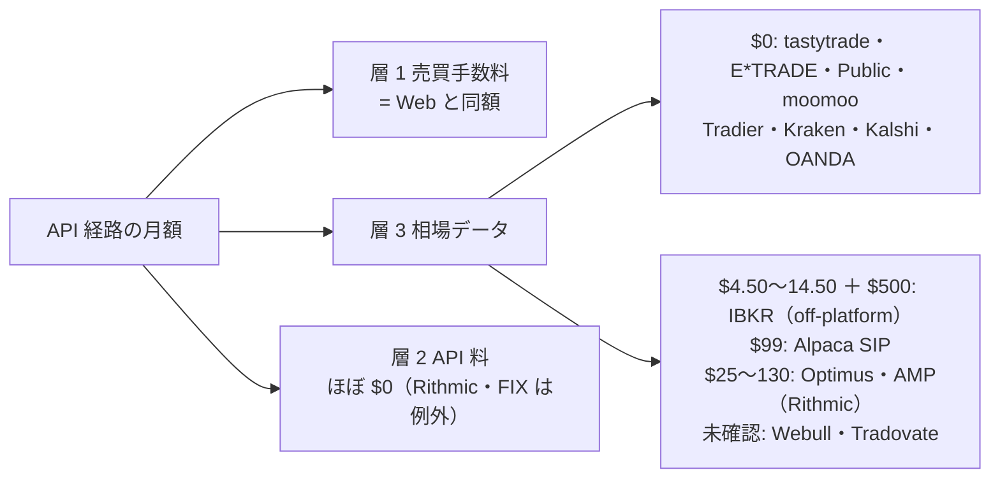
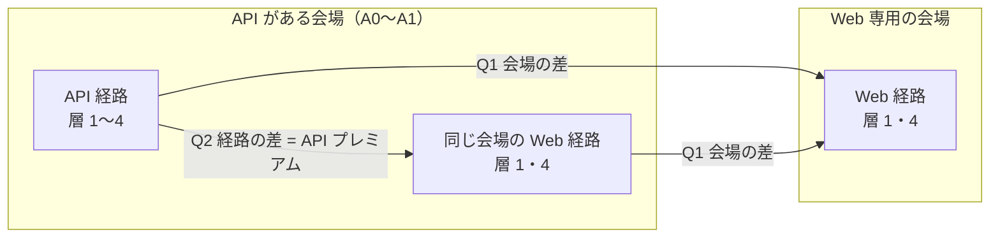

# API で売買可能なサービスの手数料と、Web の多くのサービスの手数料の比較

調査日: 2026-09-02〜03。対象: [trading-api-availability.md](trading-api-availability.md) 付録 A で発注 API が **A0〜A1** になった提供元（API 側 21）と、**Web 画面だけで売買する主要サービス**（Web 側。商品クラスごとに 3〜8 社）。商品クラスは同文書の P1〜P5 ＋ V3〜V6 を引き継ぐ。
プラン: [docs/plans/archive/trading-fee-comparison.md](../plans/archive/trading-fee-comparison.md)

> 前タスクは「③ 現在値の配信と ④ 発注 API の経路があるか」を確定させた。**この文書はその横に「その経路はいくらかかるか」を並べる。**手数料を 4 層（売買・API・データ・維持費）に分け、同じ代表取引と同じ月額シナリオで API 側と Web 側を比べた。数値はすべて公式の料金表【公表値】（URL・取得日つき）で、月額とプレミアムは【推測】の計算値。前タスクの文書は書き換えていない。

## 0. 結論

**Q1（会場の差）: 米国株・オプションでは、API がある会場は Web 専用の会場より高くない。**株・ETF は両側とも $0 が標準で、株式オプションは API 側（Public・moomoo・Alpaca・Webull $0、tastytrade $1 open のみ）が Web 専用の伝統 3 社（Fidelity・Schwab・Merrill $0.65/契約）より安い。**逆転するのは債券・OTC・先物**で、米国債は Web 側が $0 に対し API 側は IBKR $5.00（最低手数料）・Public $25（額面 $10,000）、OTC は Web 側 $0（Fidelity・Robinhood）に対し API 側 $5.98〜13.90、先物は Web 専用の Plus500（ES $2.28/片道）・Robinhood（$2.15）が API 側の最安（IBKR $2.24・Optimus $2.49・tastytrade $2.69）と同水準かやや安い。暗号資産は逆で、**API のある板（Alpaca 0.25%・Kraken Pro 0.80%）のほうが Web の simple 経路（Public app 1.25%・PayPal 1.5% ＋ spread）より安い**。

**Q2（経路の差）: 売買手数料は同じ会場なら API でも Web でも同額で、API プレミアムは層 3（相場データ）にだけ現れる。**IBKR は「data on the API is considered off-platform」で、画面なら無償の米国株ストリーミングが API では **月 $4.50〜14.50 ＋ 口座残高 $500** の購読になる（Lite は API 用の NBBO 購読自体が無い）。Alpaca は無償が IEX 単独で、全市場は $99/月。Webull は OpenAPI 用の購読が別売り（金額はログイン後）、Tradovate は API Access が有料アドオン（金額未確認）＋ API 経由の CME データにサブベンダー登録、Optimus・AMP は Rithmic 経由で $25〜125/月。一方 **tastytrade・E*TRADE・Public・moomoo・Tradier・Kraken・Kalshi・Polymarket US・OANDA は API プレミアム $0**（手数料・データとも画面と同じ）。

| クラス | 最安の API 経路（中 40 回/月） | 最安の Web 経路（同） | API プレミアム【推測】 | ⚠ 条件 |
| --- | --- | --- | --- | --- |
| P1 株・ETF | **$0**（tastytrade・E*TRADE・Public・moomoo）／SIP 全市場で揃えるなら Tradier Pro $10・Alpaca $99 | **$0**（Fidelity・Schwab・Merrill・Robinhood・SoFi・Webull・moomoo） | **$0**（学習データと同じ板を求めると $10〜99） | Web の $0 は PFOF で賄われる（⚠ Fidelity も 2026 Q2 から受領）。API 側で PFOF なしの経路は Public Smart $0.003/株 |
| P2 株式オプション | **$0**（Public・moomoo、Alpaca は指標価格のみ） | **$0**（Robinhood・SoFi）／伝統 3 社 $1.30 | **$0** | API 側のリアルタイム OPRA は Alpaca $99・IBKR $1.50（$20/月で免除） |
| P3 先物（ES 往復） | **$179**（IBKR $4.48 × 40、データ免除）／tastytrade $215 | **$172**（Robinhood）／Plus500 $182 | **≈ +$7〜43**（IBKR〜tastytrade） | IBKR は TWS 常駐。Tradovate の API 料は未確認 |
| P4 米国債（$10,000） | **$5.00**（IBKR、最低手数料）／Public $25 | **$0**（Fidelity・Schwab・Vanguard・Merrill・E*TRADE・TreasuryDirect） | **+$5〜25 /取引** | E*TRADE は同じ会場でも API は債券非対応 |
| P5 OTC（1,000 株） | **$5.98**（Public。Premium $0）／IBKR $10 | **$0**（Fidelity・Robinhood・SoFi・moomoo） | **+$6〜10 /往復** | Alpaca・Tradier・Webull は OTC 新規建て不可 |
| V3 暗号資産（BTC $5,000 往復） | **$25**（Alpaca taker）／Kraken Pro $80 | **$0＋spread ≤ $75**（Cash App）／Public app $125・PayPal ≈ $250 | **+$25〜−$225**（Cash App の spread が 0 なら API が $25 高く、PayPal 比では $225 安い） | Coinbase Advanced のティア表は取得できず |
| V4 予測市場（100 枚） | **$1.50**（Polymarket US）／Kalshi $1.75 | 同じ（同一会場）／Robinhood $2.00 | **$0** | WA 州は前タスクの居住地の壁 |
| V6 FX（EUR/USD 1 万通貨往復） | **$0.80**（tastyfx 最小）／OANDA $1.40 | 同じ（同一会場）／FOREX.com $1.20 | **$0** | 最小スプレッドで、平均は非公表。IBKR は最低 $2/注文で $4.00 |

> この図の主張: API プレミアムは「層 3 データ」に集中し、しかも会場で二極化する。無償側（tastytrade・Public 等）はプレミアム $0、有償側（IBKR・Alpaca SIP・Rithmic 経路）は月 $5〜130。売買手数料の層 1 は経路で変わらない。

そして、判断に効く発見が 5 つあった。

| # | 発見 | 効くところ |
| --- | --- | --- |
| 1 | ⚠ **「$0 手数料」の Web ブローカーは PFOF で賄われており、Fidelity も 2026 Q2 の 606 報告で「受けない」から「受ける（≤$0.0008/株）」に転じた。**PFOF を受けないと明言するのは Vanguard・Merrill（株式）・moomoo だけ | Q1 の「$0 対 $0」は執行品質が違う可能性を含む。本書は PFOF を属性として記録し、金額比較には入れない（付録 D） |
| 2 | ⚠ **規制費が 2026 年に動いた。**SEC Section 31 は 2026-04-03 まで $0.00、04-04 から $20.60/百万ドル。FINRA TAF は 2026-01-01 から $0.000195/株（上限 $9.79）・$0.00329/契約で、2027〜2029 年の引き上げ予定表が公表済み。NFA は 2026-07-01 に $0.02 → $0.01/側へ下がり、2027-07-01 に戻る。ORF は 2026-07-01 に on-exchange 方式へ変わり Cboe $0.01248・ISE $0.0080 | 会場によらない別表（付録 B）。⚠ ブローカーの料金ページには旧値（NFA $0.02、TAF $0.000166）が残っているものがある |
| 3 | ⚠ **同じ会場でも Web 経路にしか無い商品がある。**E*TRADE は先物（$1.50/片道）と債券（$0）を Web で扱うが API は非対応。IBKR Lite は Web では $0 だが API 用の NBBO 購読（Value Bundle）が「Service not available for IBKR Lite Clients」 | 「会場に API がある」と「その商品を API で安く買える」はずれる（前タスク §2-3 の手数料版） |
| 4 | ⚠ **取得経路が閉じている会場が 4 つ**: Coinbase（coinbase.com・help とも 403、Wayback も 429）、AMP のコミッション本体（計算機サイトが 403）、Tradovate の API Access 料、Webull の OpenAPI 相場購読料（ログイン後）。**第三者の値は本体に入れず付録 C に隔離** | Coinbase Advanced はティア表なしのまま「未確認」 |
| 5 | ⚠ **TCGplayer は新規セラー登録を一時停止中**（2026-08-30 更新）。eBay とカード手数料はほぼ同水準（売り手 ≈ 14%） | 前タスクで ④ が切れていたトレーディングカードは、Web 経路でも入口が閉じている |

## 1. 定義

### 1-1. 手数料の 4 層

| 層 | 含めるもの | 含めないもの | 単位 |
| --- | --- | --- | --- |
| **層 1** 売買手数料 | コミッション（株あたり・契約あたり・取引あたり）、スプレッド（FX・暗号資産の simple 経路）、maker / taker、出品・落札・決済手数料 | ⚠ **規制費**（SEC Section 31・FINRA TAF・CAT・OCC・ORF・NFA）は会場によらず同額なので**付録 B に 1 回だけ**書き、比較からは外す | 1 取引あたり、または約定額に対する % |
| **層 2** API 利用料 | API アドオン、API 専用プラン、FIX の最低手数料、サードパーティ経路（Rithmic・CQG）の月額 | — | 月額 |
| **層 3** 相場データ料 | **API 経路で現在値を受けるのに要る**購読料。画面で同じデータが無償なら、その差を「API プレミアム」に数える | 遅延データ（15 分）は無償が普通なので数えない | 月額（非専門家） |
| **層 4** 口座・プラットフォーム維持費 | 月額プラン（Tradier Pro 等）、最低残高、非活動手数料、データ購読に要る残高条件（IBKR $500） | 税金・為替手数料・出金手数料 | 月額または条件 |

⚠ **スプレッドはコミッションと直接比較できない。**約定額 × スプレッド（片道）で金額に換算し、使った公表スプレッド（最小 / typical）を必ず書く。⚠ **PFOF は隠れたコスト**だが金額を個人が取れないので、**属性（受領の明言・606 報告の所在）として付録 D に記録し、比較には入れない**。

**税は「層 5」として [trading-tax.md](trading-tax.md) §6 で扱う**（2026-09-07 追加）。手数料は取引ごとの金額、税は益に対する率なので同じ列には並ばないが、回収期間には手数料より大きく効く（短期売買で 1.32〜1.69 倍）。

### 1-2. 代表取引（1 回 = 往復）と月額シナリオ

前提条件（元手 $100,000・週 5〜15 時間・WA 州）を引き継ぎ、約定額は元手の 5%（$5,000）を基準にクラスごとに最小単位で丸めた。

| クラス | 代表取引 | 約定額 | 換算の前提 |
| --- | --- | --- | --- |
| P1 上場株・ETF | $50 の株 100 株を買って売る | $5,000 × 2 | 株あたり（IBKR）・取引あたり（Tradier）・$0 を同じ土俵に |
| P2 上場オプション | 株式オプション 1 契約を open して close | — | open / close で料金が違う社（tastytrade）、指数オプションは別料金 |
| P3 先物 | ES 1 枚往復（MES 1 枚往復を併記） | ES 想定元本 ≈ $300k【推測】 | 取引所・清算・NFA 費を分けて書く |
| P4 債券個別 | 米国債 $10,000 額面を買う（片道） | $10,000 | 額面 $100 あたり／$1 per bond／最低手数料 |
| P5 OTC・外国上場 | OTC 株 1,000 株（$5）往復／TSX 株 100 株（CAD 50）往復 | $5,000 / CAD 5,000 | OTC 追加料金・外国株の別料金・為替 |
| V3 暗号資産 | BTC $5,000 を成行で買って成行で売る（taker）。maker を併記 | $5,000 × 2 | 30 日出来高ゼロからの最低ティア。simple 経路はスプレッド ＋ 手数料 |
| V4 予測市場 | $0.50 の契約 100 枚を買って決済まで持つ（taker 片道） | $50 | 手数料が価格 P に依存する式 k × C × P × (1−P) |
| V6 小売 FX | EUR/USD 10,000 通貨を往復 | ≈ $11,000【推測】 | 1 pip = $1.00。スプレッドは往復で 1 回負担 |
| V5 専門マーケット | 1 件の出品 ＋ 1 件の購入 | カード $50・スニーカー $200・スキン $50・REC 1 枚・RI $1,000 | 出品・落札・決済の 3 段。送料・売上税は別 |

| シナリオ | 代表取引の回数/月 | 月間約定額（P1） | 用途 |
| --- | ---: | ---: | --- |
| **低** | 4 | $40,000（元手の 0.4 倍） | 日次〜週次の売買判断 |
| **中** | 40 | $400,000（4 倍） | 日次で複数銘柄 |
| **高** | 400 | $4,000,000（40 倍） | 日中の売買判断。⚠ 非表示利用の申告・OPRA の 390 注文/日・レート制限に近づく |

⚠ シナリオは比較の物差しであって、取引量を約束するものではない。「高い / 安い」はこの代表取引とシナリオの下での話で、約定額・銘柄・時間帯が変われば入れ替わりうる。

## 2. 母集団

### 2-1. API 側 — 前タスク付録 A の A0〜A1（21 提供元）

| クラス | 提供元 | 前タスクの段階 |
| --- | --- | --- |
| P1〜P2 | IBKR・Alpaca・Tradier・tastytrade・E*TRADE・Public・moomoo | A0 |
| P1〜P2 | Webull・Schwab | A1（⚠ Schwab は仕様がログイン壁の向こう。手数料は Web と同じとみなす） |
| P3 | IBKR・tastytrade・Tradovate（A0）、AMP / Rithmic・Ironbeam（A1） | — |
| P4 | IBKR・Public | A0 |
| P5 | IBKR・Public・E*TRADE | A0 |
| V3 | Kraken・Coinbase・Robinhood Crypto API | A0 |
| V4 | Kalshi・Polymarket US | A0 |
| V6 | OANDA・IBKR・tastyfx（A0）、FOREX.com（A1） | — |
| V5 | AWS RI（購入 A0・出品 A1）・eBay（出品 A0）・DMarket（A0） | — |

Robinhood は株式 REST が無く MCP は Agentic 口座のみなので、P1〜P2 では Web 側に置き、暗号資産だけ API 側に置いた。

### 2-2. Web 側 — 「多くのサービス」の選び方（確定）

基準: (1) Web / アプリで個人が売買でき、個人向け発注 API が無いか前タスクで A2〜A4（同じ会場の Web 経路も含む）、(2) 手数料表がログイン無しで一次情報として読める、(3) 規模の公表値を付ける（⚠ 各社 IR ページが 403/404 で **6 社とも取れず**。落とさず「規模未確認」とした）。

| クラス | Web 側 | 落とした・注意 |
| --- | --- | --- |
| **P1〜P2** | Fidelity・Schwab・Vanguard・Merrill Edge・Robinhood・SoFi（＋ 同じ会場の Web 経路: IBKR Lite・Webull・moomoo・E*TRADE） | Ally（手数料表を切り出せず）。⚠ Schwab の Pricing Guide は「Schwab APIs」を Online Trades に含める（API 側にも A1 で置いた） |
| **P3** | Schwab Futures・E*TRADE（先物は Web のみ）・Plus500 US・NinjaTrader（デスクトップ）・Robinhood | Optimus は API 側（Rithmic 経由）に置いた |
| **P4** | Fidelity・Schwab・Vanguard・Merrill Edge・E*TRADE・TreasuryDirect（新発のみ）・Webull | — |
| **P5** | Fidelity・Schwab・Robinhood・SoFi・moomoo・Webull | Vanguard・Merrill は OTC の料金記載なし |
| **V3** | Coinbase simple・Robinhood app・Cash App・PayPal・Kraken app・Public app | Gemini（API を持つ）。⚠ Coinbase は 403 で simple の手数料も非公表 |
| **V4** | Kalshi（Web）・Polymarket US（Web）・Robinhood（Kalshi 経由） | — |
| **V6** | FOREX.com（Wayback 2025-01）・tastyfx（Web）・OANDA（Web）・Schwab（thinkorswim）・IBKR（Web） | FOREX.com は本体 403。Schwab はスプレッド非公表 |
| **V5** | eBay・StockX・TCGplayer・Flett Exchange・Steam・Skinport・CSFloat・DMarket | TCGplayer のヘルプは 403（Zendesk API で本文取得） |

> この図の主張: 母集団は「会場 × 経路」の 2 軸。Q1 は横（会場の差）、Q2 は縦（同じ会場の API 経路と Web 経路の差）を読む。同じ会場が両側に出るのは正しい。

## 3. 方針との関係 — 何を読み、何を読まなかったか

| 行為 | 可否 | 結果 |
| --- | --- | --- |
| 公式の手数料表・料金 PDF・規約・606 報告を読む | ✅ 行った | 判定の主根拠。**すべて【公表値】**（URL・取得日つき） |
| JS 描画のページを同一サイト内の JSON・PDF・Wayback で読む | ✅ 行った | Webull（埋め込み i18n）、moomoo（画像）、NinjaTrader（埋め込み JSON）、TCGplayer（Zendesk API）、Kalshi（Wayback 2026-06-12）、FOREX.com（Wayback 2025-01） |
| ログイン後にしか出ない料金 | ❌ 取りに行かない | Webull OpenAPI 購読・Tradovate API Access・Schwab 開発者ポータル → 「未確認」（付録 C） |
| 実際に取引して手数料を【実測】 | ❌ 行わない | 本書に【実測】は無い |
| 規模の公表値（順位の出典） | ⚠ 試みた | 6 社とも IR が 403/404 → 「規模未確認」 |

## 4. 比較表 — クラス別（代表取引 1 回と月額シナリオ 3 段）

列の読み方: 「層 1」は代表取引 1 回（往復）の売買手数料【公表値からの計算】。「固定月額」は層 2 ＋ 3 ＋ 4【公表値】。「低・中・高」は 層 1 × 回数 ＋ 固定月額【推測】。IBKR の手数料免除（月 $30・$20）は回数に応じて適用した。⚠ 規制費は含まない（付録 B）。「＋?」は固定月額が未確認の行。

#### P1 上場株・ETF — $50 の株 100 株を往復（約定額 $5,000 × 2）

| 会場 | 経路 | 層 1: 代表取引 1 回 | 層 2+3+4: 固定月額 | 低 4/月 | 中 40/月 | 高 400/月 | 注記 |
| --- | --- | ---: | ---: | ---: | ---: | ---: | --- |
| IBKR Pro Fixed | API | $2.00 | $14.50 | $22.50 | $84.50 | $804.50 | 0.005/株・最低 $1.00/注文。層 3 = Value Bundle $10（手数料 $30/月で免除）＋ Add-On Streaming $4.50（API は off-platform で購読必須）。口座に $500 |
| IBKR Pro Fixed | Web | $2.00 | $0.00 | $8.00 | $80.00 | $800.00 | 画面は Cboe One ＋ IEX の非統合ストリーミング無償。NBBO は snapshot $0.01（月 100 件無償） |
| IBKR Lite | Web | $0.00 | $0.00 | $0.00 | $0.00 | $0.00 | 米国上場株 $0（PFOF 受領）。⚠ Value Bundle・Add-On は Lite 不可＝API 経路で NBBO 購読が無い |
| Alpaca Basic | API | $0.00 | $0.00 | $0.00 | $0.00 | $0.00 | ⚠ 無償は IEX のみ（約 4%）。WS リアルタイム 30 銘柄、REST は 15 分遅延 |
| Alpaca Algo Trader Plus | API | $0.00 | $99.00 | $99.00 | $99.00 | $99.00 | SIP 全市場・OPRA・銘柄無制限 $99/月 |
| Tradier Lite | API | $0.70 | $0.00 | $2.80 | $28.00 | $280.00 | $0.35/取引。consolidated リアルタイム L1 無償 |
| Tradier Pro | API | $0.00 | $10.00 | $10.00 | $10.00 | $10.00 | Pro $10/月で株 $0 |
| tastytrade | API | $0.00 | $0.00 | $0.00 | $0.00 | $0.00 | 株 $0。DXLink 無償（funded）。PFOF 受領（≤$0.0015/株） |
| E*TRADE | API | $0.00 | $0.00 | $0.00 | $0.00 | $0.00 | 株 $0。Market Data Agreement でリアルタイム（料金の明記なし）。OAuth は毎日失効 |
| Public（Wholesale） | API | $0.00 | $0.00 | $0.00 | $0.00 | $0.00 | 通常時間 $0（PFOF 受領）。時間外 $2.99（Premium $0） |
| Public（Smart / Lit） | API | $0.60 | $0.00 | $2.40 | $24.00 | $240.00 | $0.003/株（PFOF なし経路） |
| Webull | API | $0.00 | ⚠ 未確認 | $0.00＋? | $0.00＋? | $0.00＋? | 株 $0。OpenAPI 用の相場購読が別売りで金額はログイン後（アプリ側 TotalView は $2.99/月） |
| moomoo | API | $0.00 | $0.00 | $0.00 | $0.00 | $0.00 | 株 $0・Platform fee「$0 (During Promotion)」。L2 プロモ中無償（30 日平均 $100 以上） |
| Schwab（A1【推測】） | API | $0.00 | ⚠ 未確認 | $0.00＋? | $0.00＋? | $0.00＋? | Pricing Guide は「Schwab APIs」を Online Trades に含める。API 側の条件は未読 |
| Fidelity | Web | $0.00 | $0.00 | $0.00 | $0.00 | $0.00 | $0。Streaming L2 $0。⚠ Q2 2026 の 606 で PFOF 受領（≤$0.0008/株）に転じた |
| Schwab | Web | $0.00 | $0.00 | $0.00 | $0.00 | $0.00 | $0。thinkorswim 無償。PFOF 受領（≤$0.001/株） |
| Vanguard | Web | $0.00 | $2.08 | $2.08 | $2.08 | $2.08 | $0。⚠ $25/年の account service fee（e-delivery 等で免除）。PFOF なし |
| Merrill Edge | Web | $0.00 | $0.00 | $0.00 | $0.00 | $0.00 | $0。株式の PFOF なし（明言） |
| Robinhood | Web | $0.00 | $0.00 | $0.00 | $0.00 | $0.00 | $0（PFOF＝スプレッドの 12.35%）。株式 REST 無し、MCP は Agentic 口座 |
| SoFi | Web | $0.00 | $0.00 | $0.00 | $0.00 | $0.00 | $0。⚠ 6 か月ログイン無しで $25。PFOF 受領 |
| Webull | Web | $0.00 | $0.00 | $0.00 | $0.00 | $0.00 | $0。Level 1（Nasdaq Basic）無償 |
| moomoo | Web | $0.00 | $0.00 | $0.00 | $0.00 | $0.00 | $0。L2 無償（30 日平均 $100 以上）。PFOF なし（明言） |

#### P2 上場オプション — 株式オプション 1 契約を open して close

| 会場 | 経路 | 層 1: 代表取引 1 回 | 層 2+3+4: 固定月額 | 低 4/月 | 中 40/月 | 高 400/月 | 注記 |
| --- | --- | ---: | ---: | ---: | ---: | ---: | --- |
| IBKR Pro Tiered | API | $2.00 | $16.00 | $24.00 | $86.00 | $806.00 | $0.65/契約だが最低 $1.00/注文 → open・close 各 $1.00。取引所費別。層 3 = Value Bundle $10 ＋ Add-On $4.50 ＋ OPRA $1.50（$20/月で免除） |
| IBKR Lite | Web | $2.00 | $0.00 | $8.00 | $80.00 | $800.00 | $0.65/契約・最低 $1.00/注文（月 1,000 契約まで）。指数オプションは Surcharge |
| Alpaca Basic | API | $0.00 | $0.00 | $0.00 | $0.00 | $0.00 | $0。⚠ 無償は指標価格のみ。OPRA リアルタイムは Algo Trader Plus $99 |
| Tradier Lite | API | $0.70 | $0.00 | $2.80 | $28.00 | $280.00 | $0.35/契約 |
| Tradier Pro | API | $0.00 | $10.00 | $10.00 | $10.00 | $10.00 | 株式・ETF オプション $0（指数 $0.35） |
| tastytrade | API | $1.00 | $0.00 | $4.00 | $40.00 | $400.00 | open $1/契約（上限 $10/leg）・close $0 |
| E*TRADE | API | $1.30 | $0.00 | $5.20 | $52.00 | $520.00 | $0.65/契約（四半期 30 回以上で $0.50）＋ 指数は IOF |
| Public | API | $0.00 | $0.00 | $0.00 | $0.00 | $0.00 | $0 ＋ リベート $0.06/契約（API 経由）。指数は $0.50（Premium $0.35） |
| Webull | API | $0.00 | ⚠ 未確認 | $0.00＋? | $0.00＋? | $0.00＋? | 株式オプション $0（成行不可・個別株のみ）。OpenAPI 用 OPRA 購読は別売り |
| moomoo | API | $0.00 | $0.00 | $0.00 | $0.00 | $0.00 | $0/契約。OPRA L1 は資産 > 0 で無償 |
| Fidelity | Web | $1.30 | $0.00 | $5.20 | $52.00 | $520.00 | $0.65/契約（buy-to-close ≤ $0.65 は $0） |
| Schwab | Web | $1.30 | $0.00 | $5.20 | $52.00 | $520.00 | $0.65/契約 |
| Vanguard | Web | $2.00 | $2.08 | $10.08 | $82.08 | $802.08 | $1/契約（QA $1M+ で年 25 回まで $0） |
| Merrill Edge | Web | $1.30 | $0.00 | $5.20 | $52.00 | $520.00 | $0.65/契約 |
| Robinhood | Web | $0.00 | $0.00 | $0.00 | $0.00 | $0.00 | $0（ORF＋OCC $0.04/契約は規制費）。指数 $0.50（Gold $0.35） |
| SoFi | Web | $0.00 | $0.00 | $0.00 | $0.00 | $0.00 | $0（契約単価の記載なし） |

#### P3 先物 — ES 1 枚往復（MES は括弧内）

| 会場 | 経路 | 層 1: 代表取引 1 回 | 層 2+3+4: 固定月額 | 低 4/月 | 中 40/月 | 高 400/月 | 注記 |
| --- | --- | ---: | ---: | ---: | ---: | ---: | --- |
| IBKR Pro | API | $4.48（MES $1.22） | $1.55 | $19.47 | $179.20 | $1,792.00 | 0.85 ＋ CME 1.38 ＋ NFA 0.01 = $2.24/片道。層 3 = CME L1 $1.55（手数料 $20/月で免除）。TWS/CPGW 常駐 |
| tastytrade | API | $5.38（MES $2.82） | $0.00 | $21.52 | $215.20 | $2,152.00 | $1.00 ＋ 清算 $0.30 ＋ CME 1.38【流用】＋ NFA 0.01 |
| Tradovate Free | API | $5.74（MES $1.88） | ⚠ 未確認 | $22.96＋? | $229.60＋? | $2,296.00＋? | 1.29 ＋ 清算 0.19 ＋ CME 1.38 ＋ NFA 0.01 = $2.87/片道。⚠ API Access アドオン料金・API 経由の CME データ（サブベンダー登録）は未確認 |
| Tradovate Monthly $99 | API | $5.14（MES $1.68） | $99.00 | $119.56 | $304.60 | $2,155.00 | $0.99/片道。⚠ API Access は別（未確認） |
| Optimus（Rithmic） | API | $4.98（MES $1.60） | $28.00 | $47.92 | $227.20 | $2,020.00 | 0.75 ＋ 清算 0.25 ＋ 経路 0.10 ＋ CME 1.38 ＋ NFA 0.01。Rithmic $25/月 ＋ CME L1 $3（月 10 取引で無償） |
| AMP（Rithmic R\|API+） | API | ⚠ 未確認 | $130.00 | — | — | — | コミッション本体は 403 で未取得。Rithmic API $100 ＋ User ID $25 ＋ CME L1 $5/月、＋$0.10/契約 |
| Schwab | Web | $7.28（MES $5.22） | $0.00 | $29.12 | $291.20 | $2,912.00 | $2.25/契約/片道 ＋ CME 1.38【流用】＋ NFA 0.01（マイクロも $2.25） |
| E*TRADE | Web | $5.78（MES $3.72） | $0.00 | $23.12 | $231.20 | $2,312.00 | $1.50/片道。CME・CFE の相場料は非専門家なら E*TRADE 負担 |
| Plus500 US | Web | $4.56（MES $1.70） | $0.00 | $18.24 | $182.40 | $1,824.00 | $0.89 / マイクロ $0.49 片道。Data・Platform・Inactivity $0。強制清算 $10/契約 |
| NinjaTrader Free（デスクトップ） | Web | $5.74（MES $1.88） | $0.00 | $22.96 | $229.60 | $2,296.00 | Tradovate と同一 FCM。Top of book 込み。30 日ライブ取引なしで $35 |
| Robinhood | Web | $4.30（MES $2.24） | $0.00 | $17.20 | $172.00 | $1,720.00 | $0.75（Gold $0.50）＋ NFA 0.02（頁）＋ 取引所 1.38【流用】。Gold なら $3.80 |

#### P4 債券 — 米国債 $10,000 額面を買う（片道）

| 会場 | 経路 | 層 1: 代表取引 1 回 | 層 2+3+4: 固定月額 | 低 4/月 | 中 40/月 | 高 400/月 | 注記 |
| --- | --- | ---: | ---: | ---: | ---: | ---: | --- |
| IBKR | API | $5.00 | $0.00 | $20.00 | $200.00 | $2,000.00 | 0.002% × 額面 = $0.20 → 最低 $5.00。US Bond RT データは Fee Waived（Value Bundle 内） |
| Public | API | $25.00（0〜1 年物は $10.00） | $0.00 | $100.00 | $1,000.00 | $10,000.00 | 額面 $100 あたり $0.250（3〜10 年）。Bond Account $3.99/月（Premium $0） |
| Fidelity | Web | $0.00 | $0.00 | $0.00 | $0.00 | $0.00 | 米国債（TIPS 含む）新発・二次 $0 |
| Schwab | Web | $0.00 | $0.00 | $0.00 | $0.00 | $0.00 | 米国債 $0（他の債券 $1/bond） |
| Vanguard | Web | $0.00 | $2.08 | $2.08 | $2.08 | $2.08 | 米国債 $0 |
| Merrill Edge | Web | $0.00 | $0.00 | $0.00 | $0.00 | $0.00 | 米国債 $0 |
| E*TRADE | Web | $0.00 | $0.00 | $0.00 | $0.00 | $0.00 | 米国債入札・二次 $0（API は債券非対応） |
| Webull | Web | $10.00 | $0.00 | $40.00 | $400.00 | $4,000.00 | 国債 0.1% × 元本（i18n 文字列） |
| TreasuryDirect | Web | $0.00 | $0.00 | $0.00 | $0.00 | $0.00 | 「no fees ... buy securities」。⚠ 新発のみ・売却は証券会社へ転送 |

#### P5 OTC・外国上場 — OTC 株 1,000 株（$5）往復／TSX 株 100 株（CAD 50）往復

| 会場 | 経路 | 層 1: 代表取引 1 回 | 層 2+3+4: 固定月額 | 低 4/月 | 中 40/月 | 高 400/月 | 注記 |
| --- | --- | ---: | ---: | ---: | ---: | ---: | --- |
| IBKR Pro Fixed | API | OTC $10.00／TSX CAD 2.00 | $14.50 | $54.50 | $414.50 | $4,014.50 | OTC 0.005/株（Lite も Fixed）。TSX CAD 0.01/株・最低 CAD 1.00。層 3 に OTC L1 $8.00・TSX L1 CAD 9.00 が別途 |
| Public | API | OTC $5.98（Premium $0） | $0.00 | $23.92 | $239.20 | $2,392.00 | $2.99/trade。外国上場なし |
| E*TRADE | API | OTC $13.90 | $0.00 | $55.60 | $556.00 | $5,560.00 | $6.95（四半期 30 回以上で $4.95）。指値のみ |
| Fidelity | Web | OTC $0／TSX CAD 38＋為替 1% | $0.00 | $0.00 | $0.00 | $0.00 | OTC $0（非 DTC 外国 ORD +$50）。International Trading Canada CAD 19/取引 |
| Schwab | Web | OTC $13.90／TSX CAD 18＋現地 ≤CAD 1 | $0.00 | $55.60 | $556.00 | $5,560.00 | OTC $6.95。Global Account Canada 9 CAD |
| Robinhood / SoFi / moomoo / Webull | Web | OTC $0 | $0.00 | $0.00 | $0.00 | $0.00 | OTC $0（外国上場なし） |

#### V3 暗号資産 — BTC $5,000 を成行で買って成行で売る（taker。maker は注記）

| 会場 | 経路 | 層 1: 代表取引 1 回 | 層 2+3+4: 固定月額 | 低 4/月 | 中 40/月 | 高 400/月 | 注記 |
| --- | --- | ---: | ---: | ---: | ---: | ---: | --- |
| Kraken Pro（Tier 1） | API | $80（maker $40） | $0.00 | $320.00 | $3,200.00 | $32,000.00 | taker 0.80% / maker 0.40%。2 回目から Tier 2（0.60/0.30）。WA 提供あり |
| Kraken app（Instant Buy） | Web | $100＋spread | $0.00 | $400.00 | $4,000.00 | $40,000.00 | 1%（custom 1.5%）＋ spread（幅非公表） |
| Coinbase Advanced | API | ⚠ 未確認 | $0.00 | — | — | — | ティア表が 403/429 で取得できず（第三者: Intro 1 taker 1.20%【未確認】） |
| Coinbase simple | Web | ⚠ 非公表 | $0.00 | — | — | — | 「fees ... view in the trade preview screen」＋ spread。固定テーブルは現行ページに無し |
| Robinhood Crypto API v2 / Exchange routing | API | $95（maker $50） | $0.00 | $380.00 | $3,800.00 | $38,000.00 | taker 0.95% / maker 0.50%（$0–10K）。API v2 は taker 率固定（ロールアウト中） |
| Robinhood app（Market Maker routing） | Web | ≈$96 | $0.00 | $384.00 | $3,840.00 | $38,400.00 | 手数料 $0・spread 内に RH 取り分 0.95%/$100（例 0.96%） |
| Alpaca（Tier 1） | API | $25（maker $15） | $0.00 | $100.00 | $1,000.00 | $10,000.00 | taker 0.25% / maker 0.15% |
| Public API（$0–10K） | API | $60.00 | $0.00 | $240.00 | $2,400.00 | $24,000.00 | 0.60%（maker/taker 区別なし） |
| Public app | Web | $125.00 | $0.00 | $500.00 | $5,000.00 | $50,000.00 | 1.25%（$500.01 超） |
| Cash App | Web | $0＋spread 0〜0.75% | $0.00 | $0.00 | $0.00 | $0.00 | $2,000 以上は 0%。spread 往復最大 $75 |
| PayPal | Web | $150＋spread ≈$100 | $0.00 | $600.00 | $6,000.00 | $60,000.00 | 1.50%（$1,000.01+）＋ spread 推定 1.00% |

#### V4 予測市場 — $0.50 の契約 100 枚を買って決済まで持つ（taker 片道）

| 会場 | 経路 | 層 1: 代表取引 1 回 | 層 2+3+4: 固定月額 | 低 4/月 | 中 40/月 | 高 400/月 | 注記 |
| --- | --- | ---: | ---: | ---: | ---: | ---: | --- |
| Kalshi | API | $1.75（maker $0 or $0.44） | $0.00 | $7.00 | $70.00 | $700.00 | round up(0.07×C×P×(1−P))。maker 手数料は 129 series のみ 0.0175。API/Web 同一 |
| Kalshi | Web | $1.75 | $0.00 | $7.00 | $70.00 | $700.00 | 同上 |
| Polymarket US | API | $1.50（maker −$0.31） | $0.00 | $6.00 | $60.00 | $600.00 | 0.06×C×p×(1−p)、maker rebate −0.0125。API/Web 同一式 |
| Robinhood（Kalshi 経由） | Web | $2.00 | $0.00 | $8.00 | $80.00 | $800.00 | k×p×(1−p)×c（k 10%、Gold 5%）上限 $0.01/契約 ＋ Kalshi $0.01/契約 → $1.00 ＋ $1.00 |

#### V6 小売 FX — EUR/USD 10,000 通貨を往復（1 pip = $1.00）

| 会場 | 経路 | 層 1: 代表取引 1 回 | 層 2+3+4: 固定月額 | 低 4/月 | 中 40/月 | 高 400/月 | 注記 |
| --- | --- | ---: | ---: | ---: | ---: | ---: | --- |
| OANDA Spread-only | API | $1.40 | $0.00 | $5.60 | $56.00 | $560.00 | 表「EUR/USD 1.4」（単位・typical の表記なし）。API License Fees は金額記載なし。ストリーム 4 本/秒 |
| OANDA Core（$10K 入金） | API | $1.40＋実スプレッド | $0.00 | $5.60 | $56.00 | $560.00 | $0.70/1 万通貨/片道（join ページ）。最小スプレッド 0 |
| IBKR | API | $4.00＋板スプレッド | $0.00 | $16.00 | $160.00 | $1,600.00 | 0.20 bps だが最低 $2.00/注文が支配。データ無償 |
| tastyfx Standard | API | $0.80（最小） | $0.00 | $3.20 | $32.00 | $320.00 | 最小 0.8 pips、平均は非公表。⚠ 契約は自動化に書面同意を要求 |
| tastyfx Zero+ | Web | $1.00＋実スプレッド | $0.00 | $4.00 | $40.00 | $400.00 | $5/lot/side、最小 0.0 |
| FOREX.com Standard（Wayback 2025-01） | Web | $1.20（最小） | $0.00 | $4.80 | $48.00 | $480.00 | as low as 1.2。API は申請制 |
| FOREX.com RAW（Wayback 2025-01） | Web | $1.54＋実スプレッド | $0.00 | $6.16 | $61.60 | $616.00 | $7/$100k USD/片道 |
| Schwab（thinkorswim） | Web | ⚠ 非公表 | $0.00 | — | — | — | spread のみ、公表値なし |

#### V5 専門マーケット — 1 件の出品 ＋ 1 件の購入（送料・売上税は別）

| 品目 / 会場 | 経路 | 売り手コスト | 買い手コスト | 注記 |
| --- | --- | ---: | ---: | --- |
| RI $1,000 / AWS RI Marketplace | API | 12% = **$120** | $0 | 出品は root で売り手登録（米国銀行口座・生涯 $50,000） |
| カード $50 / eBay | Web（出品は API A0） | 13.25% ＋ $0.40 = **$7.03**（14.1%） | $0 | 出品料は月 250 件まで $0。US 外買い手 +1.65%。⚠ 購入 API は Limited Release |
| カード $50 / TCGplayer Lv1〜4 | Web | 10.75% ＋ (2.5% ＋ $0.30) = **$6.93**（13.9%） | $0 | Pro は 9.25% ＋ 2.5% = $7.43。⚠ **新規セラー登録を一時停止中**（2026-08-30） |
| スニーカー $200 / StockX Verified Lv1 | Web | 9% ＋ 3% ＋ 送料 $5 = **$29**（14.5%） | processing fee（⚠ 料率非公開・動的）＋ 送料 | Lv5（$100,000/四半期）で 7% |
| スニーカー $200 / eBay Athletic Shoes ≥ $150 | Web | 8% = **$16** | $0 | per-order fee なし |
| スキン $50 / Steam | Web | 受取 $43.48（買い手 $50 のとき） | **15%**（Steam 5% ＋ CS2 10%） | 公式 API なし。wallet は出金不可 |
| スキン $50 / DMarket | API | 2% = **$1.00**（非流動品 最大 10%） | $0（「the buyer pays no fees」） | 出金・API 差は未確認 |
| スキン $50 / CSFloat | 出品 API | 2% ＋ 出金 2.5% ≈ **$2.23** | 未確認 | 出金料は出来高で 0.5% まで下がる |
| スキン $50 / Skinport | Web | 8% = **$4.00**（≥ $1,000 は 6%） | 未確認 | 払出無料 |
| REC 1 枚 / Flett Exchange NJ SREC | Web | DIY **$2.50**／REC Manager $6.50 | **$5.00** | MD $2.50/$3.00、PA $2.50/$2.00、DC $2.50/$7.50、VA $2.50/$2.00。⚠ OH は表に無し（市場 $4.00/REC） |

## 5. 集計 — API プレミアムと会場の差

### 5-1. Q2: 同じ会場の API 経路 − Web 経路（層 2 ＋ 3 の差）

| 会場 | 層 1 の差 | 層 2 API 料 | 層 3 API 用データ − 画面データ | API プレミアム（月額） | 根拠【公表値】 |
| --- | --- | --- | --- | --- | --- |
| **IBKR Pro** | $0（同額） | $0（FIX のみ $1,500/月） | 画面: 米国株の非統合ストリーミング無償／API: Value Bundle $10（手数料 $30/月で免除）＋ Add-On Streaming $4.50（免除なし）。OPRA $1.50（$20 で免除）、CME L1 $1.55（$20 で免除） | **$4.50〜16.00** ＋ 口座残高 $500 | 「data on the API is considered off-platform」「The free one only provides data in Trader Workstation, and it does not provide data via API」 |
| **IBKR Lite** | $0 | $0 | ⚠ Value Bundle・Add-On・Futures Value Bundle PLUS は「Service not available for IBKR Lite Clients」 | **API で NBBO を取る経路が無い** | 脚注 31 |
| **Alpaca** | $0 | $0 | 画面と同じ IEX 無償／全市場は Algo Trader Plus $99 | **$0（IEX）／$99（SIP）** | alpaca.markets/data |
| **Tradier** | $0 | $0 | 同一（consolidated L1 無償） | **$0** | 「Real-time data is available to all Tradier Brokerage account holders」 |
| **tastytrade** | $0 | $0 | 同一（DXLink） | **$0** | 「No subscriptions.」 |
| **E*TRADE** | $0 | $0（「free for developers」） | Market Data Agreement 署名で REALTIME（料金の明記なし） | **$0（明記なし）** | api-quote-v1 |
| **Public** | $0（Wholesale）／Smart $0.003/株 | $0 | 同一（real-time quote） | **$0** | 「The Public trading API is free to use」 |
| **Webull** | $0 | $0 | ⚠ OpenAPI 用の購読が別売り（アプリ側は L1 無償、TotalView $2.99） | **未確認（≥ $0）** | 「You need a separate subscription specifically enabled for OpenAPI usage」 |
| **moomoo** | $0 | $0 | 同一（プロモ中） | **$0（プロモ終了後は未確認）** | intro/authority |
| **Tradovate** | $0 | ⚠ API Access アドオン（未確認） | ⚠ API 経由の CME データはサブベンダー登録（未確認） | **未確認（> $0）** | community.tradovate.com のスタッフ回答 |
| **Optimus / AMP** | $0 | Rithmic $25/月（Optimus）、$100 ＋ $25/月（AMP R\|API+） | CME L1 $3〜5 | **$28〜130** | exchange-data-fees |
| Kraken・Coinbase・Kalshi・Polymarket US・OANDA・tastyfx | $0 | $0 | 公開配信（RT0）／口座配信 | **$0** | 前タスク付録 A |

⚠ **プレミアムが出る会場は「取引所データを購読で受ける」構造の会場**（IBKR・Rithmic 経路・Alpaca SIP）で、「ブローカーが自社フィードを配る」会場（Tradier・tastytrade・Public・moomoo）では出ない。前タスクの「学習データ（SIP tick）と現在値の板が違う」問題（trading-api-availability §6-3）はここに費用として現れる — 全市場で揃えるなら Tradier Pro $10 か Alpaca $99。

### 5-2. Q1: 会場の差 — クラスごとの最安

| クラス | API 側の最安（中 40/月） | Web 側の最安（同） | 差 | 読み |
| --- | --- | --- | --- | --- |
| P1 | $0 | $0 | $0 | 両側とも $0 が標準。差は PFOF の有無と板の範囲（IEX / consolidated / SIP） |
| P2 | $0（Public・moomoo） | $0（Robinhood・SoFi） | $0 | 伝統 3 社（Fidelity・Schwab・Merrill）は $1.30/往復で API 側の tastytrade $1.00 より高い |
| P3 | IBKR $179（データ免除後） | Robinhood $172（Gold $157）・Plus500 $182 | ≈ ±$10 | ほぼ同水準。差は取引所費ではなくブローカー手数料 $0.75〜2.25 の幅 |
| P4 | IBKR $5.00/取引 | $0 | +$5.00 | 米国債は Web 6 社が $0。API 側は最低手数料が乗る |
| P5 OTC | Public $5.98/往復 | $0 | +$5.98 | Fidelity・Robinhood・SoFi・moomoo・Webull は OTC $0 |
| V3 | Alpaca $25 | Cash App $0 ＋ spread ≤ $75 | −$50〜+$25 | 板（API）が simple 経路（Web）より安い。Kraken Pro $80 vs app $100 ＋ spread |
| V4 | Polymarket US $1.50 | 同一会場 | $0 | Robinhood 経由は $2.00 |
| V6 | tastyfx $0.80（最小） | 同一会場 | $0 | 平均スプレッドは非公表。IBKR は最低 $2/注文で小口に不利 |

### 5-3. 感度 — 前提を変えると何が入れ替わるか

| 前提の変更 | 効くところ |
| --- | --- |
| P1 の株数を 1,000 株・$5 にする | IBKR Pro Fixed は $5.00/片道（上限 1%）。Tradier Lite $0.35 と Public Smart $3.00 が入れ替わる |
| 月 400 回（高）にする | IBKR Pro Fixed $800 対 Tradier Lite $280 対 $0 組。⚠ OPRA の非表示料免除（390 注文/日）と NYSE の Non-Display 申告に近づく |
| OTC を Public Premium（$10/月、$50,000 超で免除）にする | OTC $0 になり Web と並ぶ |
| 先物を MES にする | ES の 1/3〜1/4。Plus500 $0.85/片道、Optimus $0.80、NinjaTrader Lifetime $0.64、IBKR $0.61 |
| 暗号資産を maker で置く | Alpaca $15、Kraken Pro $40、Robinhood API $50。Cash App・PayPal は変わらない |
| FX の平均スプレッドを最小の 2 倍と置く【推測】 | tastyfx $1.60、FOREX.com $2.40。OANDA の 1.4 は typical の可能性があり順位は不明 |

## 付録 A: 会場ごとの手数料カタログ（層 1〜4）

すべて【公表値】。取得日は 2026-09-02（記載のあるものは 09-03）。原文の要点を層ごとに写し、URL は各行末。⚠ 規制費は付録 B。

### A-1. 米国証券口座（API 側）

| 会場 | 層 1 売買手数料 | 層 2 API | 層 3 相場データ（API / 画面） | 層 4 維持費 | 出典 |
| --- | --- | --- | --- | --- | --- |
| **IBKR** | 株: Pro Fixed USD 0.005/株・最低 1.00・最大 1%（規制費別）／Pro Tiered 0.0035→0.0005・最低 0.35 ＋ 取引所・清算・パススルー／Lite $0（米国上場のみ。OTC は Fixed 扱い）。オプション: Pro Tiered 0.65（premium ≥ 0.10）・0.50・0.25、最低 1.00/注文、取引所費・OCC 0.025・ORF 別／Lite 0.65 固定（月 1,000 契約）＋ 指数 Surcharge。先物: 0.85/契約（→0.25）＋ CME 1.38 ＋ NFA 0.01、マイクロ 0.25 ＋ 0.35 ＋ 0.01。債券: 米国債 0.002% × 額面・最低 $5.00、社債 0.1%/0.025%、地方債 0.05%/0.0125%。FX: 0.20 bps・最低 $2.00。TSX: CAD 0.01/株・最低 CAD 1.00 | TWS API・REST API $0。FIX CTCI 最低手数料 $1,500/月 | API: Value Bundle $10（$30/月で免除）＋ Add-On Streaming $4.50、OPRA $1.50（$20 で免除）、CME L1 $1.55（$20 で免除）、OTC L1 $8.00、TSX L1 CAD 9.00、US Bond RT 免除。⚠ Lite 不可（脚注 31）／画面: Cboe One ＋ IEX 非統合ストリーミング無償、snapshot $0.01（月 100 件無償） | 口座最低・非活動 $0（Pro/Lite）。データ購読に純資産 $500 | commissions-stocks / -options / -futures / -bonds / -spot-currencies.php、market-data-pricing.php、required-minimums.php、docs/…/tws-data-vs-api-data.md |
| **Alpaca** | 株・オプション $0（「self-directed individual cash brokerage accounts that trade U.S.-listed securities and options through an API」）。Elite Smart Router $0.0040/株（要 $30,000）。指数オプション $0.50 ＋ 取引所。プロ指定（390 rule）$0.40→$0.10。暗号資産 taker 0.25%→0.10% / maker 0.15%→0.00% | $0 | Free: IEX、WS リアルタイム 30 銘柄、REST 15 分遅延、200 calls/分／Algo Trader Plus $99: 全米国取引所・OPRA・無制限 | 非活動 記載なし。ACAT 出 $25。個人課税口座のみ | BrokFeeSched.pdf（2026-09-01）、docs …/crypto-fees、alpaca.markets/data |
| **Tradier** | Lite $0/月: 株 $0.35/取引・オプション $0.35/契約／Pro $10/月: $0・$0（指数 $0.35）／Pro Plus $35/月: 指数 $0.10。OTC 新規建て不可。先物は別口座（CQG $10/月・Rithmic $25/月） | $0（トークン無期限） | consolidated L1 リアルタイム無償（口座保有者）。sandbox は 15 分遅延 | 最低残高 $0 | tradier.com/individuals/pricing、docs.tradier.com |
| **tastytrade** | 株 $0。株式オプション $1/契約 open（$10 上限/leg）・$0 close。指数オプション $1。先物 $1、マイクロ $0.75、先物オプション $1.25 ＋ 清算 $0.30 ＋ 取引所 ＋ NFA $0.01。暗号資産 1%（BTC/ETH 0.75%） | $0 | DXLink 無償（funded account）。「No subscriptions.」 | 記載なし | tastytrade.com/pricing、Commissions & Fees PDF（2026-07-30） |
| **E*TRADE** | 株・ETF・オプション $0、契約 $0.65（四半期 30 回以上 $0.50）。OTC $6.95（$4.95）指値のみ。先物 $1.50/片道（⚠ Web のみ）。債券二次 $1/bond（$10〜250）、米国債 $0（⚠ Web のみ）。暗号資産 0.50%（zerohash） | $0（「free for developers」） | Market Data Agreement 署名で REALTIME（料金の明記なし）。CME・CFE の相場料は非専門家なら E*TRADE 負担。Level II は購読（金額ログイン後） | 非活動 記載なし。出庫 $75 | us.etrade.com/what-we-offer/pricing-and-rates |
| **Public** | 株・ETF 通常時間 $0（時間外 $2.99、Premium $0）。Smart / Lit ルート $0.003/株。オプション $0 ＋ リベート $0.06〜0.18/契約（API 経由・SPY/QQQ/IWM は $0.06）。指数 $0.50（Premium $0.35）。債券 額面 $100 あたり 国債 $0.10〜0.25・社債 $0.35〜0.50。OTC $2.99（Premium $0）。暗号資産 API 0.60%→0.10%、app $0.49〜6.29・$500 超 1.25% | $0 | real-time quote（ポーリング。源 Xignite） | Premium $10/月・$96/年（$50,000 超で免除）。非活動 $3.99/月（残高 < $70 かつ 6 か月）。Bond Account $3.99/月（Premium $0） | public.com/disclosures/fee-schedule（PDF 2026-08-14） |
| **Webull** | 株・ETF・オプション $0（米国上場）。指数オプション $0.50 ＋ 取引所固有（SPX 0.57/0.66）。大口オプション $0.10/$0.04。OTC: 低位大量 $0.0002/株・F-stock 買 $5.00/売 $0.05。先物: 段階制（⚠ 金額はログイン後）。債券 国債 0.1%・社債 0.1%（min $10）。イベント契約 $0.01 ＋ 取引所 $0.01/契約 | $0（「no extra charges for accessing the API」） | ⚠ OpenAPI 用は別売り（金額未確認）／画面: L1 Nasdaq Basic 無償、TotalView $2.99/月、NBBO $9.99/月、OPRA $2.99/月（月 1 回取引で無償）、OTC L1 $2.99。Premium $3.99/月（TotalView ＋ OPRA 込み） | 非活動 記載なし | webull.com/pricing、/premium、help/faq/126 |
| **moomoo** | 株 $0・Platform fee「$0 (During Promotion)」。株式オプション $0/契約。指数オプション $0.5/契約 ＋ 取引所固有。OTC $0（株の表に含む）。ORF $0.0122・OCC $0.025 | $0 | 画面 = API: Nasdaq Basic 無償、L2（ArcaBook）プロモ中無償（30 日平均 $100 以上）、TotalView 等「Paid」（金額なし） | 非活動 記載なし。出庫 $75 | moomoo.com/us/pricing（表は画像） |
| **Schwab**（A1【推測】） | Web と同じ（A-2） | ⚠ 未読 | ⚠ 未読 | — | — |

### A-2. 米国証券口座（Web 側）

| 会場 | 層 1 売買手数料 | 層 3 相場データ | 層 4 維持費 | 出典 |
| --- | --- | --- | --- | --- |
| **Fidelity** | 株・ETF $0。オプション $0.65/契約（buy-to-close ≤ $0.65 は $0。Professional 指定 +$0.50）。米国債（TIPS 含む）新発・二次 $0。他の債券二次 $1.00/bond（max $250、≤ 1 年 $50）。OTC $0（非 DTC 外国 ORD +$50）。International Trading Canada CAD 19/取引 ＋ 為替 1.0%（< $100K）。先物 取扱なし | 「Real-time quotes $0」「Streaming Level II quotes $0」（プロ判定 $123.50/月）。Trader+ 無料 | 最低残高なし、非活動 記載なし、出庫 $0 | fidelity.com/trading/commissions-margin-rates、Brokerage_Commissions_Fee_Schedule.pdf（FA-FEES-0326） |
| **Schwab** | 株・ETF $0。オプション $0.65。OTC $6.95。先物 $2.25/契約/片道 ＋ NFA・取引所。Forex spread。Canadian Securities $6.95。Global Account Canada 9 CAD ＋ 現地 ≤ CAD 0.01/株。米国債 $0。他債券 $1/bond（$10〜250）。暗号資産 0.75%・zero spread（Premier Bank 早期アクセス） | thinkorswim「for no charge」 | 開設・維持・最低 $0。全額出庫 $50 | schwab.com/pricing（0225-J1BL）、REG23060.pdf（April 2026） |
| **Vanguard** | 株・ETF $0。オプション $1/契約（QA $1M+ で年 25/100 回まで $0）。米国債 $0。他債券 $1 per $1,000 face（max $250）。MBS $35。非 DTC 外国株 $50 | 記載なし | ⚠ **$25/年 account service fee**（e-delivery・QA $1M 等で免除）。閉鎖・全額出庫 $100 | investor.vanguard.com/client-benefits/investment-fees |
| **Merrill Edge** | 株・ETF $0。オプション $0.65。米国債 $0。他債券 $1/bond（$10〜250）。OTC・外国株 記載なし（規約「not designed … low-priced securities or foreign securities」） | MarketPro 頁 404 → 未確認 | 最低なし。全額出庫 $49.95。非活動費の導入権を留保 | merrilledge.com/pricing、me-self-directed-fees.pdf（11/2025） |
| **Robinhood** | 株・ETF・OTC $0。オプション $0（ORF ＋ OCC 合計 $0.04/契約は規制費）。指数 $0.50（Gold $0.35）。⚠ Professional 指定は 2026-10-15 から $0.50。先物 $0.75（Gold $0.50）＋ NFA $0.02 ＋ 取引所 $0.20〜7.50。予測市場 k·p·(1−p)·c（k 10%、Gold 5%）上限 $0.01 ＋ Kalshi $0.01。暗号資産: app は $0 ＋ spread（RH 取り分 0.95%/$100）、Exchange routing taker 0.95%→0.03% | Level II（TotalView）は Gold 特典（2019 発表）。Legend 追加費用なし | Gold $5/月 or $50/年。ACATS 出 $100 | trading-fees-on-robinhood、RHF/RHD/RHC Fee Schedule PDF |
| **SoFi** | 株・ETF・OTC・オプション $0（契約単価の記載なし）＋ ORF $0.02 ＋ OCC $0.025。債券・先物・外国株 なし | 記載なし | ⚠ **非活動 $25 / 6 か月ログイン無し**。$5 minimum。ACATS 出 $100 | sofi-invest-fee-schedule.pdf（2026-08-04） |
| **TreasuryDirect** | 「There are no fees charged when you open an account or buy securities.」最低 $100。⚠ 新発のみ。売却は証券会社へ転送（「Normally there is a fee for this service.」） | — | 45 日保有後に転送可 | treasurydirect.gov/help-center/marketable-faqs |

### A-3. 先物（ES / MES 片道。取引所費は CME 非会員 ES $1.38・MES $0.35、NFA $0.01）

| 会場 | ブローカー手数料 | 清算・経路 | ES 合計 / MES 合計 | 層 2〜4 | 出典 |
| --- | --- | --- | --- | --- | --- |
| IBKR（API） | 0.85（→0.25）／マイクロ 0.25 | 込み | **2.24 / 0.61** | CME L1 $1.55（$20 で免除）。TWS/CPGW 常駐 | commissions-futures.php、CME.php |
| tastytrade（API） | 1.00 ／ 0.75 | 清算 0.30 | 2.69 / 1.41【CME 費流用】 | データ料 未確認 | pricing、Commissions & Fees PDF |
| Tradovate（API） | Free 1.29 ／ 0.39・Monthly $99 で 0.99 ／ 0.29・Lifetime $1,499 で 0.59 ／ 0.09 | 清算 0.19 | 2.87 / 0.94（Free） | ⚠ API Access アドオン・API 経由の CME データ（サブベンダー）未確認 | tradovate.com/pricing、TradovateAllInRates120625.pdf |
| NinjaTrader（デスクトップ） | 同上（同一 FCM） | 清算 0.19 | 2.87 / 0.94（Free） | Free で 30 日ライブ取引なし $35。CME L1 は plan 込み（account-fees 頁は $4〜12） | ninjatrader.com/pricing/commissions（2026-08-14） |
| Optimus（Rithmic / CQG） | 0.75 ／ 0.25 | 清算 0.25 / 0.09 ＋ 経路 0.10 | 2.49 / 0.80 | Rithmic $25/月・CQG $10/月。CME L1 月 10 取引で無償（否 $3） | Futures-Trading-Pricing.php、EX-Fees_4-17-24.json |
| AMP（Rithmic R\|API+） | ⚠ 未取得（計算機サイト 403） | 経路 0.10 | 未確認 | Rithmic API $100 ＋ $25/月。CME L1 $5・L2 $17（2026-06-01） | exchange-data-fees |
| Schwab（Web） | 2.25（マイクロも） | 記載なし | 3.64 / 2.61【流用】 | — | schwab.com/pricing 注 8 |
| E*TRADE（Web） | 1.50 | 記載なし | 2.89 / 1.86【流用】 | CME・CFE 相場料は E*TRADE 負担 | pricing-and-rates |
| Plus500 US（Web） | 0.89 ／ 0.49 | 経路 0 | 2.28 / 0.85【流用】 | Data・Platform・Inactivity $0。$10 から。強制清算 $10/契約 | us.plus500.com/en/feescharges |
| Robinhood（Web） | 0.75（Gold 0.50） | — | 2.15 / 1.12【流用】（NFA は頁の 0.02） | Gold $5/月 | before-trading-a-futures-contract |

### A-4. 暗号資産・予測市場・FX

| 会場 | 層 1 | 層 2〜4 | 出典 |
| --- | --- | --- | --- |
| **Kraken** | Pro（2026-07-09〜 cross-platform tiers）: Tier 1 $0+ maker 0.40% / taker 0.80%、Tier 2 $2.5K+ 0.30 / 0.60、Tier 3 $10K+ 0.22 / 0.38 … Tier 12 $10M+ 0.0 / 0.10。app Instant Buy 1%（custom 1.5%）＋ spread（幅非公表）、Kraken+ で $10,000/月まで免除 | 非活動 記載なし | kraken.com/features/fee-schedule、support「Cross-platform fee tier changes (July 2026)」 |
| **Coinbase** | ⚠ Advanced Trade ティア表 取得できず（403/429）。simple: 「fees … view the fees in the trade preview screen」＋ spread（固定テーブルは現行ページに無し）。「Coinbase Advanced: No spread is included」 | — | Wayback 2026-07-31（help）、10-K FY2025 |
| **Robinhood Crypto** | Market Maker routing（既定）「No commissions」＋ spread（RH 取り分 0.95%/$100）／Exchange routing: $0–10K taker 0.95% / maker 0.50% … $25M+ 0.03 / 0.00。API v2 は taker 率固定（ロールアウト中） | — | rhc-fee-schedule.pdf（20260622） |
| **Alpaca Crypto** | Tier 1 0–100K maker 0.15% / taker 0.25% … Tier 8 100M+ 0.00 / 0.10。受取側資産建て | — | docs …/crypto-fees |
| **Public Crypto** | app $0.49（≤ $10）〜$6.29（≤ $500）、$500.01 超 1.25%／API $0–10K 0.60%、10–50K 0.50% … $100M+ 0.10% | 非活動 $3.99/月 | fee-schedule PDF |
| **Cash App** | Market Buy/Sell $1–499 2.0%、$500–999 1.5%、$1,000–1,999 0.9%、$2,000+ 0%。Auto buy 0%。spread 0〜0.75% | 非活動 $0 | cash.app/bitcoin/fees |
| **PayPal**（2026-05-19） | 1.00–74.99 2.20%、75–200 2.00%、200.01–1,000 1.80%、1,000.01+ 1.50%。spread 推定 1.00% | — | paypal-consumer-fees |
| **Kalshi**（PDF 2026-02-05 版、Wayback 2026-06-12） | taker round up(0.07 × C × P × (1−P))。maker round up(0.0175 × …)（対象 129 series、主にスポーツ）。INX/NASDAQ100 系 0.035。ACH 入出金 $0（⚠ $2 出金は 2022 年版の旧規定）。API/Web 同一 | 直接会員は $0.0001 単位で丸め | web.archive.org/…/kalshi-fee-schedule.pdf、docs.kalshi.com/getting_started/fee_rounding |
| **Polymarket US**（2026-07-01〜） | Fee = Θ × C × p × (1−p)。taker Θ 0.06（100 枚 $0.50 で $1.50）、maker rebate −0.0125（−$0.31）。taker rebate $250K+/月 10%〜50%。出金無料 | KYC・Beta | docs.polymarket.us/fees |
| **Robinhood 予測市場** | Commission = k × p × (1−p) × c（k 10%、Gold 5%）、切り上げ、上限 $0.01/契約 ＋ Kalshi 取引所費 $0.01/契約/片道 | Gold $5/月 | RHD_Fee_Schedule.pdf（20260528） |
| **OANDA**（米国） | Spread-only: 表「EUR/USD 1.4」（単位・typical 表記なし）。Core: 最小スプレッド 0 ＋ $0.70/1 万通貨/片道（$10K 入金、join ページ。2022 Price Sheet は $5.00/10 万）。Elite Trader rebate $5〜17/百万 | 休眠 12 か月で月 10 通貨単位。API License Fees は定義のみで金額なし | oanda.com/us-en/trading/our-pricing、join.oanda.com/…/core-spreads-new-clients |
| **tastyfx** | Standard 最小 0.8 pips・$0／Zero+ 最小 0.0 ＋ $5/lot/side／Prime 最小 0.6（$50,000 以上）。平均は非公表。「compensated through a hedging arrangement with IG Markets Ltd.」 | 通貨換算 0.5% | tastyfx.com/accounts/pricing |
| **FOREX.com**（Wayback 2025-01-13） | Standard 「as low as 1.2」／RAW 「as low as 0.0」＋ $7/$100k USD/片道。VIP rebate ≤ $10/百万 | ⚠ 本体 403、typical 表・DMA は未取得 | trading-costs（Wayback） |
| **Schwab FX** | 「commission-free … costs reflected in the bid-ask spread」。スプレッド非公表 | — | schwab.com/forex |
| **IBKR FX** | 0.20 bps × 約定額（月 10 億まで）、最低 $2.00/注文。「All exchange and regulatory fees included.」データ「IBKR Currencies — Fee Waived」 | — | commissions-spot-currencies.php |

### A-5. 専門マーケットプレイス

| 会場 | 売り手 | 買い手 | 出典 |
| --- | --- | --- | --- |
| **AWS RI Marketplace** | 12%（upfront 価格） | $0 | aws.amazon.com/ec2/pricing/reserved-instances/marketplace |
| **eBay**（US） | final value fee: カード 13.25%（$7,500 まで、超過 2.35%）＋ $0.40/注文（> $10）、多くのカテゴリ 13.6%、Athletic Shoes ≥ $150 8%。insertion 月 250 件無料・以降 $0.35。International fee 1.65% | 記載なし（Buyer Protection fee は UK/AU/IT/FR のみ） | selling-fees?id=4822、buyer-protection-fee?id=5594 |
| **StockX** | Verified: transaction 9%（Lv1）→7%（Lv5）＋ payment processing 3% ＋ US 送料 $5、最低 $5.00。デビット払出 2%（$1.95〜9.95）。Listings（中古・招待制）$0 | Verified: processing fee ⚠ 料率非公開（動的）＋ 送料。Listings: 3%（最低 $3.95）＋ verification $12.50 | stockx.com/help/articles/what-are-stockxs-fees-for-sellers ほか |
| **TCGplayer** | Lv1〜4: commission 10.75%（cap $75/product、送料にも）＋ Transaction 2.5% × order total ＋ $0.30。Pro: 9.25% ＋ Pro Fee 2.5%。Direct: 8.95% ＋ Direct Fee $1.12/card。⚠ **新規セラー登録を一時停止中**（2026-08-30） | $0 | help.tcgplayer.com/…/201357836（Zendesk API）、New Seller FAQ |
| **Flett Exchange** | NJ SREC DIY $2.50 / REC Manager $6.50。MD $2.50/$2.50、PA $2.50/3%（min $2.50）、DC 同、VA $2.50/$2.50。⚠ OH 表に無し | NJ $5.00、MD $3.00、PA $2.00、DC $7.50、VA $2.00 | flettexchange.com/fee-schedule |
| **Steam** | 受取 = 買い手支払 ÷ 1.15 | Steam Transaction Fee 5%（min $0.01）＋ CS2 Fee 10%（publisher） | help.steampowered.com/…/61F0-72B7-9A18-C70B |
| **Skinport** | 8%（≥ $1,000 は 6%、private 2%）、VAT 込、払出無料 | 未確認 | skinport.com/faq（JSON） |
| **CSFloat** | 2% ＋ 出金 2.5%（$0）→0.5%（$100k）。USD 以外 +0.6〜1% | 未確認（入金方法別に手数料あり、額不明） | csfloat.com/faq（JSON） |
| **DMarket** | CS2 sell 2%（非流動 最大 10%）、Trade 2.5%、F2F 4% | $0（「the buyer pays no fees」） | dmarket.com/faq |

## 付録 B: 規制費（会場によらず乗るもの）とスプレッド換算の前提

| 費目 | 単位 | 料率【公表値】 | 適用開始 | 出典（取得 2026-09-02〜03） |
| --- | --- | --- | --- | --- |
| SEC Section 31 | 売却額 $1,000,000 あたり | **$20.60**（2026-04-03 まで $0.00） | 2026-04-04 | sec.gov Fee Rate Advisory FY2026（2026-02-27） |
| FINRA TAF（株式売却） | 株あたり | **$0.000195**（上限 $9.79/取引） | 2026-01-01 | FINRA Schedule A §1（2026 版）。2027 $0.000232／2028 $0.000240／2029 $0.000249 の予定表 |
| FINRA TAF（オプション売却） | 契約あたり | **$0.00329** | 2026-01-01 | 同上 |
| FINRA CAT（Rule 6897） | executed equivalent share あたり（証券会社課金） | CAT Fee 2026-1 $0.000001 ＋ Historical 1A $0.000002（＋ Historical 1 $0.000013、終了済みか未確認） | 2026-05 取引分〜 | finra.org/…/6897-0。個人への転嫁率は各社任意（IBKR $0.000003/株、Public $0.000009/株、Robinhood $0.000003/株） |
| OCC clearing fee | 契約あたり | **$0.025** | 2025-01（2025-12 のみ $0、2026 年初復帰） | Federal Register 2025-21775（theocc.com は 403） |
| ORF | 契約 side あたり（自取引所約定） | Cboe **$0.01248**、C2 $0.01417、ISE $0.0080（2026-07-01 on-exchange 方式へ） | 2026-07-01 | Cboe Fees Schedule 2026-09-01、FR 2026-17662／17663／12256。ブローカー転嫁例: tastytrade・Public・SoFi $0.02、moomoo $0.0122、Alpaca $0.015、Robinhood ORF＋OCC 合計 $0.04 |
| NFA assessment | 先物 side あたり | **$0.01**（2027-07-01 から $0.02） | 2026-07-01 | nfa.futures.org FAQ、Bylaw 1301。⚠ Plus500・Optimus・Tradovate PDF は $0.02 のまま |
| CME exchange ＋ clearing（非会員） | 契約 side | ES **$1.38**、MES **$0.35** | — | Optimus JSON・AMP ニュース・Tradovate PDF・NinjaTrader（4 出典一致）。cmegroup.com は IP 遮断で未取得 |

**代表取引に規制費を足すと**（P1 売り側のみ）: SEC $20.60 × 0.005 = $0.10、TAF $0.000195 × 100 = $0.02、CAT ≈ $0.00 → 往復 ≈ **$0.12**【計算】。P2（1 契約 open+close、売り 1 回）: TAF $0.00329 ＋ OCC $0.025 × 2 ＋ ORF ≈ $0.0125 × 2 ≈ **$0.08**（ブローカー転嫁 $0.02 なら $0.10）。P3（ES 往復）: NFA $0.02。会場によらず同額なので Q1・Q2 の差には効かない。

**スプレッド換算の前提**: FX は 1 pip = 0.0001 × 10,000 通貨 = $1.00、往復で 1 回負担。使った値は各社の「最小」または表記値（OANDA 1.4 は単位・typical の表記なし）で、**平均スプレッドは 3 社とも非公表**。暗号資産の simple 経路は公表レンジ（Cash App 0〜0.75%、PayPal 推定 1.00%、Robinhood 例 0.96%）を片道ずつ足した。

## 付録 C: 取れなかった値と、第三者情報の隔離

| 対象 | 状況 | 第三者・利用者投稿の値（⚠ 本体には入れていない） |
| --- | --- | --- |
| Coinbase Advanced Trade のティア表 | coinbase.com・help.coinbase.com とも 403、Wayback は 429（simple の help 記事だけ 2026-07-31 版が取れた） | 【第三者・未確認】Intro 1: maker 0.60% / taker 1.20%、Advanced 1（≥ $10K）: 0.25% / 0.40% |
| Coinbase simple の手数料テーブル | 現行 help は「注文時に計算・プレビューで表示」のみ | 【第三者】$10 以下 $0.99 … 1.49%（旧テーブル） |
| Tradovate API Access アドオン | tradovate.com/pricing に記載なし。support 記事は JS、zendesk 403 | 【利用者投稿 2023】$25/月 |
| Tradovate の API 経由 CME データ | スタッフ回答「register as sub-vendors」（金額なし） | — |
| Webull OpenAPI 用の相場購読 | ログイン後（購読センター）。製品ページは「Free L1」と docs「別売り」が食い違う | — |
| Webull 先物の契約あたり手数料 | 実行時 API（403）。分類のみ | — |
| AMP Futures のコミッション | ampcostcalculator.com が 403 | 【第三者】$0.15〜/side |
| Schwab Trader API の条件 | 開発者ポータルはログイン壁 | — |
| moomoo TotalView 等の月額・プロモ終了後の Platform fee | 「Paid」「During Promotion」のみ | — |
| OANDA API License Fees | 契約に定義と超過利用時の「prevailing charges」のみ | — |
| OANDA Core の現行片道単価 | join ページ $0.70/1 万 vs 2022 Price Sheet $5.00/10 万 | — |
| tastyfx・FOREX.com・Schwab の平均スプレッド | 非公表（最小値のみ。Schwab は最小も無し） | — |
| StockX 買い手 processing fee | 「determined based on the item's price, the seller's and buyer's locations, and supply and demand」 | 【記憶・未確認】US 約 3% |
| Skinport・CSFloat の買い手手数料 | FAQ に項目なし | — |
| Flett Exchange OH の料率 | fee-schedule 表に無し | — |
| E*TRADE・Public の画面リアルタイムが無償か | 明示なし | — |
| Fidelity・SoFi の暗号資産手数料 | JS 描画 / 記載なし | — |
| 規模の公表値（Web 側 6 社） | IR ページが 403/404 | — |

## 付録 D: PFOF の属性（比較には入れていない）

| 会場 | PFOF の明言【公表値・原文要旨】 | 606 報告 |
| --- | --- | --- |
| IBKR | Lite: 「payment for order flow from each Market Maker」を受領。Pro 株: dark pool のリベートは顧客へ還元。Pro オプション: 「may receive payment … from the liquidity providers」 | brokerDealerReports.php（2026 Q2） |
| Alpaca | 「receives remuneration for directing orders in securities to particular market centers」 | SEC 606a1 2026Q2 PDF |
| Tradier | 「receives payment for order flow for equity and option transactions」「95% of PFOF … executed by Apex」 | public.s3.com/rule606/tbis/ |
| tastytrade | 「receives payment for executed listed equity orders routed to market makers … $0.0015 or less per share」 | 606 Q2 2026 PDF |
| E*TRADE | 「receives payment for order flow from particular market centers for customer orders in NMS Securities」 | quarterly-order-routing-report |
| Public | Wholesale route: 「Because we receive payment for order flow from the wholesalers … we do not charge an execution fee」。Smart route・指数オプション・債券は PFOF なし | disclosures/606-report |
| Webull | 「Webull receives payment for order flow for trades Webull routes to market centers」 | 606/607 PDF |
| moomoo | 「MFI does not receive payment for order flow from other broker-dealers or execution venues」 | topic4_132 |
| Schwab | 「Schwab receives payment for listed equity order flow routed to market makers … $0.001 per share or less」 | 2026-Q2-Schwab-Quarterly-Report.pdf |
| Fidelity | ⚠ **Q2 2026**: 「FBS, through its affiliated broker-dealer NFS, receives payment for order flow (PFOF) … $0.0008 per share or less」（Q1 2026 までは「does not receive payment for order flow」） | fbs-q2-2026.xml |
| Vanguard | 「Vanguard Brokerage Services does not receive any payment for order flow.」 | public.s3.com/rule606/vgrd/ |
| Merrill Edge | 「Merrill does not receive payment for order flow from liquidity providers … in equity securities」（オプションは取引所プログラムに参加） | public.s3.com/rule606/mlco_gwim/ |
| Robinhood | RHS 606: 「payments received by RHS from this venue for routing equity order flow」（規制時間内はスプレッドの 12.35%） | RHS/RHF 606 and 607 PDF（2026 Q2） |
| SoFi | 「We receive a portion of the order routing revenue paid to the clearing firm by third party market centers」 | public.s3.com/rule606/apex/ |

## 6. 検証

| # | 検証 | 結果 |
| --- | --- | --- |
| 1 | **母集団のずれが無い** | ✅ API 側 21 提供元は前タスク付録 A の A0〜A1 と 1:1（Robinhood は暗号資産のみ API 側）。Web 側は基準 (1)(2) を満たし、落とした社（Ally・Gemini）に理由がある。⚠ 基準 (3) の規模は 6 社とも取れず「規模未確認」 |
| 2 | **層を混ぜていない** | ✅ 各値は層 1〜4 のどれか 1 つ。規制費は付録 B にだけ置き、比較表の層 1 に含めていない（IBKR・E*TRADE 等の料金表に並ぶ SEC・TAF は付録 B へ移した）。スプレッドは換算前提つき |
| 3 | **同じ物差しで比べている** | ✅ 代表取引と月額シナリオは全会場で同じ（§1-2）。open / close（tastytrade）、maker / taker（暗号資産）、最低手数料（IBKR）、免除条件（IBKR $30・$20）を落としていない。⚠ P3 の取引所費は自社ページに載せない 4 社（Schwab・E*TRADE・tastytrade・Plus500）に CME 非会員費を流用した（【流用】と明記） |
| 4 | **断定と推測を分ける** | ✅ 手数料の値はすべて【公表値】（URL・取得日）。月額・プレミアムは【推測】の計算。ログイン後の値・第三者の値は付録 C に隔離し、本体の表には入れていない。⚠ 4 出典で一致した CME 費以外に、cmegroup.com からの値は無い |
| 5 | **前タスクと矛盾しない** | ✅ 前タスク付録 A から写した値（Tradier・tastytrade・Tradovate・AMP・IBKR データ料・AWS RI・Flett NJ）は原文と一致。⚠ 新たにずれたのは NFA（前タスクの ZR 例 $0.01 と一致、Tradovate PDF の $0.02 は旧値）と Kalshi の出金 $2（2022 年版の旧規定） |

⚠ **この文書のスコープは「手数料の比較」まで。**執行品質（PFOF・約定の滑り）、税、為替、スプレッドの実勢は測っていない。手数料表の改定は速く（2026 年に SEC・TAF・NFA・ORF・Kraken・Polymarket US・Robinhood 予測市場・Fidelity の PFOF が動いた）、参照時は取得日を見ること。
