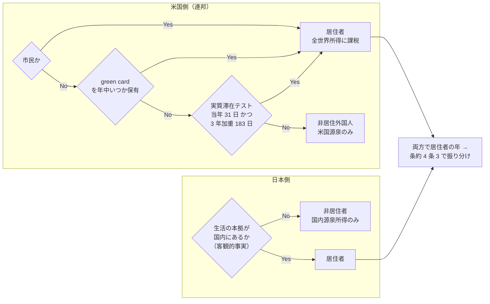
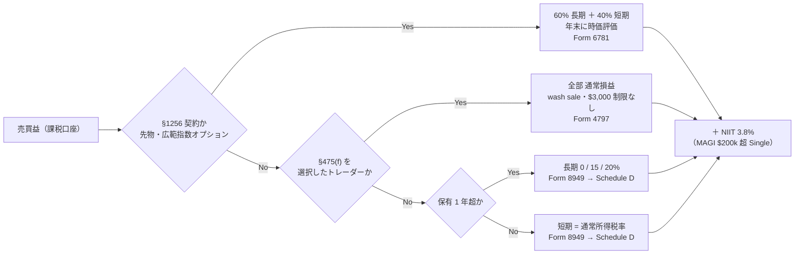
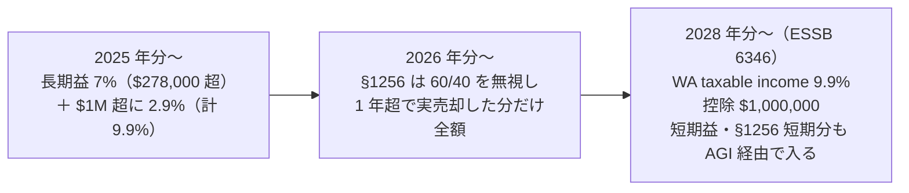
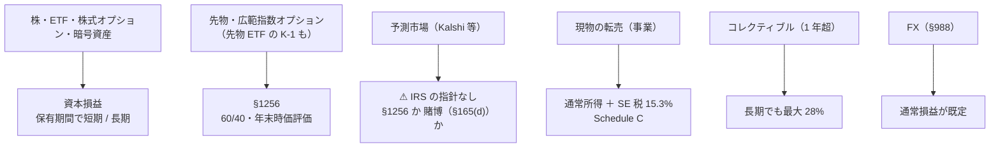
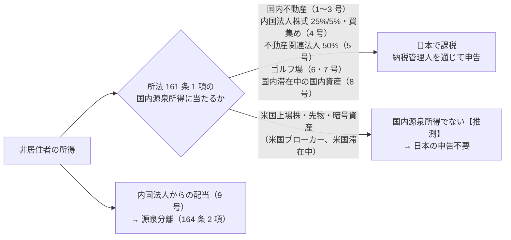
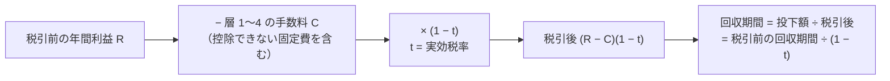

# オンラインで売買したときの納税 — 米国連邦 ＋ WA 州（＋ 日本側の確認）

作成: 2026-09-07 ／ 一次情報の取得日: すべて 2026-09-07（[§9](#9-出典) に URL）

**これは税務助言ではなく調査資料である。** 一次情報（IRS・WA DOR・RCW/WAC・e-Gov の条文・国税庁・財務省）に何が書いてあるかを記録し、
このプロジェクトの前提（米国・WA 州シアトル居住、日本は非居住、元手 $100,000、課税口座）に当てはめた結果は【推測】と明示する。
個別の申告判断は CPA / 税理士の確認が前提。

- 【公表値】: 一次情報のページ・文書に該当の文言や数値があった（出典と取得日を付す）
- 【推測】: 複数の一次情報からの当てはめ・計算。前提が変われば動く
- **未確認**: 取得した範囲に該当の文言が無かった。「無い」ことの証明ではない

## 0. 結論

1. **税は「誰が → 何を → いつ → どこに」で決まり、手数料のような単一の式は無い。** 連邦は保有期間（1 年超か）と所得階層で 15〜40.8%、
   WA 州は長期益が年 $278,000（2025 年）を超えた部分だけ 7%（$1M 超は 9.9%）、日本は米国ブローカーでの売買益なら**申告不要**の見込み【推測】
2. **短期売買（保有 1 年以下）は通常所得と同じ税率**で、中位ケース 24%・上位ケース 40.8%【推測】。回収期間は税引前の **1.3〜1.7 倍**に伸びる（[§6](#6-phase-5--税引後の-1-表と回収期間)）
3. **先物・広範指数オプション（§1256）は保有期間に関係なく 60% 長期・40% 短期**で、短期売買でも 18.6%（中位）〜30.6%（上位）【推測】。
   ⚠ WA 州は 2026 年から「1 年超保有して実際に売った §1256 契約」だけを課税対象にした（短期回転は州の対象外）
4. ⚠ **見落としやすい 3 点**: (a) wash sale は別口座・IRA まで及ぶがブローカーは同一口座・同一 CUSIP しか報告しない、
   (b) 譲渡益に源泉徴収は無く**四半期の予定納税**が要る（不足なら Form 2210 のペナルティ）、
   (c) ⚠ **WA 州は 2028 年から $1M 超の所得に 9.9% の州所得税を課す法律が 2026-03-30 に成立した**（短期益も入る。住民投票・訴訟の有無は未確認）
5. **日本側は「非居住者」なら国内源泉所得だけが課税対象**で、米国上場株・先物・暗号資産の売買益はどの号にも当たらない【推測】。
   ただし住民票の除票は判定要素ではなく、**「生活の本拠」を客観的事実で判定する**建前（所基通 2-1）。出国税（1 億円かつ 5 年超）の該当だけ先に潰す
6. **判定が閉じるかどうかは利用者の 6 つの事実で決まる**（[§7](#7-利用者が確認する事項)）。居住区分（citizen / green card / SPT）、対象年度と渡米日、口座種別、
   出国時の有価証券等の合計、日本に残る資産、申告区分（Single / MFJ）

## 1. Phase 0 — 前提の確定

税の入口は「どこの居住者として、いつからか」。この図の主張: **米国側と日本側は別々に判定し、両方で居住者になる年は条約の振り分けで解く**。

### 1-1. 米国側の居住区分

| 区分 | 判定 | 課税範囲 | 出典【公表値】 |
| --- | --- | --- | --- |
| 市民 | — | 全世界所得。条約の saving clause で米国の課税権は保たれる（条約 1 条 4） | 条約統合条文 |
| Green card test | 「lawful permanent resident of the United States at any time during the calendar year」。放棄・行政/司法による終了まで続く | 全世界所得（「A U.S. resident's income is generally subject to tax in the same manner as a U.S. citizen」） | IRS Green Card Test（07-Feb-2026）、Taxation of U.S. Residents（25-Jun-2026） |
| Substantial presence test | 当年 31 日以上 **かつ** 3 年加重 183 日以上（当年の全日数 ＋ 前年の 1/3 ＋ 前々年の 1/6）。F / J / M / Q の学生・教師などは除外日 | 同上 | IRS Substantial Presence Test（14-Mar-2026）、Pub 519（2025 Returns） |
| 渡米した年 | 「You can be both a nonresident and a resident for U.S. tax purposes during the same tax year」→ dual-status の申告 | 居住者期間は全世界、非居住者期間は米国源泉 | IRS Tax Residency Status（11-Feb-2026） |

**当てはめ【推測】**: 前提は「米国・WA 州シアトルの税務上の居住者」。市民・green card・SPT のどれで居住者になるかは本人の事実（[§7](#7-利用者が確認する事項) の 1）。
渡米が 2026 年中なら、2026 年は米国側 dual-status・日本側は出国年（[§1-2](#1-2-日本側の非居住の判定)）になり、**2026 年分の申告は両国で「年の途中で切る」形**になる。

### 1-2. 日本側の非居住の判定

| 論点 | 一次情報の文言【公表値】 | 当てはめ【推測】 |
| --- | --- | --- |
| 居住者の定義 | 所得税法 2 条 1 項 3 号「国内に住所を有し、又は現在まで引き続いて一年以上居所を有する個人」。5 号 非居住者「居住者以外の個人」 | — |
| 住所の意義 | 所基通 2-1「法に規定する住所とは各人の生活の本拠をいい、生活の本拠であるかどうかは客観的事実によって判定する」 | ⚠ **住民票の除票は判定要素ではない。** 所法 2 条・所令 14/15 条・通達 2-1〜2-4 に「住民票」の語は無い |
| 国外に住所を有すると推定 | 所令 15 条 1 項 1 号「国外において、継続して一年以上居住することを通常必要とする職業を有すること」。所基通 3-3: 在留期間が契約等で 1 年未満と明らかな場合を除き該当 | 米国で 1 年以上の就労が通常必要な職業に就いていれば、この推定で非居住者になる |
| 一時的な在外 | 所基通 2-2: 国内に生計を一にする親族・再入国後に起居する家屋・生活用動産を残すなど「明らかにその国外に赴いた目的が一時的」なら在外中も国内に居所あり | 日本に家族・住居を残していれば結論が変わる。⚠ [§7](#7-利用者が確認する事項) の 5 |
| 期間の切り方 | タックスアンサー No.1926: 居住者期間 = その年 1/1〜出国日、非居住者期間 = 翌日〜12/31 | 出国年は 2 期間に分けて申告 |
| 条約の振り分け | 日米租税条約 4 条 3: 恒久的住居 → 重要な利害関係の中心 → 常用の住居 → 国籍 → 当局合意。No.2875 も同順 | 両方で居住者になる年でも、シアトルに恒久的住居があれば米国の居住者に振り分けられる |

**結論【推測】**: 「米国で 1 年以上働く職業を持ち、日本に家族・住居を残していない」なら、出国日の翌日から**非居住者**。
住民票の除票はそれを裏づける事実の一つにすぎず、判定はこの 2 条件で行う。

### 1-3. 国外転出時課税（出国税）

| 項目 | 内容【公表値】 |
| --- | --- |
| 対象者 | **両方**を満たす居住者: (イ) 国外転出時の対象資産の合計が **1 億円以上**、(ロ) 国外転出前 10 年以内に国内に住所・居所を有していた期間が **5 年超**（所法 60 条の 2 第 5 項、No.1478） |
| 対象資産 | 有価証券（株式・投資信託など）・匿名組合契約の出資持分・未決済の信用取引・発行日取引・未決済デリバティブ（先物・オプション）。⚠ 暗号資産は列挙に無い（該当しないことの明文は未確認） |
| 効果 | 出国時に譲渡したものとみなして課税。評価時点は、納税管理人の届出をして出国なら出国時、しないなら出国予定日の 3 か月前 |
| 猶予 | 5 年（延長で 10 年）。要件: 出国時までの納税管理人の届出、確定申告書への記載、担保の提供 |

**結論**: (イ)(ロ) のどちらかを欠けば 5 項で「適用しない」。**元手 $100,000（≈ 1,500 万円）の前提なら (イ) を満たさず、この制度は関係ない【推測】。**
出国時に他の有価証券（日本の証券口座・持株・投資信託）を合計 1 億円以上持っていた場合だけ、遡って手続が要る（[§7](#7-利用者が確認する事項) の 4）。

### 1-4. 対象年度と口座種別

| 項目 | 前提 | 効くところ |
| --- | --- | --- |
| 対象年度 | **2025 年分**（申告 2026-04-15。WA 州は災害対応で 2026-05-01）と **2026 年分** | 区分の境目は年ごとに違う（[§2-1](#2-1-短期と長期0--15--20)） |
| 口座種別 | **課税口座**（brokerage）。IRA / 401(k) / HSA は [online-tradable-assets.md §5](online-tradable-assets.md#5-税優遇枠--nisa-から-ira--401k--hsa-へ) | 優遇枠の中の売買には譲渡益課税が無い。⚠ ただし課税口座で損切りして IRA で同じ銘柄を買うと wash sale になり、IRA 側の基礎価額も増えない（Rev. Rul. 2008-5） |
| 申告区分 | 表は **Single** を主に、MFJ を併記 | 0/15/20% の境目・NIIT の閾値が違う |

## 2. Phase 1 — 連邦所得税の骨格

この図の主張: **同じ「売買益」でも、保有期間と選択（§475(f)）で 4 本の経路に分かれ、経路ごとに税率と様式が違う**。

### 2-1. 短期と長期（0 / 15 / 20%）

Topic 409: 「if you hold the asset for more than one year before you dispose of it, your capital gain or loss is long-term. If you hold it one year or less, your capital gain or loss is short-term.」
短期の純益は「taxation as ordinary income at graduated tax rates」【公表値】。

長期譲渡益・適格配当の税率の境目（**課税所得**ベース）【公表値: Rev. Proc. 2024-40 §2.03、Rev. Proc. 2025-32 §2.03】:

| 課税年 | 申告区分 | 0% の上限 | 15% の上限（超えると 20%） |
| --- | --- | ---: | ---: |
| 2025 | Single | $48,350 | $533,400 |
| 2025 | MFJ | $96,700 | $600,050 |
| 2026 | Single | $49,450 | $545,500 |
| 2026 | MFJ | $98,900 | $613,700 |

短期に適用される 2026 年の通常税率（Single）【公表値: IR-2025-103、Form 1040-ES (2026)】: 10%（〜$12,400）/ 12% / 22%（$50,400 超）/ 24%（$105,700 超）/ 32%（$201,775 超）/ 35%（$256,225 超）/ 37%（$640,600 超）。標準控除 Single $16,100・MFJ $32,200。

**この資料の 2 ケース**（[online-tradable-assets.md §3-3](online-tradable-assets.md#3-3-課税--ここで順位が決まる) と同じ）【推測】:

| ケース | 課税所得 | 短期・通常所得 | 長期・適格配当 | NIIT |
| --- | ---: | ---: | ---: | --- |
| 中位 | $150,000 | 24% | 15% | なし（MAGI ≤ $200,000） |
| 上位 | $700,000 | 37% | 20% | 3.8% |

### 2-2. wash sale（前後 30 日）

| 項目 | 一次情報【公表値】 | 自動売買・高頻度への含意【推測】 |
| --- | --- | --- |
| 定義 | Pub 550 (2025): 損失で売った日の**前後 30 日**（計 61 日）に「substantially identical stock or securities」を買う・課税取引で取得する・買う契約やオプションを取得する・**IRA / Roth IRA で取得する**と wash sale | 同じ銘柄を日次で回すと損失の大半が「否認 → 基礎価額に加算」で繰り延べられる。年内に完全に手仕舞えば最終的な損益は変わらないが、**年をまたぐ持越しがあると当年の損失が消える** |
| 効果 | 否認された損失は新しい株の取得価額に加算（IRA 経由は加算されない。Rev. Rul. 2008-5）。保有期間も引き継ぐ | — |
| 範囲 | 配偶者・支配会社の取得も含む。⚠ **Form 1099-B (Box 1g) でブローカーが報告するのは「same account」「same CUSIP number」の分だけ** | 複数のブローカー・口座を使う設計なら、wash sale の突合は**自分で**やる |
| 適用されないもの | §1256 契約の時価評価（Form 6781「The wash sale rules don't apply.」）、§475(f) 選択後のトレーダー（Topic 429） | 先物中心なら wash sale の帳簿は要らない |
| 暗号資産 | §1091 の対象は「stock or securities」。Notice 2014-21 は「property」。**IRS が「適用されない」と明記したページは未確認**（条文からの推論） | 現行法では暗号資産の損切り → 即買い戻しは否認されないと読める。⚠ 立法で変わりうる |
| 様式 | Form 8949 の調整コード **W** | — |

### 2-3. NIIT 3.8%

Topic 559・Form 8960【公表値】: 3.8% × min(純投資所得, MAGI − 閾値)。閾値は **Single / HoH $200,000、MFJ $250,000、MFS $125,000** で「not indexed for inflation」。
対象は株・債券・投信・不動産の処分益、利子、配当、そして「a trade or business of trading in financial instruments or commodities」（§1411(c)(2)(B)）。
給与・能動的事業所得は対象外。⚠ **TTS を取って Schedule C にしても、取引の損益は NIIT の対象のまま**【公表値の文言からの読み】。

### 2-4. 予定納税と過少納付ペナルティ

譲渡益には源泉徴収が無い。Form 1040-ES (2026) の一般則【公表値】: 「You expect to owe at least $1,000 in tax」かつ源泉・還付クレジットが
「90% of the tax to be shown on your 2026 tax return, or 100% of the tax shown on your 2025 tax return」の小さい方に満たないなら予定納税が要る。
前年 AGI $150,000 超は 100% → **110%**。期限は **4/15・6/15・9/15・翌 1/15**。年末に大きな益が出た年は「annualized income installment method」（Pub 505 ch.2）で各期の必要額を下げられる。不足は Form 2210 で計算。

**含意【推測】**: 給与の源泉で前年税額の 100%（110%）を満たしているなら、売買益が出ても当年のペナルティは避けられる（safe harbor）。
給与が無い・前年が少ない場合は、四半期ごとに益の 24〜40.8% を積んでおく必要がある。

### 2-5. トレーダー税務ステータス（TTS）と §475(f)

| 項目 | 一次情報【公表値】 |
| --- | --- |
| TTS の 3 条件 | Topic 429: 「seek to profit from daily market movements」「Your activity must be substantial」「continuity and regularity」。考慮要素は保有期間・売買の頻度と金額・生計依存・投下時間 |
| TTS だけ（選択なし） | 損益は Schedule D / Form 8949 のまま（資本損益）、経費は Schedule C。「Gains and losses ... aren't subject to self-employment tax」 |
| §475(f) 選択の効果 | 損益は**通常損益**（Form 4797 Part II）、年末保有分を時価評価。**$3,000 の資本損失制限と wash sale が不適用**。投資用と区別した銘柄は対象外 |
| 選択の期限 | Rev. Proc. 99-17 §5.03(1): 「not later than the due date (without regard to extensions) of the original federal income tax return for the taxable year immediately preceding the election year」。例: 2027 年から有効にするには **2026 年分の申告書（2027-04-15 まで）に声明を添付**。あわせて Form 3115（自動変更 No. 64、Rev. Proc. 2025-23 §24.01） |
| 撤回 | 「with the consent of the Commissioner」。選択から 5 課税年以内の撤回は非自動手続（Rev. Proc. 2025-23 §24.02） |

**含意【推測】**: 週 5〜15 時間・元手 $100,000 の前提では「substantial」「livelihood」を満たすかが疑わしく、TTS は取れない可能性が高い。
取れたとしても §475(f) は**譲渡益を通常所得に変える**（長期 15% の優遇を捨てる）ので、勝ち続ける設計では不利、損が続く年に有利。**選択は前年の申告期限までに決める不可逆に近い判断**なので、実運用の 1 年目は選択しないのが安全側。

### 2-6. 資本損失の制限

Pub 550【公表値】: 純損失の控除は「the lesser of $3,000 ($1,500 if married filing separately), or your total net loss」。超過分は翌年以降へ繰越。
⚠ **損失年の税務上の救済は年 $3,000 まで**。損失を給与と相殺できる §475(f) の価値はここにある。

### 2-7. ブローカーの報告（1099-B / 1099-DA）

| 様式 | 何が来るか【公表値】 | 自分で埋める部分 |
| --- | --- | --- |
| Form 1099-B | covered security（2011 年以降に現金で取得した株など）は取得価額・保有期間・wash sale（同一口座・同一 CUSIP）付き。noncovered は Box 5 で空欄可 | noncovered の取得価額、別口座の wash sale |
| Form 1099-DA | **2025-01-01 以降のデジタル資産の売却から総収入を報告**（様式は 2026 年初に送付）。取得価額は **2026 年以降に取得した covered 分から** | 2025 年以前に取得した暗号資産の取得価額（Rev. Proc. 2024-28 でウォレット単位に配分） |
| Form 8949 (2025) | デジタル資産は新設の Box G/H/I（短期）・J/K/L（長期） | — |
| §1256 契約 | 1099-B Box 8〜11（実現・前年末未実現・当年末未実現・合計）→ Form 6781 line 1 | — |

## 3. Phase 2 — WA 州

この図の主張: **WA 州の「取引益にかかる税」は 3 段階で増えていく**。2025 年は長期益だけ、2026 年に §1256 の扱いが変わり、2028 年から短期益も州所得税に入る。

### 3-1. キャピタルゲイン税（RCW 82.87）

| 項目 | 内容【公表値】 |
| --- | --- |
| 税率 | RCW 82.87.040(1): 「seven percent multiplied by an individual's Washington capital gains」。(2): 2025-01-01 から **$1,000,000 超の部分に 2.90% を追加**（計 9.9%。ESSB 5813、2025 c 421） |
| 対象 | 自然人のみ。**長期**（保有 1 年超）資産の売却益。課税ベースは連邦の **net long-term capital gain** 起点 |
| 帰属 | 無形資産（株・ETF・オプション・暗号資産）は「domiciled in this state at the time the sale or exchange occurred」で WA に帰属（82.87.100）。domicile は「permanent place of abode, coupled with the intent」（WAC 458-20-301） |
| 免除 | 不動産、**退職口座（401(k)・IRA・Roth 等）**、減価償却資産、家畜、木材、漁業権 など（82.87.050） |
| 標準控除 | 2022 $250,000 / 2023 $262,000 / 2024 $270,000 / **2025 $278,000** / 2026 **未公表**（DOR が 10/31 までに公表。$1,000 単位）。⚠ $1M の追加税率の閾値は物価調整なし |
| 短期益 | **対象外**（WAC 458-20-301 Ex.12/13: 短期損益は連邦で先に相殺され、州ベースは純長期益のみ） |
| 申告 | 連邦と同日に My DOR で電子申告、連邦申告書（Schedule D・1099-B・K-1）の写しを添付。**延長しても納期限は延びない**。遅延 5%/月（上限 25%）。2025 年分は災害対応で **2026-05-01** |

**当てはめ【推測】**: 元手 $100,000 の課税口座で、年間の長期益が $278,000 を超えることは無い → **2025〜2027 年分の WA 州税はゼロ**。
E8（譲渡益を繰り返し実現する運用）の元手を桁で増やしたとき、初めてこの層が効く。

### 3-2. §1256 契約の扱い（2024 → 2026 で 2 回変わった）

| 時期 | 扱い【公表値】 |
| --- | --- |
| 2023-10-11 の DOR 暫定見解 | 連邦の 60% 部分を含める立場 |
| **2024-01-26 に取消** | 「only gains and losses recognized from a taxpayer's sale or exchange of a section 1256 contract are included ... and only if the contract was held for more than one year」。WAC 458-20-301 Ex.5: 18 か月保有して売った先物の益 $300 のうち $180（60%）を含め、1 か月保有の損失と年末みなし売却分は含めない |
| **2026-01-01 施行（SSB 5314、2025 c 409 §4）** | RCW 82.87.020(3) を「as if ... 1256 ... did not exist」で計算し、(1)(f) で「section 1256 contract held for more than one year」の長期益を加算 → **1 年超保有して実際に売った §1256 契約の益は全額、1 年以下・みなし売却はゼロ**と読める。⚠ WAC の例の更新は未確認 |

**含意【推測】**: 先物・指数オプションを日次〜週次で回す限り、WA 州のキャピタルゲイン税には**一切かからない**（2027 年分まで）。

### 3-3. B&O 税（自分の資金で売買する個人）

| 項目 | 内容【公表値】 |
| --- | --- |
| DOR の現行文言 | 「Persons who are not engaging in business are not subject to B&O tax on their income earned from investing. This category generally includes individuals who invest their own personal assets.」 |
| ⚠ ただし | 同じページで DOR は「事業」の線引きを示す**新ルールを策定中**と明記。Antio, LLC v. DOR（WA 最高裁 2024-10-24）で、事業者の投資収入控除は「incidental to the main purpose」の分に限ると確定し、ESHB 2081（2026-01-01 施行）で「incidental」= 投資収入が総収入の **5% 未満**と法定化 |
| 税率 | Service and other activities **1.5%**（前年総収入 $1M 未満）/ 1.75% / 2.1%。小規模クレジット 月 $55（サービス系 $160）で、サービス系は年 B&O 税 $1,920 まで全額相殺、$3,840 で消滅 |

**当てはめ【推測】**: 自己資金・自己勘定の個人は現行文言では対象外。**「事業」に当たる規模（TTS 相当の頻度・生計依存）になると、州側でも B&O の対象に入る可能性がある**（DOR が策定中の線引き次第）。2028 年の州所得税とあわせて、E8 の設計を大きくするときの宿題。

### 3-4. ⚠ 2028 年からの州所得税（ESSB 6346、2026 c 238）

| 項目 | 内容【公表値】 |
| --- | --- |
| 成立 | 署名 2026-03-30、施行 2026-06-11。**2028-01-01 から** WA taxable income に **9.90%** |
| 対象 | 個人のみ。標準控除 **$1,000,000**（2029 年 10 月から隔年で物価調整）。ベースは連邦 AGI から長期益を除き、82.87 対象の WA キャピタルゲイン ＋ その標準控除額を戻し入れ。払ったキャピタルゲイン税は非還付クレジット |
| 含意 | **短期売買益・§1256 の短期分も AGI 経由で入る**（AGI $1M 超の場合）。初回申告 2029 年 4 月 |
| 未確認 | 住民投票・訴訟による差止めの有無 |

### 3-5. 現物の転売（スニーカー・カード）

| 項目 | 内容【公表値】 |
| --- | --- |
| 偶発的な売却 | RCW 82.04.040「casual or isolated sale」（その種の物品を売る事業をしていない者の売却）は B&O 不適用、売上税の徴収も不要。「routine and continuous」は該当しない |
| マーケットプレイス経由 | facilitator（eBay・StockX 等）が売上税を徴収する証明があれば売り手は徴収不要。申告時は総売上を Retailing B&O（0.471%）に計上し、facilitator 徴収分を控除 |
| 登録の要否 | B&O 対象総収入 $12,000/年 未満などなら登録不要（WAC 458-20-101） |
| シアトルの売上税 | 10.55%（州 6.5% ＋ 地方 4.05%、2026-01-01〜） |

## 4. Phase 3 — 資産の種類ごとの差

この図の主張: **資産の種類は「連邦の性格」で 5 つの箱に分かれ、[online-tradable-assets.md](online-tradable-assets.md) の出口（板型・買取保証型）とは軸が違う**。

| 資産 | 連邦の性格【公表値】 | 保有期間 / 60:40 | 報告様式 | 特有の規則 | WA 州【公表値・推測】 |
| --- | --- | --- | --- | --- | --- |
| 株・ETF | 資本損益（Topic 409） | 1 年超で長期 | 1099-B → 8949 / Schedule D | wash sale、$3,000 制限 | 長期益のみ 7% / 9.9%（控除超） |
| 先物 ETF（LP 構造。USO 等） | 内部の先物が §1256 → 60/40 がパススルー。分配が無くても持分相当を毎年課税 | 60:40 | **Schedule K-1**（3 月頃） | 1099 ではない | ⚠ K-1 経由の扱いは未確認 |
| 株式オプション（個別株・ほとんどの ETF） | 資本損益。売り手のプレミアム（権利消滅）は**短期**。買い手の消滅は保有期間次第 | 短期が中心 | 1099-B → 8949 | §1256 外（Pub 550 Table 4-3） | 短期なら対象外 |
| 広範指数オプション（SPX 等） | §1256 nonequity option（「broad-based stock index options」） | 60:40 | 1099-B Box 8〜11 → Form 6781 | wash sale 不適用 | 2026〜: 1 年超で実売却した分だけ |
| 先物（規制先物契約） | §1256 | 60:40、年末時価評価 | 同上。損失の 3 年繰戻し選択（Form 6781 box D） | wash sale 不適用 | 同上 |
| 暗号資産 | 財産（Notice 2014-21）。資本損益 | 1 年超で長期 | **1099-DA**（2025 年以降の売却）、8949 Box G〜L | wash sale の明文なし、ウォレット単位の簿価（Rev. Proc. 2024-28）、1040 の質問欄 | DOR FAQ: 1 年超 ＋ WA domicile なら対象 |
| 予測市場（Kalshi / Polymarket US） | ⚠ **IRS の指針なし**。Kalshi の Help は 1099-INT / MISC / B（暗号転送）/ DA を挙げるが、イベント契約の損益をどの様式で報告するかは書いていない。§1256 も主張していない | §1256 なら 60:40。賭博なら損失は利益の範囲内（2026 年分から **90%**。P.L. 119-21） | Kalshi の PnL 明細を自分で使う建付け | Kalshi は CFTC 指定契約市場（DCM）。契約が CEA 上「swaps」とされることと §1256(b)(2) のスワップ除外の関係は未確認 | DOR ガイダンス無し。⚠ WA 州では取引自体が差止め（[online-tradable-assets.md](online-tradable-assets.md) ゲート 4b） |
| 現物の転売 | 事業なら通常所得 ＋ **SE 税 15.3%**（92.35% ベース、半額控除）。投資なら資本損益。個人使用品の売却損は控除不可 | コレクティブルは 1 年超で最大 28% | **1099-K**（$20,000 超かつ 200 件超。OBBBA で復元）、Schedule C / 8949 | 趣味なら経費控除不可 | casual sale は B&O 外、事業なら Retailing 0.471% |
| コレクティブル | §408(m)(2): art、rug / antique、metal / gem、stamp / coin、alcoholic beverage、「any other tangible personal property specified by the Secretary」 | 長期でも **最大 28%**（通常税率が低ければ低い方） | 8949 コード C | ⚠ **スニーカー・トレーディングカードが (F) の指定に含まれるかは未確認** | — |
| FX（個人） | §988: 「treated as ordinary income or loss」が既定。先渡等は当日中の識別で資本損益を選択可 | — | ブローカーの様式は未確認 | 規制先物・nonequity option は §1256 側 | 短期なら対象外 |
| 利子・配当 | 利子は通常所得。適格配当（権利落ち前後 121 日中 60 日超保有）は 0/15/20% | — | 1099-INT / DIV | 投資利子（信用金利）の控除は純投資所得が上限（Form 4952） | — |

**手数料と税の関係【公表値・推測】**: 売買手数料は経費ではなく損益計算に織り込む（取得価額に加算・売却額から控除。Pub 550）。
⚠ **層 2〜4 の固定費（API 料・相場データ・プラン月額）は、投資家（TTS でない）としては控除できない見込み**【推測。雑項目控除の停止措置（§67(g)）。未確認】。
TTS なら Schedule C で控除（Topic 429）。手数料比較の「固定月額」は**税引後の手取りをそのまま削る**。

## 5. Phase 4 — 日米の重なり

この図の主張: **非居住者の日本の課税は「国内源泉所得」の列挙に当たるかだけで決まり、米国ブローカーでの米国資産の売買はどの号にも当たらない**。

| 論点 | 一次情報【公表値】 | 当てはめ【推測】 |
| --- | --- | --- |
| 課税範囲 | 所法 5 条 2 項・7 条 1 項 3 号: 非居住者は 161 条 1 項の国内源泉所得のみ | — |
| 資産の譲渡（3 号） | 所令 281 条 1 項: 国内不動産（1〜3 号）、**内国法人**株式のうち買集め（4 イ）・特殊関係株主等が 3 年内に 25% 以上を保有し譲渡年に 5% 以上を譲渡（4 ロ、6 項）、不動産関連法人（資産の 50% 以上が国内土地等。5 号・8 項）、国内ゴルフ場（6・7 号）、**非居住者が国内に滞在する間に行う国内にある資産の譲渡**（8 号） | 米国上場株（外国法人株式）・先物・暗号資産はどの号にも無い。⚠ 一時帰国中に日本の口座で売買する場合の 8 号該当性は未確認 |
| 運用・保有（2 号） | 所令 280 条 1 項の列挙（日本国債・内国法人債券・居住者向け貸付金など）。2 項 2 号: 市場デリバティブ・店頭デリバティブの決済益は「含まれない」（外国市場デリバティブの文言は無い） | 米国先物の益は 2 号にも当たらない |
| 条約 13 条 | 1 不動産、2 不動産化体株式、3〜6 は特殊。**7「1 から 6 までに規定する財産以外の財産の譲渡から生ずる収益に対しては、譲渡者が居住者とされる締約国においてのみ租税を課することができる」** | 国内法で当たる場合でも、上場株の少量譲渡なら条約 13 条 7 項で居住地国（米国）のみ課税。⚠ 条約適用の届出手続は未確認 |
| 配当 | 内国法人からの配当は 161 条 1 項 9 号 → 164 条 2 項の源泉分離 | 日本の証券口座に残った株の配当は日本で源泉徴収（条約の限度税率は未確認） |
| 手続 | 通法 117 条: 納税管理人は「国税に関する事項を処理する必要があるとき」に選任。No.1926: 納税管理人ありなら翌年 2/16〜3/15 に申告、なしなら出国日までに準確定申告。年を通じて海外なら「国内源泉所得があり基礎控除を超える場合」に申告 | 国内源泉所得が無ければ、出国後の年の申告は不要 |

**結論【推測】**: 米国ブローカーで米国上場株・先物・暗号資産を売買する限り、**日本側の申告は不要**。
日本側の申告が要るのは、[§7](#7-利用者が確認する事項) の 5 の資産（日本の不動産・内国法人株式の大口・日本の口座の配当）を持つ場合と、出国年の準確定申告だけ。

⚠ **未調査の宿題**: 米国側の外国口座報告（FBAR / Form 8938）は本タスクの範囲外。日本に口座を残しているなら別途。住民税（1/1 の住所基準）も未確認。

## 6. Phase 5 — 税引後の 1 表と回収期間

[trading-fee-comparison.md](trading-fee-comparison.md) の手数料 4 層に「層 5 税」を足す。手数料は**取引ごとの金額**、税は**益に対する率**なので、
同じ列には並ばない。ここでは (a) クラスごとの「層 1〜4 の最安（中 40 回/月）＋ 層 5 の実効税率」を 1 表にし、(b) 回収期間が税でどれだけ伸びるかを係数で示す。

この図の主張: **税は手数料と違って「勝ったときだけ」かかるが、回収期間には手数料より大きく効く**（税引前の回収期間を (1 − t) で割る）。

### 6-1. 層 5 を足した 1 表【推測】

前提: 2026 年・Single・課税口座・WA domicile。「中位」= 課税所得 $150,000（通常 24%・長期 15%・NIIT なし）、「上位」= $700,000（37%・20%・NIIT 3.8%）。
手数料の列は [trading-fee-comparison.md §5-2](trading-fee-comparison.md#5-2-q1-会場の差--クラスごとの最安) の最安（中 40 回/月）。

| クラス（代表的な持ち方） | 層 1〜4 最安（月） | 連邦の性格 | 層 5 実効税率 中位 | 上位 | WA 州（追加） | 回収期間の係数 1/(1−t) 中位 / 上位 |
| --- | ---: | --- | ---: | ---: | --- | --- |
| P1 株・ETF（1 年以下で回す） | $0 | 短期 | **24.0%** | **40.8%** | なし | ×1.32 / ×1.69 |
| P1 株・ETF（1 年超で持つ） | $0 | 長期 | **15.0%** | **23.8%** | 長期益 $278,000 超に 7%（$1M 超 9.9%） | ×1.18 / ×1.31 |
| P2 株式オプション（短期） | $0 | 短期（売り手のプレミアムは常に短期） | 24.0% | 40.8% | なし | ×1.32 / ×1.69 |
| P3 先物・SPX オプション（§1256、短期回転） | $172〜179 | 60% 長期 ＋ 40% 短期 | **18.6%** | **30.6%** | なし（2026〜は 1 年超の実売却のみ） | ×1.23 / ×1.44 |
| V3 暗号資産（短期） | $25 | 短期 | 24.0% | 40.8% | なし | ×1.32 / ×1.69 |
| V3 暗号資産（1 年超） | $25 | 長期 | 15.0% | 23.8% | 長期益 $278,000 超に 7% | ×1.18 / ×1.31 |
| V4 予測市場 | $1.50 | ⚠ 未確定。通常所得なら 24 / 37%、§1256 なら 18.6 / 30.6%、賭博なら損失は益の 90% まで | 24.0%〜 | 37.0%〜 | ⚠ WA 州では取引不可 | ×1.32〜 |
| V5 現物の転売（事業） | 出品・落札 ≈ 14% | 通常所得 ＋ SE 税 | **≈ 36%** | **≈ 40%** | Retailing B&O 0.471%（$12,000 未満は登録不要） | ×1.56 / ×1.67 |
| コレクティブル（1 年超） | — | 最大 28% | 24.0% | 31.8% | 長期益 $278,000 超に 7% | ×1.32 / ×1.47 |
| 参考: 適格配当・長期益（E1/E2） | $0 | 長期 | 15.0% | 23.8% | — | ×1.18 / ×1.31 |
| 参考: 利子（E2） | $0 | 通常所得 | 24.0% | 40.8% | なし | ×1.32 / ×1.69 |

計算の前提: 60/40 = 0.6 × 長期率 ＋ 0.4 × 通常率（上位は NIIT 3.8% を加算）。事業の転売は 通常率 ＋ SE 税 15.3% × 92.35%（上位は社会保障の上限超で Medicare 2.9% 分のみ）− SE 税半額控除の効果【概算】。
コレクティブルの中位は min(28%, 24%) = 24%。予測市場は IRS の指針が無いので幅で書いた。

### 6-2. 何が動くか

| 見方 | 結果【推測】 |
| --- | --- |
| **短期売買の設計** | 手数料 $0 の会場でも、税で回収期間が **1.32 倍（中位）〜1.69 倍（上位）** に伸びる。手数料比較で「$0 対 $0.70」を争う差より桁が大きい |
| **先物に寄せる価値** | §1256 の 60/40 で、同じ短期回転でも実効税率が 24% → 18.6%（中位）、40.8% → 30.6%（上位）に下がる。加えて wash sale の帳簿が要らず、WA 州の対象にもならない。⚠ 先物の手数料（月 $172〜179）は株の $0 より高いので、**利益が月 $3,000 前後を超えると税の差が手数料の差を上回る**（(24% − 18.6%) × 利益 > $179 → 利益 > $3,300/月【概算】） |
| **1 年超で持つ価値** | 15% と 24% の差は 9 ポイント。E8 を「年 1 回だけ利益確定する」設計にすれば、短期回転より税引後で 1.12 倍（中位）有利 |
| **既存の試算への影響** | [online-tradable-assets.md §4](online-tradable-assets.md#4-phase-4--確定セグメントでの試算と判定) の税引後年間収入（E1/E2）は本書の税率と一致しており**数値の修正は無い**。追加するのは (a) 2026 年からの §1256 の州扱い、(b) 2028 年からの州所得税、(c) 予定納税の要否、の 3 点 |
| **固定費の控除** | 層 2〜4（データ・API・プラン月額）は投資家では控除できない見込み【推測】なので、税引後の手取りをそのまま削る。IBKR の $14.50/月は年 $174 = 中位で利益 $229 分に相当 |

## 7. 利用者が確認する事項

ここが埋まれば判定が閉じる。**本人にしか分からない事実**なので、この資料では分岐として書いてある。

| # | 確認事項 | 効くところ | 埋まっていないときの扱い |
| --- | --- | --- | --- |
| 1 | 米国側の居住区分: 市民 / green card / 実質滞在テスト（当年 31 日 ＋ 3 年加重 183 日） | [§1-1](#1-1-米国側の居住区分)。全世界所得課税かどうか、条約の saving clause | 「居住者」として書いてある（前提どおり） |
| 2 | 渡米日と対象年度（2025 年か 2026 年か）。渡米年は dual-status | [§1-1](#1-1-米国側の居住区分)・[§1-2](#1-2-日本側の非居住の判定)。年の途中で切る申告 | 2025・2026 の両方の区分を載せた |
| 3 | 申告区分（Single / MFJ）と課税所得の水準 | [§2-1](#2-1-短期と長期0--15--20)・[§2-3](#2-3-niit-38)。0/15/20% の境目と NIIT | Single の中位・上位の 2 ケース |
| 4 | 出国時の有価証券等の合計が 1 億円以上だったか（日本の証券口座・持株・投信を含む） | [§1-3](#1-3-国外転出時課税出国税)。出国税の要否と納税管理人 | 元手 $100,000 の前提で「該当しない」 |
| 5 | 日本に残る資産: 不動産、内国法人株式（25% / 5%）、不動産関連法人株式、ゴルフ会員権、日本の証券口座（配当）、日本に生計を一にする家族・住居 | [§1-2](#1-2-日本側の非居住の判定)・[§5](#5-phase-4--日米の重なり)。非居住の判定と国内源泉所得 | 「無い」として「日本側の申告不要」 |
| 6 | 給与の源泉徴収が前年税額の 100%（110%）を満たすか | [§2-4](#2-4-予定納税と過少納付ペナルティ)。予定納税の要否 | 満たさない場合は四半期ごとに益の 24〜40.8% を積む |

## 8. 既存資料との整合

| 資料 | 本書との関係 |
| --- | --- |
| [trading-fee-comparison.md](trading-fee-comparison.md) §1-1 | 層 4 の「含めないもの」に税金がある → 本書の [§6-1](#6-1-層-5-を足した-1-表推測) が層 5 |
| [online-tradable-assets.md](online-tradable-assets.md) §3-3 | 2026 年の区分（$49,450 / $545,500）、WA 7% / 9.9%、控除 $278,000 は本書と一致。**追加**: §1256 の州扱い（2026〜）、2028 年の州所得税、予定納税、wash sale の口座またぎ、1099-DA |
| [online-tradable-assets.md](online-tradable-assets.md) §4 | 税引後年間収入の税率は一致。数値の修正なし |
| [overview.md](overview.md) §6 | 「日本側の非居住は本人申告。条文への当てはめは未確認」→ 本書 [§1-2](#1-2-日本側の非居住の判定) で条文に当てた（判定は本人の事実 5 に依存） |

## 9. 出典

取得日はすべて 2026-09-07。PDF は本文を読んだ。取得できなかった経路（IRS の /instructions/i6781、Kalshi の旧 URL、ProShares の旧 URL）は様式 PDF・現行ページで代替した。

### 9-1. 連邦（IRS・条文）

| 内容 | URL |
| --- | --- |
| Topic 409 Capital Gains and Losses（25-Feb-2026） | https://www.irs.gov/taxtopics/tc409 |
| Rev. Proc. 2024-40（2025 年の区分） | https://www.irs.gov/pub/irs-drop/rp-24-40.pdf |
| Rev. Proc. 2025-32（2026 年の区分） | https://www.irs.gov/pub/irs-drop/rp-25-32.pdf |
| IR-2025-103（2026 年インフレ調整、2025-10-09） | https://www.irs.gov/newsroom/irs-releases-tax-inflation-adjustments-for-tax-year-2026-including-amendments-from-the-one-big-beautiful-bill |
| Publication 550（2025 Returns） | https://www.irs.gov/pub/irs-pdf/p550.pdf |
| Publication 519（2025 Returns） | https://www.irs.gov/publications/p519 |
| Substantial Presence Test（14-Mar-2026）/ Green Card Test（07-Feb-2026）/ Tax Residency Status（11-Feb-2026）/ Taxation of U.S. Residents（25-Jun-2026） | https://www.irs.gov/individuals/international-taxpayers/substantial-presence-test ／ …/alien-residency-green-card-test ／ …/determining-an-individuals-tax-residency-status ／ …/taxation-of-resident-aliens |
| §1091 wash sale / Rev. Rul. 2008-5 / Notice 2014-21 | https://www.law.cornell.edu/uscode/text/26/1091 ／ https://www.irs.gov/pub/irs-drop/rr-08-05.pdf ／ https://www.irs.gov/pub/irs-drop/n-14-21.pdf |
| Instructions for Form 1099-B（2026）/ 8949（2025）/ 1099-DA（30-Apr-2026） | https://www.irs.gov/instructions/i1099b ／ https://www.irs.gov/instructions/i8949 ／ https://www.irs.gov/instructions/i1099da |
| Digital Assets（02-Sep-2026）/ Virtual currency FAQ（30-Jun-2026）/ Rev. Proc. 2024-28 | https://www.irs.gov/filing/digital-assets ／ https://www.irs.gov/individuals/international-taxpayers/frequently-asked-questions-on-virtual-currency-transactions ／ https://www.irs.gov/pub/irs-drop/rp-24-28.pdf |
| Topic 559 NIIT（02-Apr-2026）/ NIIT Q&A（13-Sep-2025）/ Form 8960 指示 / §1411 | https://www.irs.gov/taxtopics/tc559 ／ https://www.irs.gov/newsroom/questions-and-answers-on-the-net-investment-income-tax ／ https://www.irs.gov/instructions/i8960 ／ https://www.law.cornell.edu/uscode/text/26/1411 |
| Form 1040-ES（2026）/ Pub 505 / Topic 306（31-Mar-2026）/ Form 2210 指示 | https://www.irs.gov/pub/irs-pdf/f1040es.pdf ／ https://www.irs.gov/publications/p505 ／ https://www.irs.gov/taxtopics/tc306 ／ https://www.irs.gov/instructions/i2210 |
| Topic 429 Traders in Securities（26-Jan-2026）/ Rev. Proc. 99-17 / Rev. Proc. 2025-23 | https://www.irs.gov/taxtopics/tc429 ／ https://www.irs.gov/pub/irs-irbs/irb99-07.pdf ／ https://www.irs.gov/pub/irs-drop/rp-25-23.pdf |
| Form 6781（2025）/ §1256 / Schedule D 指示（2025） | https://www.irs.gov/pub/irs-pdf/f6781.pdf ／ https://www.law.cornell.edu/uscode/text/26/1256 ／ https://www.irs.gov/instructions/i1040sd |
| §408(m) コレクティブル / §1 | https://www.law.cornell.edu/uscode/text/26/408 ／ https://www.law.cornell.edu/uscode/text/26/1 |
| 1099-K: Understanding（28-Jun-2026）/ What to do（27-Jul-2026）/ IR-2025-107 / FAQ（03-Apr-2026）/ §6050W | https://www.irs.gov/businesses/understanding-your-form-1099-k ／ https://www.irs.gov/businesses/what-to-do-with-form-1099-k ／ https://irs.gov/newsroom/irs-issues-faqs-on-form-1099-k-threshold-under-the-one-big-beautiful-bill-dollar-limit-reverts-to-20000 ／ https://www.irs.gov/newsroom/form-1099-k-faqs-general-information ／ https://www.law.cornell.edu/uscode/text/26/6050W |
| Schedule C 指示（2025）/ Topic 554 SE 税 / 趣味と事業 | https://www.irs.gov/instructions/i1040sc ／ https://www.irs.gov/taxtopics/tc554 ／ https://www.irs.gov/newsroom/hobby-or-business-heres-what-to-know-about-that-side-hustle |
| §165(d) 賭博損失 / Topic 419 | https://www.law.cornell.edu/uscode/text/26/165 ／ https://www.irs.gov/taxtopics/tc419 |
| §988 FX / Topic 403 利子 / Topic 404 配当 / Form 4952 | https://www.law.cornell.edu/uscode/text/26/988 ／ https://www.irs.gov/taxtopics/tc403 ／ https://www.irs.gov/taxtopics/tc404 ／ https://www.irs.gov/forms-pubs/about-form-4952 |
| 発行体・会場（一次）: USCF K-1 / ProShares 税 FAQ / Kalshi Help（2026-06-22）/ CFTC 8302-20 / Polymarket US docs / eBay / StockX | https://www.uscfinvestments.com/k1-information ／ https://www.proshares.com/faqs/volatility-commodity-currency-proshares-taxation-faqs ／ https://help.kalshi.com/en/articles/13823849-what-tax-documentation-does-kalshi-provide ／ https://www.cftc.gov/PressRoom/PressReleases/8302-20 ／ https://docs.polymarket.us/getting-started/what-is-polymarket-us.md ／ https://www.ebay.com/help/selling/fees-credits-invoices/ebay-and-form-1099-k?id=4794 ／ https://stockx.com/help/articles/tax-and-1099-information-for-us-sellers |

### 9-2. WA 州（DOR・RCW/WAC・議会・裁判所）

| 内容 | URL |
| --- | --- |
| DOR Capital gains tax / Do you owe / FAQ | https://dor.wa.gov/taxes-rates/other-taxes/capital-gains-tax ／ …/do-you-owe-capital-gains-tax ／ …/frequently-asked-questions-about-washingtons-capital-gains-tax |
| RCW 82.87.020 / .040 / .050 / .060 / .100 / .110 / .150 / .160 | https://app.leg.wa.gov/rcw/default.aspx?cite=82.87.040 （他は cite を差し替え） |
| WAC 458-20-300 / 458-20-301 / 458-20-101 / 458-20-106 | https://app.leg.wa.gov/wac/default.aspx?cite=458-20-301 （他は cite を差し替え） |
| ESSB 5813（2025 c 421）/ DOR 特別通知（新しい段階税率） | https://app.leg.wa.gov/billsummary?BillNumber=5813&Year=2025 ／ https://dor.wa.gov/forms-publications/publications-subject/special-notices/new-tiered-rates-washingtons-capital-gains-tax |
| §1256 の暫定見解の取消（2024-01-26）/ SSB 5314（2025 c 409） | https://dor.wa.gov/laws-rules/interim-statement-regarding-capital-gains-excise-tax-and-section-1256-contracts ／ https://lawfilesext.leg.wa.gov/biennium/2025-26/Pdf/Bills/Session%20Laws/Senate/5314-S.SL.pdf |
| 2025 年分の期限延長（2026-05-01）/ 前納（HB 1376） | https://dor.wa.gov/about/news-releases/2026/capital-gains-excise-tax-returns-due-date-moved-may-1-2026 ／ https://dor.wa.gov/forms-publications/publications-subject/special-notices/prepayment-capital-gains-tax |
| B&O: Investment income / Investments / RCW 82.04.4281 / .290 / .250 / .4451 / .140 / .150 / ESHB 2081 | https://dor.wa.gov/taxes-rates/business-occupation-tax/investment-income ／ https://dor.wa.gov/forms-publications/publications-subject/tax-topics/investments ／ https://app.leg.wa.gov/rcw/default.aspx?cite=82.04.4281 ／ https://app.leg.wa.gov/billsummary?BillNumber=2081&Year=2025 |
| Antio, LLC v. Dep't of Revenue, No. 102223-9（2024-10-24） | https://www.courts.wa.gov/opinions/pdf/1022239.pdf |
| 州所得税: DOR Income tax / ESSB 6346（2026 c 238）/ 2026 tax legislation | https://dor.wa.gov/taxes-rates/income-tax ／ https://app.leg.wa.gov/billsummary?BillNumber=6346&Year=2025 ／ https://lawfilesext.leg.wa.gov/biennium/2025-26/Pdf/Bills/Session%20Laws/Senate/6346-S.SL.pdf ／ https://dor.wa.gov/forms-publications/publications-subject/tax-topics/2026-tax-legislation |
| 転売: Marketplace sellers / facilitators / SSB 5581 / Seattle 売上税（2026 Q1） | https://dor.wa.gov/taxes-rates/retail-sales-tax/marketplace-fairness-leveling-playing-field/marketplace-sellers ／ https://dor.wa.gov/sites/default/files/2025-11/Seattle-LLEP-Q1-26.pdf |
| NFT の暫定見解 | https://dor.wa.gov/laws-rules/interim-statement-regarding-taxability-non-fungible-tokens-nfts |

### 9-3. 日本（e-Gov・国税庁・財務省）

| 内容 | URL |
| --- | --- |
| 所得税法 2・5・7・60 の 2・102・127・161・164 条（e-Gov 法令 API v2） | https://laws.e-gov.go.jp/api/2/law_data/340AC0000000033?elm=MainProvision-Article_2&response_format=json （elm を差し替え） |
| 所得税法施行令 14・15・280・281 条 | https://laws.e-gov.go.jp/api/2/law_data/340CO0000000096?elm=MainProvision-Article_15&response_format=json |
| 国税通則法 117 条 | https://laws.e-gov.go.jp/api/2/law_data/337AC0000000066?elm=MainProvision-Article_117&response_format=json |
| 所得税基本通達 2-1〜2-3 / 3-1〜3-3 | https://www.nta.go.jp/law/tsutatsu/kihon/shotoku/01/01.htm ／ https://www.nta.go.jp/law/tsutatsu/kihon/shotoku/01/08.htm |
| タックスアンサー No.2875（居住者と非居住者の区分）/ No.1478（国外転出時課税）/ No.1923（納税管理人）/ No.1926（海外勤務中の所得） | https://www.nta.go.jp/taxes/shiraberu/taxanswer/gensen/2875.htm ／ https://www.nta.go.jp/taxes/shiraberu/taxanswer/shotoku/1478.htm ／ …/1923.htm ／ …/1926.htm |
| 日米租税条約 統合条文（財務省。「法的根拠となるものではない」注記あり）/ 条約一覧 | https://www.mof.go.jp/tax_policy/summary/international/tax_convention/USA_ST_jp.pdf ／ https://www.mof.go.jp/tax_policy/summary/international/tax_convention/tax_convetion_list_jp.html |

### 9-4. 未確認のまま残したもの

| 項目 | 状態 |
| --- | --- |
| 暗号資産に wash sale が「適用されない」と IRS が明記した文書 | 未発見（§1091 の文言と Notice 2014-21 からの推論） |
| ETF オプションが §1256 外と明記した IRS 文言 | 未発見（equity option の定義からの推論） |
| スニーカー・トレーディングカードのコレクティブル該当（§408(m)(2)(F) の指定） | 未発見 |
| 予測市場のイベント契約の §1256 該当性、Kalshi がイベント契約の損益を報告する様式 | IRS の指針・Kalshi の明記とも無し |
| 投資家の層 2〜4 の費用が控除できないこと（§67(g) の停止措置の現行状態） | 未確認 |
| WA: 2026 年の標準控除額、§1256 改正後の WAC の例、個人トレーダーが「事業」になる線引き、2028 年州所得税の住民投票・訴訟 | 未公表・未確認 |
| 日本: 暗号資産の「国内にある資産」該当性、一時帰国中の売買、条約適用の届出様式、住民税 | 未確認 |
| 米国側の外国口座報告（FBAR / Form 8938） | 本タスクの範囲外（未調査） |
